# Build Northwind Orders (Canvas): Part 2, Order form

This series of articles will build a simple order management Canvas app step-by-step.  It will showcase how to use:
- Many-to-One relationships.  Many Orders can be related to the same Customer.  But each Order can be related to only one Customer.
- One-to-Many relationships.  Each Order can be related to many Order Details (or line items).  But each Order Detail is related to only one Order.
- Many-to-Many relationships.  Each Product can be related to many Product Categories.  And each Product Category can be related to many Products. 
- Option sets.  

The completed app will look like this:


There are four parts:
- [Part 1, Orders list](northwind-orders-canvas-part1.md)
- Part 2, Order details form (this part)
- [Part 3, Order line items](northwind-orders-canvas-part3.md)

If you have not already done so, work through part 1.  Or take a shortcut by opening the **Northwind Orders (Canvas), Building Part 1** app after [installing the Northwind Traders sample database and apps](northwind-install.md)

## A title bar for later

1. Let's create a title bar across the top of the app where we can place additional buttons that will be helpful as we continue building our app.

	Select **Screen1** in the Navigation pane.  This ensures that we don't accidentally add controls to the gallery:

	

1. From the **Insert** ribbon, insert a [**Label** control](controls/control-text-box.md) control:

	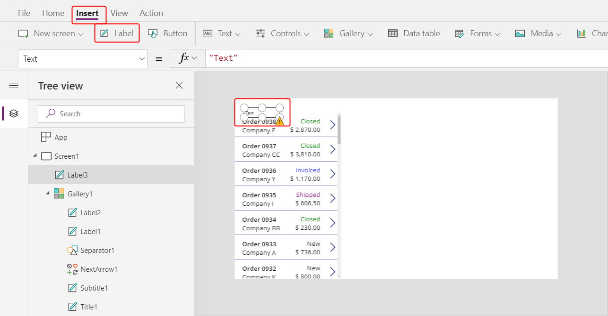

	This control should appear only once, over the top of the gallery.  If it is replicated for each item in the gallery, remove it and ensure the screen is selected in the last step before inserting it again.

1. Resize and reposition the control to span the top of the app:

	

1. Double click into the control to edit the text for the control and enter Northwind Orders:

	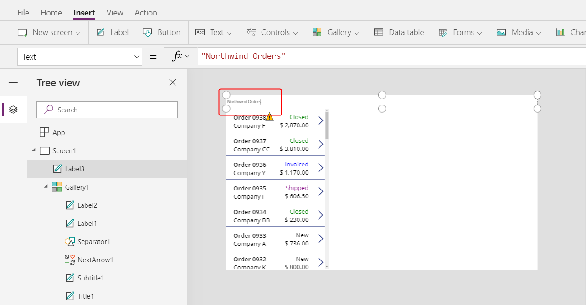

	Notice that the **Text** property is being updated in the formula bar as you type. 

1. From the **Home** ribbon, format the control to center the text, fill the background with dark blue, use white for the text color, use a bold font, and increase the font size to 24 points:

	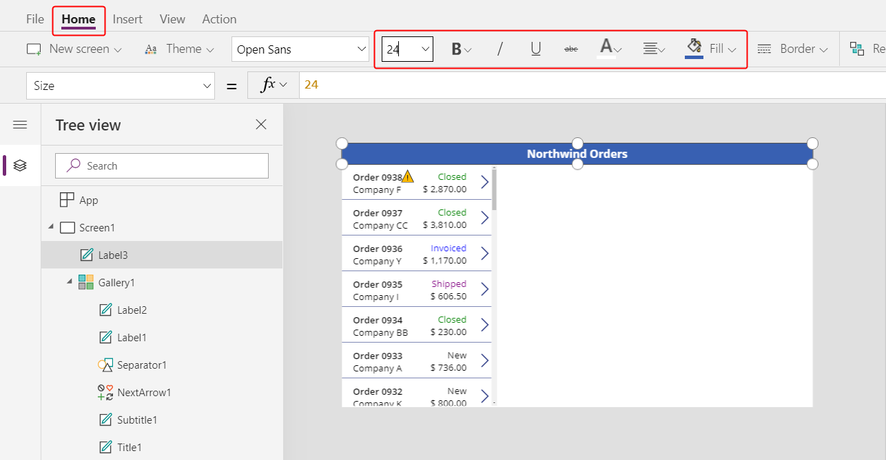

## Display more Order information

1. From the **Insert** ribbon, insert an [**Edit form** control](controls/control-form-detail.md):

	

	The control will be overlay the other controls on the screen in the top left corner:

	

1. Resize and reposition this control under the title bar in the upper right side of the screen:

	

1. In the formula bar, set the **DataSource** property of the control **Orders**:

	

1. In the Properties panel, select **Edit fields** which will open the **Fields** panel:  

	

1. Select **+ Add fields** and place a check next to these fields:

	- **Customer**
	- **Employee**

	

	Scroll down and place a check next to these fields:

	- **Notes**
	- **Order Date** 
	- **Order Number**
	- **Order Status**
	- **Paid Date**

	

	Finally, select the **Add** button at the bottom of the Fields panel.

	We now see seven fields in our form:

	

1. In the **Properties** panel, change the number of columns from 3 to 12.  This will give us more flexibility in laying out the fields:

	

	Although we said 12, that would make for some very small fields if the form control took us literally.  When switching the number of columns, the form control will keep the fields at least 3 columns wide, but we do have 12 snap points across to work with:

1. Reposition the fields within the form by drag-and-drop of their drag handles and resize them as you would any control:

	

	For more information on working with form layout, see [understand data-form layout for canvas apps](working-with-form-layout).

1. For the date fields we don't want to show the time portions.  It is tempting to just select the time controls and delete them, but that can cause problems if they are a part of the formulas for updating data values or the positioning of other controls.  

	The best way to accomplish our goal is to set the **Visible** property of the hour, minutes, and colon separator controls to *false* and resize the [**Date picker** control](controls/control-date-picker.md) to fill the width of the data card.  
 
	Find the Order Date data card in the left navigation pane.  In the navigation pane, multi-select the three controls by holding down the Shift key while selecting each.  

	

	Then set **Visible** to *false* which will be done for all three at once since they are multi-selected:

	

	And now we can resize the date picker to show all of the date:

	

1. Repeat the last step for the **Paid Date** field:

	

		

		

1. Let's connect this form to the selected Order in our Orders list.  Set the **Item** property of the form control to:

	```powerapps-dot
	Gallery1.Selected
	```

	

	As you change selection in the gallery, the form will update to reflect the information for that order.

	

## Alternate data cards

1. Besides unlocking an manually changing a data card, some data types offer a selection of pre-built experiences.  Select the form control and in the properties panel select **Edit fields**.  Then select the **Order number** field:

	

	By default, we don't want the order number to be editable so we'll select a data card that shows the value in a label control with the **View text** data card:  

	

	Now we will only see the order number but will be unable to change it:
	
	

1. To make the order number more prominent, use the **Home** ribbon to resize the text of the order number to 20 points:

	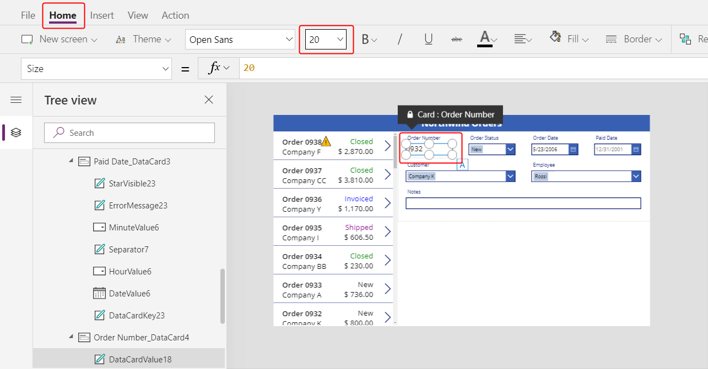

## Using Many-to-One relationships

1. 	As we saw with the Orders list, we could reference the **Company** field of the **Customer** lookup as if the entire **Customer** record wsa available to us for each **Order**.  The same is true here - the complete record for the employee is available through the combo box control's **Selected** property.

	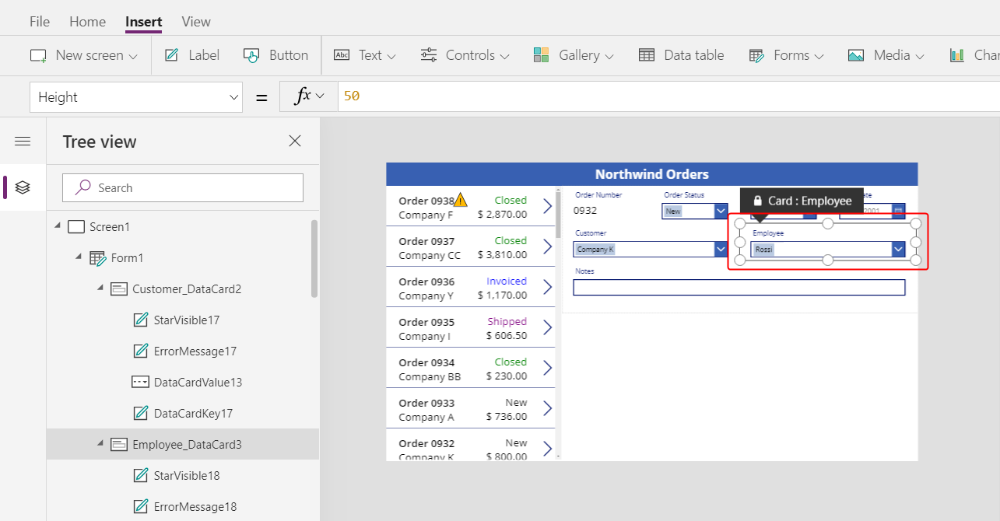

	Again nothing to change in our app for this step, we are continuing our exploration.

1. Unlock the **Employees** card:

	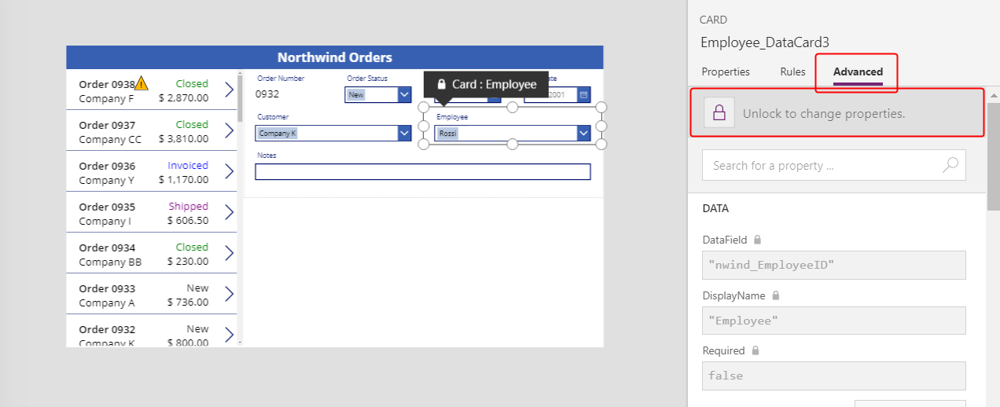

	After it has been unlocked:

	

1. Resize the combo box control within the data card to make room for the employee picture:

	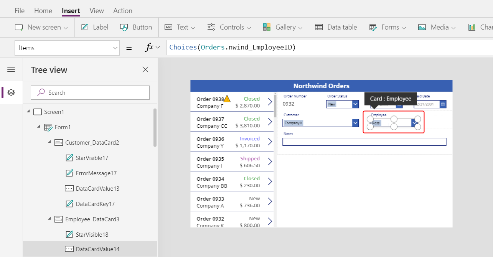

1. From the **Insert** menu, insert an [**Image** control](controls/control-image.md).  Make sure that the data card is selected before doing so:

	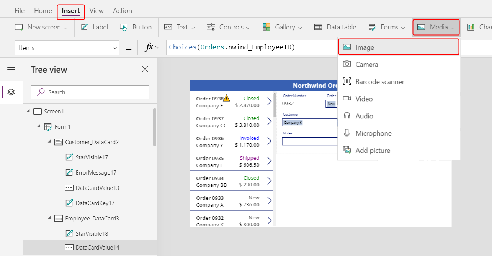

	The data card will expand to accept the image control: 

	

1. Resize and reposition the image control to the right of the combo box control:

	

1. Set the **Image** property of the image control to this formula:

	```powerapps-dot
	DataCardValue1.Selected.Picture
	```

	And now we see the picture of the selected employee.  

	

	Change the value in the combo box to see how the image tracks with the selection.

	


## Saving changes

1. From the **Insert** ribbon, insert a check mark **Icon** control: 

	TODO: select screen1 in nav pane

	

	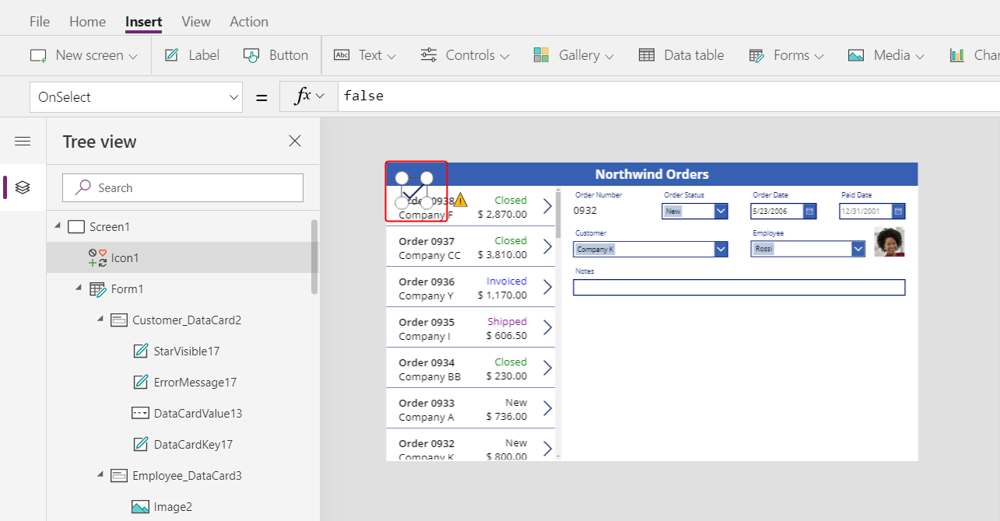

1. Using the **Home** ribbon, change the color of this icon to White.  Resize and reposition this control to the upper right hand side of the title bar:

	

1. Set the **OnSelect** property to the formula:

	```powerapps-dot
	SubmitForm( Form1 )
	```

	

1. Set the **DisplayMode** property to the formula:

	```powerapps-dot
	If( Form1.Unsaved, DisplayMode.Edit, DisplayMode.Disabled )
	```

	

1. Set the **DisabledColor** property to the formula:

	```powerappd-dot
	Gray
	```

	

	We can now save changes to an order.  The check mark icon will be disabled and gray if we have not changed anything on the form:

	

1. From the **Insert** ribbon, insert a cancel **Icon** control.  Using the **Home** ribbon, change its color to white.  Resize and reposition the control to the left of the check mark icon:

	

	

	

1. Set the **OnSelect** property to the formula:

	```powerapps-dot
	ResetForm( Form1 )
	```

	


1. Set the **DisplayMode** property to the formula:

	```powerapps-dot
	If( Form1.Unsaved Or Form1.Mode = FormMode.New, DisplayMode.Edit, DisplayMode.Disabled )
	```

	

1. Set the **DisabledColor** property to the formula:

	```powerappd-dot
	Gray
	```

	

	We can now cancel changes to an order.  The check mark and cancel icons will be disabled and gray if we have not changed anything on the form:

	

1. From the **Insert** ribbon, insert an add **Icon** control.  Using the **Home** ribbon, change its color to white.  Resize and reposition the control to the left of the check mark icon:

	

	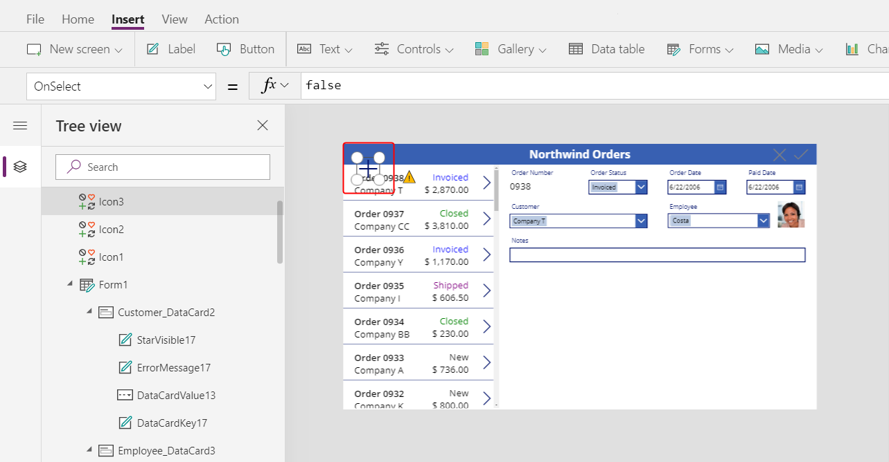

	

1. Set the **OnSelect** property to the formula:

	```powerapps-dot
	NewForm( Form1 )
	```

	

1. Set the **DisplayMode** property to the formula:

	```powerapps-dot
	If( Form1.Unsaved Or Form1.Mode = FormMode.New, DisplayMode.Disabled, DisplayMode.Edit )
	```

	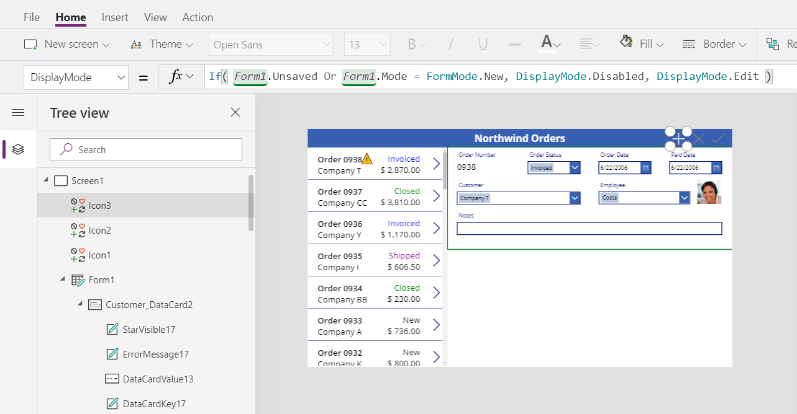


1. Set the **DisabledColor** property to the formula:

	```powerappd-dot
	Gray
	```

	

	We can now cancel changes to an order.  The check mark and cancel icons will be disabled and gray if we have not changed anything on the form:

	

1. From the **Insert** ribbon, insert a **Trash** **Icon** control.  Using the **Home** ribbon, change its color to white.  Resize and reposition the control to the left of the check mark icon:

	

	

	

1. Set the **OnSelect** property to the formula:

	```powerapps-dot
	Remove( Orders, Gallery1.Selected )
	```

	

1. Set the **DisplayMode** property to the formula:

	```powerapps-dot
	If( Form1.Mode = FormMode.New, DisplayMode.Disabled, DisplayMode.Edit )
	```

	

1. Set the **DisabledColor** property to the formula:

	```powerappd-dot
	Gray
	```

	

	We can now cancel changes to an order.  The check mark and cancel icons will be disabled and gray if we have not changed anything on the form:

	


## On to Part 3

To recap, we just built a single screen Canvas app that shows the list of Orders.  This list includes:
- A formula to format the Order Number: `"Orders " & ThisItem.OrderNumber`
- A field in a Many-to-One relationship: `ThisItem.Customer.Company`
- An Option set label: `ThisItem.'Order Status'`
- Conditional formatting for the status: `Switch( ThisItem.'Order Status', 'Orders Status'.Closed, Green, ...`
- An aggregate function over a One-to-Many relationship: `Sum( ThisItem.'Order Details', Quantity * 'Unit Price' )`

In the next part, we'll add an [**Edit form** control](controls/control-form-detail.md) to display and edit more information about the order in a form.


	


