# Create an order overview in a canvas app

Follow the steps in this topic to create a list of orders in a canvas app based on sample data in Common Data Service. As in the [previous topic in this series](orthwind-orders-canvas-part1.md), the sample data is for a fictitious organization named Northwind Traders, and this single-screen app is designed to run on tablets.

> [!div class="mx-imgBorder"]
> 

As you build the app, you'll discover and explore these concepts:

- **Many-to-one relationships.** Each customer can place one or more orders, but only one customer can place each order. The **Orders** entity is related to the **Customers** entity so that the list near the left edge can show which customer placed each order. The list shows the name of the customer, but it could show data from any column in the **Customers** entity.
- **One-to-many relationships.** Each order contains one or more line items, each of which appears as a record in the **Order Details** entity. Each order detail is contained in only one order.
- **Option sets.** Each order has a status, such as **New**, **Shipped**, **Invoiced**, or **Closed**. Sets of values such as these are defined as option sets in the database and can be shared across apps.
- **Gallery and form interactions.** The gallery lists all orders, a user can select an order, and the rest of the app responds to the user's selection.

To build this app, follow the steps in these topics

> [!div class="mx-imgBorder"]
> 

- [**Part 1, Orders list**](northwind-orders-canvas-part1.md): Show each order's number, customer name, status, and total amount in a list. Select an order that you want to edit or delete elsewhere in the screen.
- **Part 2, Order form**: As this topic describes, show and edit an overview of the order, delete the order, or create another order.
- [**Part 3, Order details**](northwind-orders-canvas-part3.md): Show and edit the line items, called order details, that are associated with each order.

If you haven't already done so, [install the Northwind Traders sample database and apps](northwind-install.md), and then take either of these approaches:

- Build the first part of the app yourself by [creating the list of orders](northwind-orders-canvas-part1.md).
- Take a shortcut by opening the **Northwind Orders (Canvas), Start Part 2** app.

## Add a title bar

Across the top of the app, create a title bar that will hold action buttons later.

1. In the **Tree view** pane, select **Screen1** to ensure that you don't accidentally add controls to the orders-list gallery:

    > [!div class="mx-imgBorder"]
    > 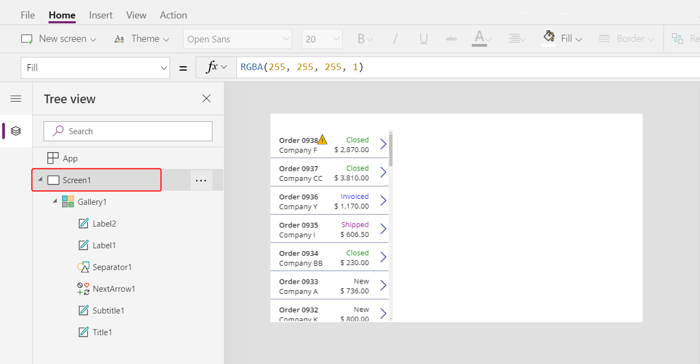

1. On the **Insert** tab, select **Label** to insert a [**Label**](controls/control-text-box.md) control:

    > [!div class="mx-imgBorder"]
    > 

    This control should appear only once, above the gallery. If it appears in each item of the gallery, delete the first instance of the label, ensure that the screen is selected (see previous step), and then insert the label again.

1. Move the control and resize it to span the top of the screen:

    > [!div class="mx-imgBorder"]
    > 

1. Double click into the control to edit its text, and then enter **Northwind Orders**.

    As an alternative, modify the **Text** property in the formula bar, which has the same result:

    > [!div class="mx-imgBorder"]
    > 

1. On the **Home** tab, format the label control:
    - Increase the font size to 24 points.
    - Make the text bold.
    - Make the text white.
    - Center the text.
    - Add a dark-blue fill to the background.

    > [!div class="mx-imgBorder"]
    > 

## Show an order overview

In this section, you'll add controls to show more information about the currently selected order.

1. On the **Insert** tab, insert an [**Edit form**](controls/control-form-detail.md) control:

    > [!div class="mx-imgBorder"]
    > 

    By default, the control appears in the upper-left corner, where other controls might make it difficult to find:

    > [!div class="mx-imgBorder"]
    > 

1. Move this control under the title bar, and resize the form to cover the upper-right corner of the screen:

    > [!div class="mx-imgBorder"]
    > 

1. In the formula bar, set the **DataSource** property of the control to this formula:

    ```powerapps-dot
    Orders
    ```

    > [!div class="mx-imgBorder"]
    > 

    You can set the same property in the **Properties** tab of the right-hand pane, but this approach adds fields to the form that we don't need. If you use the formula bar, the form remains empty.

1. In the **Properties** tab of the right-hand pane, select **Edit fields** to open the **Fields** pane:

    > [!div class="mx-imgBorder"]
    > 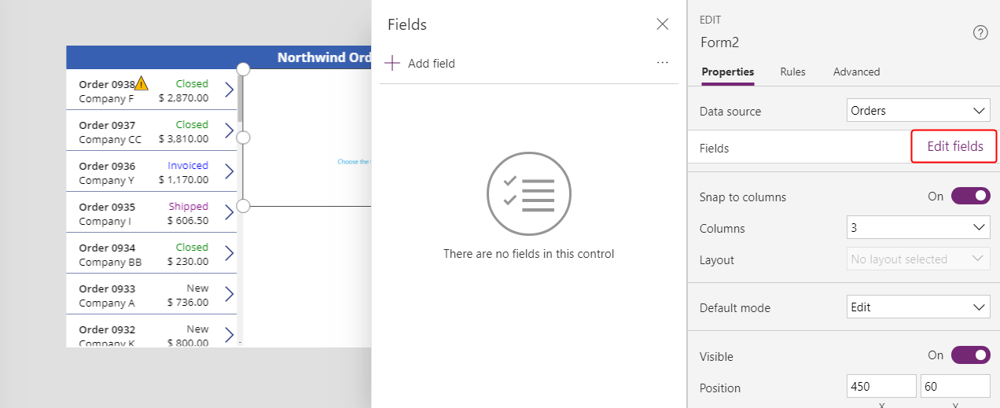

1. In the **Fields** pane, select **Add field**, and then select the check boxes for the **Customer** and **Employee** fields.

    > [!div class="mx-imgBorder"]
    > 

1. Scroll down until  these fields appear, and then select their check boxes:

    - **Notes**
    - **Order Date**
    - **Order Number**
    - **Order Status**
    - **Paid Date**

    > [!div class="mx-imgBorder"]
    > 

1. At the bottom of the **Fields** pane, select **Add**.

    The form shows seven fields:

    > [!div class="mx-imgBorder"]
    > 

    If any field shows a red error icon, a problem might have occurred when data was pulled from the source. To resolve the error, select **Data sources** on the **View** tab, select **Data sources** in the **Data** pane, select the ellipsis (...) next to **Orders**, and then select **Refresh**.

1. In the **Properties** tab of the right-hand pane, change the number of columns in the form from 3 to 12.

    This step adds flexibility as you arrange the fields:

    > [!div class="mx-imgBorder"]
    > 

    Many UI designs rely on 12-column layouts because they can evenly accommodate rows of 1, 2, 3, 4, 6, and 12 controls. You'll create rows that contain 1, 2, or 4 controls.

1. Move and resize the fields by dragging their handles, just as you would any other control:

    > [!div class="mx-imgBorder"]
    > 

    For more information about how to arrange fields in a form, see [Understand data-form layout for canvas apps](working-with-form-layout.md).

1. Let's not show the time portions of the date fields; that level of granularity is not needed.

    It is tempting to just select the time controls and delete them, but that can cause problems if they are a part of the formulas for updating data values or the positioning of other controls within the data card.  

	The best way to accomplish our goal is to set the **Visible** property of the hour, minutes, and colon separator controls to *false* and resize the [**Date picker** control](controls/control-date-picker.md) to fill the width of the data card.  
 
	Find the **Order Date** data card in the left navigation pane (it may have a different name, but should contain **Order Date**).  In the navigation pane, multi-select the three controls by holding down the Shift key while selecting each.  

	

	Then set **Visible** to *false*.  All controls selected will be effected:

	

	And now we can re-size the date picker to show the complete date:

	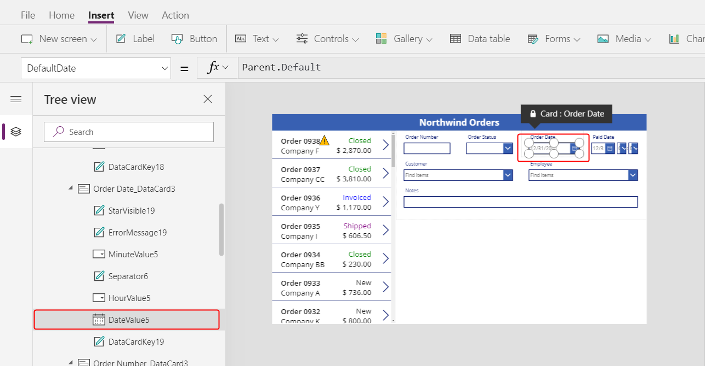

1. Repeat the last step for the **Paid Date** field.  First multi-select the controls in the left hand navigation panel:

	

    Then set **Visible** to *false*:

		

    And finally re-size the date picker control:

	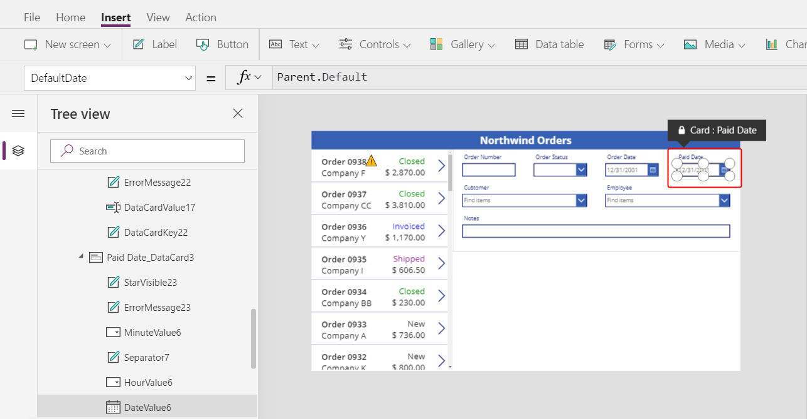	

1. Finally, let's connect the selected item in our Orders list to the Order form.  
 
    Select the form control in the navigation pane.  Set the **Item** property of the form control to:

	```powerapps-dot
	Gallery1.Selected
	```

	

    Your gallery may be named something different than **Gallery1**.  Check the navigation pane to find the name of your form if you experience problems.  

	Now as you change selection in the gallery, the form will update to reflect additional information for that order.

	

## Alternate data cards

1. The Order number field is an auto-number field, assigned by the Common Data Service when the record is created.  Let's change the data card so this field is not editable.

    Some data types offer a selection of pre-built experiences.  Select the form control and in the properties panel select **Edit fields**.  Then select the **Order number** field:

	

1. Pull down on the **Control type** control:

	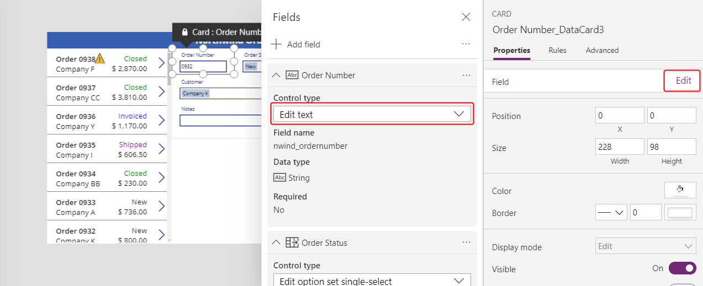

1. Select the **View text** data card:  

	

1. Close the Data panel.  Now we will only see the order number but will be unable to change it:
	
	

1. To make the order number more prominent, use the **Home** ribbon to re-size the text of the order number to 20 points:

	

## Using Many-to-One relationships in data cards

1. 	Let's display the employee's picture next to the selected employee.  Select the employee data card:  

	

1. Using the Advanced panel, unlock the **Employees** card:

	

	After it has been unlocked, formulas that were previously read only can now be edited:

	

1. Re-size the combo box control within the data card to make room for the employee picture:

	

1. From the **Insert** menu, insert an [**Image** control](controls/control-image.md).  Make sure that the data card is selected before doing so:

	

	The data card will expand to accept the image control: 

	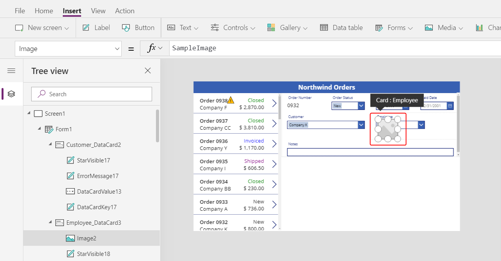

1. Re-size and re-position the image control to the right of the combo box control:

	

1. Set the **Image** property of the image control to this formula:

	```powerapps-dot
	DataCardValue1.Selected.Picture
	```

	

	And now we see the picture of the selected employee.

    It is possible the name of your combo box control is different than shown here.  Check the navigation pane on the left side of the PowerApps Studio to see the control name used in your app.
 	
    The **Orders** entity has a Many-to-One relationship with the **Employees** entity.  As we saw with the Orders list we can reference all the columns of the related record, in this case the **Picture** field.  We are doing this from the record that is selected in the combo box control.

1. Change the value in the combo box to see how the picture shown tracks with the selection.

	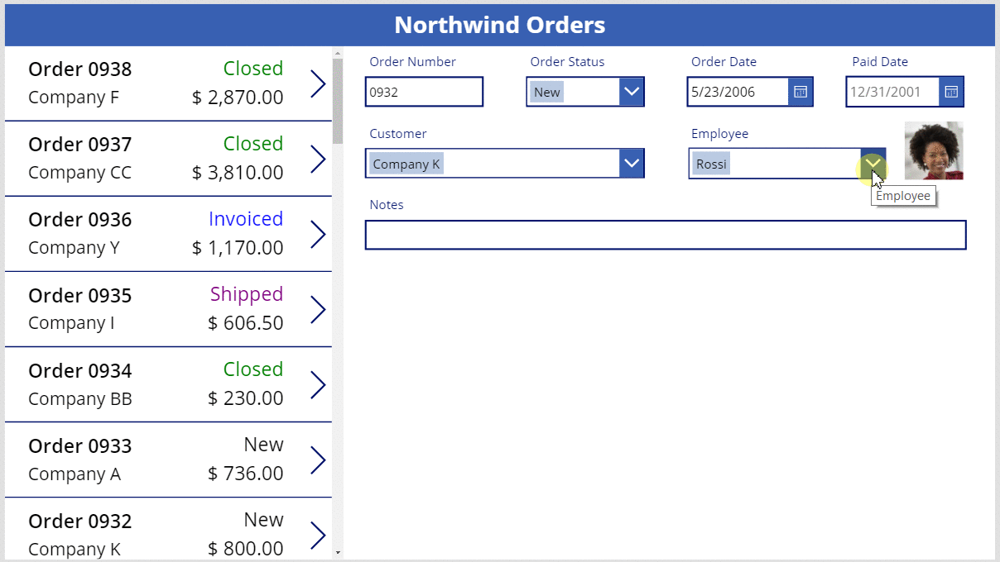

## Saving changes

1. Let's add a button to save the changes that app users make in the form.  

    Select **Screen1** in the navigation pane, to ensure we don't add a control to a data card.  From the **Insert** ribbon, insert a check mark **Icon** control: 

	

    The inserted icon will overlap other controls in the left upper corner of the screen and may be difficult to see: 

	

1. Using the **Home** ribbon, change the color of this icon to white.  Re-size and re-position this control to the upper right hand side of the title bar:

	

1. Set the **OnSelect** property to the formula:

	```powerapps-dot
	SubmitForm( Form1 )
	```

	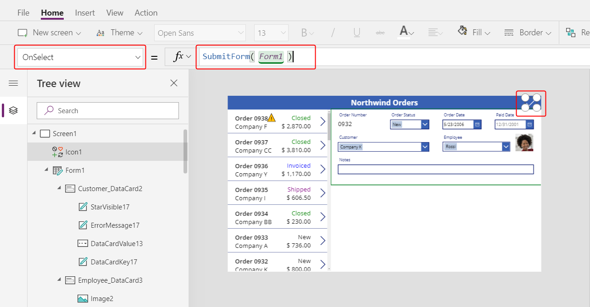

    The [**SubmitForm** function](functions/function-form.md) will gather any changed values in the form and submit them to the database.  Marching ants can be seen across the top of the screen while this is happening, and when complete, the gallery control will reflect the changes.

1. Set the **DisplayMode** property to the formula:

	```powerapps-dot
	If( Form1.Unsaved, DisplayMode.Edit, DisplayMode.Disabled )
	```

	

    It only makes sense to submit changes if there are unsaved changes on the form.  If there are no unsaved changes, the icon will appare with the **DisabledColor** which we will set next. 

1. Set the **DisabledColor** property to the formula:

	```powerappd-dot
	Gray
	```

	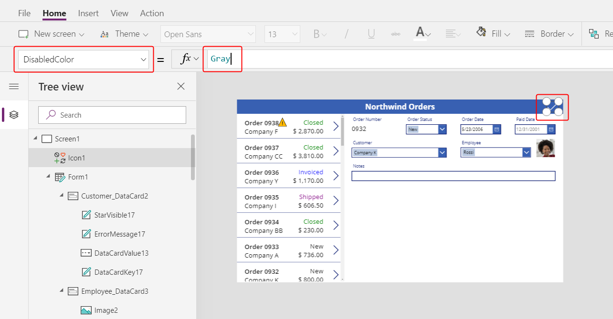

	We can now save changes to an order.  The check mark icon will be disabled and gray if we have not changed anything on the form:

	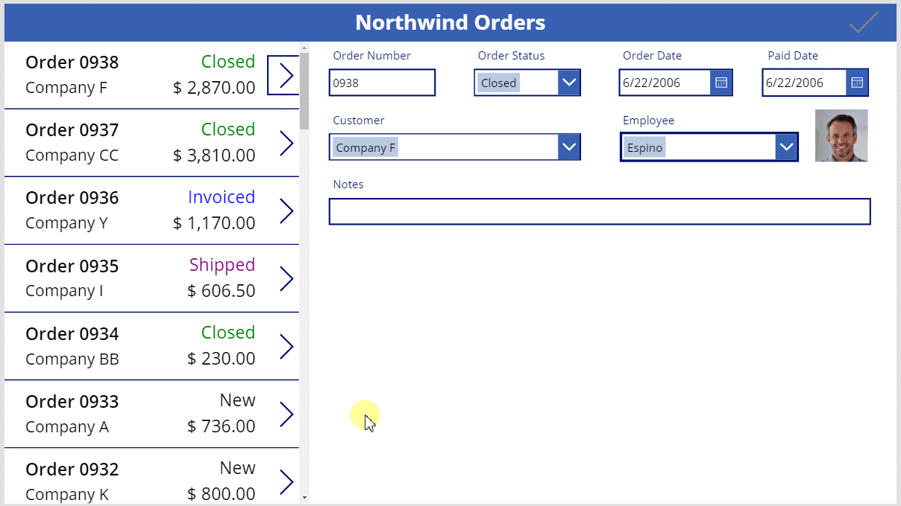

1. Let's add a button to cancel changes made to the data in a form, in case an app user changes their mind. 

    From the **Insert** ribbon, insert a cancel **Icon** control: 

	

    The inserted icon will overlap other controls in the left upper corner of the screen and may be difficult to see:

	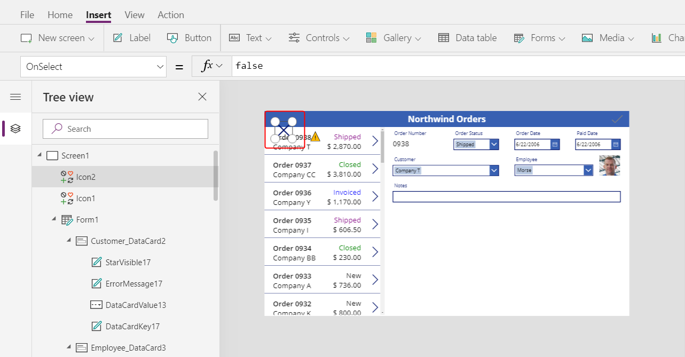

1. Using the **Home** ribbon, change the color of this icon to white.  Re-size and re-position this control to the upper right hand side of the title bar:

	

1. Set the **OnSelect** property to the formula:

	```powerapps-dot
	ResetForm( Form1 )
	```

	

    The [**ResetForm** function](functions/function-form.md) will discard all changes in the form and return the record to its original state.

1. Set the **DisplayMode** property to the formula:

	```powerapps-dot
	If( Form1.Unsaved Or Form1.Mode = FormMode.New, DisplayMode.Edit, DisplayMode.Disabled )
	```

	

    The formula here is slightly different from the one we used for the submit button.  I doesn't make sense to discard changes if none have been made.  But there is an added case: if the form is in **New** mode (which we'll enable next) we will want **ResetForm** to discard the new record.

1. Set the **DisabledColor** property to the formula:

	```powerappd-dot
	Gray
	```

	

	We can now cancel changes to an order.  The check mark and cancel icons will be disabled and gray if we have not changed anything on the form:

	

1. From the **Insert** ribbon, insert an add **Icon** control.  

	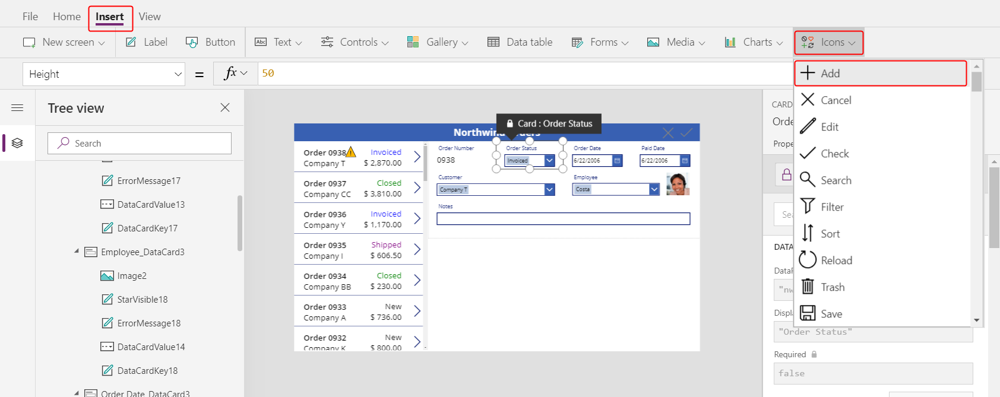

    The inserted icon will overlap other controls in the left upper corner of the screen and may be difficult to see:

	

1. Using the **Home** ribbon, change the color of this icon to white.  Re-size and re-position this control to the upper right hand side of the title bar:

	

1. Set the **OnSelect** property to the formula:

	```powerapps-dot
	NewForm( Form1 )
	```

	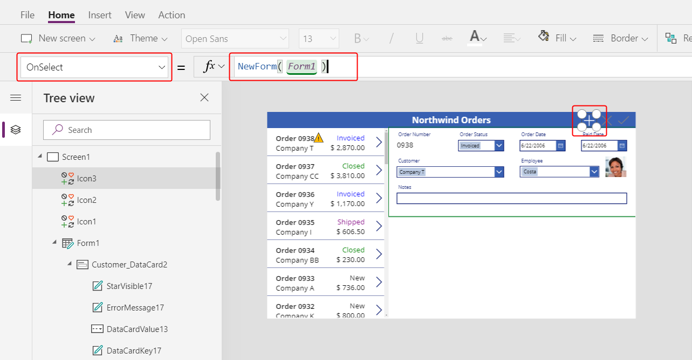

    The [**NewForm** function](functions/function-form.md) will create a new blank record to show in the form.  

1. Set the **DisplayMode** property to the formula:

	```powerapps-dot
	If( Form1.Unsaved Or Form1.Mode = FormMode.New, DisplayMode.Disabled, DisplayMode.Edit )
	```

	

    The formula is the reverse of the last **DisplayMode** we set.  Here, if there are unsaved changed we should be disabled until those are saved.  Even if there are no unsaved changed (no deviation from the default blank) we still should not enter **New** mode again.  

1. Set the **DisabledColor** property to the formula:

	```powerappd-dot
	Gray
	```

	

	We can now create new orders.  But only if the form has no unsaved changes and we are already not creating an order:  

	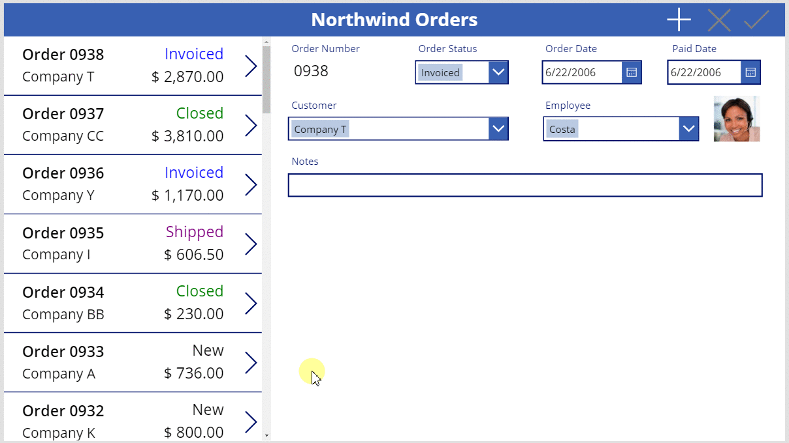

1. From the **Insert** ribbon, insert a **Trash** **Icon** control.  

	

    The inserted icon will overlap other controls in the left upper corner of the screen and may be difficult to see:

	

1. Using the **Home** ribbon, change the color of this icon to white.  Re-size and re-position this control to the upper right hand side of the title bar:

	

1. Set the **OnSelect** property to the formula:

	```powerapps-dot
	Remove( Orders, Gallery1.Selected )
	```

	

    The [**Remove** function](functions/function-remove-removeif.md) is not a form control function.  But we are grouping it here since the app's user would see that the currently selected record, which is showing in the form, is the one to be deleted.  Rather than working through the form control, we use the **Remove** function which directly removes a record form a data source.

1. Set the **DisplayMode** property to the formula:

	```powerapps-dot
	If( Form1.Mode = FormMode.New, DisplayMode.Disabled, DisplayMode.Edit )
	```

	

    It doesn't make sense to delete a record that is being created, that does not yet exist in the data source.

1. Set the **DisabledColor** property to the formula:

	```powerappd-dot
	Gray
	```

	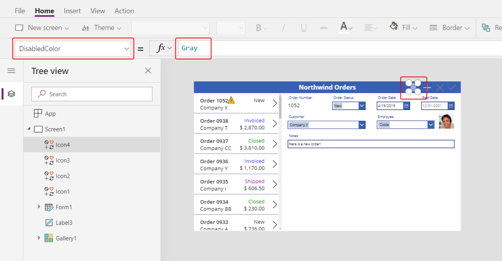

	We can now delete existing orders.

	

## On to Part 3

To recap, we just added a form to our app which allows us to see and edit more information about each order.  We used:
- A form for Orders: **DataSource =** `Orders`
- A connection between the Orders list and the form: **Item =** `Gallery1.Selected`
- An alternate data card for Order number: **View text**
- A Many-to-One relationship to show the employee's picture in the employee data card: `DataCardValue1.Selected.Picture`
- Icon to save changes to an Order: `SubmitForm( Form1 )`
- Icon to cancel changes to an Order: `ResetForm( Form1 )`
- Icon to create a new Order: `NewForm( Form1 )`
- Icon to delete an existing record: `Remove( Orders, Gallery1.Selected )` 

In the next part, we'll add another gallery control and use the [**Patch** function](functions/function-patch.md) to display and edit the list of items sold with each order.


	


