# Create a summary form in a canvas app

Follow step-by-step instructions to create a summary form in a canvas app for managing fictitious data in the Northwind Traders database. This topic is part of a series that explains how to build a business app on relational data in Microsoft Dataverse. For best results, explore these topics in this sequence:

1. [Create an order gallery](northwind-orders-canvas-part1.md).
2. Create a summary form (**this topic**).
3. [Create a detail gallery](northwind-orders-canvas-part3.md).

> [!div class="mx-imgBorder"]
> 

## Prerequisites

1. [Install the Northwind Traders database and apps](northwind-install.md).
1. Review the [overview of the canvas app](northwind-orders-canvas-overview.md) for Northwind Traders.
1. [Create the order gallery](northwind-orders-canvas-part1.md) yourself, or open the **Northwind Orders (Canvas) - Begin Part 2** app, which already contains that gallery.

## Add a title bar

Across the top of the app, create a title bar, which will hold action buttons by the end of this topic.

1. In the **Tree view** pane, select **Screen1** to ensure that you don't accidentally add a control to the order gallery:

    > [!div class="mx-imgBorder"]
    > 

1. On the **Insert** tab, select **Label** to insert a [**Label**](controls/control-text-box.md) control:

    > [!div class="mx-imgBorder"]
    > 

    The new label should appear only once, above the gallery. If it appears in each item of the gallery, delete the first instance of the label, ensure that the screen is selected (as the previous step describes), and then insert the label again.

1. Move and resize the new label to span the top of the screen:

    > [!div class="mx-imgBorder"]
    > 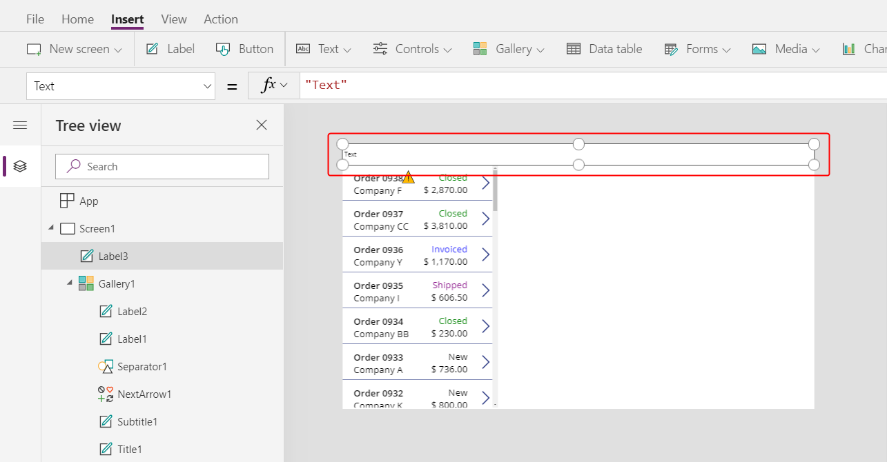

1. Double-click the text of the label, and then type **Northwind Orders**.

    As an alternative, modify the **Text** property in the formula bar to achieve the same result:

    > [!div class="mx-imgBorder"]
    > 

1. On the **Home** tab, format the label:
    - Increase the font size to 24 points.
    - Make the text bold.
    - Make the text white.
    - Center the text.
    - Add a dark-blue fill to the background.

    > [!div class="mx-imgBorder"]
    > 

## Add an Edit form control

In this section, you'll add controls to show a summary of any order that the user selects in the gallery.

1. On the **Insert** tab, insert an [**Edit form**](controls/control-form-detail.md) control:

    > [!div class="mx-imgBorder"]
    > 

    By default, the form appears in the upper-left corner, where other controls might make it difficult to find:

    > [!div class="mx-imgBorder"]
    > 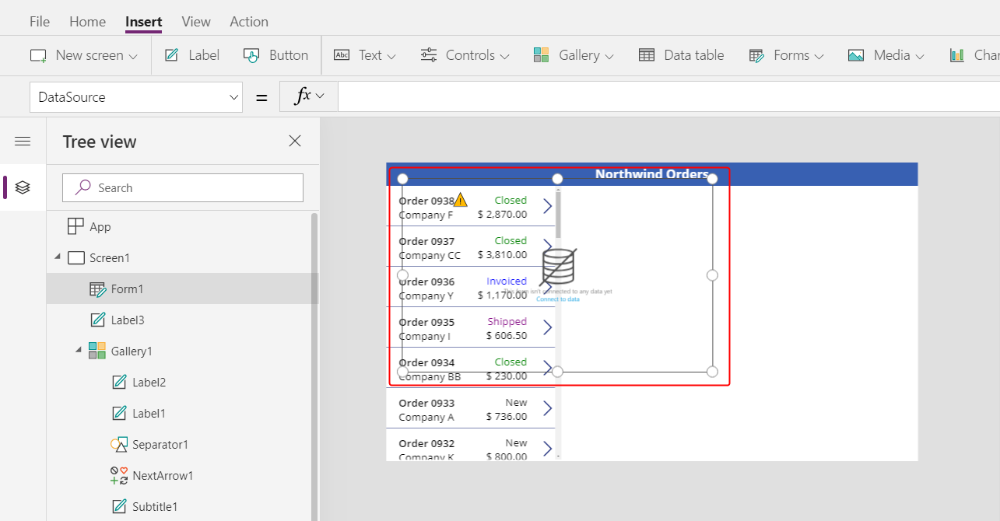

1. Move and resize the form to cover the upper-right corner of the screen under the title bar:

    > [!div class="mx-imgBorder"]
    > 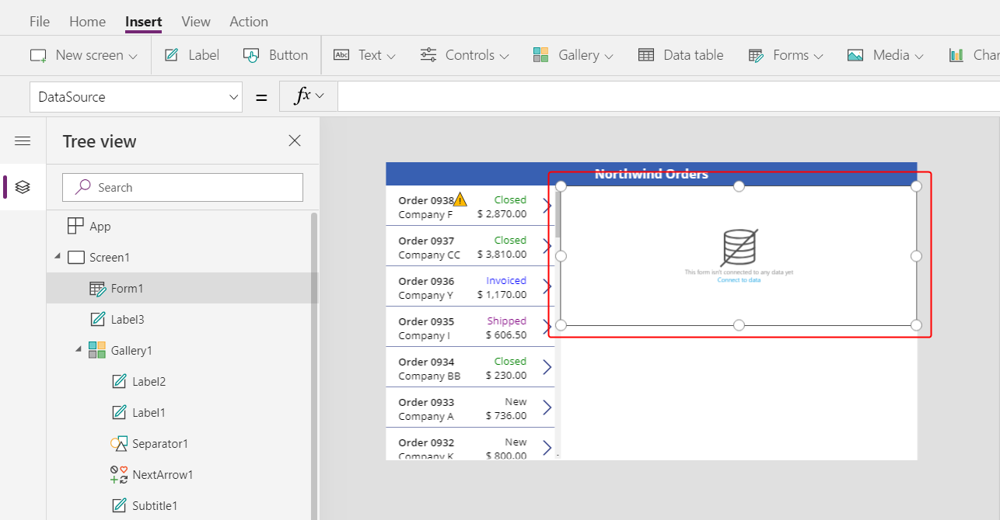

1. In the **Properties** pane, select the **Data source** drop down.

    > [!div class="mx-imgBorder"]
    > 

1. Select the **Orders** data source.

## Add and arrange fields

1. In the **Properties** tab near the right edge, select **Edit fields** to open the **Fields** pane.

    > [!div class="mx-imgBorder"]
    > 

1. If the **Fields** pane is not empty, remove the fields that have already been inserted.  

    > [!div class="mx-imgBorder"]
    > 

1. After the fields list is empty, select **Add field**, and then select the check boxes for the **Customer** and **Employee** fields.

    > [!div class="mx-imgBorder"]
    > 

1. Scroll down until these fields appear, and then select their check boxes:

    - **Notes**
    - **Order Date**
    - **Order Number**
    - **Order Status**
    - **Paid Date**

    > [!div class="mx-imgBorder"]
    > 

    > [!div class="mx-imgBorder"]
    > 

1. At the bottom of the **Fields** pane, select **Add**, and then close the **Fields** pane.

    The form shows seven fields, which may be in a different order:

    > [!div class="mx-imgBorder"]
    > 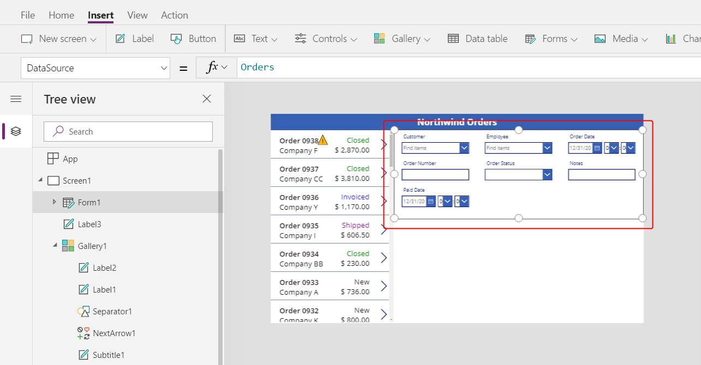

    > [!NOTE]
    > If any field shows a red error icon, a problem might have occurred when data was pulled from the source. To resolve the error, refresh the data:
    >
    > 1. On the **View** tab, select **Data sources**.
    > 1. In the **Data** pane, select **Data sources**.
    > 1. Next to **Orders**, select the ellipsis (...), select **Refresh**, and then close the **Data** pane.
    >
    > If the combo box for the customer or employee name still shows an error, check the **Primary text** and **SearchField** of each box by selecting it and then opening the **Data** pane. For the customer box, both fields should be set to **nwind_company**. For the employee box, both fields should be set to **nwind_lastname**.

1. With the form selected, change the number of columns in the form from 3 to 12 in the **Properties** tab near the right edge.

    This step adds flexibility as you arrange the fields:

    > [!div class="mx-imgBorder"]
    > 

    Many UI designs rely on 12-column layouts because they can evenly accommodate rows of 1, 2, 3, 4, 6, and 12 controls. In this topic, you'll create rows that contain 1, 2, or 4 controls.

1. Move and resize the fields by dragging their handles, just as you would any other control, so that each row contains these data cards in the specified order:

    - First row: **Order Number**, **Order Status**, **Order Date**, and **Paid Date**
    - Second row: **Customer** and **Employee**
    - Third row: **Notes**

    > [!NOTE]
    > You might find it easier to widen the **Notes**, **Customer**, and **Employee** data cards before you arrange them.

    > [!div class="mx-imgBorder"]
    > 

    More information about how to arrange fields in a form: [Understand data-form layout for canvas apps](working-with-form-layout.md).

## Hide time controls

In this example, you don't need the time portions of the date fields because that level of granularity can distract the user. If you delete them, you might cause problems in formulas that rely on those controls to update date values or determine the position of another control in the data card. Instead, you'll hide the time controls by setting their **Visible** property.

1. In the **Tree view** pane, select the **Order Date** data card.

    The card might have a different name, but it contains **Order Date**.

1. While holding down the Shift key, select the hour, minute, and colon-separator controls in the **Order Date** data card.

    > [!div class="mx-imgBorder"]
    > 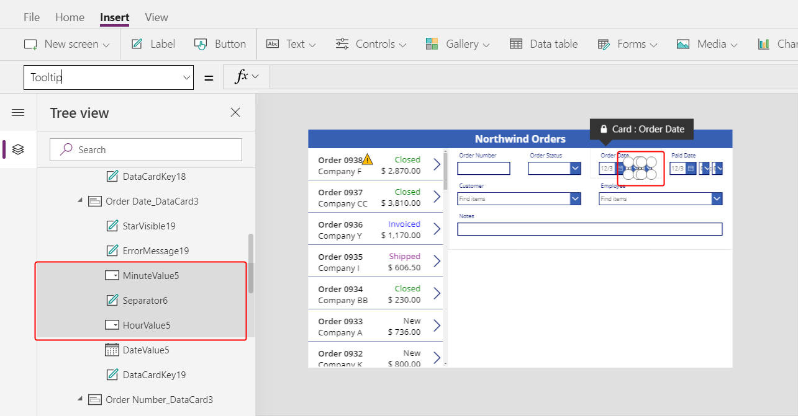

1. Set the controls' **Visible** property to **false**.

    All selected controls disappear from the form:

    > [!div class="mx-imgBorder"]
    > 

1. Resize the [**Date picker**](controls/control-date-picker.md) control to show the complete date:

    > [!div class="mx-imgBorder"]
    > 

    Next, you'll repeat the last few steps for the **Paid Date** field.

1. In the **Tree view** pane, select the time controls in the **Paid Date** data card:

    > [!div class="mx-imgBorder"]
    > 

1. Set the selected controls' **Visible** property to **false**:

    > [!div class="mx-imgBorder"]
    > 

1. Resize the date picker in the **Date Paid** card:

    > [!div class="mx-imgBorder"]
    > 

## Connect the order gallery

1. In the **Tree view** pane, collapse the form to more easily find the name of the order gallery, and then, if necessary, rename it to **Gallery1**.

1. Set the summary form's **Item** property to this expression:

    ```powerapps-dot
    Gallery1.Selected
    ```

    > [!div class="mx-imgBorder"]
    > 

    The form shows an summary of whatever order the app user selects in the list.

    > [!div class="mx-imgBorder"]
    > 

## Replace a data card

**Order number** is an identifier that Dataverse assigns automatically when you create a record. This field has a [**Text input**](controls/control-text-input.md) control by default, but you'll replace it with a label so that the user can't edit this field.

1. Select the form, select **Edit fields** in the **Properties** tab near the right edge, and then select the **Order number** field:

    > [!div class="mx-imgBorder"]
    > 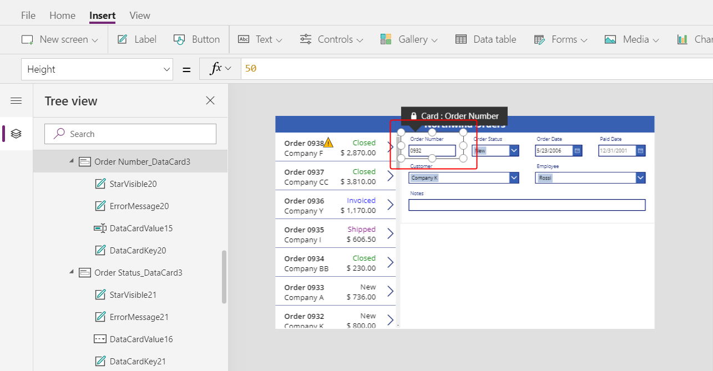

1. Open the **Control type** list:

    > [!div class="mx-imgBorder"]
    > 

1. Select the **View text** data card:

    > [!div class="mx-imgBorder"]
    > 

1. Close the **Fields** pane.

    The user can no longer change the order number:

    > [!div class="mx-imgBorder"]
    > 

1. On the **Home** tab, change the order number's font size to 20 points so that the field is easier to find:

    > [!div class="mx-imgBorder"]
    > 

## Use a many-to-one relationship

The **Orders** table has a many-to-one relationship with the **Employees** table: each employee can create many orders, but each order can be assigned to only one employee. When the user selects an employee in the [**Combo box**](controls/control-combo-box.md) control, its **Selected** property provides that employee's entire record from the **Employees** table. As a result, you can configure an [**Image**](controls/control-image.md) control to show the picture of whatever employee the user selects in the combo box.

1. Select the **Employee** data card:

    > [!div class="mx-imgBorder"]
    > 

1. In the **Advanced** tab near the right edge, unlock the data card so that you can edit formulas that were previously read-only:

    > [!div class="mx-imgBorder"]
    > 

1. In the data card, reduce the width of the combo box to make room for the employee picture:

    > [!div class="mx-imgBorder"]
    > 

1. On the **Insert** tab, select **Media** > **Image**:

    > [!div class="mx-imgBorder"]
    > 

    An image appears in the data card, which expands to accommodate it:

    > [!div class="mx-imgBorder"]
    > 

1. Resize the image, and move it to the right of the combo box:

    > [!div class="mx-imgBorder"]
    > 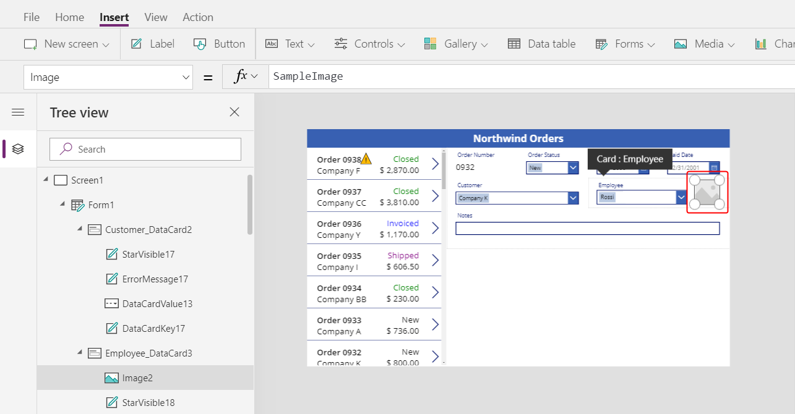

1. Set the **Image** property of the image to this formula, replacing the number at the end of DataCardValue if necessary:

    ```powerapps-dot
    DataCardValue7.Selected.Picture
    ```

    > [!div class="mx-imgBorder"]
    > 

    The picture of the selected employee appears.

1. While holding down the Alt key, select a different employee in the combo box to confirm that the picture also changes.

    > [!div class="mx-imgBorder"]
    > 

## Add a Save icon

1. In the **Tree view** pane, select **Screen1**, and then select **Insert** > **Icons** > **Check**:

    > [!div class="mx-imgBorder"]
    > 

    The [**Check**](controls/control-shapes-icons.md) icon appears in the upper-left corner by default, where other controls might make the icon difficult to find:

    > [!div class="mx-imgBorder"]
    > 

1. On the **Home** tab, change the **Color** property of the icon to white, resize the icon, and move it near the right edge of the title bar:

    > [!div class="mx-imgBorder"]
    > 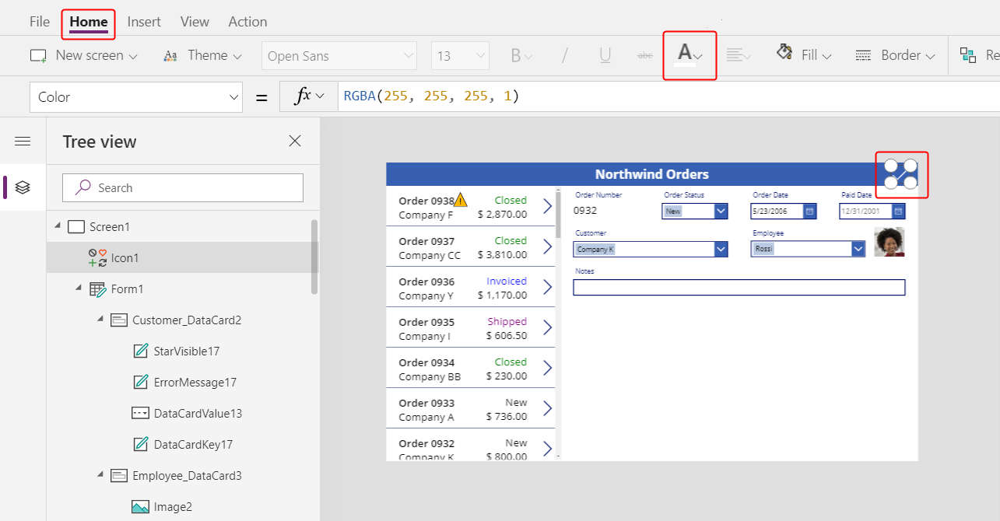

1. In the **Tree view** pane, confirm that the form's name is **Form1**, and then set the icon's **OnSelect** property to this formula:

    ```powerapps-dot
    SubmitForm( Form1 )
    ```

    > [!div class="mx-imgBorder"]
    > 

    When the user selects the icon, the [**SubmitForm**](functions/function-form.md) function gathers any changed values in the form and submits them to the data source. Dots march across the top of the screen as the data is submitted, and the order gallery reflects the changes after the process finishes.

1. Set the icon's **DisplayMode** property to this formula:

    ```powerapps-dot
    If( Form1.Unsaved, DisplayMode.Edit, DisplayMode.Disabled )
    ```

    > [!div class="mx-imgBorder"]
    > 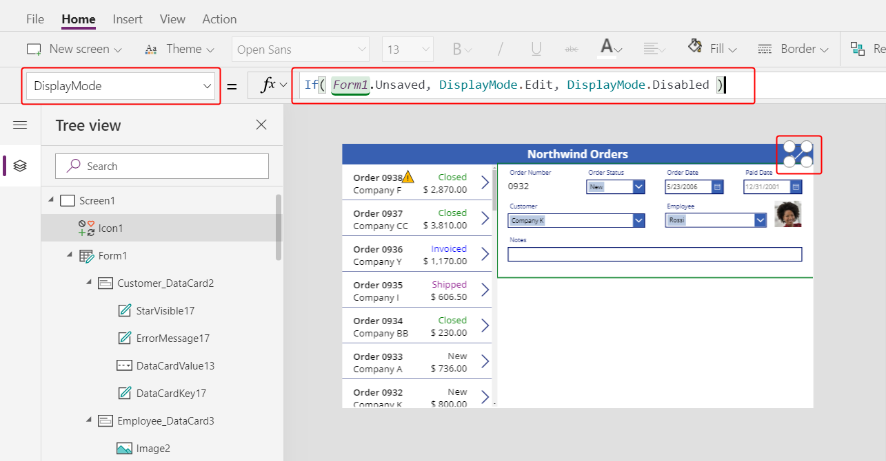

    If all changes in the form have been saved, the icon is disabled and appears in the **DisabledColor**, which you'll set next.

1. Set the icon's **DisabledColor** property to this value:

    ```powerapps-dot
    Gray
    ```

    > [!div class="mx-imgBorder"]
    > 

    The user can save changes to an order by selecting the Check icon, which is then disabled and dimmed until the user makes another change:

    > [!div class="mx-imgBorder"]
    > 

## Add a Cancel icon

1. On the **Insert** tab, select **Icons** > **Cancel**:

    > [!div class="mx-imgBorder"]
    > 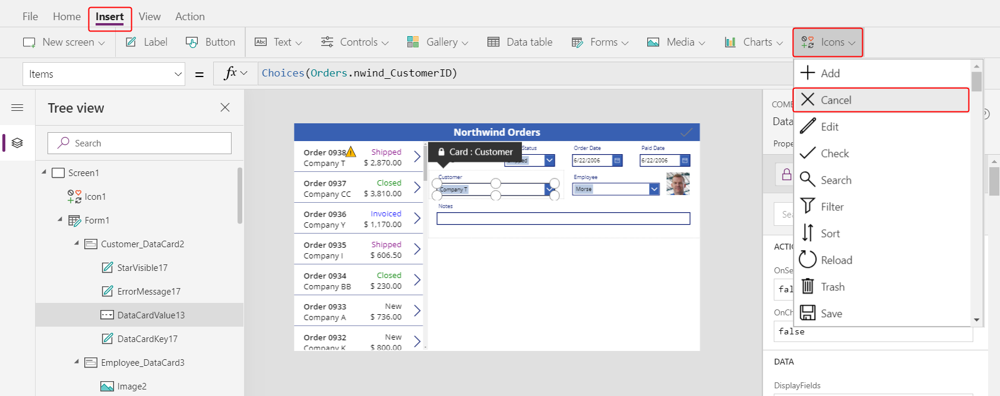

    The icon appears in the upper-left corner by default, where other controls might make the icon difficult to find:

    > [!div class="mx-imgBorder"]
    > 

1. On the **Home** tab, change the icon's **Color** property to white, resize the icon, and move it to the left of the Check icon:

    > [!div class="mx-imgBorder"]
    > 

1. Set the Cancel icon's **OnSelect** property to this formula:

    ```powerapps-dot
    ResetForm( Form1 )
    ```

    > [!div class="mx-imgBorder"]
    > 

    The [**ResetForm**](functions/function-form.md) function discards all changes in the form, which returns it to its original state.

1. Set the Cancel icon's **DisplayMode** property to this formula:

    ```powerapps-dot
    If( Form1.Unsaved Or Form1.Mode = FormMode.New, DisplayMode.Edit, DisplayMode.Disabled )
    ```

    > [!div class="mx-imgBorder"]
    > 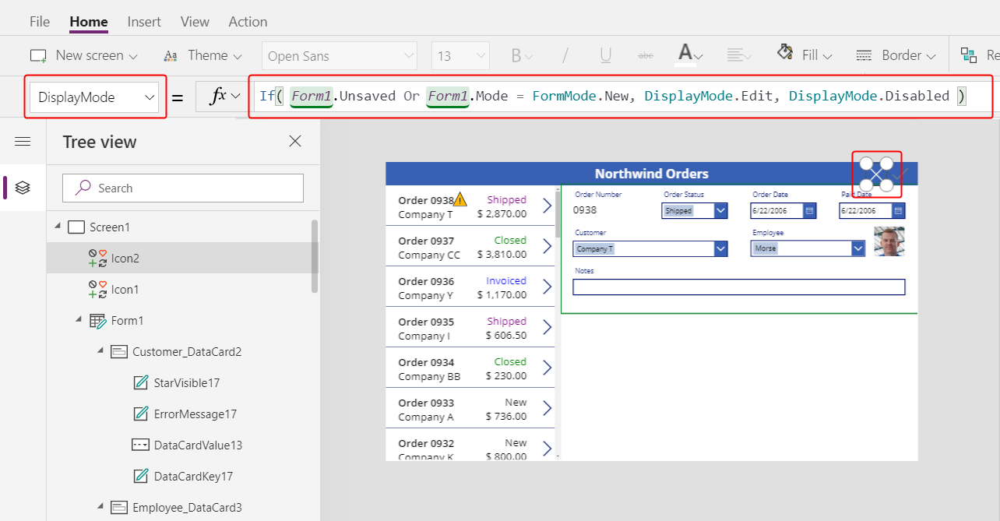

    This formula differs slightly from the one for the Check icon. The Cancel icon is disabled if all changes have been saved or the form is in **New** mode, which you'll enable next. In that case, **ResetForm** discards the new record.

1. Set the Cancel icon's **DisabledColor** property to this value:

    ```powerapps-dot
    Gray
    ```

    > [!div class="mx-imgBorder"]
    > 

    The user can cancel changes to an order, and the Check and Cancel icons are disabled and dimmed if all changes have been saved:

    > [!div class="mx-imgBorder"]
    > 

## Add an Add icon

1. On the **Insert** tab, select **Icons** > **Add**.

    > [!div class="mx-imgBorder"]
    > 

    The **Add** icon appears in the upper-left corner by default, where other controls might make it difficult to find:

    > [!div class="mx-imgBorder"]
    > 

1. On the **Home** tab, set the **Color** property of the Add icon to white, resize the icon, and move it to the left of the Cancel icon:

    > [!div class="mx-imgBorder"]
    > 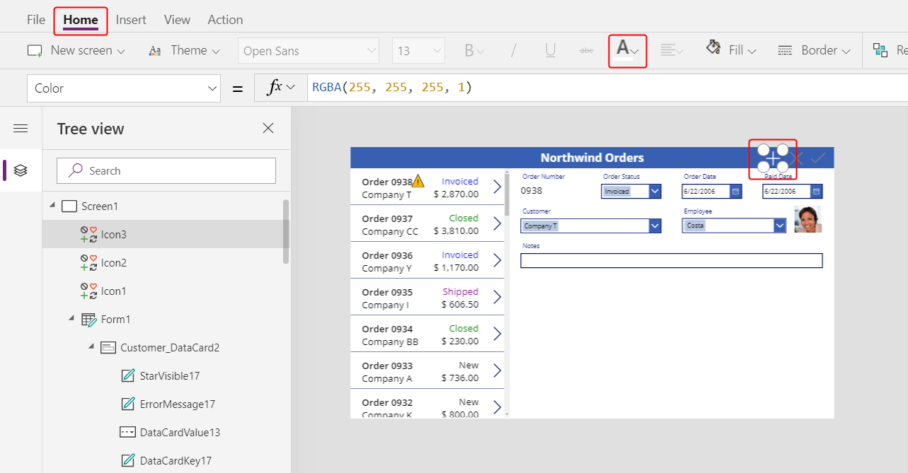

1. Set the Add icon's **OnSelect** property to this formula:

    ```powerapps-dot
    NewForm( Form1 )
    ```

    > [!div class="mx-imgBorder"]
    > 

    The [**NewForm**](functions/function-form.md) function shows a blank record in the form.  

1. Set the Add icon's **DisplayMode** property to this formula:

    ```powerapps-dot
    If( Form1.Unsaved Or Form1.Mode = FormMode.New, DisplayMode.Disabled, DisplayMode.Edit )
    ```

    > [!div class="mx-imgBorder"]
    > 

    The formula disables the Add icon under these conditions:

    - The user makes changes but doesn't save or cancel them, which is the opposite behavior from the Check and Cancel icons.
    - The user selects the Add icon but makes no changes.

1. Set the Add icon's **DisabledColor** property to this value:

    ```powerapps-dot
    Gray
    ```

    > [!div class="mx-imgBorder"]
    > 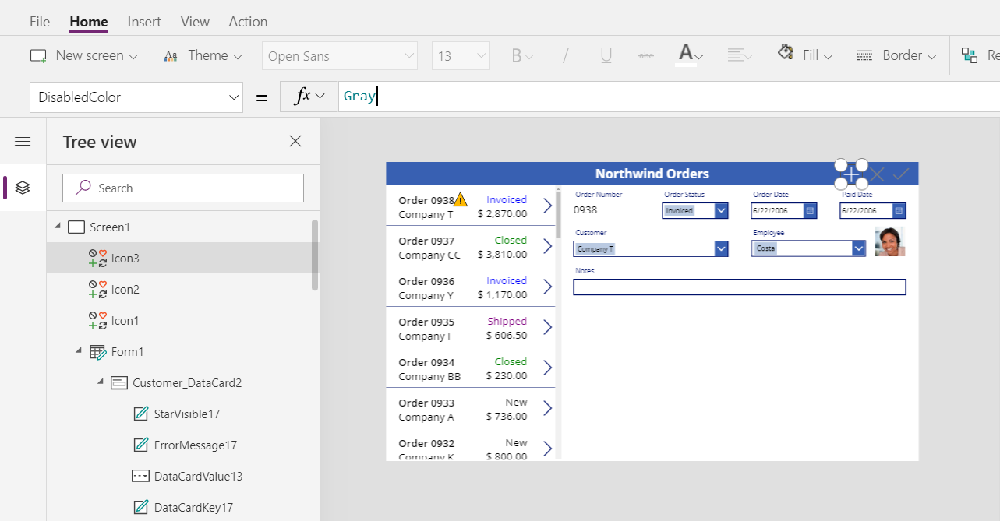

    The user can create an order if they make no changes or they save or cancel any changes they've made. (If the user selects this icon, they can't select it again until they make one or more changes and then save or cancel those changes):

    > [!div class="mx-imgBorder"]
    > 

> [!NOTE]
> If you create and save an order, you might need to scroll down in the order gallery to show your new order. It won't have a total price because you haven't added any order details yet.

## Add a Trash icon

1. On the **Insert** tab, select **Icons** > **Trash**.

    > [!div class="mx-imgBorder"]
    > 

    The **Trash** icon appears in the upper-left corner by default, where other controls might make it difficult to find:

    > [!div class="mx-imgBorder"]
    > 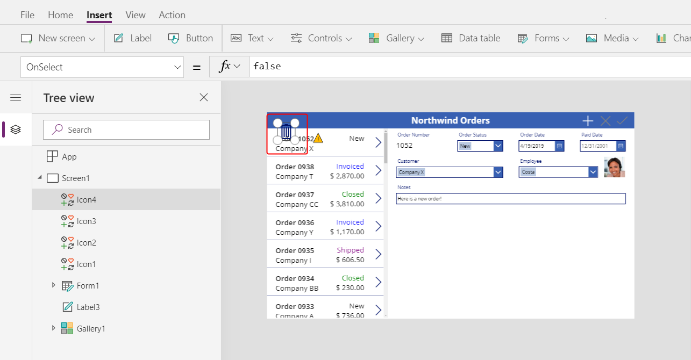

1. On the **Home** tab, change the Trash icon's **Color** property to white, resize the icon, and move it to the left of the Add icon:

    > [!div class="mx-imgBorder"]
    > 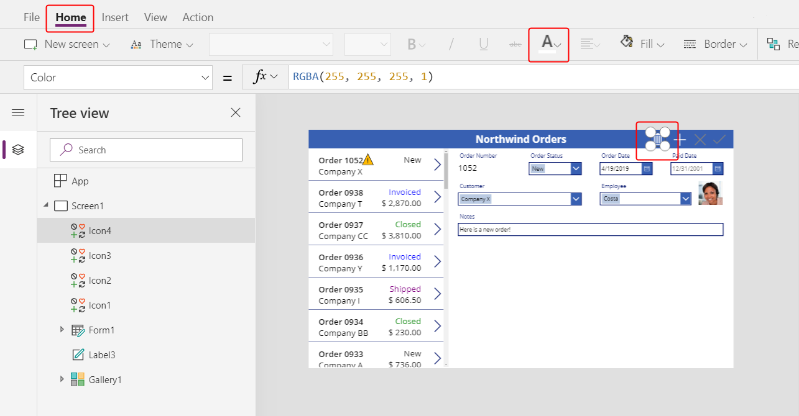

1. Set the Trash icon's **OnSelect** property to this formula:

    ```powerapps-dot
    Remove( Orders, Gallery1.Selected )
    ```

    > [!div class="mx-imgBorder"]
    > 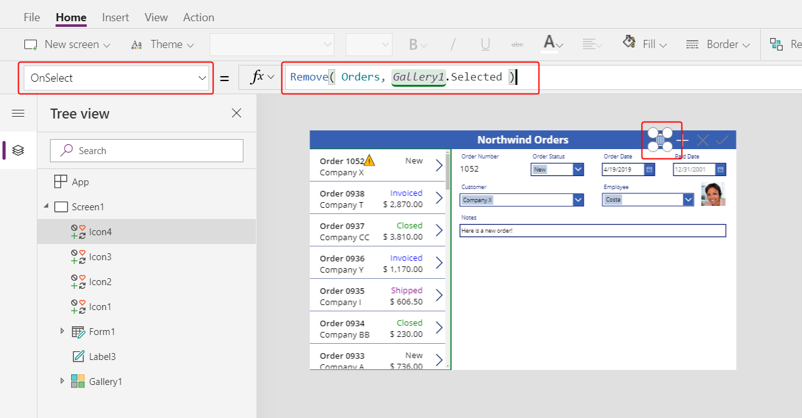

    The [**Remove**](functions/function-remove-removeif.md) function removes a record from a data source. In this formula, the function removes the record that's selected in the order gallery. The Trash icon appears near the summary form (not the order gallery) because the form shows more details about the record, so the user can more easily identify the record that the formula will delete.

1. Set the Trash icon's **DisplayMode** property to this formula:

    ```powerapps-dot
    If( Form1.Mode = FormMode.New, DisplayMode.Disabled, DisplayMode.Edit )
    ```

    > [!div class="mx-imgBorder"]
    > 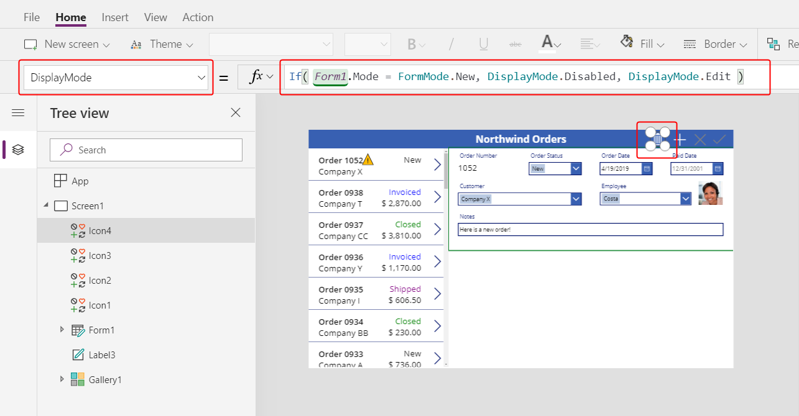

    This formula disables the Trash icon if the user is creating a record. Until the user saves the record, the **Remove** function has no record to delete.

1. Set the Trash icon's **DisabledColor** property to this value:

    ```powerapps-dot
    Gray
    ```

    > [!div class="mx-imgBorder"]
    > 

    The user can delete an order.

    > [!div class="mx-imgBorder"]
    > 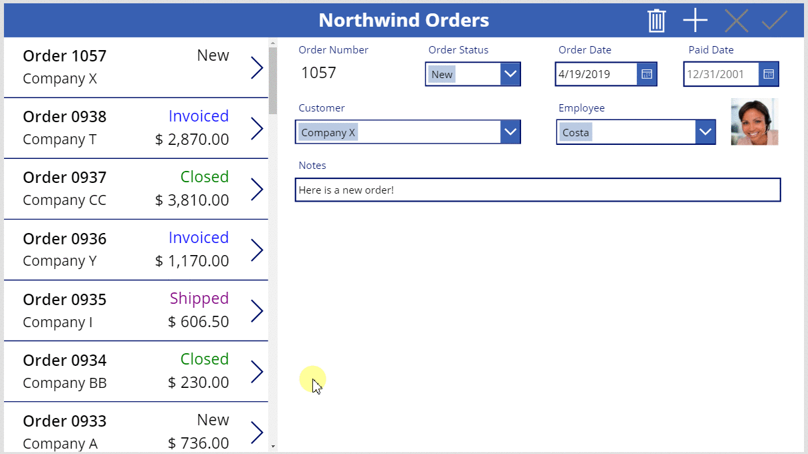

## Summary

To recap, you added a form in which the user can show and edit a summary of each order, and you used these elements:

- A form that shows data from the **Orders** table: **Form1.DataSource =** `Orders`
- A connection between the form and the order gallery: **Form1.Item =** `Gallery1.Selected`
- An alternate control for the **Order number** field: **View text**
- A many-to-one relationship to show the employee's picture in the **Employee** data card: `DataCardValue1.Selected.Picture`
- An icon to save changes to an order: `SubmitForm( Form1 )`
- An icon to cancel changes to an order: `ResetForm( Form1 )`
- An icon to create an order: `NewForm( Form1 )`
- An icon to delete an order: `Remove( Orders, Gallery1.Selected )`

## Next step

In the next topic, you'll add another gallery to show the products in each order, and you'll change those details by using the [**Patch**](functions/function-patch.md) function.

> [!div class="nextstepaction"]
> [Create the detail gallery](northwind-orders-canvas-part3.md)


[!INCLUDE[footer-include](../../includes/footer-banner.md)]