# Build Northwind Orders (Canvas): Part 2, Order form

Let's continue building a simple order management canvas app over data in the Common Data Service, step-by-step.  When we are done we will have a single screen master-detail app:


This app will showcase:

- **Many-to-One relationships.** Many Orders can be related to the same Customer. Each Order can be related to only one Customer.  All of the columns of the foreign entity are available to use.
- **One-to-Many relationships.** Each Order can be related to many Order Details (or line items). Each Order Detail is related to only one Order.
- **Option sets.**  A set of named choices defined in the database and shared across apps.  
- **Gallery and form interactions.**  The gallery provides the list of Orders to choose from, and the rest of the app responds to changes in the gallery's selection.      

The instructions for building the app are broken into three parts:


- [**Part 1, Orders list**](northwind-orders-canvas-part1.md):  Displays the list of orders.  Selection in this list determines which order is being edited on the rest of the screen.
- **Part 2, Order form**:  View and edit information about the order.  Here new orders can be created and existing orders deleted.  You are here.
- [**Part 3, Order details**](northwind-orders-canvas-part3.md):  View and edit the product line items that are associated with the order.  

If you have not already done so, work through [part 1](northwind-orders-canvas-part1.md).  Or take a shortcut by opening the **Northwind Orders (Canvas), Start Part 2** app after [installing the Northwind Traders sample database and apps](northwind-install.md)

## An app title bar

1. Let's create a title bar across the top of the app.  We'll use this space to hold action buttons later.

	Select **Screen1** in the Navigation pane.  This ensures that we don't accidentally add controls to the orders list gallery:

	

1. From the **Insert** ribbon, insert a [**Label** control](controls/control-text-box.md):

	

	This control should appear only once, over the top of the gallery.  If it is replicated for each item in the gallery, delete it and ensure the screen is selected (see previous step) before inserting it again.

1. Re-size and re-position the control to span the top of the screen:

	

1. Double click into the control to edit the text for the control and enter **Northwind Orders**.  Alternatively, you can modify the **Text** property in the formula bar, both methods do the same thing:

	

1. Using the **Home** ribbon, use the formatting buttons to format the label control:
    - increase the font size to 24 points
    - use a bold font
    - use white for the text color
    - center the text
    - fill the background with dark blue

    

## Display more Order information in a form

1. Let's display more of the columns from the currently selected order.  

    From the **Insert** ribbon, insert an [**Edit form** control](controls/control-form-detail.md):

	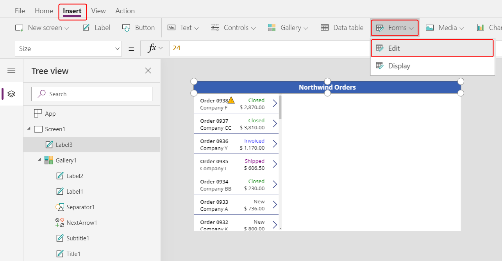

	The control will overlay the other controls on the screen in the top left corner and may difficult to see:

	

1. Re-size and re-position this control under the title bar in the upper right corner of the screen:

	

1. In the formula bar, set the **DataSource** property of the control to this formula:

    ```powerapps-dot
    Orders
    ```

	

    We could have also used the Properties panel to set the data source but this would have added fields to the form that we don't need.  By setting the data source in the formula bar the form remains empty. 

1. In the Properties panel, select **Edit fields** which will open the **Fields** panel:  

	

1. Select **+ Add field** and place a check mark next to these fields:

	- **Customer**
	- **Employee**

	

	Scroll down and place a check mark next to these fields:

	- **Notes**
	- **Order Date** 
	- **Order Number**
	- **Order Status**
	- **Paid Date**

	

	Finally, select the **Add** button at the bottom of the Fields panel.

	We now see seven fields in our form:

	

    If any of these fields show a red error there may be a problem with metadata fetch.  Using the **View** ribbon, select **Data sources**, select the three elipses to the right of **Orders** and **Refresh** the data source.

1. In the **Properties** panel, change the number of columns from 3 to 12.  This will give us more flexibility in laying out the fields:

	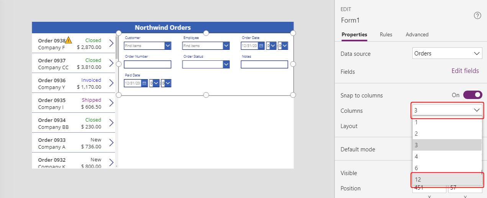

    Using a 12 column layout is common in UI design as spans of 12 columns can evenly accomodate rows of 1, 2, 3, 4, 6, and 12 controls.  We'll use this for a mix of 1, 2, and 4 controls in each row.

1. Re-position the fields within the form by drag-and-drop of their drag handles and re-size them as you would any control:

	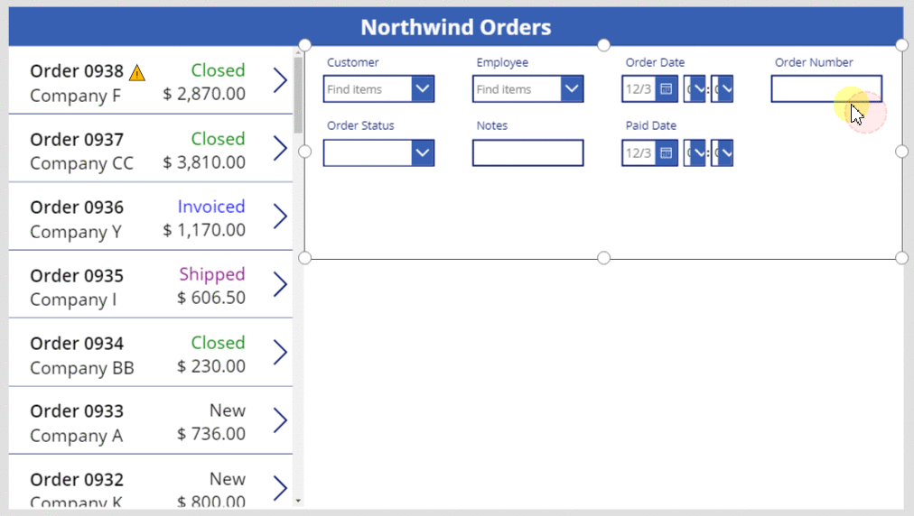

	For more information on working with form layout, see [understand data-form layout for canvas apps](working-with-form-layout.md).

1. Let's not show the time portions of the date fields, that level of granularity is not needed.  

    It is tempting to just select the time controls and delete them, but that can cause problems if they are a part of the formulas for updating data values or the positioning of other controls within the data card.  

	The best way to accomplish our goal is to set the **Visible** property of the hour, minutes, and colon separator controls to *false* and resize the [**Date picker** control](controls/control-date-picker.md) to fill the width of the data card.  
 
	Find the **Order Date** data card in the left navigation pane (it may have a different name, but should contain **Order Date**).  In the navigation pane, multi-select the three controls by holding down the Shift key while selecting each.  

	

	Then set **Visible** to *false*.  All controls selected will be effected:

	

	And now we can re-size the date picker to show the complete date:

	

1. Repeat the last step for the **Paid Date** field.  First multi-select the controls in the left hand navigation panel:

	

    Then set **Visible** to *false*:

	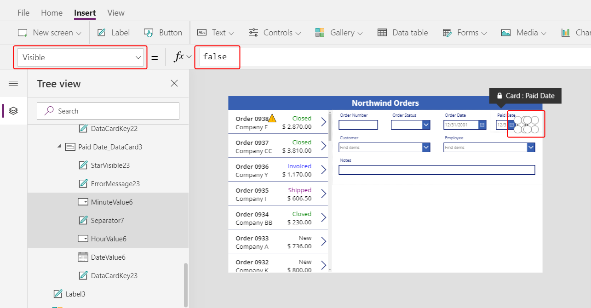	

    And finally re-size the date picker control:

		

1. Finally, let's connect the selected item in our Orders list to the Order form.  
 
    Select the form control in the navigation pane.  Set the **Item** property of the form control to:

	```powerapps-dot
	Gallery1.Selected
	```

	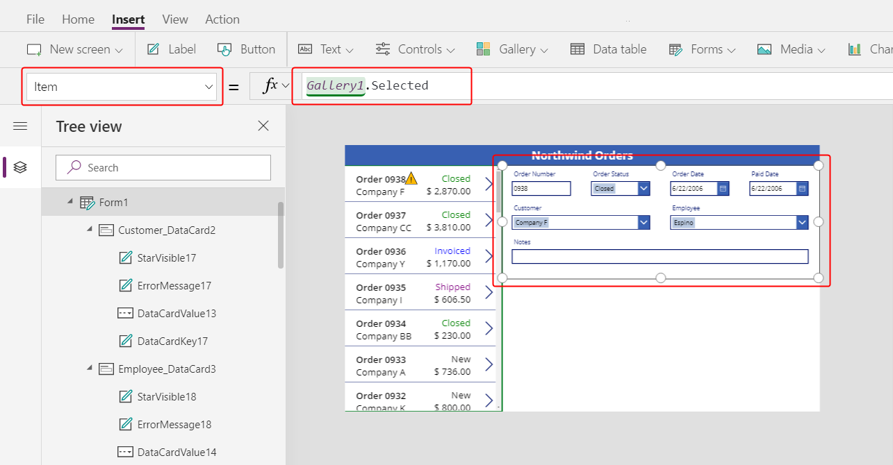

    Your gallery may be named something different than **Gallery1**.  Check the navigation pane to find the name of your form if you experience problems.  

	Now as you change selection in the gallery, the form will update to reflect additional information for that order.

	

## Alternate data cards

1. The Order number field is an auto-number field, assigned by the Common Data Service when the record is created.  Let's change the data card so this field is not editable.

    Some data types offer a selection of pre-built experiences.  Select the form control and in the properties panel select **Edit fields**.  Then select the **Order number** field:

	

1. Pull down on the **Control type** control:

	

1. Select the **View text** data card:  

	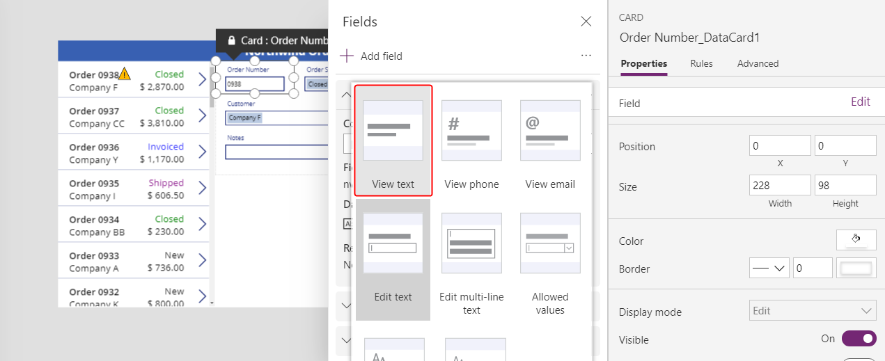

1. Close the Data panel.  Now we will only see the order number but will be unable to change it:
	
	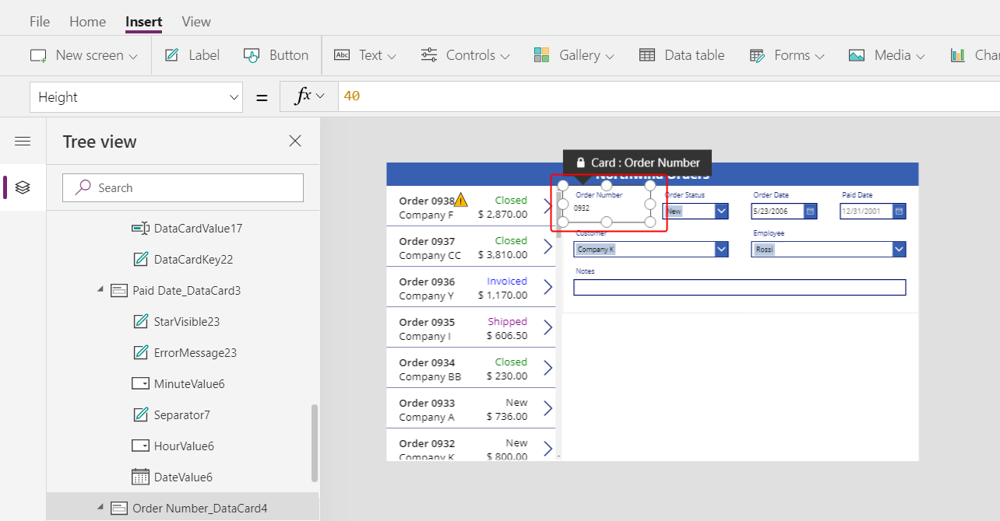

1. To make the order number more prominent, use the **Home** ribbon to re-size the text of the order number to 20 points:

	

## Using Many-to-One relationships in data cards

1. 	Let's display the employee's picture next to the selected employee.  Select the employee data card:  

	

1. Using the Advanced panel, unlock the **Employees** card:

	

	After it has been unlocked, formulas that were previously read only can now be edited:

	

1. Re-size the combo box control within the data card to make room for the employee picture:

	

1. From the **Insert** menu, insert an [**Image** control](controls/control-image.md).  Make sure that the data card is selected before doing so:

	

	The data card will expand to accept the image control: 

	

1. Re-size and re-position the image control to the right of the combo box control:

	

1. Set the **Image** property of the image control to this formula:

	```powerapps-dot
	DataCardValue1.Selected.Picture
	```

	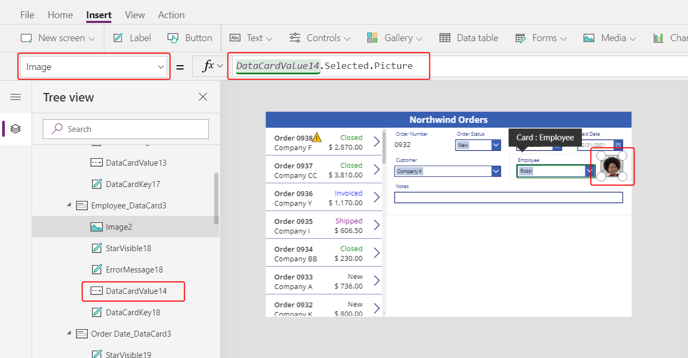

	And now we see the picture of the selected employee.

    It is possible the name of your combo box control is different than shown here.  Check the navigation pane on the left side of the PowerApps Studio to see the control name used in your app.
 	
    The **Orders** entity has a Many-to-One relationship with the **Employees** entity.  As we saw with the Orders list we can reference all the columns of the related record, in this case the **Picture** field.  We are doing this from the record that is selected in the combo box control.

1. Change the value in the combo box to see how the picture shown tracks with the selection.

	

## Saving changes

1. Let's add a button to save the changes that app users make in the form.  

    Select **Screen1** in the navigation pane, to ensure we don't add a control to a data card.  From the **Insert** ribbon, insert a check mark **Icon** control: 

	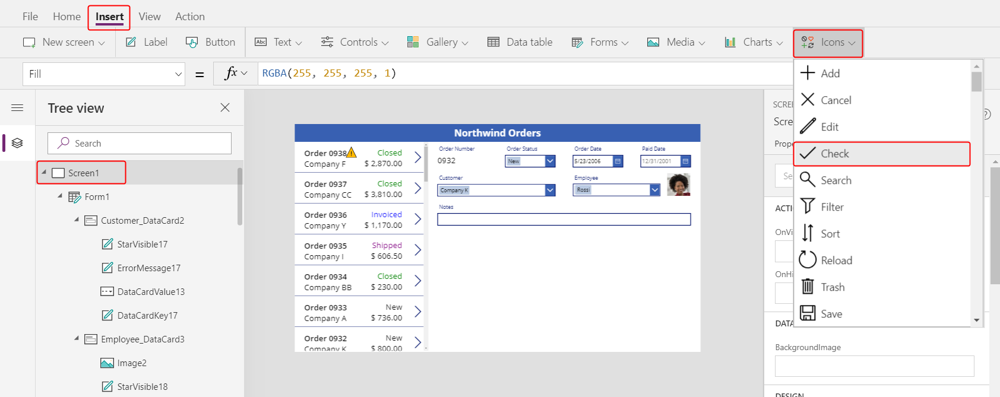

    The inserted icon will overlap other controls in the left upper corner of the screen and may be difficult to see: 

	

1. Using the **Home** ribbon, change the color of this icon to white.  Re-size and re-position this control to the upper right hand side of the title bar:

	

1. Set the **OnSelect** property to the formula:

	```powerapps-dot
	SubmitForm( Form1 )
	```

	

    The [**SubmitForm** function](functions/function-form.md) will gather any changed values in the form and submit them to the database.  Marching ants can be seen across the top of the screen while this is happening, and when complete, the gallery control will reflect the changes.

1. Set the **DisplayMode** property to the formula:

	```powerapps-dot
	If( Form1.Unsaved, DisplayMode.Edit, DisplayMode.Disabled )
	```

	

    It only makes sense to submit changes if there are unsaved changes on the form.  If there are no unsaved changes, the icon will appare with the **DisabledColor** which we will set next. 

1. Set the **DisabledColor** property to the formula:

	```powerappd-dot
	Gray
	```

	

	We can now save changes to an order.  The check mark icon will be disabled and gray if we have not changed anything on the form:

	

1. Let's add a button to cancel changes made to the data in a form, in case an app user changes their mind. 

    From the **Insert** ribbon, insert a cancel **Icon** control: 

	

    The inserted icon will overlap other controls in the left upper corner of the screen and may be difficult to see:

	

1. Using the **Home** ribbon, change the color of this icon to white.  Re-size and re-position this control to the upper right hand side of the title bar:

	

1. Set the **OnSelect** property to the formula:

	```powerapps-dot
	ResetForm( Form1 )
	```

	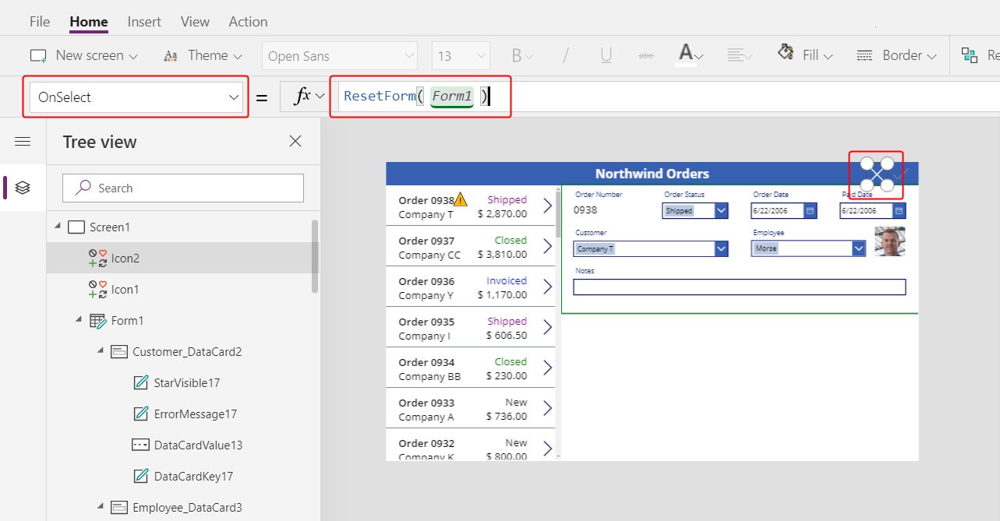

    The [**ResetForm** function](functions/function-form.md) will discard all changes in the form and return the record to its original state.

1. Set the **DisplayMode** property to the formula:

	```powerapps-dot
	If( Form1.Unsaved Or Form1.Mode = FormMode.New, DisplayMode.Edit, DisplayMode.Disabled )
	```

	

    The formula here is slightly different from the one we used for the submit button.  I doesn't make sense to discard changes if none have been made.  But there is an added case: if the form is in **New** mode (which we'll enable next) we will want **ResetForm** to discard the new record.

1. Set the **DisabledColor** property to the formula:

	```powerappd-dot
	Gray
	```

	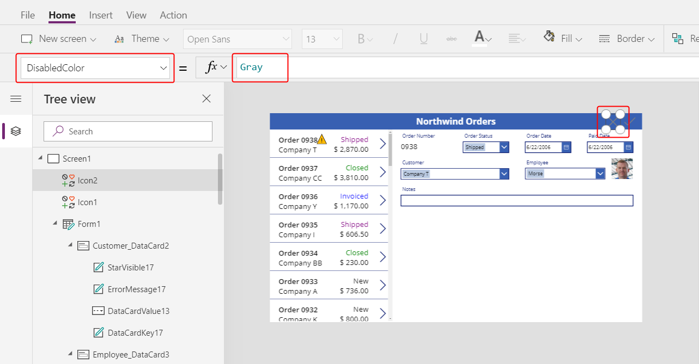

	We can now cancel changes to an order.  The check mark and cancel icons will be disabled and gray if we have not changed anything on the form:

	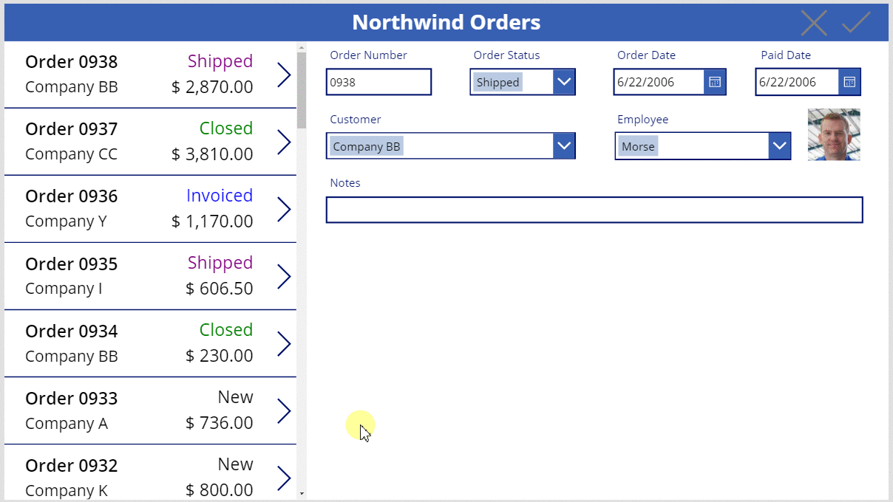

1. From the **Insert** ribbon, insert an add **Icon** control.  

	

    The inserted icon will overlap other controls in the left upper corner of the screen and may be difficult to see:

	

1. Using the **Home** ribbon, change the color of this icon to white.  Re-size and re-position this control to the upper right hand side of the title bar:

	

1. Set the **OnSelect** property to the formula:

	```powerapps-dot
	NewForm( Form1 )
	```

	

    The [**NewForm** function](functions/function-form.md) will create a new blank record to show in the form.  

1. Set the **DisplayMode** property to the formula:

	```powerapps-dot
	If( Form1.Unsaved Or Form1.Mode = FormMode.New, DisplayMode.Disabled, DisplayMode.Edit )
	```

	

    The formula is the reverse of the last **DisplayMode** we set.  Here, if there are unsaved changed we should be disabled until those are saved.  Even if there are no unsaved changed (no deviation from the default blank) we still should not enter **New** mode again.  

1. Set the **DisabledColor** property to the formula:

	```powerappd-dot
	Gray
	```

	

	We can now create new orders.  But only if the form has no unsaved changes and we are already not creating an order:  

	

1. From the **Insert** ribbon, insert a **Trash** **Icon** control.  

	

    The inserted icon will overlap other controls in the left upper corner of the screen and may be difficult to see:

	

1. Using the **Home** ribbon, change the color of this icon to white.  Re-size and re-position this control to the upper right hand side of the title bar:

	

1. Set the **OnSelect** property to the formula:

	```powerapps-dot
	Remove( Orders, Gallery1.Selected )
	```

	

    The [**Remove** function](functions/function-remove-removeif.md) is not a form control function.  But we are grouping it here since the app's user would see that the currently selected record, which is showing in the form, is the one to be deleted.  Rather than working through the form control, we use the **Remove** function which directly removes a record form a data source.

1. Set the **DisplayMode** property to the formula:

	```powerapps-dot
	If( Form1.Mode = FormMode.New, DisplayMode.Disabled, DisplayMode.Edit )
	```

	

    It doesn't make sense to delete a record that is being created, that does not yet exist in the data source.

1. Set the **DisabledColor** property to the formula:

	```powerappd-dot
	Gray
	```

	

	We can now delete existing orders.

	

## On to Part 3

To recap, we just added a form to our app which allows us to see and edit more information about each order.  We used:
- A form for Orders: **DataSource =** `Orders`
- A connection between the Orders list and the form: **Item =** `Gallery1.Selected`
- An alternate data card for Order number: **View text**
- A Many-to-One relationship to show the employee's picture in the employee data card: `DataCardValue1.Selected.Picture`
- Icon to save changes to an Order: `SubmitForm( Form1 )`
- Icon to cancel changes to an Order: `ResetForm( Form1 )`
- Icon to create a new Order: `NewForm( Form1 )`
- Icon to delete an existing record: `Remove( Orders, Gallery1.Selected )` 

In the next part, we'll add another gallery control and use the [**Patch** function](functions/function-patch.md) to display and edit the list of items sold with each order.


	


