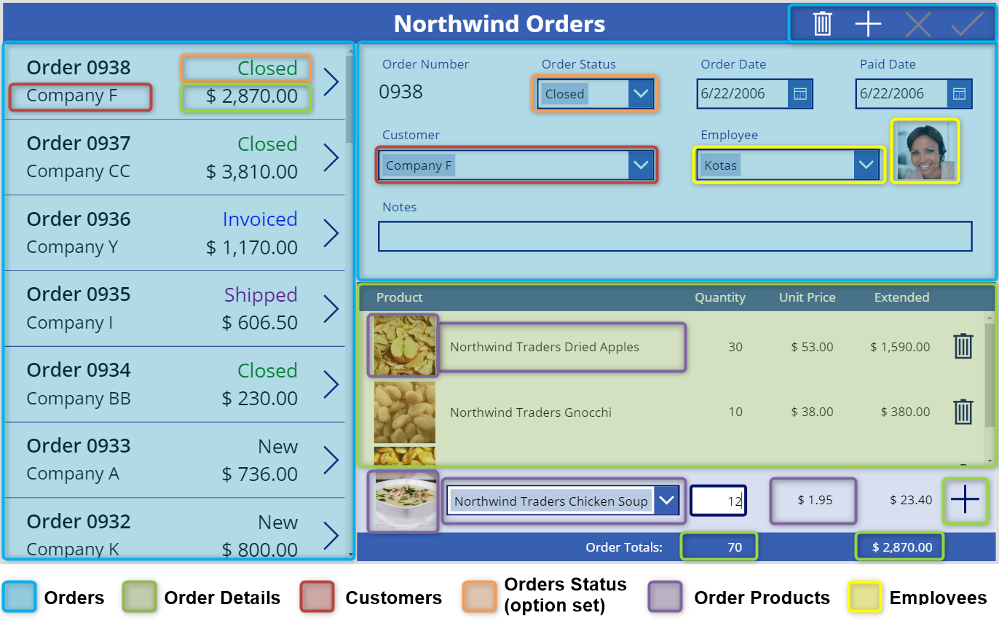
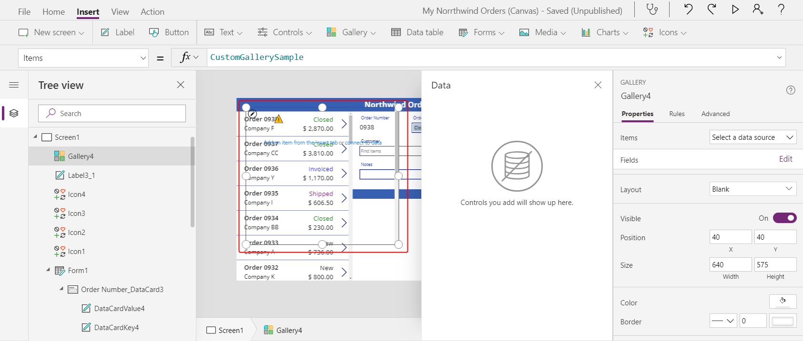
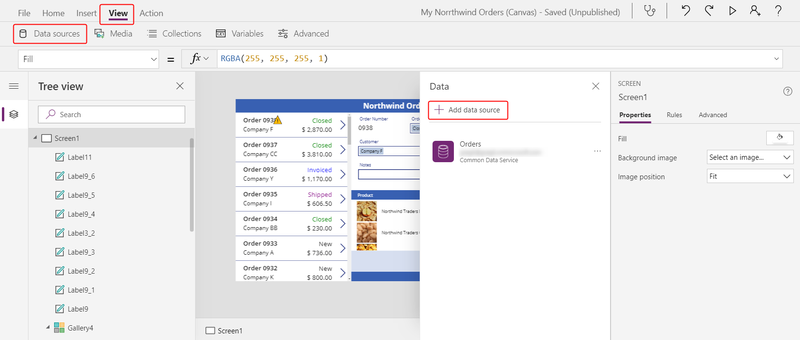
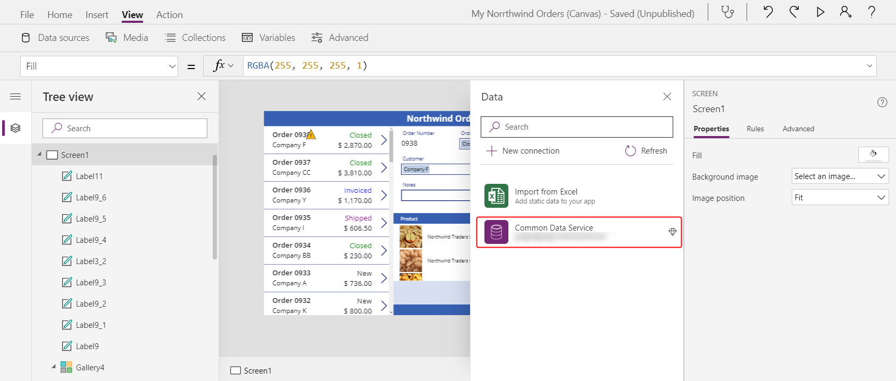
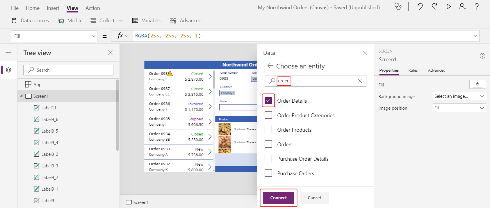
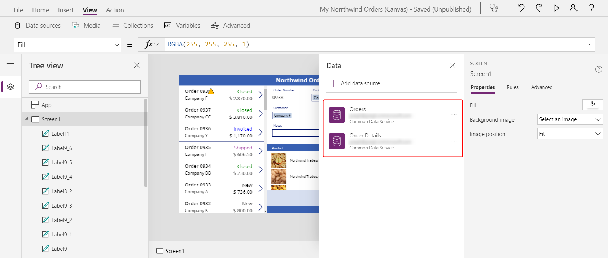
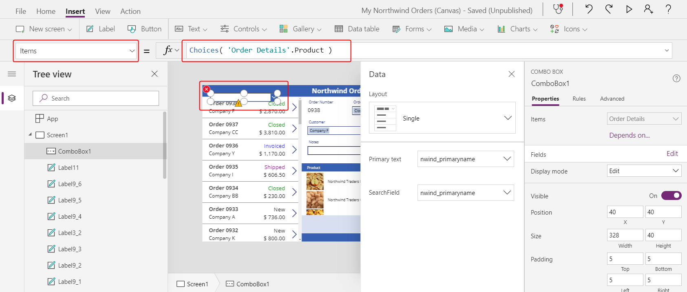
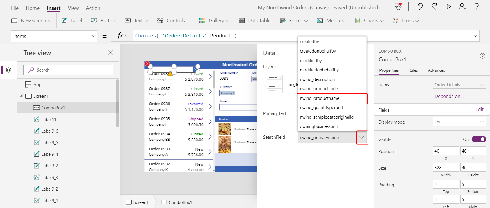

# Create a list of order details in a canvas app

Follow the steps in this topic to create a list of order details in a canvas app based on fictitious data in Common Data Service. As in the [previous topic in this series](northwind-orders-canvas-part2.md), this single-screen app is designed to help the user show, update, create, and delete orders on a tablet device.

> [!div class="mx-imgBorder"]
> 

As you build the app, you'll discover and explore these concepts:

- **Many-to-one relationships.** Each customer can place one or more orders, but only one customer can place each order. The **Orders** entity is related to the **Customers** entity so that the list near the left edge can show which customer placed each order. The list shows the name of the customer, but it could show data from any column in the **Customers** entity.
- **One-to-many relationships.** Each order contains one or more line items, each of which appears as a record in the **Order Details** entity. Each order detail is contained in only one order.
- **Option sets.** Each order has a status, such as **New**, **Shipped**, **Invoiced**, or **Closed**. These values are defined as option sets in the database and can be shared across apps.
- **Gallery and form interactions.** The gallery lists all orders, a user can select an order, and the rest of the app responds to the user's selection.
 
In terms of relationships, this app uses six entities and option sets.

> [!div class="mx-imgBorder"]
> 

Most of these start as references from the **Orders** entity with the help of the [**Gallery**](controls/control-gallery.md) and [**Edit form**](controls/control-form-detail.md) controls to provide a "current" order from which to work. For example, **ThisItem** in the gallery near the left edge provides a single order, from which you can walk the many-to-one relationship to the **Customers** entity and retrieve the company name with the simple dot notation **ThisItem.Customer.Company**. Likewise, you can walk the one-to-many relationship from **ThisItem** to the **Order Details** entity to retrieve the list of products in this order with **ThisItem.'Order Details'**.

To build this app, follow the steps in these topics

> [!div class="mx-imgBorder"]
> 

- [**Part 1, Orders list**](northwind-orders-canvas-part1.md): Show each order's number, customer name, status, and total amount in a list. Select an order that you want to edit or delete elsewhere in the screen.
- [**Part 2, Order form**](northwind-orders-canvas-part2.md): Show and edit a summary of the order, delete the order, or create another order.
- **Part 3, Order details**: As this topic describes, show and edit the line items, called order details, that are associated with each order.

If you haven't already done so, work through [part 2](northwind-orders-canvas-part2.md). Or take a shortcut by opening the **Northwind Orders (Canvas), Start Part 3** app after you [install the Northwind Traders sample database and apps](northwind-install.md)

If you haven't already done so, [install the Northwind Traders sample database and apps](northwind-install.md), and then take either of these approaches:

- Build the first two parts of the app yourself by [creating the list of orders](northwind-orders-canvas-part1.md) and [creating the order summary](northwind-orders-canvas-part2.md).
- Take a shortcut by opening the **Northwind Orders (Canvas), Start Part 3** app, which already contains the list of orders and the order summary.

## Display order details

1. Let's display the product line items that make up this order. Copy (with Ctrl-C) and Paste (with Ctrl-V) the title bar label at the top of the screen:

    > [!div class="mx-imgBorder"]
    > 

1. Resize and move the copy to just below the form control from Part 2.   Double-click   into the control and backspace over the text to remove it (you can also set the **Text** property to an empty string or **""**):

    > [!div class="mx-imgBorder"]
    > 

1. Insert a [**Gallery** control](controls/control-gallery.md) with a **Blank vertical** layout:

    > [!div class="mx-imgBorder"]
    > 

    The newly inserted control will overlay the existing controls on the left hand side of the screen:

    > [!div class="mx-imgBorder"]
    > 

1. Close the **Data** pane, and then resize and move the control below the new title bar:

    > [!div class="mx-imgBorder"]
    > 

1. Set the **Items** property of the new gallery to this formula:

    ```powerapps-dot
    Gallery1.Selected.'Order Details'
    ```

    > [!div class="mx-imgBorder"]
    > 

    Your gallery may be named something different than **Gallery1**. Check the name in the **Tree view** pane on the left of your screen if you encounter problems.

    You've just linked the two galleries on your screen: the new gallery will display the **Order Details** for the selected **Order** in the orders-list gallery. Here we are traversing the one-to-many relationship between the **Order Details** and **Orders** entities, as seen in the PowerApps portal:

    > [!div class="mx-imgBorder"]
    >  

1. Select **Add an item from the insert tab** inside the gallery to select the template for the gallery. You can tell the difference from selecting the gallery itself because the bounding box is slightly inside the gallery's boundary and is usually shorter than the gallery's height. As you insert controls into this template, they will be repeated for each item:

    > [!div class="mx-imgBorder"]
    > 

1. On the **Insert** tab, insert a [**Label** control](controls/control-text-box.md).

    The label should appear within the gallery; if it doesn't, try again, but make sure to select the gallery's template before you insert the label.

    > [!div class="mx-imgBorder"]
    > 

1. Set the label's **Text** property to this formula:

    ```powerapps-dot
    ThisItem.Product.'Product Name'
    ```

1. Resize the Label control so that the full text appears:

    > [!div class="mx-imgBorder"]
    > 

    With this formula, you're walking from a record in the **Order Details** entity. The record is held in **ThisItem** over to the **Order Products** entity through a many-to-one relationship:

    > [!div class="mx-imgBorder"]
    > 

    And extracting the **Product Name** field (other fields you're about to use are also highlighted):

    > [!div class="mx-imgBorder"]
    > 

1. On the **Insert** tab, insert an [**Image**](controls/control-image.md) control into the gallery:

    > [!div class="mx-imgBorder"]
    > 

1. Resize and move the image and label controls to be side by side.

    For fine-grained control over size and position, start to resize or move the control without the Alt key pressed, and then after starting hold down the Alt key:

    > [!div class="mx-imgBorder"]
    > 

1. Set the **Image** property to this formula:

    ```powerapps-dot
    ThisItem.Product.Picture
    ```
    Here you're again referencing the **Order Product** associated with this **Order Detail** record and extracting the **Picture** field to display.

    > [!div class="mx-imgBorder"]
    > 

1. Shorten the height of the gallery's template so that more than one **Order Detail** record appears at a time:

    > [!div class="mx-imgBorder"]
    > 

1. On the **Insert** tab, insert another **Label** control into the gallery. Resize and move the label to the right of the product information.  Set its **Text** property to this expression:

    ```powerapps-dot
    ThisItem.Quantity
    ```

    This formula pulls information directly from the **Order Details** entity (no relationship required).

    > [!div class="mx-imgBorder"]
    >  

1. On the **Home** tab, change the alignment of this control to **Right**:

    > [!div class="mx-imgBorder"]
    > 

1. On the **Insert** tab, insert another **Label** control into the gallery. Resize and move the label to the right of the quantity. Set its **Text** property to this formula:

    ```powerapps-dot
    Text( ThisItem.'Unit Price', "[$-en-US]$ #,###.00" )
    ```

    If you don't include the language tag (**[$-en-US]**), it will be added for you based on your language and region. If you use a different language tag, you'll want to remove the **$** just before the first **#** and then add your own currency symbol in that position.

    > [!div class="mx-imgBorder"]
    > 

1. On the **Home** tab, change the alignment of this control to **Right**:

    > [!div class="mx-imgBorder"]
    > 

1. On the **Insert** tab, insert another **Label** control into the gallery. Resize and move the label to the right of the unit price. Set its **Text** property to this formula:

    ```powerapps-dot
    Text( ThisItem.Quantity * ThisItem.'Unit Price', "[$-en-US]$ #,###.00" )
    ```

    Again, if you don't include the language tag (**[$-en-US]**), it will be added for you based on your language and region. If the tag is different, you'll want to use your own currency symbol instead of the **$** just before the first **#**.

    > [!div class="mx-imgBorder"]
    > 

1. On the **Home** tab, change the alignment of this control to **Right**:

    > [!div class="mx-imgBorder"]
    > 

1. You're done adding controls to this gallery for now. In the **Tree view** pane, select **Screen1** to ensure that the gallery is no longer selected.

1. On the **Insert** tab, insert another **Label** control on to the screen:

    > [!div class="mx-imgBorder"]
    > 

1. Resize and move this control on top of the second title bar above the picture of the products. Change the text's color to white on the **Home** tab:

    > [!div class="mx-imgBorder"]
    > 

1. Copy and paste this control.  Resize and move above the quantity column. Double-click into the control and type **Quantity**:

    > [!div class="mx-imgBorder"]
    > 

1. Copy and paste this control. Resize and move it above the unit price column. Double-click into the control and type **Unit Price**:

    > [!div class="mx-imgBorder"]
    > 

1. Copy and paste this control. Resize and move above the extended price column. Double-click into the control and type **Extended**:

    > [!div class="mx-imgBorder"]
    > 

## Display Order totals

1. Reduce the height of the gallery to make room to display the order totals at the bottom of the screen:

    > [!div class="mx-imgBorder"]
    > 

1. Copy and paste the title bar in the middle of the screen, and move it to the bottom of the screen:

    > [!div class="mx-imgBorder"]
    > 

1. Copy and paste the label showing **Product** from the middle title bar, and move that label to the left of the **Quantity** column on top of the bottom title bar. Double-click into the control, and then type **Order Totals:**:

    > [!div class="mx-imgBorder"]
    > 

1. Copy and paste this label control. Resize and move this control to the right of the **Order Totals:** label. Set the **Text** property to this formula:

    ```powerapps-dot
    Sum( Gallery1.Selected.'Order Details', Quantity )
    ```

    This formula will show a delegation warning, but you can ignore it because no single order will have more than 500 products.

    On the **Home** tab, set the text alignment to **Right**:

    > [!div class="mx-imgBorder"]
    > 

1. Copy and paste this label control. Resize and move this control below the **Extended** column. Set the **Text** property to this formula:

    ```powerapps-dot
    Text( Sum( Gallery1.Selected.'Order Details', Quantity * 'Unit Price' ), "[$-en-US]$ #,###.00" )
    ```

    This formula will show a delegation warning, but you can ignore it because no single order will have more than 500 products.

    > [!div class="mx-imgBorder"]
    > 

## Add an order detail

Gallery controls are read only and don't offer a way to add items. Let's add an area below the gallery where we can provide some editable controls to configure a record in the **Order Details** entity and insert that record into an order.

1. Shorten the height of the gallery showing **Order Details** to make room for a single item editing space below where we can add an **Order Detail**:

    > [!div class="mx-imgBorder"]
    > 

1. On the **Insert** tab , insert a **Label** control and resize and move it below the gallery.  

    > [!div class="mx-imgBorder"]
    > 

1. Double-click into the control, and clear the text on the label (empty string or **""**).  On the **Home** tab, set the **Fill** color to a light blue:

    > [!div class="mx-imgBorder"]
    > 

1. On the **View** tab , select **Data sources** > **Add data source**:

    > [!div class="mx-imgBorder"]
    > 

1. Select **Common Data Service**:

    > [!div class="mx-imgBorder"]
    > 

1. At the top of the **Data** pane, type **order** in the search box, select the **Order Details** check box, and then select **Connect**at the bottom of the pane:

    > [!div class="mx-imgBorder"]
    > 

    You've just added another data source to the app:

    > [!div class="mx-imgBorder"]
    > 

    You must add this data source because, although the app can read through a one-to-many relationship, the app can't yet write back changes. We must make changes directly with the related entity.

1. Close the **Data** pane. On the **Insert** tab , select **Controls** > **Combo box**:

    > [!div class="mx-imgBorder"]
    > 

1. The combo box control will appear to overlay the other controls on the upper-left side of the screen. Set the **Items** property to this formula:

    ```powerapps-dot
    Choices( 'Order Details'.Product )
    ```

    > [!div class="mx-imgBorder"]
    > 

    The [**Choices** function](functions/function-choices.md) returns a table of all the possible values for the field **Product** in the **Order Details** entity. This field is a lookup in a many-to-one relationship, so **Choices** returns all the records in the **Order Products** entity. 

    You can also use **Choices** with option sets to return the table of all the options, which was used behind the scenes in Part 2 to provide a combo box for **Order Status** in the form.

1. In the **Data** pane, set the **Primary text** to **nwind_productname**.

    You specify the logical name because the **Data** pane doesn't support display names in this case yet:

    > [!div class="mx-imgBorder"]
    > 

1. In the **Data** pane, set the **SearchField** to **nwind_productname**:

    > [!div class="mx-imgBorder"]
    > 

1. Close the **Data** pane. In the **Properties** tab of the right-hand pane, scroll down, turn off **Allow multiple selection**, and turn on **Allow searching**:

    > [!div class="mx-imgBorder"]
    > 

1. Resize and move the combo box on top of our light-blue area, in the same column as the product names shown above it in the gallery:

    > [!div class="mx-imgBorder"]
    > 

    This control will capture the **Product** for the **Order Details** record.

1. While holding down the Alt key, select the down arrow on the combo box.

    By holding down the Alt key, you can interact with controls in PowerApps Studio without needing to open Preview mode.

    You should see the list of all products.  Select of one of the products:

    > [!div class="mx-imgBorder"]
    > 

1. From the **Insert** menu, select **Media**, and then select an **Image** control:

    > [!div class="mx-imgBorder"]
    > 

    The control will overlay other controls on the left side of the screen and may not be easy to see:

    > [!div class="mx-imgBorder"]
    > 

1. Resize and move this control under the other product images next to the combo box control in the light blue area.  Set the **Image** property of this control to:

    ```powerapps-dot
    ComboBox1.Selected.Picture
    ```

    > [!div class="mx-imgBorder"]
    > 

    We are using the same trick we used in Part 2 to show the employee picture.  The **Selected** property on the combo box control returns the entire record of the product selected including the **Picture** field.

1. From the **Insert** menu, select **Text** and insert a [**Text input** control](controls/control-text-input.md):

    > [!div class="mx-imgBorder"]
    > 

    Again, this new control will be inserted over the other controls on the left side of the screen:

    > [!div class="mx-imgBorder"]
    > 

1. Resize and move this control to the right of the combo box control, under the quantity column of the gallery above:

    > [!div class="mx-imgBorder"]
    > 

    This control will capture the **Quantity** for the **Order Details** record.

1. Set the **Default** property of this control to **""**:

    > [!div class="mx-imgBorder"]
    > 

1. Using the **Home** tab , set the text alignment of this control to **Right**:

    > [!div class="mx-imgBorder"]
    > 

1. From the **Insert** menu, insert a **Label** control, which will appear in the upper left corner of the screen:

    > [!div class="mx-imgBorder"]
    > 

1. Resize and move this control to the right of the text input control.  Set its **Text** property to the formula:

    ```powerapps-dot
    Text( ComboBox1.Selected.'List Price', "[$-en-US]$ #,###.00" )
    ```

    > [!div class="mx-imgBorder"]
    > 

    This control is displaying the **List Price** from the **Order Products** entity.  We will use this for the **Unit Price** field in the **Order Details** record.  If we had wanted the app user to be able to modify the price, we could ahve used a **Text input** control and set the **Default** property to **List Price**.

1. Using the **Home** tab , set the text alignment of this control to **Right**:

    > [!div class="mx-imgBorder"]
    > 

1. Cut and paste a copy of this control.  Resize and move it to the right of the **List price** label.  Set its **Text** property to the formula:

    ```powerapps-dot
    Text( Value(TextInput1.Text) * ComboBox1.Selected.'List Price', "[$-en-US]$ #,###.00" )
    ```

    > [!div class="mx-imgBorder"]
    > 

    This control is displaying the extended price based on the quantity entered and the list price.  It is purely informational for the app user.

1.   Double-click   the **Text input** control that holds quantity and type a number.  The **Extended** price label will automatically recalculate to show the new value:

    > [!div class="mx-imgBorder"]
    > 

1. From the **Insert** tab , select **Icons** and insert an **Add** icon:

    > [!div class="mx-imgBorder"]
    > 

    The icon will be inserted in the upper left corner of the screen and may be hard to see.

    > [!div class="mx-imgBorder"]
    > 

1.  Resize and move this icon to the right of the other controls in the light blue area.  Set its **OnSelect** property to the formula:

    ```powerapps-dot
    Patch( 'Order Details', 
        Defaults('Order Details'),
        { 
            Order: Gallery1.Selected, 
            Product: ComboBox1.Selected,
            Quantity: Value(TextInput1.Text), 
            'Unit Price': ComboBox1.Selected.'List Price' 
        }
    );
    Refresh( Orders );
    Reset( ComboBox1 ); 
    Reset( TextInput1 )
    ```

    > [!div class="mx-imgBorder"]
    > 

    Let's unpack what this formula is doing:
    - The [**Patch** function](functions/function-patch.md) is used to update and create records.  We are using it to modify the **Order Details** entity and in this case to create a new record by passing **Defaults( 'Order Details' )** in the second argument.
    - The third argument to **Patch** is the record we want to add.  We are providing values for the fields we care about:
        - **Order** is the order currently selected in the Orders list.
        - **Product** is taken from the combo box control we just added.  It will return the complete record for whatever **Order Products** was selected by the app user.  That is how we set lookup values in canvas apps, by complete record and not by primary keys.
        - **Quantity** is taken from the text input control we just added. 
        - **'Unit Price'** is taken from the current price in the **Order Products** entity.  It is one of the fields made available by thte combo box's selection.
    - For performance reasons, data is cached in a canvas app.  After updating the **Order Details**, the cache for the **Orders** entity won't know that the One-to-Many relationship to **Order Details** has been updated.  We use the [**Refresh** function](functions/function-refresh.md) to let it know.
    - After adding an **Order Detail**, we'd like to clear out the selections for a new record.  The [**Reset** function](functions/function-reset.md) clears the app user's input to start fresh. 

1. Preview the app with the triangular Play button at to the right of the Studio.  Press the **+** icon to add the product and quantity in the light blue area to the order.  Add another item to the order if you wish:

    > [!div class="mx-imgBorder"]
    > 

## Remove Order Details

1. Now that we can add an order detail, let's add a way to remove one.

    Select the gallery template for the **Order Details** in the center of the screen:

    > [!div class="mx-imgBorder"]
    > 

1. From the **Insert** tab , select **Icons**, and select the **Trash** icon:

    > [!div class="mx-imgBorder"]
    > 

    The icon will be inserted in the upper left corner of gallery's template, overlaying other controls and may be hard to see.

    > [!div class="mx-imgBorder"]
    > 

1. Resize and move this icon control to the right side of the gallery's template.  Set its **OnSelect** property to the formula:

    ```powerapps-dot
    Remove( 'Order Details', ThisItem ); Refresh( Orders )
    ```

    > [!div class="mx-imgBorder"]
    > 

    As we can't yet remove a record directly from a relationship, the [**Remove** function](functions/function-remove-removeif.md) is used to remove a record directly from the related entity.  **ThisItem** is the record to remove, taken from the same record in the gallery where the trash can icon appears.

    Again, as we use cached data, we need to inform the **Orders** entity that we did something to one of its related entities without it knowning about it, by invoking the **Refresh** function.

1. Again preview the app.  Click the trash icon next to each **Order Details** record you would like to remove from the order.  Try adding and removing various order details from your orders:

    > [!div class="mx-imgBorder"]
    > 

## In conclusion

To recap, we just added another gallery to our app to show **Order Details** and a facility for adding an **Order Detail**.   We used:
- A second gallery control, linked to the first through a One-to-Many relationship: **Gallery2.Items** = `Gallery1.Selected.'Order Details'`
- From here, navigating a Many-to-One relationship: `ThisItem.Product.'Product Name'` and `ThisItem.Product.Picture`
- The **Choices** function to obtain a list of possible **Order Products**: `Choices( 'Order Details'.Product' )`
- The **Selected** property of a combo box control as the complete Many-to-One related record: `ComboBox1.Selected.Picture` and `ComboBox1.Selected.'List Price'`
- The **Patch** function to create a new **Order Details** record: `Patch( 'Order Details', Defautls( 'Order Details' ), ... )`
- The **Remove** function to delete an **Order Details** record: `Remove( 'Order Details', ThisItem )`

This has been a quick walk through of using Common Data Service relationships and option sets in a canvas app for educational purposes.  There are many other aspects of this app to considered before it is ready for production use, such as field validation and error handling.