# Create a list of order details in a canvas app

Follow the steps in this topic to create a list of order details in a canvas app based on fictitious data in Common Data Service. This topic finishes a series that describes how to build this single-screen app that helps the user show, update, create, and delete orders on a tablet device.

> [!div class="mx-imgBorder"]
> 

## Explore the user interface

### List of orders

On the left edge of the app, a gallery shows a list of orders, including the order number, the status, the name of the customer, and the total cost. The user can scroll through the list to find an order and then select it by selecting the arrow for that order. [Create a list of orders.](northwind-orders-canvas-part1.md)

### Order summary

In the upper-right corner, a form summarizes whatever order the user selected in the list. The summary includes much of the same information in the list of orders, but it also shows the dates when the order was created and paid, as well as the name and picture of the employee who managed the order. The user can change the data in the form, save those changes, cancel them, or delete the order by selecting an icon near the right edge of the title bar. [Create an order summary](northwind-orders-canvas-part1.md).

### Order details

Near the lower-right corner, another gallery shows information about which products the selected order contains and in what quantities. The user can delete any item in that gallery and add another item by using the controls under the gallery. This topic describes how to add and configure that gallery and those controls.

> [!div class="mx-imgBorder"]
> 

## Explore the data sources

To create this app, you'll show data from five entities and an option set. In fact, most areas of this app shows data from multiple entities. For example, the list of orders contains this information:

- The order number is a field in the **Orders** entity.
- The status is an option in the **Orders Status** option set.
- The customer name is a field in the **Customers** entity.
- The total cost is calculated based on records in the **Order Details** entity.

The summary contains some of the same information as the list of orders, but it also contains the name and the picture of the employee who managed the order. That information is pulled from fields in the **Employees** entity. The list of order details shows records in the **Order Details** entity, and each product in those details is a record in the **Order Products** entity.

> [!div class="mx-imgBorder"]
> 

## Explore the relationships

You can show data from different sources (for example, entities) in the same gallery or form because those entities have relationships that were created for you in the database. 

### Many-to-one relationships

For example, information about the customer and the employee for each order resides in the **Customers** and **Employees** entities. Therefore, the **Orders** entity has many-to-one relationships with those entities because of these requirements:

- Each customer can place more than one order, but each order can be placed by only one customer.
- Each employee can manage more than one order, but each order can be managed by only one employee.

Each order also has one or more line items that represent the products that the order contains and their quantities. Each line item is a record in the **Order Details** entity, which pulls information about each product from the **Order Products** entity. Each detail identifies only one product, but each product can appear in multiple details. Therefore, the **Order Details** entity has a many-to-one relationship with the **Order Products** entity.

### One-to-many relationships
Each order can contain multiple line items, but each line item relates to only one order. Therefore, the **Orders** entity has a one-to-many relationship with the **Order Details** entity.

### Dot notation

To show data based on a relationship between entities, you create a formula that uses dot notation in a practice that's known as "walking the relationship." For example, each record in the **Orders** entity pulls information from the **Customers** entity so that the list of orders can show the customer name. In the list of orders, you configure this behavior by setting the **Text** property of a label to this expression:<br>`ThisItem.Customer.Company`

**ThisItem** specifies a record in the **Orders** entity and information from the **Customers** entity about the customer who placed the order. In this case, the expression specifies that the customer's company name appears. However, the entire record for that customer is pulled, so you could just as easily show, for example, the email address for the customer's primary contact instead.

As another example of "walking a relationship," you can specify that a gallery should show records in one entity based on a record that the user selected in another gallery and that's in another entity. To show the order details, you'll set a gallery's **Items** property to this expression:<br>`Gallery1.Selected.'Order Details'`

In this case, **Gallery1.Selected** specifies a record in the **Orders** entity, just as **ThisItem** did in the previous example. However, this expression doesn't pull a record as the previous expression did. Instead, it pulls an entire table of records to show the name and per-unit cost of each product (as reflected in the **Order Products** entity) and the quantity (as reflected in the **Order Details** entity).

## Prerequisites

If you haven't already done so, [install the Northwind Traders sample database and apps](northwind-install.md), and then take either of these approaches:

- Build the first two parts of the app yourself by [creating the list of orders](northwind-orders-canvas-part1.md) and [creating the order summary](northwind-orders-canvas-part2.md).
- Take a shortcut by opening the **Northwind Orders (Canvas), Start Part 3** app, which already contains the list of orders and the order summary.

## Display order details

Let's display the product line items that make up this order.

1. At the top of the screen, select the label that acts as a title bar, copy it by pressing Ctrl-C, and then paste it by pressing Ctrl-V:

    > [!div class="mx-imgBorder"]
    > 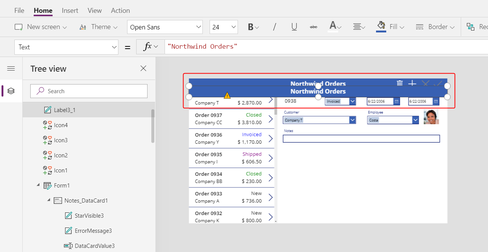

1. Resize and move the copy so that it appears just under the order summary, and then remove the text from the title-bar copy.

    You can remove the text in either of these ways:

    - Select the text by double-clicking it, and then press the Del key.
    - Set the control's **Text** property to an empty string (**""**).

    > [!div class="mx-imgBorder"]
    > 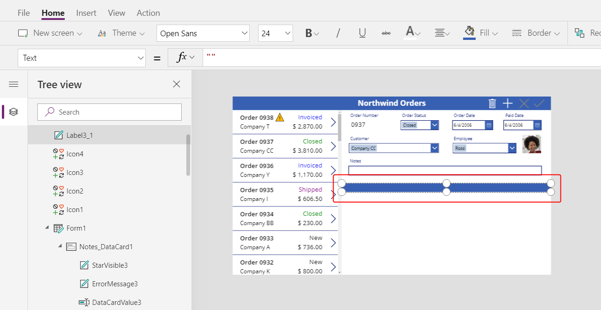

1. Insert a [**Gallery**](controls/control-gallery.md) control with a **Blank vertical** layout:

    > [!div class="mx-imgBorder"]
    > 

    The new control, which will show order details, appears over the existing controls in the upper-left corner:

    > [!div class="mx-imgBorder"]
    > 

1. Close the **Data** pane, and then resize and move the order-details gallery to the lower-right corner, below the new title bar:

    > [!div class="mx-imgBorder"]
    > 

1. Set the **Items** property of the order-details gallery to this formula:

    ```powerapps-dot
    Gallery1.Selected.'Order Details'
    ```

    > [!div class="mx-imgBorder"]
    > 

    If an error appears, confirm that the order-list gallery is named **Gallery1** (in the **Tree view** pane near the left edge). If the gallery has a different name, rename it to **Gallery1**.

    You've just linked the two galleries on your screen. When the user selects an order in the order list, that selection identifies a record in the **Orders** entity. If that order contains one or more line items, the record is linked to one or more records in the **Order details** entity, and data from those records appear in the new gallery. This behavior reflects the one-to-many relationship that was created for you between the **Order Details** and **Orders** entities, and the formula that you specified "walks" that relationship by using dot notation:

    > [!div class="mx-imgBorder"]
    > 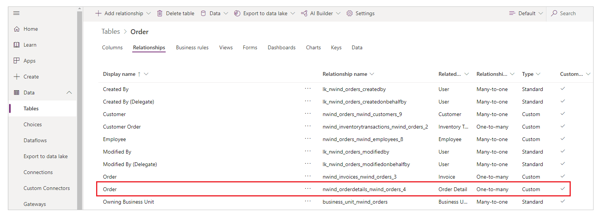 

1. Select the gallery template by selecting **Add an item from the insert tab** inside the gallery.

    Ensure that you've selected the gallery template instead of the gallery itself. The bounding box should be slightly inside the gallery's boundary and probably shorter than the gallery's height. As you insert controls into this template, they are repeated for each item in the gallery:

    > [!div class="mx-imgBorder"]
    > 

1. On the **Insert** tab, insert a [**Label** control](controls/control-text-box.md).

    The label should appear within the gallery; if it doesn't, try again, but make sure to select the gallery's template before you insert the label.

    > [!div class="mx-imgBorder"]
    > 

1. Set the new label's **Text** property to this formula:

    ```powerapps-dot
    ThisItem.Product.'Product Name'
    ```

1. Resize the **Label** control so that the full text appears:

    > [!div class="mx-imgBorder"]
    > 

    This formula walks from a record in the **Order Details** entity. The record is held in **ThisItem** over to the **Order Products** entity through a many-to-one relationship:

    > [!div class="mx-imgBorder"]
    > 

    The **Product Name** field (and other fields you're about to use) is extracted:

    > [!div class="mx-imgBorder"]
    > 

1. On the **Insert** tab, insert an [**Image**](controls/control-image.md) control into the gallery:

    > [!div class="mx-imgBorder"]
    > 

1. Resize and move the image and label controls to be side by side.

    For fine-grained control over size and position, start to resize or move the control without the Alt key pressed, and then after starting hold down the Alt key:

    > [!div class="mx-imgBorder"]
    > 

1. Set the **Image** property to this formula:

    ```powerapps-dot
    ThisItem.Product.Picture
    ```
    Here you're again referencing the **Order Product** associated with this **Order Detail** record and extracting the **Picture** field to display.

    > [!div class="mx-imgBorder"]
    > 

1. Shorten the height of the gallery's template so that more than one **Order Detail** record appears at a time:

    > [!div class="mx-imgBorder"]
    > 

1. On the **Insert** tab, insert another **Label** control into the gallery. Resize and move the label to the right of the product information.  Set its **Text** property to this expression:

    ```powerapps-dot
    ThisItem.Quantity
    ```

    This formula pulls information directly from the **Order Details** entity (no relationship required).

    > [!div class="mx-imgBorder"]
    >  

1. On the **Home** tab, change the alignment of this control to **Right**:

    > [!div class="mx-imgBorder"]
    > 

1. On the **Insert** tab, insert another **Label** control into the gallery. Resize and move the label to the right of the quantity. Set its **Text** property to this formula:

    ```powerapps-dot
    Text( ThisItem.'Unit Price', "[$-en-US]$ #,###.00" )
    ```

    If you don't include the language tag (**[$-en-US]**), it will be added for you based on your language and region. If you use a different language tag, you'll want to remove the **$** just before the first **#** and then add your own currency symbol in that position.

    > [!div class="mx-imgBorder"]
    > 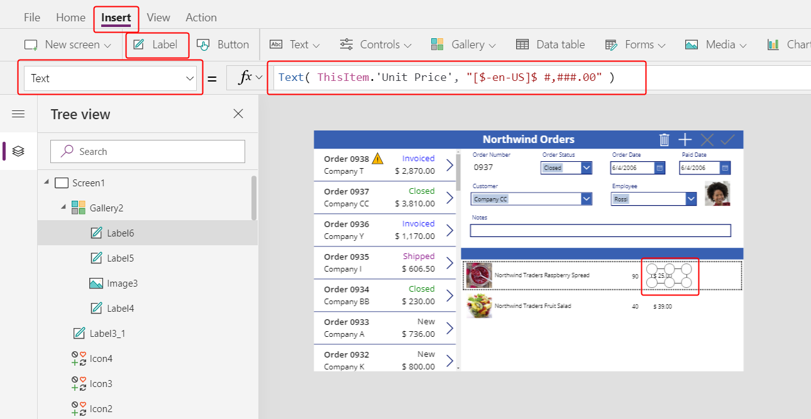

1. On the **Home** tab, change the alignment of this control to **Right**:

    > [!div class="mx-imgBorder"]
    > 

1. On the **Insert** tab, insert another **Label** control into the gallery. Resize and move the label to the right of the unit price. Set its **Text** property to this formula:

    ```powerapps-dot
    Text( ThisItem.Quantity * ThisItem.'Unit Price', "[$-en-US]$ #,###.00" )
    ```

    Again, if you don't include the language tag (**[$-en-US]**), it will be added for you based on your language and region. If the tag is different, you'll want to use your own currency symbol instead of the **$** just before the first **#**.

    > [!div class="mx-imgBorder"]
    > 

1. On the **Home** tab, change the alignment of this control to **Right**:

    > [!div class="mx-imgBorder"]
    > 

1. You're done adding controls to this gallery for now. In the **Tree view** pane, select **Screen1** to ensure that the gallery is no longer selected.

1. On the **Insert** tab, insert another **Label** control on to the screen:

    > [!div class="mx-imgBorder"]
    > 

1. Resize and move this control on top of the second title bar above the picture of the products. Change the text's color to white on the **Home** tab:

    > [!div class="mx-imgBorder"]
    > 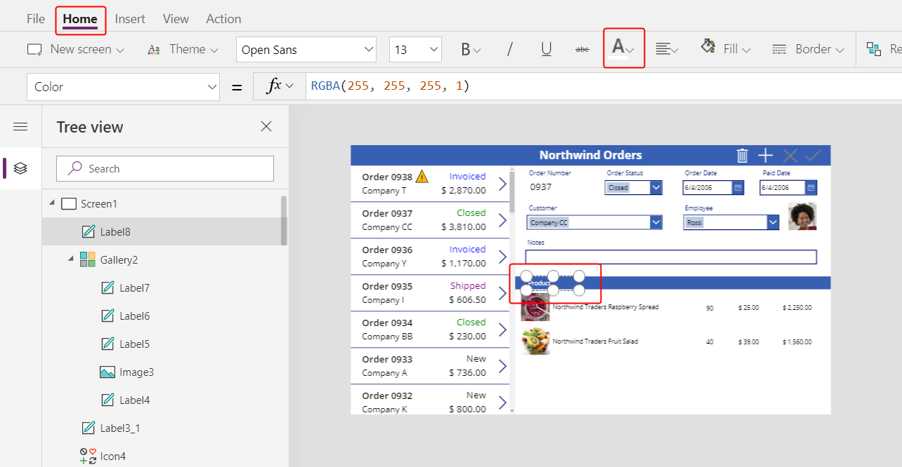

1. Copy and paste this control.  Resize and move above the quantity column. Double-click into the control and type **Quantity**:

    > [!div class="mx-imgBorder"]
    > 

1. Copy and paste this control. Resize and move it above the unit price column. Double-click into the control and type **Unit Price**:

    > [!div class="mx-imgBorder"]
    > 

1. Copy and paste this control. Resize and move above the extended price column. Double-click into the control and type **Extended**:

    > [!div class="mx-imgBorder"]
    > 

## Display Order totals

1. Reduce the height of the gallery to make room to display the order totals at the bottom of the screen:

    > [!div class="mx-imgBorder"]
    > 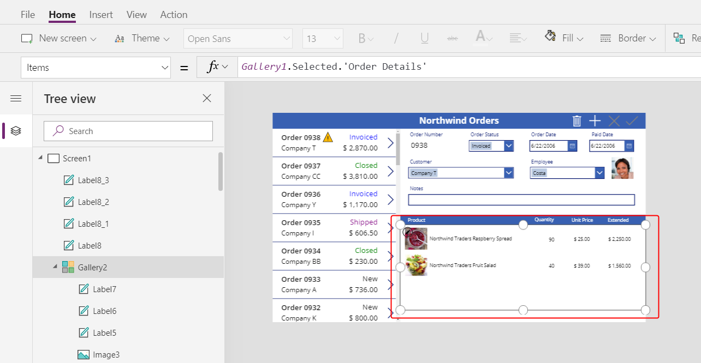

1. Copy and paste the title bar in the middle of the screen, and move it to the bottom of the screen:

    > [!div class="mx-imgBorder"]
    > 

1. Copy and paste the label showing **Product** from the middle title bar, and move that label to the left of the **Quantity** column on top of the bottom title bar. Double-click into the control, and then type **Order Totals:**:

    > [!div class="mx-imgBorder"]
    > 

1. Copy and paste this label control. Resize and move this control to the right of the **Order Totals:** label. Set the **Text** property to this formula:

    ```powerapps-dot
    Sum( Gallery1.Selected.'Order Details', Quantity )
    ```

    This formula will show a delegation warning, but you can ignore it because no single order will have more than 500 products.

    On the **Home** tab, set the text alignment to **Right**:

    > [!div class="mx-imgBorder"]
    > 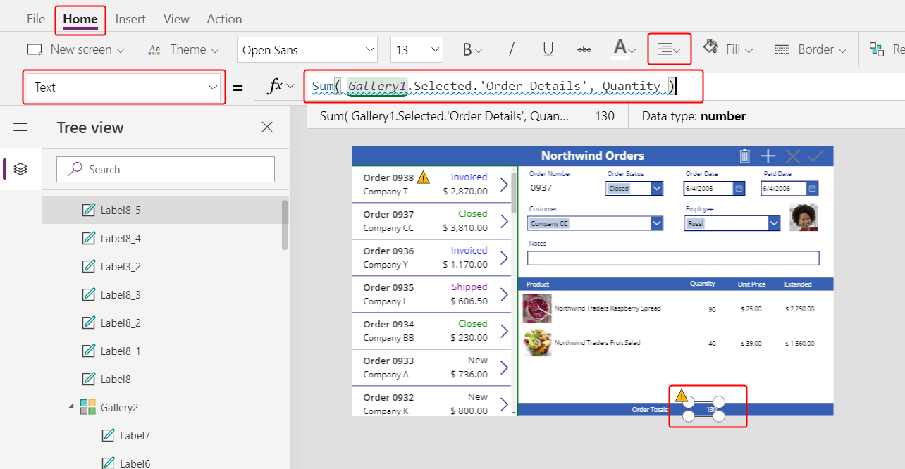

1. Copy and paste this label control. Resize and move this control below the **Extended** column. Set the **Text** property to this formula:

    ```powerapps-dot
    Text( Sum( Gallery1.Selected.'Order Details', Quantity * 'Unit Price' ), "[$-en-US]$ #,###.00" )
    ```

    This formula will show a delegation warning, but you can ignore it because no single order will have more than 500 products.

    > [!div class="mx-imgBorder"]
    > 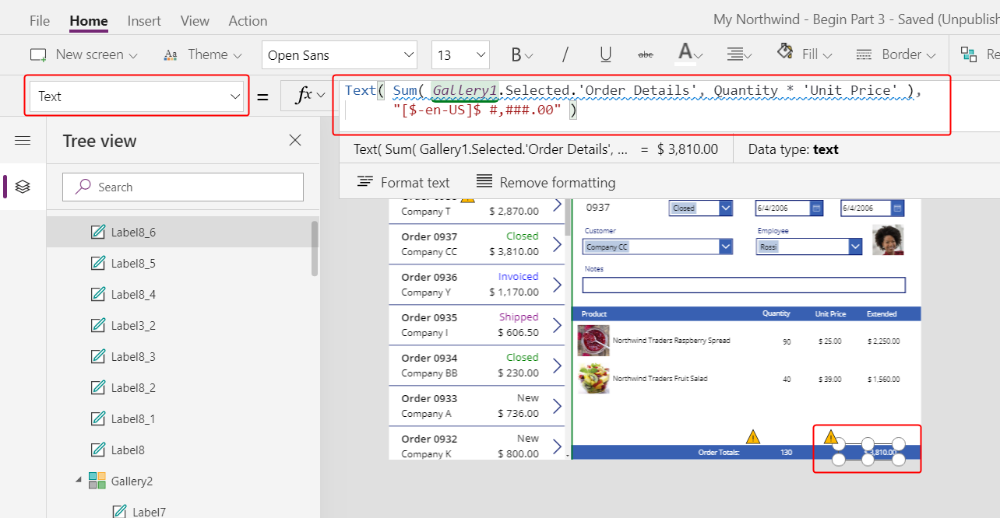

## Add an order detail

Gallery controls are read only and don't offer a way to add items. Let's add an area below the gallery where we can provide some editable controls to configure a record in the **Order Details** entity and insert that record into an order.

1. Shorten the height of the gallery showing **Order Details** to make room for a single item editing space below where we can add an **Order Detail**:

    > [!div class="mx-imgBorder"]
    > 

1. On the **Insert** tab , insert a **Label** control and resize and move it below the gallery.  

    > [!div class="mx-imgBorder"]
    > 

1. Double-click into the control, and clear the text on the label (empty string or **""**).  On the **Home** tab, set the **Fill** color to a light blue:

    > [!div class="mx-imgBorder"]
    > 

1. On the **View** tab , select **Data sources** > **Add data source**:

    > [!div class="mx-imgBorder"]
    > 

1. Select **Common Data Service**:

    > [!div class="mx-imgBorder"]
    > 

1. At the top of the **Data** pane, type **order** in the search box, select the **Order Details** check box, and then select **Connect**at the bottom of the pane:

    > [!div class="mx-imgBorder"]
    > 

    You've just added another data source to the app:

    > [!div class="mx-imgBorder"]
    > 

    You must add this data source because, although the app can read through a one-to-many relationship, the app can't yet write back changes. We must make changes directly with the related entity.

1. Close the **Data** pane. On the **Insert** tab , select **Controls** > **Combo box**:

    > [!div class="mx-imgBorder"]
    > 

1. The combo box control will appear to overlay the other controls on the upper-left side of the screen. Set the **Items** property to this formula:

    ```powerapps-dot
    Choices( 'Order Details'.Product )
    ```

    > [!div class="mx-imgBorder"]
    > 

    The [**Choices** function](functions/function-choices.md) returns a table of all the possible values for the field **Product** in the **Order Details** entity. This field is a lookup in a many-to-one relationship, so **Choices** returns all the records in the **Order Products** entity. 

    You can also use **Choices** with option sets to return the table of all the options, which was used behind the scenes in Part 2 to provide a combo box for **Order Status** in the form.

1. In the **Data** pane, set the **Primary text** to **nwind_productname**.

    You specify the logical name because the **Data** pane doesn't support display names in this case yet:

    > [!div class="mx-imgBorder"]
    > 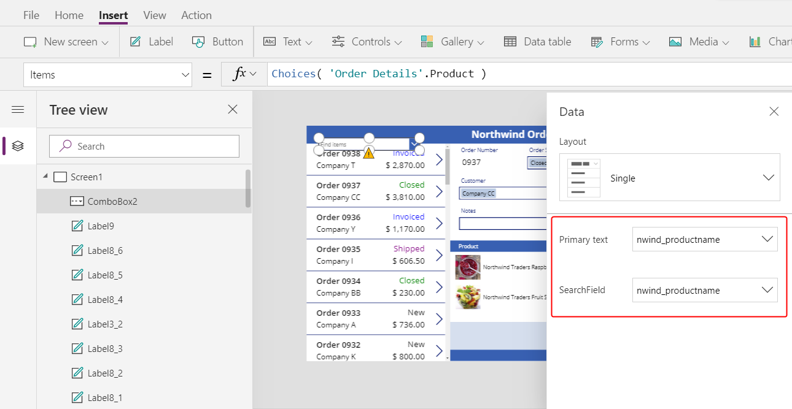

1. In the **Data** pane, set the **SearchField** to **nwind_productname**:

    > [!div class="mx-imgBorder"]
    > 

1. Close the **Data** pane. In the **Properties** tab of the right-hand pane, scroll down, turn off **Allow multiple selection**, and turn on **Allow searching**:

    > [!div class="mx-imgBorder"]
    > 

1. Resize and move the combo box on top of our light-blue area, in the same column as the product names shown above it in the gallery:

    > [!div class="mx-imgBorder"]
    > 

    This control will capture the **Product** for the **Order Details** record.

1. While holding down the Alt key, select the down arrow on the combo box.

    By holding down the Alt key, you can interact with controls in PowerApps Studio without needing to open Preview mode.

    You should see the list of all products.  Select of one of the products:

    > [!div class="mx-imgBorder"]
    > 

1. From the **Insert** menu, select **Media**, and then select an **Image** control:

    > [!div class="mx-imgBorder"]
    > 

    The control will overlay other controls on the left side of the screen and may not be easy to see:

    > [!div class="mx-imgBorder"]
    > 

1. Resize and move this control under the other product images next to the combo box control in the light blue area.  Set the **Image** property of this control to:

    ```powerapps-dot
    ComboBox1.Selected.Picture
    ```

    > [!div class="mx-imgBorder"]
    > 

    We are using the same trick we used in Part 2 to show the employee picture.  The **Selected** property on the combo box control returns the entire record of the product selected including the **Picture** field.

1. From the **Insert** menu, select **Text** and insert a [**Text input** control](controls/control-text-input.md):

    > [!div class="mx-imgBorder"]
    > 

    Again, this new control will be inserted over the other controls on the left side of the screen:

    > [!div class="mx-imgBorder"]
    > 

1. Resize and move this control to the right of the combo box control, under the quantity column of the gallery above:

    > [!div class="mx-imgBorder"]
    > 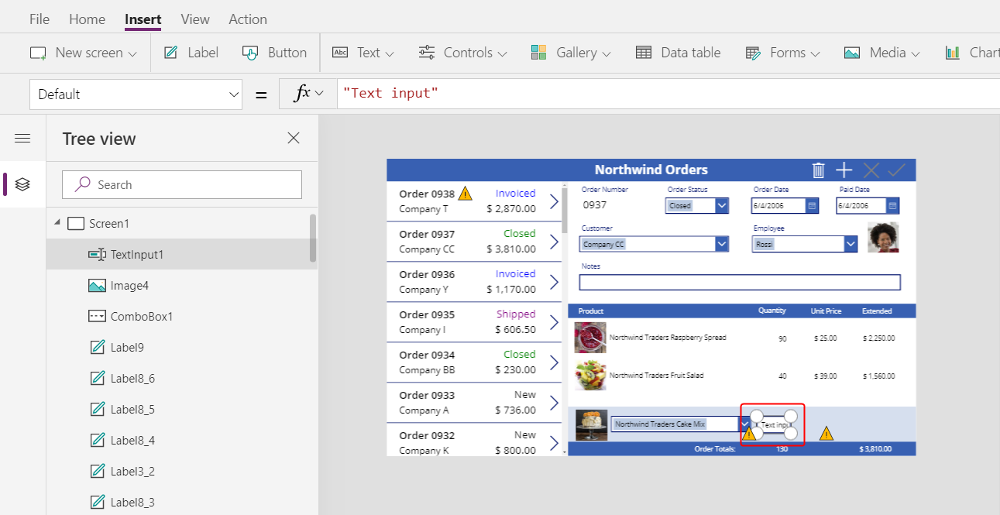

    This control will capture the **Quantity** for the **Order Details** record.

1. Set the **Default** property of this control to **""**:

    > [!div class="mx-imgBorder"]
    > 

1. Using the **Home** tab , set the text alignment of this control to **Right**:

    > [!div class="mx-imgBorder"]
    > 

1. From the **Insert** menu, insert a **Label** control, which will appear in the upper left corner of the screen:

    > [!div class="mx-imgBorder"]
    > 

1. Resize and move this control to the right of the text input control.  Set its **Text** property to the formula:

    ```powerapps-dot
    Text( ComboBox1.Selected.'List Price', "[$-en-US]$ #,###.00" )
    ```

    > [!div class="mx-imgBorder"]
    > 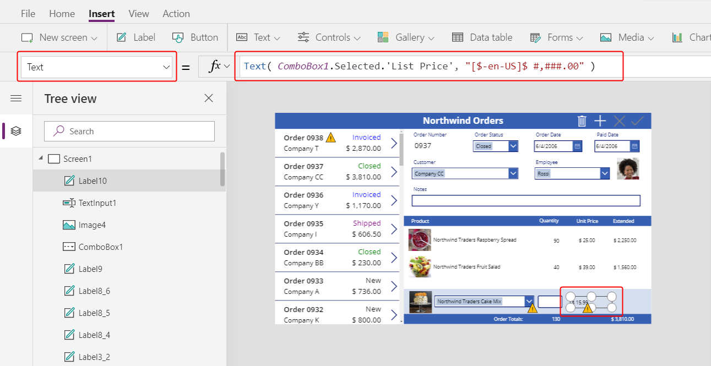

    This control is displaying the **List Price** from the **Order Products** entity.  We will use this for the **Unit Price** field in the **Order Details** record.  If we had wanted the app user to be able to modify the price, we could ahve used a **Text input** control and set the **Default** property to **List Price**.

1. Using the **Home** tab , set the text alignment of this control to **Right**:

    > [!div class="mx-imgBorder"]
    > 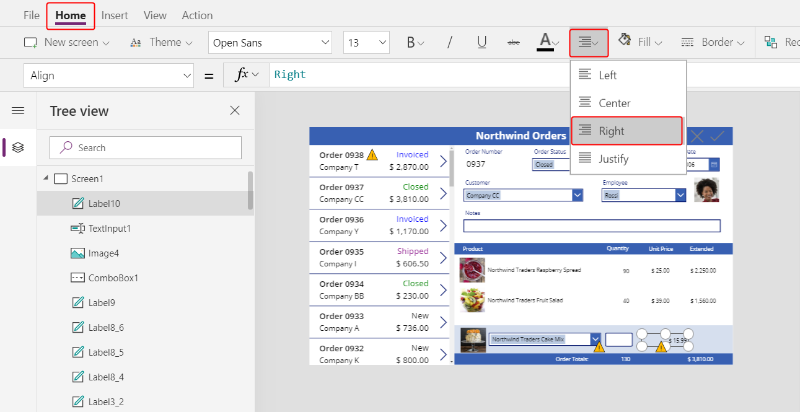

1. Cut and paste a copy of this control.  Resize and move it to the right of the **List price** label.  Set its **Text** property to the formula:

    ```powerapps-dot
    Text( Value(TextInput1.Text) * ComboBox1.Selected.'List Price', "[$-en-US]$ #,###.00" )
    ```

    > [!div class="mx-imgBorder"]
    > 

    This control is displaying the extended price based on the quantity entered and the list price.  It is purely informational for the app user.

1.   Double-click   the **Text input** control that holds quantity and type a number.  The **Extended** price label will automatically recalculate to show the new value:

    > [!div class="mx-imgBorder"]
    > 

1. From the **Insert** tab , select **Icons** and insert an **Add** icon:

    > [!div class="mx-imgBorder"]
    > 

    The icon will be inserted in the upper left corner of the screen and may be hard to see.

    > [!div class="mx-imgBorder"]
    > 

1.  Resize and move this icon to the right of the other controls in the light blue area.  Set its **OnSelect** property to the formula:

    ```powerapps-dot
    Patch( 'Order Details', 
        Defaults('Order Details'),
        { 
            Order: Gallery1.Selected, 
            Product: ComboBox1.Selected,
            Quantity: Value(TextInput1.Text), 
            'Unit Price': ComboBox1.Selected.'List Price' 
        }
    );
    Refresh( Orders );
    Reset( ComboBox1 ); 
    Reset( TextInput1 )
    ```

    > [!div class="mx-imgBorder"]
    > 

    Let's unpack what this formula is doing:
    - The [**Patch** function](functions/function-patch.md) is used to update and create records.  We are using it to modify the **Order Details** entity and in this case to create a new record by passing **Defaults( 'Order Details' )** in the second argument.
    - The third argument to **Patch** is the record we want to add.  We are providing values for the fields we care about:
        - **Order** is the order currently selected in the Orders list.
        - **Product** is taken from the combo box control we just added.  It will return the complete record for whatever **Order Products** was selected by the app user.  That is how we set lookup values in canvas apps, by complete record and not by primary keys.
        - **Quantity** is taken from the text input control we just added. 
        - **'Unit Price'** is taken from the current price in the **Order Products** entity.  It is one of the fields made available by thte combo box's selection.
    - For performance reasons, data is cached in a canvas app.  After updating the **Order Details**, the cache for the **Orders** entity won't know that the One-to-Many relationship to **Order Details** has been updated.  We use the [**Refresh** function](functions/function-refresh.md) to let it know.
    - After adding an **Order Detail**, we'd like to clear out the selections for a new record.  The [**Reset** function](functions/function-reset.md) clears the app user's input to start fresh. 

1. Preview the app with the triangular Play button at to the right of the Studio.  Press the **+** icon to add the product and quantity in the light blue area to the order.  Add another item to the order if you wish:

    > [!div class="mx-imgBorder"]
    > 

## Remove Order Details

1. Now that we can add an order detail, let's add a way to remove one.

    Select the gallery template for the **Order Details** in the center of the screen:

    > [!div class="mx-imgBorder"]
    > 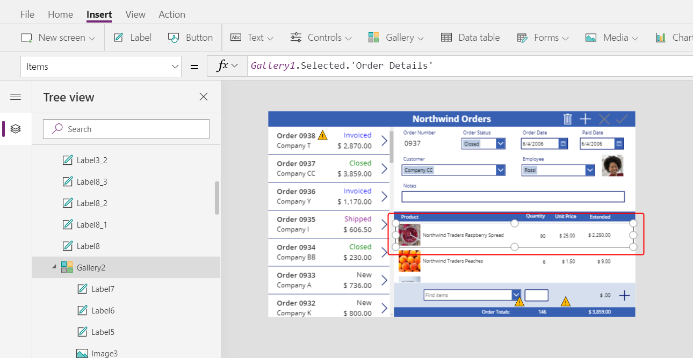

1. From the **Insert** tab , select **Icons**, and select the **Trash** icon:

    > [!div class="mx-imgBorder"]
    > 

    The icon will be inserted in the upper left corner of gallery's template, overlaying other controls and may be hard to see.

    > [!div class="mx-imgBorder"]
    > 

1. Resize and move this icon control to the right side of the gallery's template.  Set its **OnSelect** property to the formula:

    ```powerapps-dot
    Remove( 'Order Details', ThisItem ); Refresh( Orders )
    ```

    > [!div class="mx-imgBorder"]
    > 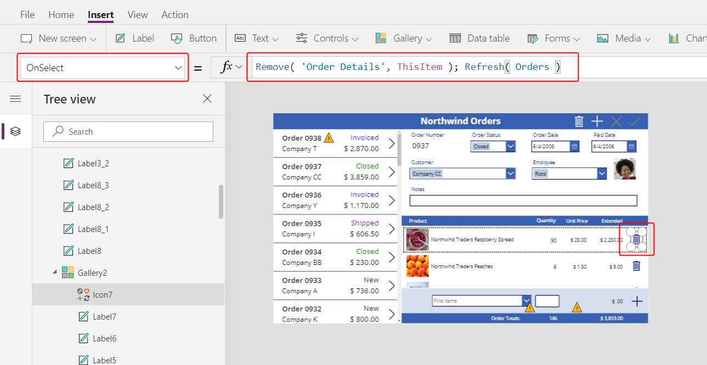

    As we can't yet remove a record directly from a relationship, the [**Remove** function](functions/function-remove-removeif.md) is used to remove a record directly from the related entity.  **ThisItem** is the record to remove, taken from the same record in the gallery where the trash can icon appears.

    Again, as we use cached data, we need to inform the **Orders** entity that we did something to one of its related entities without it knowning about it, by invoking the **Refresh** function.

1. Again preview the app.  Click the trash icon next to each **Order Details** record you would like to remove from the order.  Try adding and removing various order details from your orders:

    > [!div class="mx-imgBorder"]
    > 

## In conclusion

To recap, we just added another gallery to our app to show **Order Details** and a facility for adding an **Order Detail**.   We used:
- A second gallery control, linked to the first through a One-to-Many relationship: **Gallery2.Items** = `Gallery1.Selected.'Order Details'`
- From here, navigating a Many-to-One relationship: `ThisItem.Product.'Product Name'` and `ThisItem.Product.Picture`
- The **Choices** function to obtain a list of possible **Order Products**: `Choices( 'Order Details'.Product' )`
- The **Selected** property of a combo box control as the complete Many-to-One related record: `ComboBox1.Selected.Picture` and `ComboBox1.Selected.'List Price'`
- The **Patch** function to create a new **Order Details** record: `Patch( 'Order Details', Defautls( 'Order Details' ), ... )`
- The **Remove** function to delete an **Order Details** record: `Remove( 'Order Details', ThisItem )`

This has been a quick walk through of using Common Data Service relationships and option sets in a canvas app for educational purposes.  There are many other aspects of this app to considered before it is ready for production use, such as field validation and error handling.