# Build Northwind Orders (Canvas): Part 3, Order details

This series of articles will build a simple order management Canvas app step-by-step.  It will showcase how to use:
- Many-to-One relationships.  Many Orders can be related to the same Customer.  But each Order can be related to only one Customer.
- One-to-Many relationships.  Each Order can be related to many Order Details (or line items).  But each Order Detail is related to only one Order.
- Option sets.  

The completed app will look like this:


There are four parts:
- [Part 1, Orders list](northwind-orders-canvas-part1.md)
- Part 2, Order details form (this part)
- [Part 3, Order line items](northwind-orders-canvas-part3.md)

If you have not already done so, work through part 1.  Or take a shortcut by opening the **Northwind Orders (Canvas), Building Part 1** app after [installing the Northwind Traders sample database and apps](northwind-install.md)

## Display Order Details

1. Let's display the line items that make up this order.  Copy (with Ctrl-C) and Paste (with Ctrl-V) the title bar label at the top of the screen:

	

1. Resize and reposition the copy to just below the form control.  Double click into the control and backspace over the text to remove it (you can also set the Text property to **""**):

	

1. Insert a [**Gallery** control](controls/control-gallery.md) with a **Blank vertical** layout:

	

1. The newly inserted control will overlay the existing controls on the left hand side of the screen:
 
	

	Close the Data pane.  Resize and reposition the control below our new title bar:

	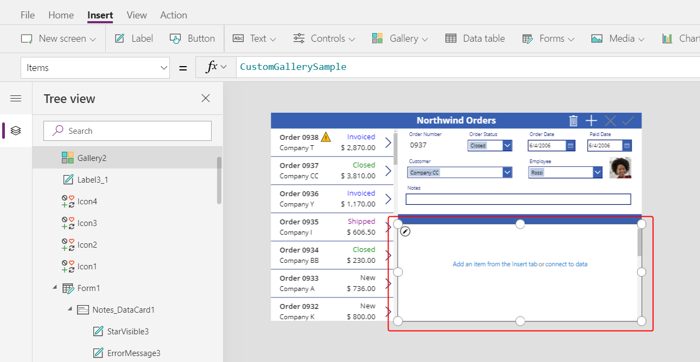

1. Set the **Items** property of the gallery to the formula:

	```powerapps-dot
	Gallery1.Selected.'Order Details'
	```

	

1. Select the **Add an itme from the insert tab** link inside the gallery to select the template for the gallery.  You can tell the difference from selecting the gallery itself because the bounding box is slightly inside the gallery's boundary and is usually shorter than the gallery's height.  We will be inserting controls into this template that will be repeated for each item:

	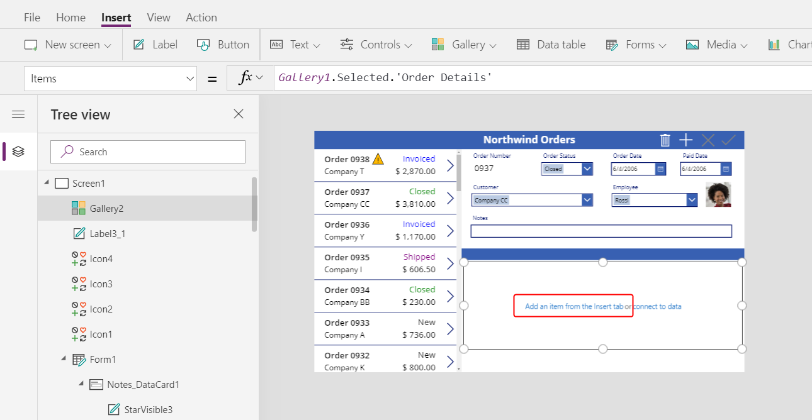

1. From the **Insert** ribbon, insert a [**Label** control](controls/control-text-box.md).  It should appear within the gallery; if it does not, try again and make sure the gallery's template is selected before inserting the control.

	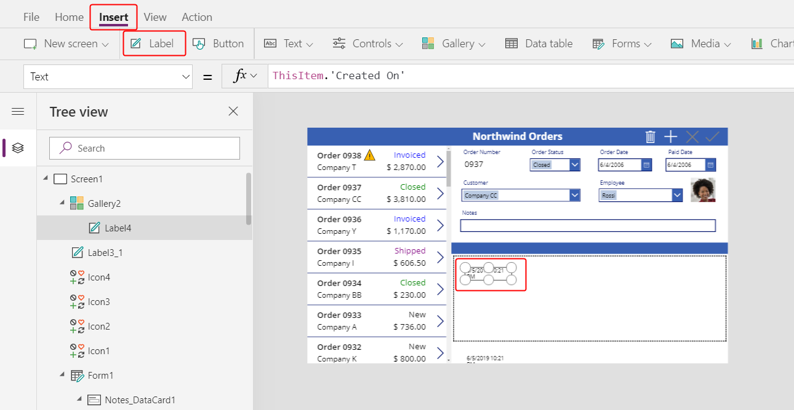

1. Set the **Text** property to the formula:

	```powerapps-dot
	ThisItem.Product.'Product Name'
	```
	
	With this formula we are walking from an **Order Detail** record which is held in **ThisItem** over to the **Products** entity through a Many-to-One relationship and then extracting the **Product Name** column.  

	Resize the control as needed to see the full text:

	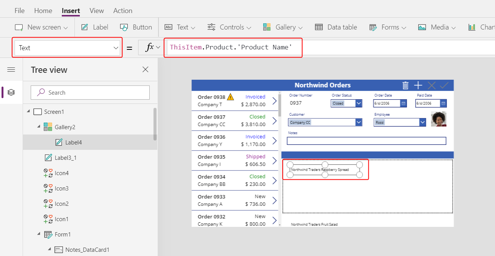

1. From the **Insert** ribbon, insert an [**Image** control](controls/control-image.md) into the gallery:

	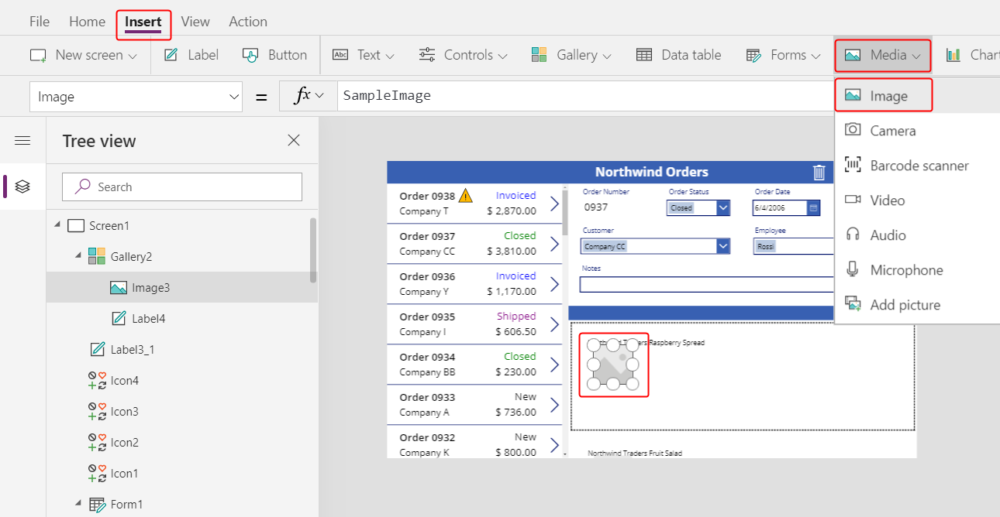

1. Resize and reposition the image and label controls to be side by side.  For fine grained control over size and position, start to resize or move the control and then hold down the Alt key:

	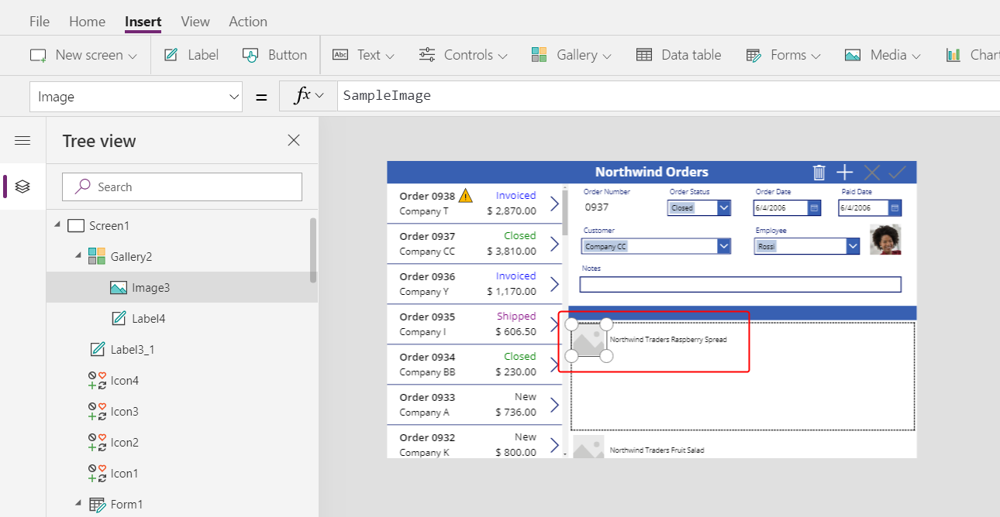

1. Set the **Image** property to this formula:

	```powerapps-dot
	ThisItem.Product.Picture
	```
	Here we are again referencing the **Product** associated with this **Order Detail** record and extracting the **Picture** column to display.

	

1. Shorten the height of the gallery's template so that we can see more than one product at a time:
 
	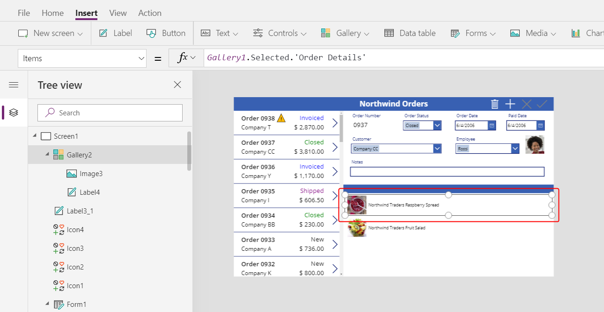

1. From the **Insert** ribbon, insert another **Label** control into the gallery.  Resize and reposition it to the right of the product information.  Set it's **Text** Property to the formula:

	```powerapps-dot
	ThisItem.Quantity
	```

	This formula is pulling information directly from the **Order Details** records.
 
	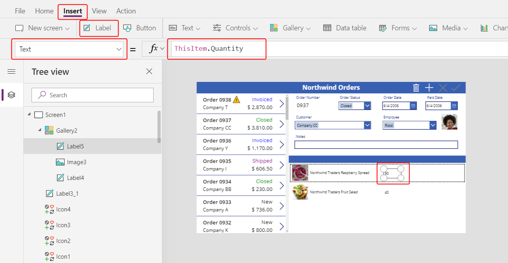 
 
1. From the **Home** ribbon, change the alignment of this control to **Right**:

	

1. From the **Insert** ribbon, insert another **Label** control into the gallery.  Resize and reposition it to the right of the quantity.  Set it's **Text** Property to the formula:

	```powerapps-dot
	Text( ThisItem.'Unit Price', "[$-en-US]$ #,###.00" )
	```

	If you don't include the language tag (**[$-en-US]**) it will be added for you based on your language and region.  If it is different, you will want to use your own currency symbol instead of the **$** shown here just before the first **#**.

	

1. From the **Home** ribbon, change the alignment of this control to **Right**:

	

1. From the **Insert** ribbon, insert another **Label** control into the gallery.  Resize and reposition it to the right of the unit price.  Set it's **Text** Property to the formula:

	```powerapps-dot
	Text( ThisItem.Quantity * ThisItem.'Unit Price', "[$-en-US]$ #,###.00" )
	```

	Again, if you don't include the language tag (**[$-en-US]**) it will be added for you based on your language and region.  If it is different, you will want to use your own currency symbol instead of the **$** shown here just before the first **#**.

	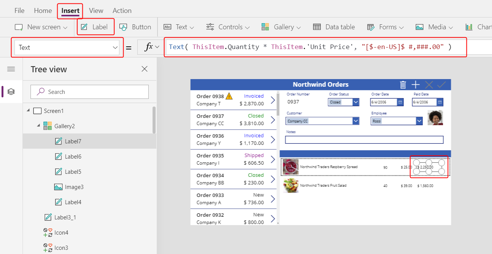

1. From the **Home** ribbon, change the alignment of this control to **Right**:

	

1. We are done adding controls to this gallery for now.  Click on the gray area outside of the screen or on another control outside of the gallery.  From the **Insert** ribbon, insert another **Label** control on to the screen:

	

1. Resize and reposition this control on top of the second title bar above the picture of the products.  Change the text's color to White with the **Home** ribbon:

	

1. Copy and paste this control.  Resize and reposition above the quantity column.  Double click into the control and type **Quantity**:

	

1. Copy and paste this control.  Resize and reposition above the unit price column.  Double click into the control and type **Unit Price**:

	

1. Copy and paste this control.  Resize and reposition above the extended price column.  Double click into the control and type **Extended**:

	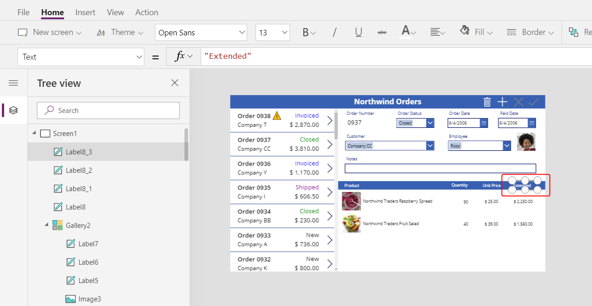

## Display Order totals

1. Resize the height of the gallery to make room to display the order totals at the bottom of the screen:

	

1. Copy and paste the title bar in the middle of the screen and reposition it at the bottom of the screen:

	

1. Copy and paste the label showing **Product** from the middle title bar and position this to the left of the **Quantity** column on top of the bottom title bar.  Double click into the control and type **Order Totals:**:

	

1. Copy and paste this label control.  Resize and reposition this control to the right of the **Order Totals:** label.  Set the **Text** property to the formula:

	```powerapps-dot
	Sum( Gallery1.Selected.'Order Details', Quantity )
	```

	This formula will show a delegation warning.  This is OK since we do not expect to have more than 500 diferent products in any one order.

	Using the **Home** ribbon set the text alignment to **Right**:

	

1. Copy and paste this label control.  Resize and reposition this control below the **Extended** column.  Set the **Text** property to the formula:

	```powerapps-dot
	Text( Sum( Gallery1.Selected.'Order Details', Quantity * 'Unit Price' ), "[$-en-US]$ #,###.00" )
	```

	This formula will show a delegation warning.  This is OK since we do not expect to have more than 500 diferent products in any one order.

	

## Add Order Details

1. Shorten the height of the gallery showing **Order Details** to make room for an editing space below it where we can add an **Order Detail**:

	

1. From the **Insert** ribbon, insert a **Label** control and resize and resposition it below the gallery.  

	

1. Double click into the control and clear the text on the label.  Using the **Home** ribbon, set the **Fill** color to a light blue:

	

1. From the **View** ribbon, select **Data sources** and then **+ Add data source**:

	

1. Select the **Common Data Service**:

	

1. Type **order** in the search box at the top of the data pane.  Check the **Order Details** entity.  Click the **Connect** button at the bottom of the screen:

	

	We have just added another data source to our app:

	

1. Close the Data panel.  From the **Insert** ribbon, select **Controls** and then **Combo box**:

	

1. The combo box control will appear to overlay the other controls on the upper left side of the screen.  Set the **Items** property to the formula:

	```powerapps-dot
	Choices( 'Order Details'.Product )
	```

	

1. In the Data panel, set the **Primary text** and **SearchField** to **nwind_productname**:

	

	

1. Close the Data panel.  Scroll down in the Properties panel and turn off **Allow multiple selection** and turn on **Allow searching**:

	

1. Resize and reposition the combo box on top of our light blue area, in the same column as the product names above it:

	

1. Hold down the Alt key and click the down arrow on the combo box. You should see the list of products.  Select of one of the products:

	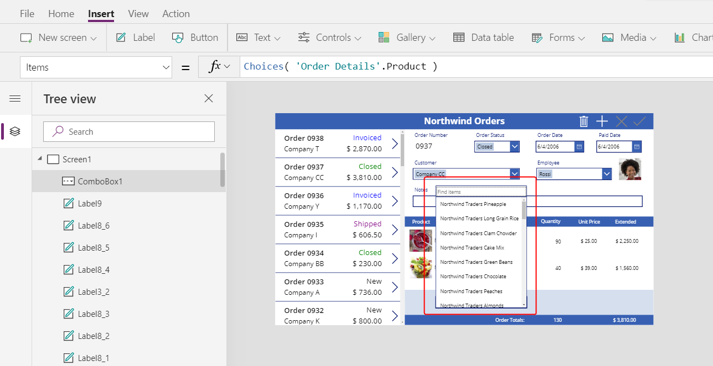

1. From the **Insert** menu, select **Media** and insert an **Image** control:

	

	The control will overlay other controls on the left side of the screen:

	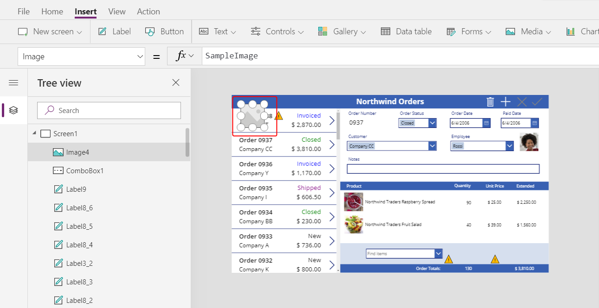

1. Resize and reposition this control under the other product images next to the combo box control in the light blue area.  Set the **Image** property of this control to:

	```powerapps-dot
	ComboBox1.Selected.Picture
	```

	

1. From the **Insert** menu, select **Text** and insert a [**Text input** control](controls/control-text-input.md):

	

	Again, this new control will be inserted over the other controls on the left side of the screen:

	

1. Resize and reposition this control to the right of the combo box control:

	

1. Set the **Default** property of this control to **""**:

	

1. Using the **Home** ribbon, set the text alignment of this control to **Right**:

	

1. From the **Insert** menu, insert a **Label** control, which will appear in the upper left corner of the screen:

	

1. Reize and reposition this control to the right of the text input control.  Set its **Text** property to the formula:

	```powerapps-dot
	Text( ComboBox1.Selected.'List Price', "[$-en-US]$ #,###.00" )
	```

	

1. Using the **Home** ribbon, set the text alignment of this control to **Right**:

	

1. Cut and paste a copy of this control.  Resize and reposition it to the right of the **List price** label.  Set its **Text** property to the formula:

	```powerapps-dot
	Text( Value(TextInput1.Text) * ComboBox1.Selected.'List Price', "[$-en-US]$ #,###.00" )
	```

	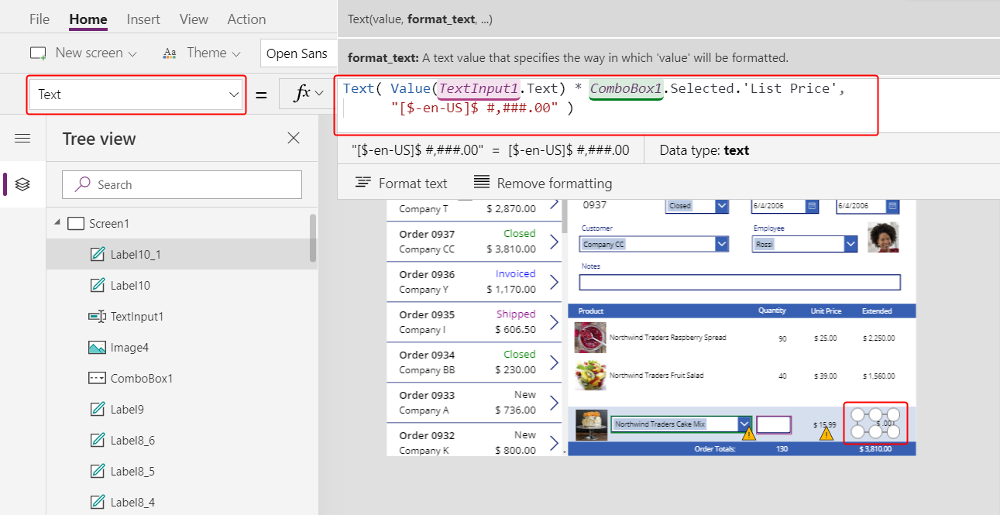

1. Double click the **Quantity** text input control and type a number.  The **Extended** price label will automatically recalculate to show the new value:

	

1. From the **Insert** ribbon, select **Icons** and insert an **Add** icon:

	

	The icon will be inserted in the upper left corner of the screen.

	

1.  Resize and reposition this icon to the right of the other controls in the light blue area.  Set its **OnSelect** property to the formula:

	```powerapps-dot
	Patch( 'Order Details', 
	    Defaults('Order Details'),
	    { 
        	Order: Gallery1.Selected, 
        	Product: ComboBox1.Selected,
        	Quantity: Value(TextInput1.Text), 
        	'Unit Price': ComboBox1.Selected.'List Price' 
    	}
	);
	Refresh( Orders );
	Reset( ComboBox1 ); 
	Reset( TextInput1 )
	```

	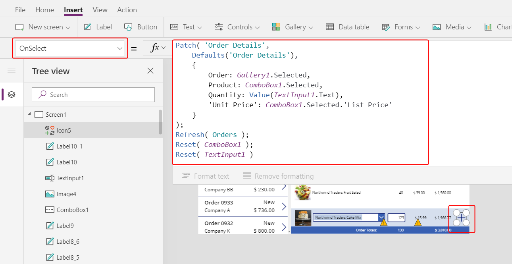

1. Preview the app with the triangular Play button at to the right of the Studio.  Press the **+** icon to add the product and quantity in the light blue area to the order.  Add another item to the order as well:

	

## Remove Order Details

1. Select the gallery template for the **Order Details** in the center of the screen:

	

1. From the **Insert** ribbon, select **Icons** and insert a **Trash** icon:

	

	The icon will be inserted in the upper left corner of gallery's template, overlaying other controls.

	

1. Resize and reposition this icon control to the right side of the gallery's template.  Set its **OnSelect** property to the formula:

	```powerapps-dot
	Remove( 'Order Details', ThisItem ); Refresh( Orders )
	```

	

1. Again preview the app.  Click the trash icon next to each **Order Details** record you would like to remove from the order.  Try adding and removing various products:

	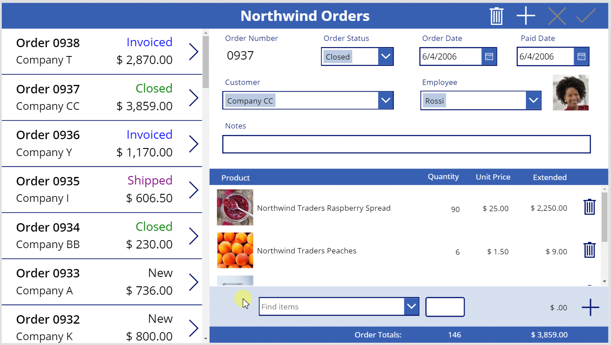


	


	


