# Create a detail gallery in a canvas app

Follow step-by-step instructions to create a detail gallery in a canvas app for managing fictitious data in the Northwind Traders database. This topic is part of a series that explains how to build a business app on relational data in Microsoft Dataverse. For best results, explore these topics in this sequence:

1. [Create an order gallery](northwind-orders-canvas-part1.md).
1. [Create a summary form](northwind-orders-canvas-part2.md).
1. Create a detail gallery (**this topic**).

> [!div class="mx-imgBorder"]
> 

## Prerequisites

Before you start this topic, you must install the database as described earlier in this topic. You must then either create the order gallery and the summary form or open the **Northwind Orders (Canvas) - Begin Part 3** app, which already contains that gallery and that form.

## Create another title bar

1. At the top of the screen, select the [**Label**](controls/control-text-box.md) control that acts as a title bar, copy it by pressing Ctrl-C, and then paste it by pressing Ctrl-V:

    > [!div class="mx-imgBorder"]
    > 

1. Resize and move the copy so that it appears just under the summary form.

1. Remove the text from the copy in either of these ways:

    - Double-click the text to select it, and then press Delete.
    - Set the label's **Text** property to an empty string (**""**).

    > [!div class="mx-imgBorder"]
    > 

## Add a gallery

1. Insert a [**Gallery**](controls/control-gallery.md) control with a **Blank vertical** layout:

    > [!div class="mx-imgBorder"]
    > 

    The new gallery, which will show order details, appears in the upper-left corner.

1. Close the fly out data source dialog, and then resize and move the detail gallery to the lower-right corner, below the new title bar:

    > [!div class="mx-imgBorder"]
    > 

1. Set the **Items** property of the detail gallery to this formula:

    ```powerapps-dot
    Gallery1.Selected.'Order Details'
    ```

    > [!div class="mx-imgBorder"]
    > 

    If an error appears, confirm that the order gallery is named **Gallery1** (in the **Tree view** pane near the left edge). If that gallery has a different name, rename it **Gallery1**.

    You've just linked the two galleries. When the user selects an order in the order gallery, that selection identifies a record in the **Orders** table. If that order contains one or more line items, the record in the **Orders** table is linked to one or more records in the **Order details** table, and data from those records appears in the detail gallery. This behavior reflects the one-to-many relationship that was created for you between the **Orders** and **Order Details** tables. The formula that you specified "walks" that relationship by using dot notation:

    

## Show product names

1. In the detail gallery, select **Add an item from the Insert tab** to select the gallery template:

    > [!div class="mx-imgBorder"]
    > 

    Ensure that you've selected the gallery template instead of the gallery itself. The bounding box should be slightly inside the gallery's boundary and probably shorter than the gallery's height. As you insert controls into this template, they are repeated for each item in the gallery.

1. On the **Insert** tab, insert a label into the detail gallery.

    The label should appear within the gallery; if it doesn't, try again, but make sure to select the gallery's template before you insert the label.

    > [!div class="mx-imgBorder"]
    > 

1. Set the new label's **Text** property to this formula:

    ```powerapps-dot
    ThisItem.Product.'Product Name'
    ```

    If no text appears, select the arrow for **Order 0901** near the bottom of the order gallery.

1. Resize the label so that the full text appears:

    > [!div class="mx-imgBorder"]
    > 

    This expression walks from a record in the **Order Details** table. The record is held in **ThisItem** over to the **Order Products** table through a many-to-one relationship:

    

    The **Product Name** column (and other columns that you're about to use) are extracted:

    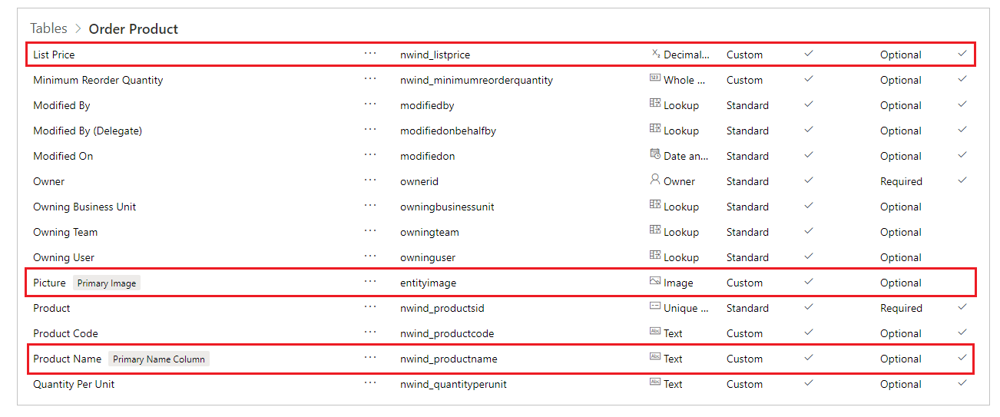

## Show product images

1. On the **Insert** tab, insert an [**Image**](controls/control-image.md) control into the detail gallery:

    > [!div class="mx-imgBorder"]
    > 

1. Resize and move the image and the label to be side by side.

    > [!TIP]
    > For fine-grained control over the size and the position of a control, start to resize or move it without pressing the Alt key, and then continue to resize or move the control while you hold down the Alt key:

    > [!div class="mx-imgBorder"]
    > 

1. Set the image's **Image** property to this formula:

    ```powerapps-dot
    ThisItem.Product.Picture
    ```

    Again, the expression references a product that's associated with this order detail and extracting the **Picture** field to display.

    > [!div class="mx-imgBorder"]
    > 

1. Reduce the height of the gallery's template so that more than one **Order Detail** record appears at a time:

    > [!div class="mx-imgBorder"]
    > 

## Show product quantity and cost

1. On the **Insert** tab, insert another label into the detail gallery, and then resize and move the new label to the right of the product information.

1. Set the new label's **Text** property to this expression:

    ```powerapps-dot
    ThisItem.Quantity
    ```

    This formula pulls information directly from the **Order Details** table (no relationship required).

    > [!div class="mx-imgBorder"]
    >  

1. On the **Home** tab, change the alignment of this control to **Right**:

    > [!div class="mx-imgBorder"]
    > 

1. On the **Insert** tab, insert another label into the detail gallery, and then resize and move the label to the right of the quantity label.

1. Set the new label's **Text** property to this formula:

    ```powerapps-dot
    Text( ThisItem.'Unit Price', "[$-en-US]$ #,###.00" )
    ```

    If you don't include the language tag (**[$-en-US]**), it will be added for you based on your language and region. If you use a different language tag, you'll want to remove the **$** just after the close square bracket (**]**), and then add your own currency symbol in that position.

    > [!div class="mx-imgBorder"]
    > 

1. On the **Home** tab, change the alignment of this control to **Right**:

    > [!div class="mx-imgBorder"]
    > 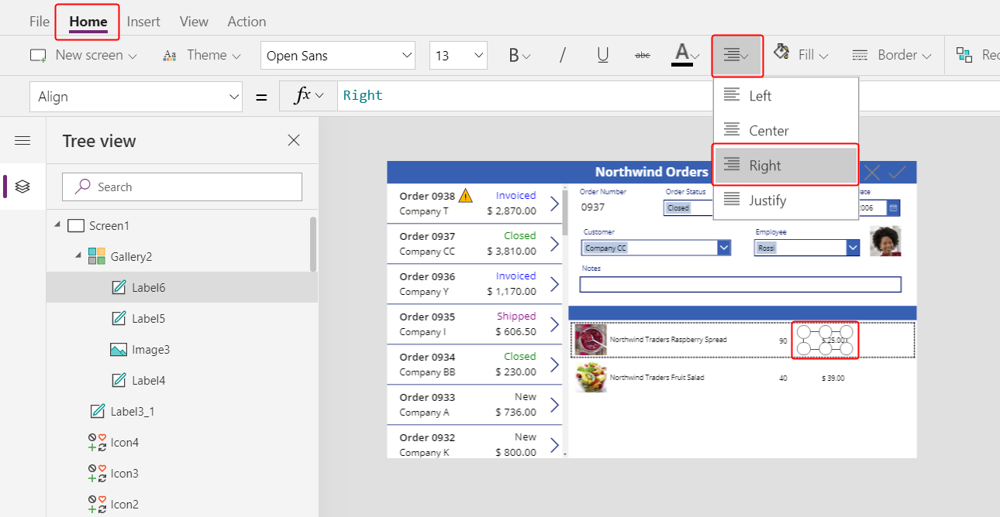

1. On the **Insert** tab, insert another label control into the detail gallery, and then resize and move the new label to the right of the unit price.

1. Set the new label's **Text** property to this formula:

    ```powerapps-dot
    Text( ThisItem.Quantity * ThisItem.'Unit Price', "[$-en-US]$ #,###.00" )
    ```

    Again, if you don't include the language tag (**[$-en-US]**), it will be added for you based on your language and region. If the tag is different, you'll want to use your own currency symbol instead of the **$** just after the close square bracket (**]**).

    > [!div class="mx-imgBorder"]
    > 

1. On the **Home** tab, change the alignment of this control to **Right**:

    > [!div class="mx-imgBorder"]
    > 

    You're done adding controls to the detail gallery for now.

1. In the **Tree view** pane, select **Screen1** to ensure that the detail gallery is no longer selected.

## Add text to the new title bar

1. On the **Insert** tab, insert another label on to the screen:

    > [!div class="mx-imgBorder"]
    > 

1. Resize and move the new label above the pictures of the products in the second title bar, and then change the text's color to white on the **Home** tab.

1. Double-click the label's text, and then type **Product**:

    > [!div class="mx-imgBorder"]
    > 

1. Copy and paste the product label, and then resize and move the copy above the quantity column.

1. Double-click the new label's text, and then type **Quantity**:

    > [!div class="mx-imgBorder"]
    > 

1. Copy and paste the quantity label, and then resize and move the copy above the unit-price column.

1. Double-click the new label's text, and then type **Unit Price**:

    > [!div class="mx-imgBorder"]
    > 

1. Copy and paste the unit-price label, and then resize and move the copy above the extended-price column.

1. Double-click the text of the new label, and then type **Extended**:

    > [!div class="mx-imgBorder"]
    > 

## Display order totals

1. Reduce the height of the detail gallery to make room for the order totals at the bottom of the screen:

    > [!div class="mx-imgBorder"]
    > 

1. Copy and paste the title bar in the middle of the screen, and then move the copy to the bottom of the screen:

    > [!div class="mx-imgBorder"]
    > 

1. Copy and paste the product label from the middle title bar, and then move the copy to the bottom title bar, just to the left of the **Quantity** column.

1. Double-click the new label's text, and then type this text:<br>**Order Totals:**

    > [!div class="mx-imgBorder"]
    > 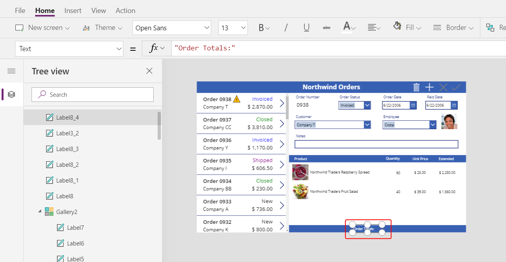

1. Copy and paste the order-totals label, and then resize and move the copy to the right of the order-totals label.

1. Set the new label's **Text** property to this formula:

    ```powerapps-dot
    Sum( Gallery1.Selected.'Order Details', Quantity )
    ```

    This formula shows a delegation warning, but you can ignore it because no single order will contain more than 500 products.

1. On the **Home** tab, set the new label's text alignment to **Right**:

    > [!div class="mx-imgBorder"]
    > 

1. Copy and paste this label control, and then resize and move the copy under the **Extended** column.

1. Set the copy's **Text** property to this formula:

    ```powerapps-dot
    Text( Sum( Gallery1.Selected.'Order Details', Quantity * 'Unit Price' ), "[$-en-US]$ #,###.00" )
    ```

    This formula shows a delegation warning, but you can ignore it because no single order will contain more than 500 products.

    > [!div class="mx-imgBorder"]
    > 

## Add space for new details

In any gallery, you can show data but you can't update it or add records. Under the detail gallery, you'll add an area where the user can configure a record in the **Order Details** table and insert that record into an order.

1. Reduce the height of the detail gallery enough to make room for a single-item editing space under that gallery.

    In this space, you'll add controls so that the user can add an order detail:

    > [!div class="mx-imgBorder"]
    > 

1. On the **Insert** tab, insert a label, and then resize and move it under the detail gallery.

    > [!div class="mx-imgBorder"]
    > 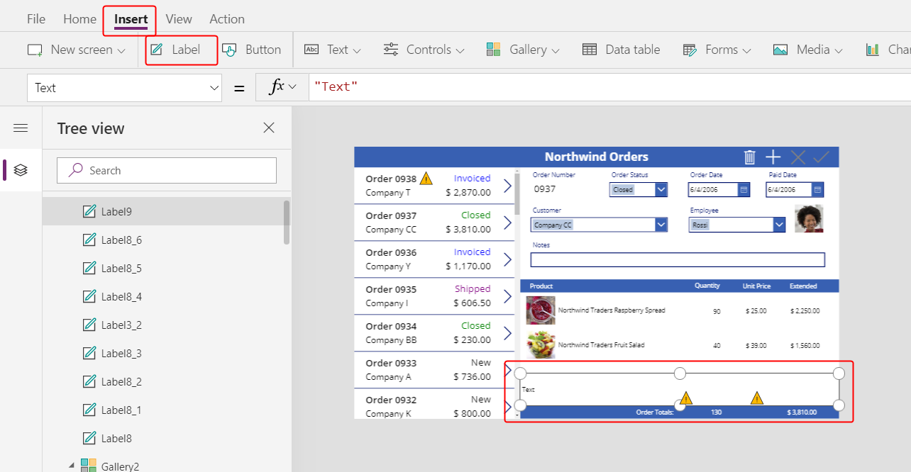

1. Double-click the text of the new label, and then press Delete.

1. On the **Home** tab, set the new label's **Fill** color to **LightBlue**:

    > [!div class="mx-imgBorder"]
    > 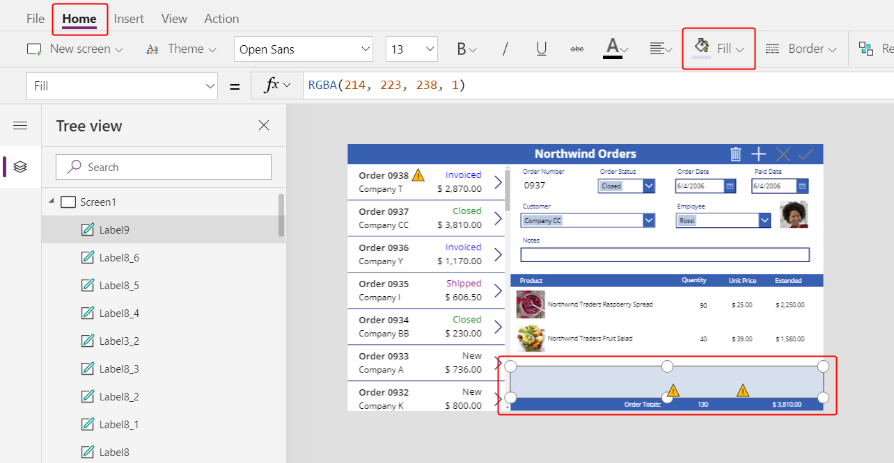

## Select a product

1. On the **Insert** tab, select **Controls** > **Combo box**:

    > [!div class="mx-imgBorder"]
    > 

    The [**Combo box**](controls/control-combo-box.md) control appears in the upper-left corner.

1. In the fly out dialog, select the **Order Products** data source.

1. In the **Properties** tab for the combo box, select **Edit** (next to **Fields**) to open the **Data** pane.  Ensure that the **Primary text** and **SearchField** are set to **nwind_productname**.

    You specify the logical name because the **Data** pane doesn't support display names in this case yet:

    > [!div class="mx-imgBorder"]
    > 

1. Close the **Data** pane.

1. In the **Properties** tab near the right edge, scroll down, turn off **Allow multiple selection**, and ensure that **Allow searching** is turned on:

    > [!div class="mx-imgBorder"]
    > 

1. Resize and move the combo box to the light-blue area, just under the product-name column in the detail gallery:

    > [!div class="mx-imgBorder"]
    > 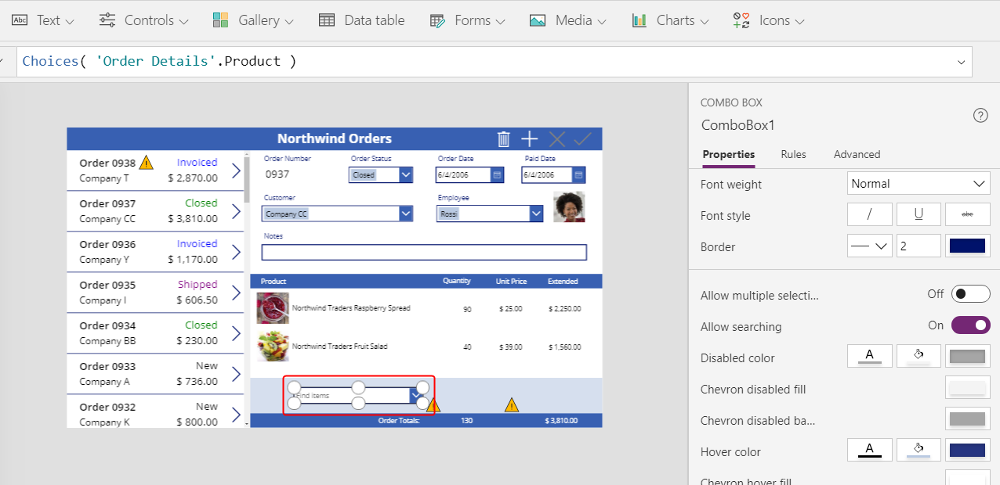

    In this combo box, the user will specify a record in the **Product** table for the **Order Details** record that the app will create.

1. While holding down the Alt key, select the combo box's down arrow.

    > [!TIP]
    > By holding down the Alt key, you can interact with controls in Power Apps Studio without opening Preview mode.

1. In the list of products that appears, select a product:

    > [!div class="mx-imgBorder"]
    > 

## Add a product image

1. On the **Insert** tab, select **Media** > **Image**:

    > [!div class="mx-imgBorder"]
    > 

    The [**Image**](controls/control-image.md) control appears in the upper-left corner:

    > [!div class="mx-imgBorder"]
    > 

1. Resize and move the image to the light-blue area under the other product images and next to the combo box.

1. Set the **Image** property of the image to:

    ```powerapps-dot
    ComboBox1.Selected.Picture
    ```

    > [!div class="mx-imgBorder"]
    > 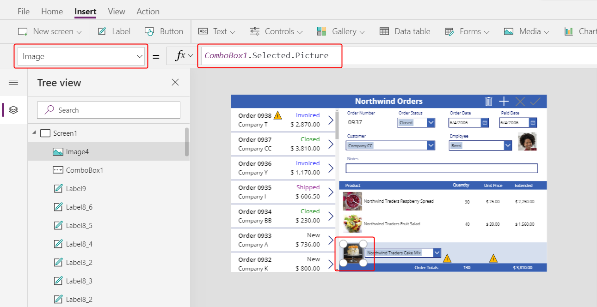

    You're using the same trick as you used to show the employee picture in the summary form. The **Selected** property of the combo box returns the entire record of whatever product the user selects, including the **Picture** field.

## Add a quantity box

1. On the **Insert** tab, select **Text** > **Text input**:

    > [!div class="mx-imgBorder"]
    > 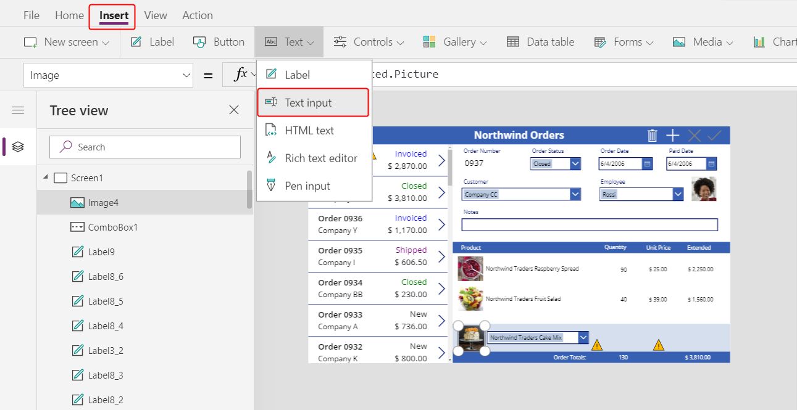

    The [**Text input**](controls/control-text-input.md) control appears in the upper-left corner:

    > [!div class="mx-imgBorder"]
    > 

1. Resize and move the text-input box to the right of the combo box, under the quantity column in the detail gallery:

    > [!div class="mx-imgBorder"]
    > 

    By using this text-input box, the user will specify the **Quantity** field of the **Order Details** record.

1. Set the **Default** property of this control to **""**:

    > [!div class="mx-imgBorder"]
    > 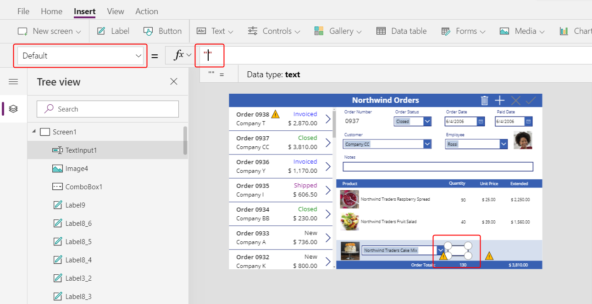

1. On the **Home** tab, set the text alignment of this control to **Right**:

    > [!div class="mx-imgBorder"]
    > 

## Show the unit and extended prices

1. On the **Insert** tab, insert a **Label** control.

    The label appears in the upper-left corner of the screen:

    > [!div class="mx-imgBorder"]
    > 

1. Resize and move the label to the right of the text-input control, and set the label's **Text** property to this formula:

    ```powerapps-dot
    Text( ComboBox1.Selected.'List Price', "[$-en-US]$ #,###.00" )
    ```

    > [!div class="mx-imgBorder"]
    > 

    This control shows the **List Price** from the **Order Products** table. This value will determine the **Unit Price** field in the **Order Details** record.

    > [!NOTE]
    > For this scenario, the value is read-only, but other scenarios might call for the app user to modify it. In that case, use a **Text input** control, and set its **Default** property to **List Price**.

1. On the **Home** tab, set the text alignment of the list-price label to **Right**:

    > [!div class="mx-imgBorder"]
    > 

1. Copy and paste the list-price label, and then resize and move the copy to the right of the list-price label.

1. Set the new label's **Text** property to this formula:

    ```powerapps-dot
    Text( Value(TextInput1.Text) * ComboBox1.Selected.'List Price', "[$-en-US]$ #,###.00" )
    ```

    > [!div class="mx-imgBorder"]
    > 

    This control shows the extended price based on the quantity that the app user specified and the list price of the product that the app user selected. It's purely informational for the app user.

1. Double-click the text-input control for quantity, and then type a number.

    The **Extended** price label recalculates to show the new value:

    > [!div class="mx-imgBorder"]
    > 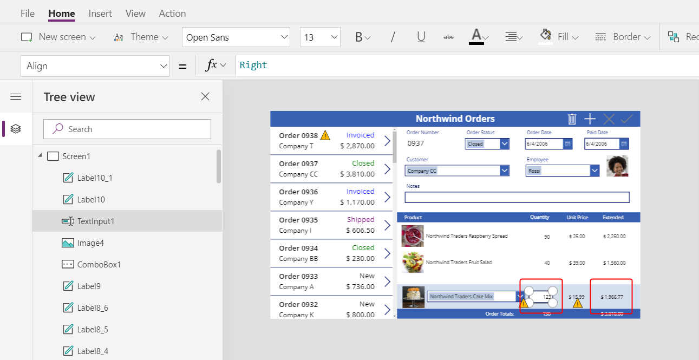

## Add an Add icon

1. On the **Insert** tab, select **Icons** > **Add**:

    > [!div class="mx-imgBorder"]
    > 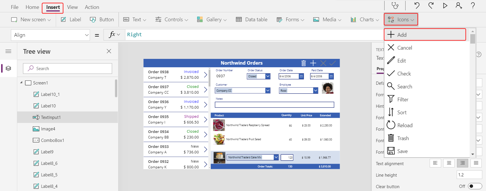

    The icon appears in the upper-left corner of the screen.

    > [!div class="mx-imgBorder"]
    > 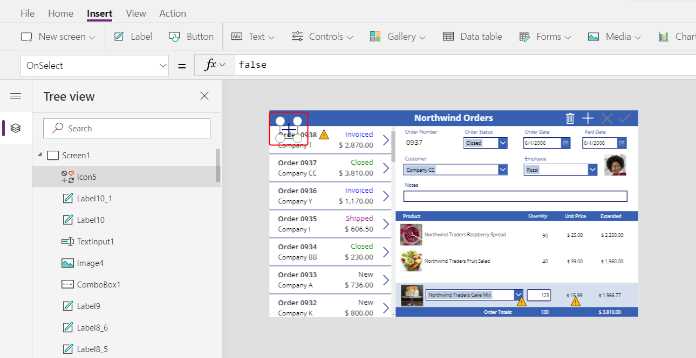

1. Resize and move this icon to the right edge of the light-blue area, and then set the icon's **OnSelect** property to this formula:

    ```powerapps-dot
    Patch( 'Order Details',
        Defaults('Order Details'),
        {
            Order: Gallery1.Selected,
            Product: ComboBox1.Selected,
            Quantity: Value(TextInput1.Text),
            'Unit Price': ComboBox1.Selected.'List Price'
        }
    );
    Refresh( Orders );
    Reset( ComboBox1 );
    Reset( TextInput1 )
    ```

    > [!div class="mx-imgBorder"]
    > 

    In general, the [**Patch**](functions/function-patch.md) function updates and creates records, and the specific arguments in this formula determine the exact changes that the function will make.

    - The first argument specifies the data source (in this case, the **Order Details** table) in which the function will update or create a record.
    - The second argument specifies that the function will create a record with the default values for the **Order Details** table unless otherwise specified in the third argument.
    - The third argument specifies that four columns in the new record will contain values from the user.

      - The **Order** column will contain the number of the order that the user selected in order gallery.
      - The **Product** column will contain the name of the product that the user selected in the combo box that shows products.
      - The **Quantity** column will contain the value that the user specified in the text-input box.
      - The **Unit Price** column will contain the list price of the product that the user selected for this order detail.

    > [!NOTE]
    > You can build formulas that use data from any column (in the **Order Products** table) for whatever product the app user selects in the combo box that shows products. When the user selects a record in the **Order Products** table, not only does the product’s name appear in that combo box but also the product’s unit price appears in a label. Each lookup value in a canvas app references an entire record, not just a primary key.

    The **Refresh** function ensures that the **Orders** table reflects the record that you’ve just added to the **Order Details** table. The **Reset** function clears the product, quantity, and unit-price data so that the user can more easily create another order detail for the same order.

1. Press F5, and then select the **Add** icon.

    The order reflects the information that you specified:

    > [!div class="mx-imgBorder"]
    > 

1. (optional) Add another item to the order.

1. Press Esc to close Preview mode.

## Remove an order detail

1. In the center of the screen, select the template of the detail gallery:

    > [!div class="mx-imgBorder"]
    > 

1. On the **Insert** tab, select **Icons** > **Trash**:

    > [!div class="mx-imgBorder"]
    > 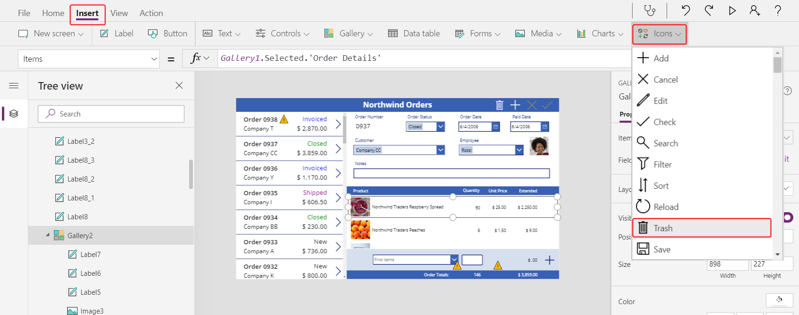

    The Trash icon appears in the upper-left corner of gallery's template.

    > [!div class="mx-imgBorder"]
    > 

1. Resize and move the Trash icon to the right side of the detail gallery's template, and set the icon's **OnSelect** property to this formula:

    ```powerapps-dot
    Remove( 'Order Details', ThisItem ); Refresh( Orders )
    ```

    > [!div class="mx-imgBorder"]
    > 

    As of this writing, you can't remove a record directly from a relationship, so the [**Remove**](functions/function-remove-removeif.md) function removes a record directly from the related table. **ThisItem** specifies the record to remove, taken from the same record in the detail gallery where the Trash icon appears.

    Again, the operation uses cached data, so the **Refresh** function informs the **Orders** table that the app has changed one of its related tables.

1. Press F5 to open Preview mode, and then select the Trash icon next to each **Order Details** record that you want to remove from the order.

1. Try adding and removing various order details from your orders:

    > [!div class="mx-imgBorder"]
    > 

## In conclusion

To recap, you added another gallery to show order details and controls adding and removing an order detail in the app. You used these elements:

- A second gallery control, linked to the order gallery through a one-to-many relationship: **Gallery2.Items** = `Gallery1.Selected.'Order Details'`
- A many-to-one relationship from the **Order Details** table to the **Order Products** table: `ThisItem.Product.'Product Name'` and `ThisItem.Product.Picture`
- The **Choices** function to get a list of products: `Choices( 'Order Details'.Product' )`
- The **Selected** property of a combo box as the complete many-to-one related record: `ComboBox1.Selected.Picture` and `ComboBox1.Selected.'List Price'`
- The **Patch** function to create an **Order Details** record: `Patch( 'Order Details', Defaults( 'Order Details' ), ... )`
- The **Remove** function to delete an **Order Details** record: `Remove( 'Order Details', ThisItem )`

This series of topics has been a quick walkthrough of using Dataverse relationships and choices in a canvas app for educational purposes. Before you release any app to production, you should consider field validation, error handling, and many other factors.


[!INCLUDE[footer-include](../../includes/footer-banner.md)]