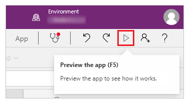
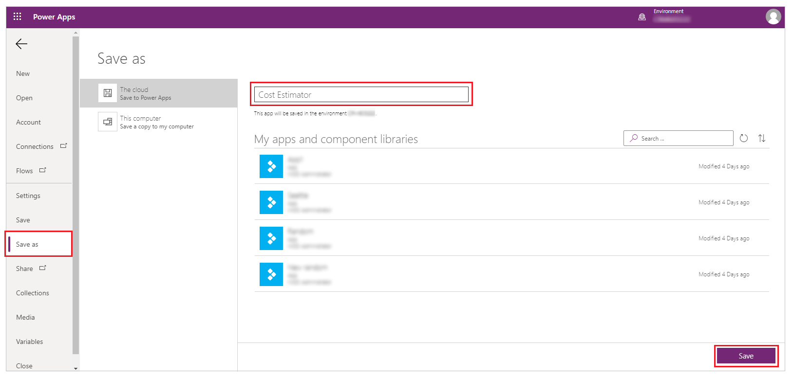

# Create a canvas app from a sample in Power Apps

In this quickstart, you'll create a canvas app from a sample template. Once created, you can explore the app design possibilities, and discover concepts that you can apply as you develop your own canvas apps.

Each sample showcases a real-world scenario but uses fictitious data. 

If you don't have a license for Power Apps, you can [sign up for free](../signup-for-powerapps.md).

## Open a sample app

1. Sign in to [Power Apps](https://make.powerapps.com?utm_source=padocs&utm_medium=linkinadoc&utm_campaign=referralsfromdoc).

1. Select **All templates**.

1. Choose a sample app from the list of sample apps, such as **Cost Estimator**.

	

1. Update the app name and select **Create** to create the app.

    > [!NOTE]
    > Some sample apps may be available in only phone or tablet layouts. Read [create responsive layouts in canvas apps](create-responsive-layout.md) for more details regarding layouts. If the sample app you selected has phone and tablet as layout options, select a layout of your choice.

1. Select **Make my own app** to connect the app to data storage, such as OneDrive.

    

1. After you select, or connect to storage from the available choices, such as OneDrive, select **Done**.

1. Open Preview mode by pressing F5 (or by selecting the play button near the upper-right corner).

	

	Each sample represents a different scenario with different kinds of screens and other controls. If you opened the Cost Estimator sample, you can use the default app to do these tasks:

	- Create an appointment for estimating the cost of installing a flooring product in a room of a particular size.
	- Capture details such as address and square footage, and calculate the price based on discounts and tax rates.
	- Filter a list of appointments to only show the ones with estimates already created, for which estimates haven't been created, or all appointments.
	
1. When you finish exploring the app, close Preview mode by pressing Esc (or by clicking or tapping the close icon near the upper-right corner, under the title bar for Power Apps).

## Save the app

1. Near the upper-left corner, select **File** tab.

1. In the **Settings** page, review the default settings.

1. Select **Save as**.

1. Enter the name for the app. For example, *Cost Estimator*.

1. Select **Save**.

    

## Next steps

In this quickstart, you created a sample that uses fictitious data. For more help learning how to create an app, you can also automatically generate an app based on data in other sources, such as Microsoft Dataverse, SharePoint, or Excel.

> [!div class="nextstepaction"]
> [Generate an app](data-platform-create-app.md)

[!INCLUDE[footer-include](../../includes/footer-banner.md)]