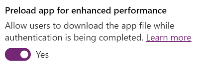

# Tips and best practices to improve performance of canvas apps

In the previous articles, you learned about the [execution phases and data call flow](execution-phases-data-flow.md), [common sources of slow performance](slow-performance-sources.md), and [common performance issues and resolutions](common-performance-issue-resolutions.md) in canvas apps. You can also benefit by following the tips and best practices in this article to boost the performance of apps that you create.

## Limit data connections

**Don't add more than 30 connections in one app**. Apps prompt new users to sign in to each connector, so every extra connector increases the amount of time that the app needs to start. As an app runs, each connector requires CPU resources, memory, and network bandwidth when the app requests data from that source.

You can quickly measure your app's performance by turning on Developer Tools in [Microsoft Edge](/microsoft-edge/devtools-guide/network) or [Google Chrome](https://developers.google.com/web/tools/chrome-devtools/network-performance/) while running the app. Your app is more likely to take longer than 15 seconds to return data if it frequently requests data from more than 30 connections. Each added connection is counted individually in this limit, irrespective of the connected data source type&mdash;such as Microsoft Dataverse or SQL Server tables, or lists created using Microsoft Lists.

## Limit the number of controls

**Don't add more than 500 controls in one app**. Power Apps generates an HTML document object model to render each control. The more controls you add, the more generation time Power Apps needs.

You can, in some cases, achieve the same result and have the app start faster if you use a gallery instead of individual controls. In
addition, you might want to reduce the number of control types on the same screen. Some controls (such as PDF viewer, data table, and
combo box) pull in large execution scripts and take longer to render.

## Optimize the OnStart property

Use the [**ClearCollect**](functions/function-clear-collect-clearcollect.md) function to cache data locally if it doesn't change during the user session. Also, use the [**Concurrent**](functions/function-concurrent.md) function to load data sources simultaneously; this can cut the amount of time an app needs to load data in half. More information: [Concurrent function in Power Apps](functions/function-concurrent.md)

Without the **Concurrent** function, the following formula loads each of four tables one at a time:

```powerapps-dot
ClearCollect( Product, '[SalesLT].[Product]' );
ClearCollect( Customer, '[SalesLT].[Customer]' );
ClearCollect( SalesOrderDetail, '[SalesLT].[SalesOrderDetail]' );
ClearCollect( SalesOrderHeader, '[SalesLT].[SalesOrderHeader]' )
```

You can confirm this behavior in the Developer Tools for your browser, as shown in the following image.


You can enclose the same formula in the **Concurrent** function to reduce the overall time that the operation needs:

```powerapps-dot
Concurrent(	
	ClearCollect( Product, '[SalesLT].[Product]' ),
	ClearCollect( Customer, '[SalesLT].[Customer]' ),
	ClearCollect( SalesOrderDetail, '[SalesLT].[SalesOrderDetail]' ),
	ClearCollect( SalesOrderHeader, '[SalesLT].[SalesOrderHeader]' ))
```

With this change, the app fetches the tables in parallel, as shown in the following image.

	

> [!NOTE]
> For more information about the performance problems and resolutions related to OnStart, read [OnStart event needs tuning](common-performance-issue-resolutions.md#onstart-event-needs-tuning).

> [!TIP]
> We recommend using [App.StartScreen](functions/object-app.md#startscreen-property) property since it simplifies app launch and boosts the app's performance.

## Cache lookup data

Use the **Set** function to cache data from lookup tables locally to avoid repeatedly retrieving data from the source. This technique optimizes performance if the data probably won't change during a session. As shown in the following example, the data is retrieved from the source once, and then referenced locally until the user closes the app.

```powerapps-dot
Set(CustomerOrder, Lookup(Order, id = “123-45-6789”));
Set(CustomerName, CustomerOrder.Name);
Set(CustomerAddress, CustomerOrder.Address);
Set(CustomerEmail, CustomerOrder.Email);
Set(CustomerPhone, CustomerOrder.Phone);
```

This method is more useful for data such as contact information, default values, or user information that doesn't change frequently. You can also use this technique with the **Defaults** and **User** functions.

## Avoid control dependency between screens

To improve performance, the screens of an app are loaded into memory only as they're needed. This optimization can be hampered if, for example, screen 1 is loaded and one of its formulas uses the property of a control from screen 2. Now screen 2 must be loaded to fulfill the dependency before screen 1 can be displayed. Imagine screen 2 has a dependency on screen 3, which has another dependency on screen 4, and so on. This dependency chain can cause many screens to be loaded.

For this reason, avoid formula dependencies between screens. In some cases, you can use a global variable or collection to share information between screens.

There's an exception: In the previous example, imagine that the only way to display screen 1 is by navigating from screen 2. Then screen 2 will have already been loaded in memory when screen 1 is to be loaded. No extra work is needed to fulfill the dependency for screen 2, and therefore there's no performance impact.

## Use delegation

Where possible, use functions that delegate data processing to the data source instead of retrieving data to the local device for processing. If an app must process data locally, the operation requires much more processing power, memory, and network bandwidth, especially if the dataset is large.

> [!TIP]
> To learn about delegable functions supported by specific connectors, go to the [connector documentation](/connectors/).

For an example of delegable functions, consider an ID column defined as the **Number** data type in a list created using Microsoft Lists. Formulas in the following example will return the results as expected. However, the first formula is delegable while the second is non-delegable.

| Formula                                           | Delegable? |
|---------------------------------------------------|------------|
| ``Filter ('List data source', ID = 123 )`` | Yes        |
| ``Filter(`List data source', ID ="123")``  | No         |

Because we assume that the ID column in SharePoint is defined with the data type of **Number**, the right-side value should be a numeric variable instead of a string variable. Otherwise, this mismatch might trigger the formula to be non-delegable.

The use of [non-delegable functions and inappropriate data row limits for non-delegable queries](common-performance-issue-resolutions.md#use-of-non-delegable-functions-and-inappropriate-data-row-limits-for-non-delegable-queries) can have an adverse effect on the performance of the app. More information: [Understand delegation in a canvas app](delegation-overview.md#non-delegable-limits)

## Use Delayed Load

Turn on the [preview feature](./working-with-experimental-preview.md) for delayed load if your app has more than 10 screens, no rules, and many controls that are on multiple screens and are directly bound to the data source. If you build this type of app and don't enable this feature, app performance can suffer because the controls in all screens must be populated even on screens that aren't open. Also, all screens of the app must be updated whenever the data source changes, such as when the user adds a record.

## Working with large datasets

Use data sources and formulas that can be delegated to keep your apps performing well while users can access all the information they need, and avoid hitting the data row limit of 2,000 for non-delegable queries. For data-record columns on which users can search, filter, or sort data, use indexes on columns as described by the data sources such as [SQL Server](/sql/relational-databases/sql-server-index-design-guide) or [SharePoint](https://support.office.com/article/Add-an-index-to-a-SharePoint-column-f3f00554-b7dc-44d1-a2ed-d477eac463b0).

> [!NOTE]
> For additional information about how large datasets can cause common performance problems on different platforms, read [Large datasets loading slowly on different platforms](common-performance-issue-resolutions.md#large-datasets-loading-slowly-on-different-platforms).

## Republish apps regularly

Makers are encouraged to publish their apps regularly. Because the Power Apps platform is continuously optimized and deployed, your app is regenerated within the latest platform optimizations when you republish it.

## Avoid repeating the same formula in multiple places

If multiple properties run the same formula (especially if it's complex), consider setting it once and then referencing the output of the first property in subsequent ones. For example, don't set the **DisplayMode** property of controls A, B, C, D, and E to the same complex formula. Instead, set A's **DisplayMode** property to the complex formula, set B's **DisplayMode** property to the result of A's **DisplayMode** property, and so on for C, D, and E.

## Enable DelayOutput on all Text input controls

If you have multiple formulas or rules that reference the value of a **Text input** control, set the **DelayedOutput** property of that control to true. The **Text** property of that control will be updated only after keystrokes entered in quick succession have stopped. The formulas or rules won't run as many times, and app performance will improve.

## Avoid using Form.Updates in rules and formulas

If you reference a user-input value in a rule or a formula by using a `Form.Updates` variable, it iterates over all the form's data cards and creates a record each time. To make your app more efficient, reference the value directly from the data card or the control value.

## Use DelayItemLoading and Loading spinner to improve performance in Gallery

Depending on the configuration, Gallery can take longer to render the visible rows. There are a couple of ways to improve performance.

- Simplify the template. For example, consider reducing the number of controls, references to lookups.
- Galleries with complex templates can benefit from having **DelayItemLoading** set to **true**, and **LoadingSpinner** set to **LoadingSpinner.Controls**. This change will improve the perceived experience when render time is longer. **DelayItemLoading** will also defer the rendering of templates which will allow the rest of the screen to render faster as both screen and gallery are not competing for resources.

## Enable Preload app for enhanced performance

You can optionally preload your app to increase performance.

1. Sign in to [Power Apps](https://make.powerapps.com), and then select **Apps** in the menu.

2. Select **More actions** (...) for the app you want to share, and then select **Settings**.

3. In the Settings panel, toggle **Preload app for enhanced performance** to **Yes**. App will then pre-load.


    
4. For the changes to take effect for apps embedded in Teams, remove and add your app into Teams again.

    > [!NOTE]
    > This makes the compiled app assets accessible via unauthenticated endpoints to enable loading them before authentication. However, users can still only use your app to access data via connectors only after authentication and authorization completes. This behavior ensures that the data an app retrieves from data sources won’t be available to unauthorized users. Compiled app assets include a collection of JavaScript files containing text authored in app controls (such as PCF controls), media assets (such as images), the app name, and the environment URL the app resides in.
    > 
    > In general, apps should retrieve media and information from data sources, through connections. If media and information must be added to the app, without coming from a connection, and it is considered sensitive you may want to disable this setting. Note, disabling this setting will result in users waiting a bit longer to access an app.

## App data stored on your device

To allow users to retrieve app details faster when the app starts, certain data is locally stored on your device in the browser cache. Information that's stored includes app, environment, and connection details. This data will stay stored in the browser based on each browsers’ storage limits.. To clear stored data, see [instructions for each browser](/troubleshoot/power-platform/power-apps/troubleshooting-startup-issues).


## Next steps

Review the [coding standards](https://aka.ms/powerappscanvasguidelines) for maximizing app performance and keeping apps easier to maintain.

### See also

[Understand canvas app execution phases and data call flow](execution-phases-data-flow.md) <br>
[Common canvas app performance issues and resolutions](common-performance-issue-resolutions.md) <br>
[Common sources of slow performance for a canvas app](slow-performance-sources.md) <br>
[Common issues and resolutions for Power Apps](/troubleshoot/power-platform/power-apps/common-issues-and-resolutions) <br>
[Troubleshooting startup issues for Power Apps](/troubleshoot/power-platform/power-apps/troubleshoot-power-query-issues)


[!INCLUDE[footer-include](../../includes/footer-banner.md)]
