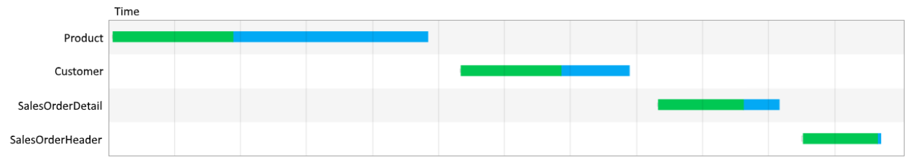
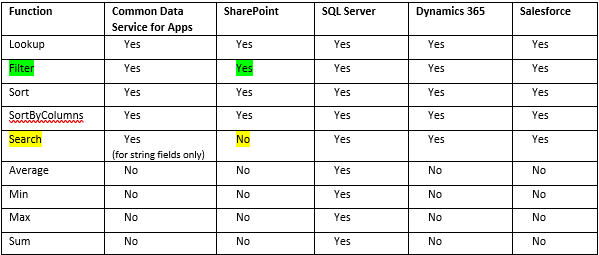

# Optimize canvas-app performance in PowerApps
Microsoft is working hard to improve the performance of all apps that run on the PowerApps platform. 
But you can follow the best practices in this topic to boost the performance of apps that you create.

When a user opens an app, it goes through these phases of execution before showing any user interface: 
1. **Authenticates the user** - Prompts the user, if that person has never opened the app before, to sign in with credentials for whatever connections the app needs. If the same user opens the app again, that person might be prompted again, depending on the organization’s security policies. 
2. **Gets metadata** - Retrieves metadata such as the version of the PowerApps platform on which the app runs and the sources from which it must retrieve data. 
3. **Initializes the app** - Performs any tasks specified in the **OnStart** property. 
4. **Renders screens** - Renders the first screen with controls that the app has populated with data. If the user opens other screens, the app renders them by using the same process.  

## Limit data connections 
**Don’t connect to more than 30 data sources from the same app**. Apps prompt new users to sign in to each connector, so every 
additional connector increases the amount of time that the app needs to start. As an app runs, each connector requires CPU resources,
memory, and network bandwidth when the app requests data from that source. 

You can quickly measure your app’s performance by turning on Developer Tools in [Microsoft Edge](https://docs.microsoft.com/microsoft-edge/devtools-guide/network) or [Google Chrome](https://developers.google.com/web/tools/chrome-devtools/network-performance/) while running the app. Your app is more likely to take longer than 15 seconds to return data if it frequently requests
data from more than 30 data sources, such as Common Data Service for Apps, Azure SQL, SharePoint, and Excel on OneDrive.  

## Limit the number of controls 
**Don’t add more than 500 controls to the same app**. PowerApps generates an HTML DOM to render each control. The more controls you add,
the more generation time PowerApps needs. 

You can, in some cases, achieve the same result and have the app start faster if you use a gallery instead of individual controls. In
addition, you might want to reduce the number of control types on the same screen. Some controls (such as PDF viewer, data table, and
combo box) pull in large execution scripts and take longer to render. 

## Optimize the OnStart function
Use the [**ClearCollect**](functions/function-clear-collect-clearcollect.md) function to cache data locally if it doesn’t change during the user session. Also, use the [**Concurrent**](functions/function-concurrent.md) function to load data sources simultaneously.

As [this reference topic](functions/function-concurrent.md) demonstrates, you can
use **Concurrent** to cut the amount of time an app needs to load data in half.

Without the **Concurrent** function, this formula loads each of four tables one at a time:

	ClearCollect( Product, '[SalesLT].[Product]' );
	ClearCollect( Customer, '[SalesLT].[Customer]' );
	ClearCollect( SalesOrderDetail, '[SalesLT].[SalesOrderDetail]' );
	ClearCollect( SalesOrderHeader, '[SalesLT].[SalesOrderHeader]' )

You can confirm this behavior in the Developer Tools for your browser:

	
You can enclose the same formula in the **Concurrent** function to reduce the overall time that the operation needs:

	Concurrent(	
		ClearCollect( Product, '[SalesLT].[Product]' ),
		ClearCollect( Customer, '[SalesLT].[Customer]' ),
		ClearCollect( SalesOrderDetail, '[SalesLT].[SalesOrderDetail]' ),
		ClearCollect( SalesOrderHeader, '[SalesLT].[SalesOrderHeader]' ))
		
With this change, the app fetches the tables in parallel: 

	

## Cache lookup data
Use the **Set** function to cache data from lookup tables locally to avoid repeatedly retrieving data from the source. This technique
optimizes performance if the data probably won’t change during a session. As in this example, the data is retrieved from the source once
and then referenced locally after that until the user closes the app. 

	Set(CustomerOrder, Lookup(Order, id = “123-45-6789”));
	Set(CustomerName, CustomerOrder.Name);
	Set(CustomerAddress, CustomerOrder.Address);
	Set(CustomerEmail, CustomerOrder.Email);
	Set(CustomerPhone, CustomerOrder.Phone);

Contact information doesn’t change frequently, and neither do default values and user information. So you can generally use this 
technique with the **Defaults** and **User** functions also. 

## Avoid controls dependency between screens
If a control’s value depends on the value of a control on a different screen, manage the data by using a variable, a collection, or a data-source reference.

## Use global variables
To pass the app’s state from one screen to another, create or modify a global variable value by using the [**Set**](functions/function-set.md) function instead of by using the **Navigate** and **UpdateContext)** functions.

## Use delegation
Where possible, use functions that delegate data processing to the data source instead of retrieving data to the local device for processing. If an app must process data locally, the operation requires much more processing power, memory, and network bandwidth, especially if the data set is large.

As [this list](delegation-list.md) shows, different data sources support delegation from different functions:

For example, SharePoint lists support delegation from the [**Filter**](functions/function-filter-lookup.md) function but not the [**Search**](functions/function-filter-lookup.md) function. So you should use **Filter** instead of **Search** to find items in a gallery if the SharePoint list contains more than 500 items. For more tips, see [Working with large SharePoint lists in PowerApps](https://powerapps.microsoft.com/blog/powerapps-now-supports-working-with-more-than-256-items-in-sharepoint-lists/) (blog post). 

## Use Delayed Load
Turn on the [experimental feature](working-with-experimental.md) for Delayed Load if your app has more than 10 screens, no rules, and many controls that are on multiple screens and that are directly bound to the data source. If you build this type of app and don’t enable this feature, app performance may suffer because the controls in all screens must be populated even on screens that aren’t open. Also, all screens of the app must be updated whenever the data source changes, such as when the user adds a record.

## Working with large data sets
Use data sources and formulas that can be delegated to keep your apps performing well while users can access all the information they need, and avoid hitting the data row limit of 2000 for non-delegable queries. For data-record columns on which users can search, filter, or sort data, those indexes of columns are designed well as these docs describe for [SQL Server](https://docs.microsoft.com/sql/relational-databases/sql-server-index-design-guide?view=sql-server-2017) and [SharePoint](https://support.office.com/article/Add-an-index-to-a-SharePoint-column-f3f00554-b7dc-44d1-a2ed-d477eac463b0).  

## Republish apps regularly
[Republish your apps](https://powerapps.microsoft.com/blog/republish-your-apps-to-get-performance-improvements-and-additional-features/) (blog post) to get performance improvements and additional features from the PowerApps platform.

## Avoid repeating the same formula in multiple places
If multiple properties run the same formula (especially if it's complex), consider setting it once and then referencing the output of the first property in subsequent ones. For example, don't set the **DisplayMode** property of controls A, B, C, D and E to the same complex formula. Instead, set A's **DisplayMode** property to the complex formula, set B's **DisplayMode** property to the result of A's **DisplayMode** property, and so on for C, D, and E.

## Enable DelayOutput on all Text input controls
If you have multiple formulas or rules that reference the value of a **Text input** control, set the **DelayedOutput** property of that control to true. The **Text** property of that control will be updated only after keystrokes entered in quick succession have ceased. The formulas or rules won't run as many times, and app performance will improve.

## Avoid using Form.Updates in rules and formulas
If you reference a user-input value in a rule or a formula by using a **Form.Updates** variable, it iterates over all the form’s data cards and creates a record each time. To make your app more efficient, reference the value directly from the data card or the control value.

## Next steps
Review the [coding standards](https://aka.ms/powerappscanvasguidelines) for maximizing app performance and keeping apps easier to maintain.
