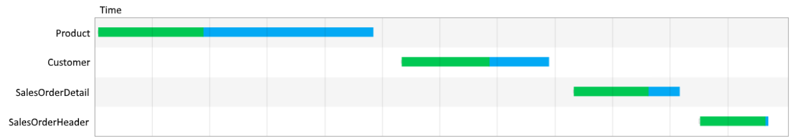

# Optimize canvas-app performance in PowerApps
Microsoft is working hard to improve the performance of all apps that run on the PowerApps platform. 
But you can follow the best practices in this topic to boost the performance of apps that you create.

When you open an app, it goes through these phases of execution before showing any user interface: 
1. **Authenticate the user** - Prompts you, if you’ve never opened the app before, to sign in with credentials for whatever connections
the app needs. If you opened the app again, you might be prompted again, depending on your organization’s security policies. 
2. **Get metadata** - Retrieves metadata such as on which version of the PowerApps platform the app runs and from which sources it must 
retrieve data. 
3. **Initialize the app** - Performs any tasks specified in the OnStart property. 
4. **Render screens** - Renders the first screen of the app with controls that it has populated with data. If you open other screens, 
the app renders them by using the same process.  

## Limit data connections 
**Don’t connect to more than 30 data sources from the same app**. Apps prompt new users to sign in to each connector, so every 
additional connector increases the amount of time that the app needs to start. As an app runs, each connector requires CPU resources,
memory, and network bandwidth when the app requests data from that source. 

You can quickly measure your app’s performance by turning on Developer Tools in [Microsoft Edge](https://docs.microsoft.com/microsoft-edge/devtools-guide/network) or [Google Chrome](https://developers.google.com/web/tools/chrome-devtools/network-performance/) while running the app. Your app is more likely to take longer than 15 seconds to return data if it frequently requests
data from more than 30 data sources, such as Common Data Service for Apps, Azure SQL, SharePoint, and Excel on OneDrive.  

## Limit number of controls 
**Don’t add more than 500 controls to the same app**. PowerApps generates an HTML DOM to render each control. The more controls you add,
the more generation time PowerApps needs. 

You can, in some cases, achieve the same result and have the app starts faster if you use a gallery instead of individual controls. In
addition, you might want to reduce the number of control types on the same screen.  Some controls (such as PDF viewer, data table and
combo-box) pull in large execution script and take longer to render. 

## Optimize OnStart function
Use the [**ClearCollect**](functions/function-clear-collect-clearcollect.md) function to cache data locally if it doesn’t change during the user session. Also, use the [**Concurrent**](functions/function-concurrent.md) function to load data sources simultaneously.

As [this reference topic](functions/function-concurrent.md) demonstrates, you can
use **Concurrent** to cut the amount of time an app needs to load data in half.

Without the Concurrent function, this formula loads each of four tables one at a time:

	ClearCollect( Product, '[SalesLT].[Product]' );
	ClearCollect( Customer, '[SalesLT].[Customer]' );
	ClearCollect( SalesOrderDetail, '[SalesLT].[SalesOrderDetail]' );
	ClearCollect( SalesOrderHeader, '[SalesLT].[SalesOrderHeader]' )

You can confirm this behavior in the Developer Tools for your browser:

	
You can enclose the same formula in the Concurrent function to reduce the overall time the operation needs:

	Concurrent(	
		ClearCollect( Product, '[SalesLT].[Product]' );
		ClearCollect( Customer, '[SalesLT].[Customer]' );
		ClearCollect( SalesOrderDetail, '[SalesLT].[SalesOrderDetail]' );
		ClearCollect( SalesOrderHeader, '[SalesLT].[SalesOrderHeader]' ))
		
With this change, the tables are fetched in parallel: 

	

## Cache lookup data
Use the **Set** function to cache data from lookup tables locally to avoid repeatedly retrieving data from the source. This technique
optimizes performance if the data probably won’t change during a session. As in this example, the data is retrieved from the source once
and then referenced locally after that until the user closes the app. 

	Set(CustomerOrder, Lookup(Order, id = “123-45-6789”));
	Set(CustomerName, CustomerOrder.Name);
	Set(CustomerAddress, CustomerOrder.Address);
	Set(CustomerEmail, CustomerOrder.Email);
	Set(CustomerPhone, CustomerOrder.Phone);

Contact information doesn’t change frequently, and neither do default values and user information. So you can generally use this 
technique with the **Defaults** and **User** functions also. 

## Avoid controls dependency between screens
If a control’s value depends on the value of a control on a different screen, use a variable, a collection, or a data-source reference to manage the data.

## Use global variables
To pass the app’s state from one screen to another, create or modify a global variable value by using the [**Set**](functions/function-set.md) function instead of by using the Navigate and UpdateContext functions.

## Use delegation
Where possible, use functions that delegate data processing to the data source instead of retrieving data to the local device for processing. If an app must process data locally, the operation requires much more processing power, memory, and network bandwidth, especially if the data set is large.

As [this list](delegation-list.md) shows, different data sources support delegation from different functions:

For example, SharePoint lists support delegation from the [**Filter**](functions/function-filter-lookup.md) function but not the [**Search**](functions/function-filter-lookup.md) function. So you should use Filter instead of Search to find items in a gallery if the SharePoint list contains more than 500 items. For more tips, see [Working with large SharePoint lists in PowerApps](https://powerapps.microsoft.com/blog/powerapps-now-supports-working-with-more-than-256-items-in-sharepoint-lists/) (blog post). 

## Use Delayed Load
Turn on the [experimental feature](working-with-experimental.md) for Delayed Load if your app has more than 10 screens, no rules, and many controls that are on multiple screens and that are directly bound to the data source.  If you build this type of app and don’t enable this feature, app performance may suffer because the controls in all screens must be populated even on screens that aren’t open. Also, all screens of the app must be updated whenever the data source changes, such as when the user adds a record.

## Working with large data sets
Use data sources and formulas that can be delegated to keep your apps performing well while users can access all the information they need, avoid hitting the data row limit of 2000 for non-delegable queries. 
For data record columns which users can search, filter or sort data,  that indexes of columns are designed well as these docs describe for [SQL Server](https://docs.microsoft.com/sql/relational-databases/sql-server-index-design-guide?view=sql-server-2017) and [SharePoint](https://support.office.com/article/Add-an-index-to-a-SharePoint-column-f3f00554-b7dc-44d1-a2ed-d477eac463b0).  

## Republish apps regularly
[Republish your apps](https://powerapps.microsoft.com/blog/republish-your-apps-to-get-performance-improvements-and-additional-features/) to get performance improvements and additional features from the PowerApps platform.
