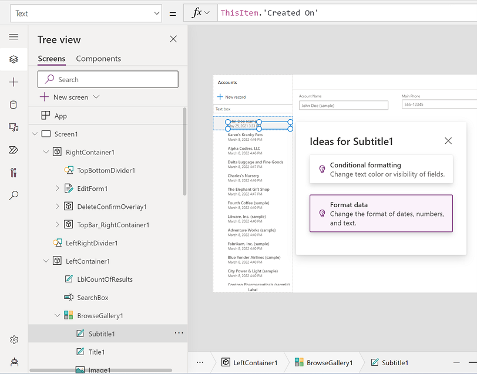
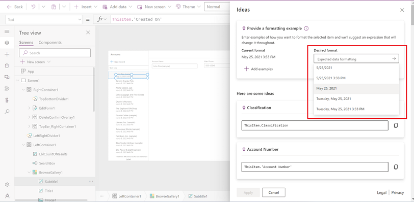

# Transform examples to Power Fx formulas 

Most of us have struggled at times with manipulation of text when building apps. For help, we search online for tips and examples, or tools to test RegEx patterns. **Train with examples** uses [PROSE](https://www.microsoft.com/research/group/prose/) (Programming by Examples and Natural Language) so you can now just provide one or more desired outputs, and then Power Apps can automatically generate the formula for you.

Let's use a simple app to show how to use this feature. You can follow [Create an app from scratch](data-platform-create-app-scratch.md) to create a sample app. In the following example, we're using the **Accounts** table in Dataverse with sample data that you can choose to install while creating the environment. You can also use your own table if you don't have sample data.

## Work with dates in a gallery

To work with and manipulate dates in a gallery using Power Apps Ideas:

1. Select your target label. For this example, we'll use **Created On**. Select the date field and then select **Format data**.

    

1. Enter your output in the **Desired format** text box. Or use one of the listed examples, in this case **May 25, 2021**, and then press Enter. 
 
   Select the generated formula.  

    ```power-fx
    Text(DateTimeValue(ThisItem.'Created On'), "mmmm d", "en-US")
    ```
    
    
    
    The formula is updated in the formula bar. You can now check the rest of the items in your gallery to see if the formula did the manipulation that you wanted.

## Work with text display in a gallery

To work with text display in a gallery using Power Apps Ideas:

1. Select your target label, such as **Account Name**, and then select **Format data**.

1. Enter your output in the **Desired format** text box or use one of the listed examples. For example, change the Account Name from "Fourth Coffee (sample)" to "Fourth C", press Enter, and then select the generated formula.

    ```power-fx
    Left(ThisItem.'Account Name', Find(" ", ThisItem.'Account Name') + 1) 
    ```

    The formula is updated in the formula bar, and you can check the rest of the items in your gallery to see if the formula did the manipulation that you wanted.

## Use Train with examples in your app

In the above scenario, if you wanted to include the first word of the account name along with the last word's initial, the above formula would not work for all scenarios. That's because the above formula takes only the second word's initial in the name. And some account names have three or more words.

For example, "Alpine Ski House" becomes "Alpine S", whereas to have last word's initial, it should be "Alpine H".

To achieve this scenario, use **Add examples** by providing such examples using the **Ideas** pane:

1. Select **Add examples** and then select one of the values from your table. Type in the desired format. 
   
   You can add up to 20 examples but typically you only need two or three examples for Ideas to start working.

1. Press Enter or select the arrow button (**>**) to see new ideas.

1. Select and apply to see if it meets your needs.

    ```power-fx
    First(Split(ThisItem.'Account Name', " ")).Result & Mid(Left(ThisItem.'Account Name', First(LastN(MatchAll(ThisItem.'Account Name', "\ "), 2)).StartMatch + 1), First(LastN(MatchAll(ThisItem.'Account Name', "\ "), 2)).StartMatch) 
    ```

    Now you've used the **Transform examples to Power Fx formulas** capability and generated a formula using Power Apps Ideas for the specific requirement that couldn't be achieved using the natural language alone.

## Supported and unsupported capabilities

The following capabilities are supported:

- Converting a single date field in a table to a different format
- Converting a single text field in a table to a different format
- Converting a single number field in a table to a different format
- Works only for label text in a gallery
- All available languages and data connectors as supported by Power Apps regions

The following capabilities aren't supported:

- Math functions on number fields
- Manipulating text from multiple columns
- Formatting Lookup fields
- Scenarios that include:
    - Branching
    - If/else patterns ([function If()](functions/function-if.md))

### See also

- [Formula reference](formula-reference.md)
- [Power Apps Ideas overview](power-apps-ideas.md)
- [Transform natural language to Power Fx formulas](power-apps-ideas-transform.md)
