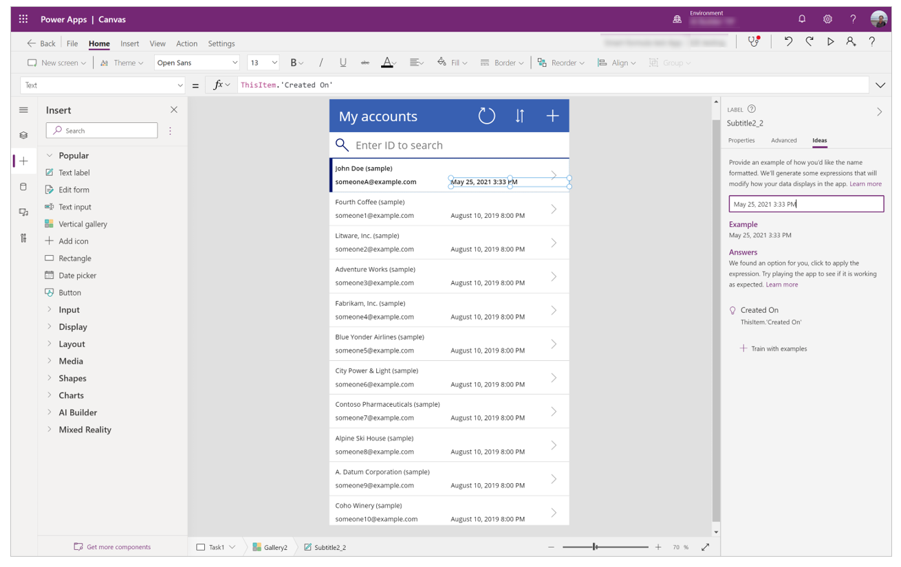
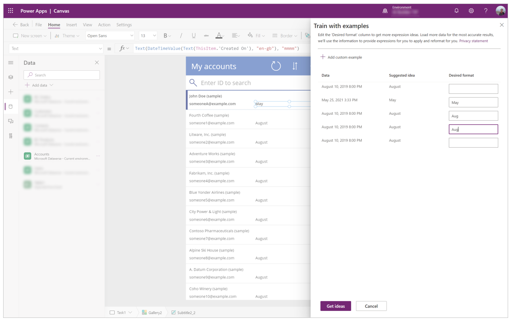

# Tutorial: Train with examples (Preview)

[This article is pre-release documentation and is subject to change.]

> [!IMPORTANT]
> - This is a preview feature.
> - Preview features aren’t meant for production use and may have restricted functionality. These features are available before an official release so that customers can get early access and provide feedback.

We all had the time when we struggled with manipulation of text when we’re building apps. Searching online for tips and examples, or tools to test RegEx patterns. **Train with examples** uses PROSE (Program Synthesis using Example) so you can now just give us one or a more desired outputs, and then Power Apps can automatically generate the formula for you.

Let's use a simple app to show you how to use this feature. You can follow [Create an app from scratch](data-platform-create-app-scratch.md) to create a sample app. In the following example, we're using the **Accounts** table in Dataverse with sample data that gets installed when you choose to install sample data while creating the environment. You can also use your own table if you don't have sample data.

## Step 1. Work with dates in a gallery

To work with and manipulate dates in a gallery using Power Apps Ideas:

1. Select your target label. For this tutorial, we'll use **Created On**. Select the Ideas pane on the right-side of the screen, and you'll see a screen like the following:

    

1. Enter your desired output in the text box. For example, change "March 22, 2020 3:19 PM" to "March", so it will only show the month, and then press Enter. <br> You will find a formula generated for you, click on it  

    ```powerapps-dot
    TrimEnds(Left(Text(ThisItem.'Created On'), Match(Text(ThisItem.'Created On'), "\p{Zs}*\ \p{Zs}*").StartMatch + Len(Match(Text(ThisItem.'Created On'), "\p{Zs}*\ \p{Zs}*").FullMatch) - 1)) 
    ```

    The formula is updated in the formula bar, and you can check the rest of the items in your gallery to see if the formula did the manipulation that you wanted.

## Step 2. Work with text display in a gallery

1. Select your target label, such as **email**, and then select the Ideas pane.

1. Enter your desired output in the text box. For example, change email address from "someone@example.com" to "someone@", and press Enter. <br> You will find a formula generated for you, click on it 

    ```powerapps-dot
    TrimEnds(Left(ThisItem.Email, Match(ThisItem.Email, "\p{Zs}*@\p{Zs}*").StartMatch + Len(Match(ThisItem.Email, "\p{Zs}*@\p{Zs}*").FullMatch) - 1)) 
    ```

    The formula is updated in the formula bar, and you can check the rest of the items in your gallery to see if the formula did the manipulation that you wanted.

## Step 3. Train with examples

In the this date scenario, if you try to change the date display to only the first 3 letters of the month, and you provided one example, it may not be able to give you a result.

1. Select **Train with examples** under the **Answers** pane, and give more examples in the side pane.

    > [!NOTE]
    > You don’t need to fill in all the boxes. Enter a few different examples for Power Apps Ideas to learn. 

    

1. (Optional) If you have an example that’s not listed, you can also select **Add custom example** on the top.

1. After you have finished adding examples, select **Get ideas**. This time Ideas pane is able to give you a suggestion of formula.

1. Select and apply to see if it meets your needs.

    ```powerapps-dot
    Mid(Left(Text(ThisItem.'Created On'), 3), Match(Text(ThisItem.'Created On'), "[\p{Lu}\p{Ll}]+").StartMatch) 
    ```

### See also

- [Formula reference](formula-reference.md)
- [Power Apps Ideas overview (Preview)](power-apps-ideas.md)
- [Tutorial: Transforming natural language to Power Fx formulas (Preview)](power-apps-ideas-transform.md)
