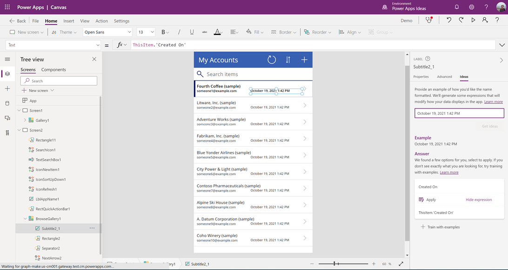
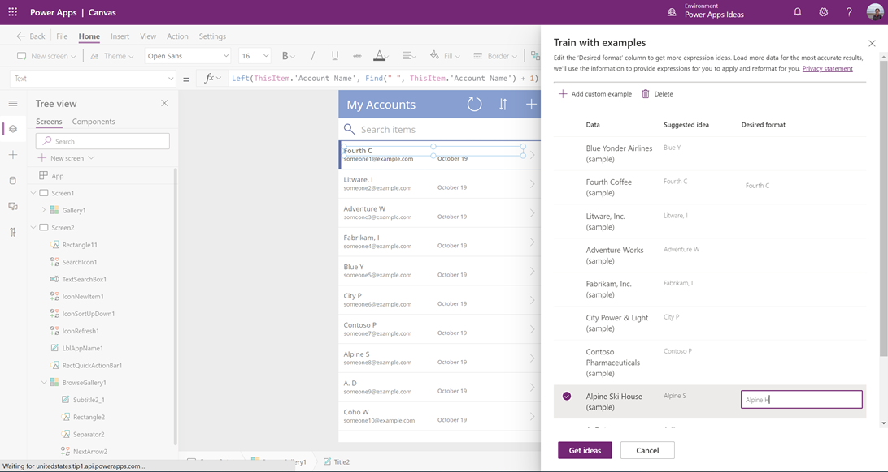

# Transform examples to Power Fx formulas (preview)

[This article is pre-release documentation and is subject to change.]

We all had the time when we struggled with manipulation of text when we’re building apps. Searching online for tips and examples, or tools to test RegEx patterns. **Train with examples** uses [PROSE](https://www.microsoft.com/research/group/prose/) (Programming by Examples and Natural Language) so you can now just give us one or more desired output, and then Power Apps can automatically generate the formula for you.

Let's use a simple app to show you how to use this feature. You can follow [Create an app from scratch](data-platform-create-app-scratch.md) to create a sample app. In the following example, we're using the **Accounts** table in Dataverse with sample data that gets installed when you choose to install sample data while creating the environment. You can also use your own table if you don't have sample data.

## Work with dates in a gallery

To work with and manipulate dates in a gallery using Power Apps Ideas:

1. Select your target label. For this example, we'll use **Created On**. Select the Ideas pane on the right-side of the screen, and you'll see a screen like the following:

    

1. Enter your desired output in the text box. For example, change "October 19, 2021 1:42 PM" to "October 19", and then press Enter. <br> Select the generated formula.  

    ```powerapps-dot
    Text(DateTimeValue(ThisItem.'Created On'), "mmmm d", "en-US")
    ```

    The formula is updated in the formula bar. You can now check the rest of the items in your gallery to see if the formula did the manipulation that you wanted.

## Work with text display in a gallery

To work with text display in a gallery using Power Apps Ideas:

1. Select your target label, such as **Account Name**, and then select the Ideas pane.

1. Enter your desired output in the text box. For example, change the Account Name from "Fourth Coffee (sample)" to "Fourth C", and press Enter. <br> Select the generated formula.

    ```powerapps-dot
    Left(ThisItem.'Account Name', Find(" ", ThisItem.'Account Name') + 1) 
    ```

    The formula is updated in the formula bar, and you can check the rest of the items in your gallery to see if the formula did the manipulation that you wanted.

## Use Train with examples in your app

In above scenario, if you wanted to include the first name plus last name's initial, the above formula will not work as it takes only the second word's initial in the name. To correct that you can follow below steps.

1. Select **Train with examples** under the **Answers** pane, and give more examples in the side pane.

    > [!NOTE]
    > You don’t need to fill in all the boxes. Enter a few different examples for Power Apps Ideas to learn. 

    

1. (Optional) If you have an example that’s not listed, you can also select **Add custom example** on the top.

1. After you have finished adding examples, select **Get ideas**. This time Ideas pane is able to give you a suggestion of formula.

1. Select and apply to see if it meets your needs.

    ```powerapps-dot
    First(Split(ThisItem.'Account Name', " ")).Result & Mid(Left(ThisItem.'Account Name', First(LastN(MatchAll(ThisItem.'Account Name', "\ "), 2)).StartMatch + 1), First(LastN(MatchAll(ThisItem.'Account Name', "\ "), 2)).StartMatch) 
    ```

    You've just used **Transform examples to Power Fx formulas** capability and generated formula using Power Apps Ideas for the specific requirement that couldn't be achieved using the natural language alone.
   
## Supported and unsupported capabilities

The following capabilities are supported:

- Converting a single date field in a table to a different format
- Converting a single text field in a table to a different format
- Converting a single number field in a table to different format
- Works only for label text in a gallery
- All available languages and data connectors as supported by Power Apps regions

The following capabilities aren't supported:

- Math functions on number fields
- Manipulating text from multiple columns
- Scenarios that include:
    - Branching
    - If/else patterns ([function If()](functions/function-if.md))

### See also

- [Formula reference](formula-reference.md)
- [Power Apps Ideas overview (preview)](power-apps-ideas.md)
- [Transform natural language to Power Fx formulas (preview)](power-apps-ideas-transform.md)
