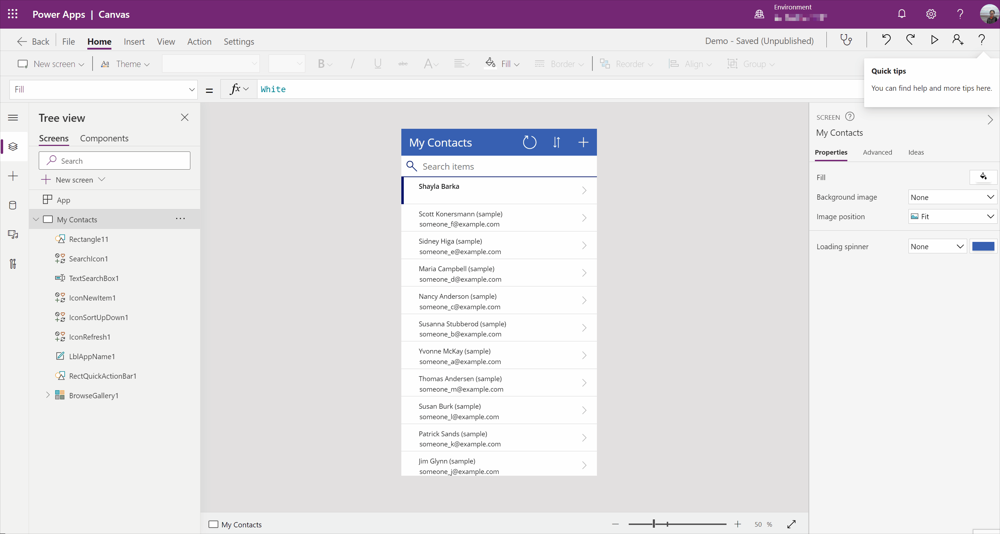

# Transform natural language to Power Fx formulas (preview)

[This article is pre-release documentation and is subject to change.]

Power Apps Ideas feature currently supports only **Gallery** and **Data table** controls for the **Items** property, and it now supports Microsoft Dataverse, Sharepoint List and Excel as connectors. So, if you've a gallery bound to one of these data sources, and are about to compose a formula for its **Items** property, you can benefit from Power Apps Ideas. 

For example, instead of figuring out how to write the following formula:
```powerapps-dot
Filter('Table1', StartsWith('fullname', "Yvonne"))
```

You can type in `'fullname' starts with Yvonne` instead.



To begin, let’s take a look at a simple app to see how we can use the Power Apps Ideas to help write formulas.

You can follow the steps mentioned in [Create a canvas app from Microsoft Dataverse](data-platform-create-app.md) to generate that app using **Accounts** table from Dataverse.

1. Select **BrowseGallery1,** which is bound to the **Accounts** table.

1. Go to the property pane on the right-side of the screen, and select the **Ideas** tab. <br> You'll see a large textbox with a few default examples.

1. Select one of the default suggestions to check how it works, or start to type in your own query in natural language such as English (en-us).

    :::image type="content" source="media/power-apps-ideas/power-apps-ideas-c7-marked.png" alt-text="Get started with Power Apps Ideas.":::

1. When typing, you can describe your requirements in your preferred way. But remember, more precise input will always yield to more accurate formula suggestions.

1. You'll see one or more formula suggestions produced. Let’s use the example `search 'Account Name' by 'TextSearchBox1'`. You'll see that the formula suggestion produced includes two parts:

    1. **Accounts** where the text in **TextSearchBox1** appears in **name**. This is trying to explain what the suggested formula is doing&mdash;so that it's easier for users who aren't familiar with Power Fx to understand the result. The names of the components used in the app are shown in bold.

    1. The formula suggestion in this scenario is `Search('Accounts', TextSearchBox1.Text, "name")`.

        :::image type="content" source="media/power-apps-ideas/Ideas_example_c7.png" alt-text="Suggested formula based on entered search scenario.":::

1. When you select any suggested idea for a formula, the formula gets updated automatically and runs so you can check the result in your app. You can then decide whether to keep the selected formula, or modify it.

## More examples

Consider the following examples to inspire from while working with Power Apps Ideas.

| Scenario | Description | Ideas example |
| --- | --- | --- |
|**Sort your table** |Sort by a single column |sort Accounts by 'Account Name'|
| | |sort Accounts by 'Account Name' A-Z|
| | |sort Accounts by 'Account Name' Z-A|
| |Sort by a few columns|sort Accounts by 'Account Name' and 'Created On'|
| | |sort Accounts by 'Account Name' A-Z and 'Created On' latest on top|
| |Sort existing tables |sort 'Gallery3' by 'Account Name' z to a|
|**Filter or search table by some conditions**|A number condition|'Accounts' with length of 'Account Name' bigger than 10|
| |A date condition|'Accounts' whose 'Created On' is last year, 'Accounts' whose 'Modified On' is within seven days of 'Created On'|
| |A text condition|'Accounts' whose 'Account Name' contains "test"|
| |A few conditions|'Accounts' whose s Name' contains "test" and 'Status' is Active|
| |Search table by user input|search 'Accounts' by 'Account Name' in 'TextInput1'|
| |Find a single record|find the first record in 'Accounts' where 'Account Name' contains "test"|
| |Find records on the top or the bottom of the table|Top 10 Accounts|
| | |Last 10 Accounts|

## Best practices

To get the best results, here are some tips that you can follow when writing the plain natural language query in the Ideas pane.

- Enter the complete context in the query. For example, if you need to filter a table by some conditions, be precise about which table to filter, which column to filter by, and what conditions need to be met.
- Use IntelliSense as much as possible. IntelliSense could help the AI model recognize context, and understand data types better.

## Limitations

> [!NOTE]
> We're improving the model to make it better and to accomplish more complex tasks, support more functions, controls, and properties. If you have a wish list, submit ideas through [Power Apps Ideas - Power Platform Community](https://powerusers.microsoft.com/t5/Power-Apps-Ideas/idb-p/PowerAppsIdeas).

Power Apps Ideas has the following limitations currently:

- Regions and language: Currently available in environments created inside United States, with English (en-us) set as the browser's default language.
- Controls: Supports generating formulas for **Gallery** and **Data table** controls&mdash;on their **Items** property. Can recognize control value of TextInput, Dropdown, DatePicker, Slider, Toggle, Checkbox, Radio as input.
- Data sources: Currently Ideas supports **Dataverse** tables, SharePoint Lists, Excel sheets.
- Functions: Works best on table manipulation functions like `Search()`, `Filter()`, `Sort()`, `SortByColumns()`, `FirstN()`, and `LastN()`. And also a list of basic functions for the conditions. See [Supported Power Fx functions](#supported-power-fx-functions). We’ll continue to add support for more functions.
- Data types: Supports Text, Whole Number, Date and Time, Date Only, Decimal Number, Choice, Choices, Yes/No. Not supported: Lookup, File and Image.
- This feature's model understands some commonly used expressions in natural  language. For example, it can translate from `latest on top`, `big to small` to a descending order and `oldest on top`, `small to big` to ascending order. And can understand most of the context so even you didn't specify the table names, it will make the best prediction based on the current table that is bound to the control.<br>  

## Supported Power Fx functions

Functions supported by Power Apps Ideas feature:

:::row:::
   :::column span="":::
      [Date](functions/function-date-time.md)
   :::column-end:::
   :::column span="":::
      [DateAdd](functions/function-date-time.md)
   :::column-end:::
   :::column span="":::
      [DateDiff](functions/function-date-time.md)
   :::column-end:::
   :::column span="":::
      [DateTimeValue](functions/function-datevalue-timevalue.md)
   :::column-end:::
   :::column span="":::
      [DateValue](functions/function-datevalue-timevalue.md)
   :::column-end:::
   :::column span="":::
      [Day](functions/function-datetime-parts.md)
   :::column-end:::
:::row-end:::
:::row:::
   :::column span="":::
      [Distinct](functions/function-distinct.md)
   :::column-end:::
   :::column span="":::
      [EndsWith](functions/function-startswith.md)
   :::column-end:::
   :::column span="":::
      [Filter](functions/function-filter-lookup.md)
   :::column-end:::
   :::column span="":::
      [FirstN](functions/function-first-last.md)
   :::column-end:::
   :::column span="":::
      [Hour](functions/function-datetime-parts.md)
   :::column-end:::
   :::column span="":::
      [IsBlank](functions/function-isblank-isempty.md)
   :::column-end:::
:::row-end:::
:::row:::
   :::column span="":::
      [IsEmpty](functions/function-isblank-isempty.md)
   :::column-end:::
   :::column span="":::
      [LastN](functions/function-first-last.md)
   :::column-end:::
   :::column span="":::
      [Minute](functions/function-datetime-parts.md)
   :::column-end:::
   :::column span="":::
      [Month](functions/function-datetime-parts.md)
   :::column-end:::
   :::column span="":::
      [Now](functions/function-now-today-istoday.md)
   :::column-end:::
   :::column span="":::
      [Search](functions/function-filter-lookup.md)
   :::column-end:::
:::row-end:::
:::row:::
   :::column span="":::
      [Second](functions/function-datetime-parts.md)
   :::column-end:::
   :::column span="":::
      [Sort](functions/function-sort.md)
   :::column-end:::
   :::column span="":::
      [SortByColumns](functions/function-sort.md)
   :::column-end:::
   :::column span="":::
      [StartsWith](functions/function-startswith.md)
   :::column-end:::
   :::column span="":::
      [Time](functions/function-date-time.md)
   :::column-end:::
   :::column span="":::
      [TimeValue](functions/function-datevalue-timevalue.md)
   :::column-end:::
:::row-end:::
:::row:::
   :::column span="":::
      [Today](functions/function-now-today-istoday.md)
   :::column-end:::
   :::column span="":::
      [Weekday](functions/function-datetime-parts.md)
   :::column-end:::
   :::column span="":::
      [Year](functions/function-datetime-parts.md)
   :::column-end:::
   :::column span="":::
   :::column-end:::
   :::column span="":::
   :::column-end:::
   :::column span="":::
   :::column-end:::
:::row-end:::

## Giving us feedback

If you have any feedback for this feature, e.g. you find the formula suggestions inaccurate or you have suggestions, ideas to share with us, you can easily find the feedback card in the Ideas panel. By clicking send feedback, you can write down your thoughts. Note, please don't include any confidential or personal information in your feedback. 

Microsoft is committed to developing and deploying AI technologies in a responsible manner. If you find any inappropriate or absurd results generated by Power Apps
Ideas, in the same feedback card, you will see a [Report it now](https://msrc.microsoft.com/report/abuse) link below the feedback box which can help us keep our AI model behaving in a responsible manner. For a timely response, ensure to select **Threat type** as "URL" and **Incident type** as "Responsible AI" as shown in the following screenshot.

:::image type="content" source="media/power-apps-ideas/ideas-feedback-channel.png" alt-text="Give us feedback.":::

## Next steps

[Transform examples to Power Fx formulas](power-apps-ideas-train-examples.md)

### See also

- [Formula reference](formula-reference.md)
- [Power Apps Ideas overview (preview)](power-apps-ideas.md)
