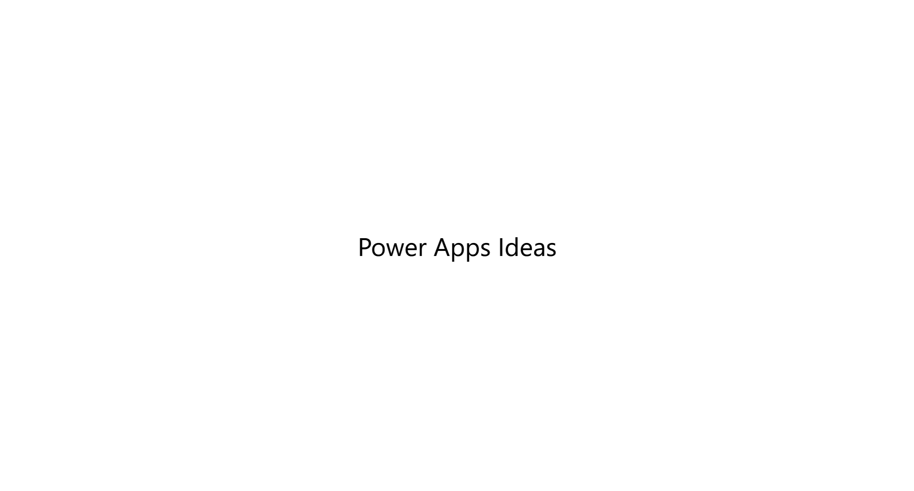
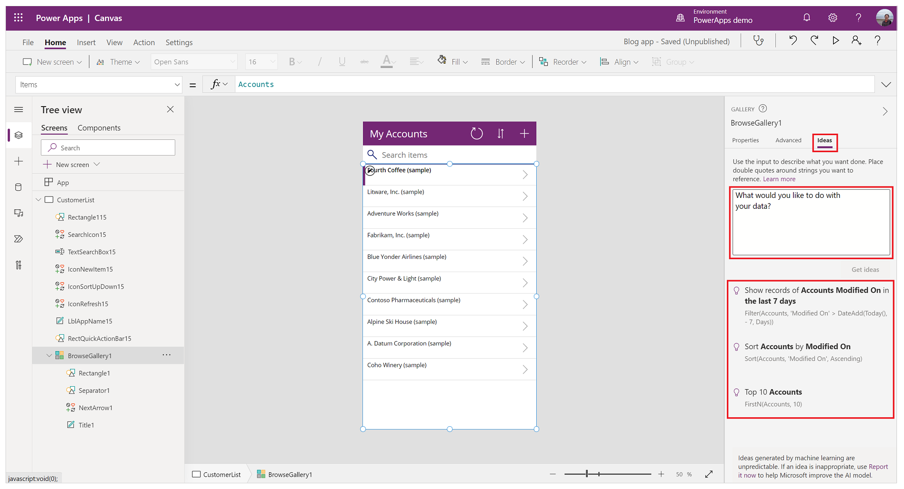
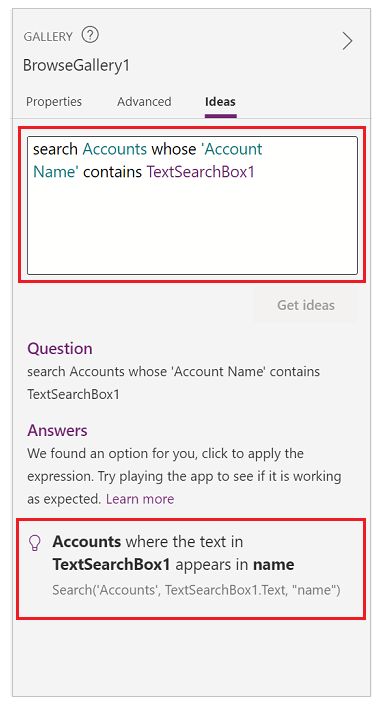
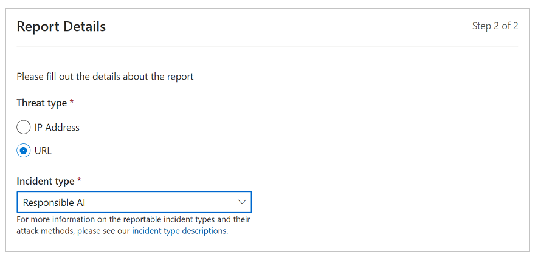

# Power Apps Ideas (Experimental)

[This article is pre-release documentation and is subject to change.]

[Power Fx](/power-platform/power-fx/overview) is a powerful, low-code language to help makers stitch app components together. However, sometimes it's not easy to write a formula. It takes time to learn and effort to tune. Power Apps Ideas are created to help customers ease the formula authoring experience by using the power of AI models. It can
now be used to transform natural language to a Power Fx formula.

> [!IMPORTANT]
> - This is an experimental feature.
> - Experimental features aren’t meant for production use and may have restricted functionality. These features are available before an official release so that customers can get early access and provide feedback.

For example, instead of figuring out how to write the following formula:

```powerapps-dot
Sort(Search('Contacts', TextSearchBox1.Text, "fullname"), 'Created On', Descending)
```

You can type in `search Contacts with 'Full Name' in TextSearchBox1 and sort results by 'Created On' latest on top`.



## Transforming natural language to Power Fx formula

Power Apps Ideas feature currently supports only **Gallery** and **Data table** controls on their **Items** property, and is trained for the **Microsoft Dataverse connector**. So if you've a gallery binding to a Dataverse table, and you’re about to write a formula for its Items property, you can check out the Power Apps Ideas.

To begin, let’s take a look at a simple app to see how we use the Power Apps Ideas to help building formulas.

You can follow steps mentioned in [Create a canvas app from Microsoft Dataverse](data-platform-create-app.md) to generate that app using Accounts table from Dataverse.

1. Select **BrowseGallery1,** which is bound to the Accounts table.

1. Go to the property pane on the right-side of the screen, and select **Ideas** tab.

1. You'll see a large textbox with a few default examples.

1. Select one of the default suggestions to check how it works, or start to type in your own query in plain English.

    

1. When typing, try to be precise about the table names, column names, and conditions you want to use. For example, `search Accounts whose 'Account Name' contains TextSearchBox1”, “show Accounts whose ‘Created On’ is earlier than 7 days ago”`. After done typing, hit Enter button or select on the blank space of that tab.

1. You'll see one or a few formula suggestions coming out. Let’s use the example above `search Accounts whose 'Account Name' contains TextSearchBox1`. You'll see there’s one formula suggestion popped out. And it includes two parts:

    1. **Accounts** where the text in **TextSearchBox1** appears in **name**. This is trying to explain what the suggested formula is doing&mdash;so that it's easier for the users who aren't familiar with Power Fx can understand the result. Bold parts are for components used in the app.

    1. `Search('Accounts', TextSearchBox1.Text, "name")` > This is the actual formula suggestion.

        

1. When you select any suggested idea for a formula, the formula gets updated automatically and runs so you can check the result in your app. You can then decide whether to keep the selected idea formula, or change.

## Best practices

To get the best results, here's some tips that you can follow when writing the plain English query in the Ideas pane.

- Enter complete context in the query. For example, if you need to filter a table by some conditions, be precise about which table to filter, which column to filter by, and what conditions it needs to meet.
- Use IntelliSense as much as possible. IntelliSense could help the AI model recognize context, understand data types better.
- Double quote the text string you want to filter or search for. This will help the model recognize the target string better and provide a more accurate formula suggestion.

## Limitations

During this experimental release, Power Apps Ideas has the following limitations:

- Regions and language: Currently available in environments created inside United States, with the browser default language as English.
- Controls: Supports only **Gallery** and **Data table** controls&mdash;on their **Items** property.
- Data sources: Currently the model is optimized for **Dataverse** tables and won't generate any suggestions if your Gallery or Data table is not bound to a Dataverse table.
- Functions: Works best on `Search()`, `Filter()`, `Sort()`, `SortByColumns()`, `FirstN()`, and `LastN()`. We’ll continue to add support of more functions.
- Data types: Supports Text, Date time, Numbers. Not supported: Lookup, Choice, Choices, Yes/No, File and Image.
- This feature's model understands some commonly used expressions in natural  language. For example, it can translate from `latest on top`, `big to small` to a descending order and `oldest on top`, `small to big` to ascending order. However, it needs you to be precise about table, column, control names. <br> For example, if you enter `search Accounts with name in textbox`, it might not give you good result because there’s no linkage build on the model to understand “name” maps to “Account Name” column and textbox maps to TextSearchBox1. <br> 
- This feature doesn’t understand business-related verbs. For example, if you want to show accounts that are created in the last month, you might not get good result, because the model doesn’t understand “created” means “Created On” column.

> [!NOTE]
> We're improving the model to make it better and to accomplish more complex tasks, support more functions, and properties. If you have a wish list, submit ideas through [Power Apps Ideas - Power Platform Community](https://powerusers.microsoft.com/t5/Power-Apps-Ideas/idb-p/PowerAppsIdeas).

## Reporting abuses

Microsoft is committed to develop and deploying AI technologies in a responsible manner. If you find any inappropriate or absurd results generated by Power Apps
Ideas, select the [Report it now](https://msrc.microsoft.com/report/abuse) link at the bottom of the ideas pane to help us improve the AI model. Make sure to select Threat type as URL and Incident Type as Responsible AI as showed by following screenshot so we can try our best to respond in time.



### See also

[Formula reference](formula-reference.md)
