# Understand Power Apps Studio

When you create a canvas app by using any method, you're taken to the canvas app
builder called Power Apps Studio. You can use Power Apps Studio to design, build, and manage your canvas app. 

## Overview of Power Apps Studio

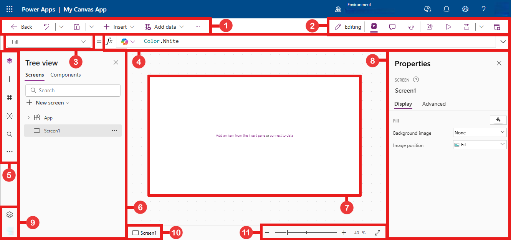

1. [Power Apps Studio modern command bar](#1--power-apps-studio-modern-command-bar) – dynamic command bar that shows different set of commands based on the control that's selected.
1. [App actions](#2--app-actions) - options to rename, share, run the app checker, add comments, preview, save, or publish the app.

1. [Properties list](#3--properties-list) - list of properties for the selected object.

1. [Formula bar](#4--formula-bar) - compose or edit a formula for the selected property with one
or more functions.

1. [App authoring menu](#5--app-authoring-menu) - selection pane to switch between data sources and
insert options.

1. [App authoring options](#6--app-authoring-options) - details pane with options relevant to the selected
menu item for authoring the app.

1. [Canvas/screen](#7--canvasscreen) - primary canvas for composing the app structure.

1. [Properties pane](#8--properties-pane) - properties list for the selected object in UI format.

1. [Screen selector](#9--screen-selector) - switch between different screens in an app.

1. [Change canvas screen size](#10--change-canvas-screen-size) - change the size of the canvas during an authoring experience in Power Apps Studio.

Let's understand each option in Power Apps Studio in detail.

## 1 – Power Apps Studio modern command bar

Power Apps Studio options are available on the command bar. The
options are relevant to the current session and app-related settings. 

> [!div class="mx-imgBorder"] 
> 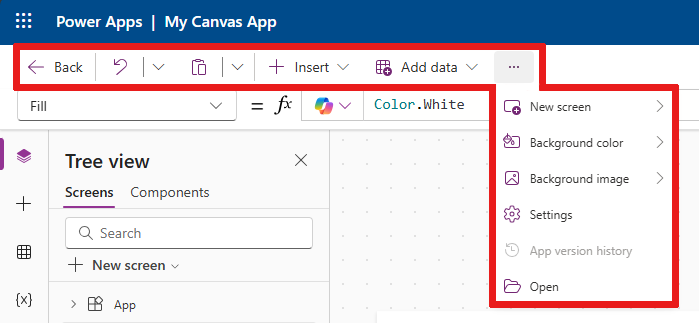

The command bar displays different set of commands depending on which control is selected.

### Back

Takes you back to the build hub, closing the current Power Apps Studio session.

### Undo and redo

> [!div class="mx-imgBorder"] 
> 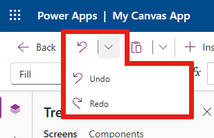

- **Undo** – undo the last action.
- **Redo** – repeat the last action.

### Cut, copy, and paste

> [!div class="mx-imgBorder"] 
> 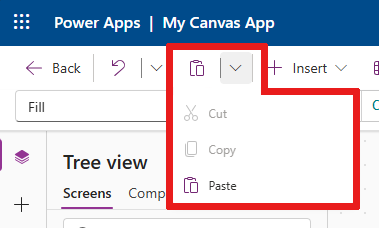

- **Cut** – Cut the selection, and store it in the clipboard.
- **Copy** – Copy the selection, and store it in the clipboard.
- **Paste** - Paste the last cut, or copied selection from the clipboard.

### Insert

> [!div class="mx-imgBorder"] 
> 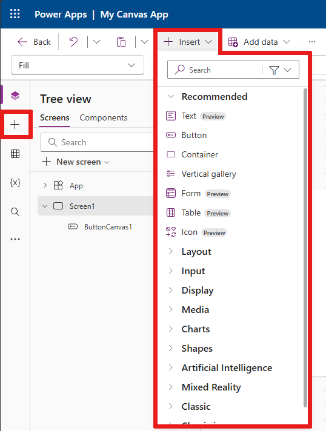

The **Insert** menu is available from the command bar and from the app authoring menu on the left.

Insert shows all the popular objects or controls that you can add on the selected screen in your canvas app. You can also expand other choices or use the components option to insert controls from a component library.

To insert controls on the canvas, you can drag the control to the canvas or select the control.

#### Popular controls
| **Name**      | **Description**                                                                                      |
|-----------------|------------------------------------------------------------------------------------------------------|
|*Text label* | A box that shows data such as text, numbers, dates, or currency. |
|*Edit form*|Display, edit, or create a record in a data source.|
|*Text input*|A box that shows text.|
|*Vertical gallery*|A control that contains other controls and shows a set of data.|
|*Rectangle*|A rectangular shape to configure the canvas appearance.|
|*Date Picker*|A control that the user can select to specify a date.|
|*Button*|A control that the user can select to interact with the app.|

For more information about the controls that you can insert, and their properties
and definitions, go to [Controls and properties in Power Apps](reference-properties.md).

### Add data

> [!div class="mx-imgBorder"] 
> 

- Create a new table by selecting **Create new table**.
- Select any other existing tables from the current environment.
- Search and select a connector, such as **SharePoint** or **SQL Server**.

### New screen layouts

> [!div class="mx-imgBorder"] 
> 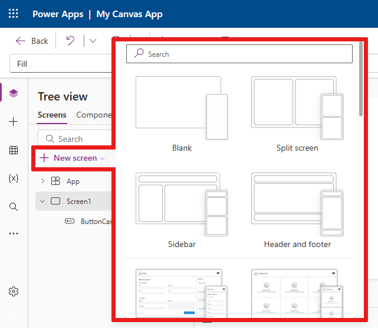

Add screens and select from the list of available screen layouts.

#### Screnarios

> [!div class="mx-imgBorder"] 
> 

Or, select the **Screnarios** and select a screen type based on the available scenarios, such as **Blank**, **Scrollable**, **List**, **Success**, **Tutorial**, **Email**, **People**, **Meeting**, **Calendar**, **Portrait print**, or **Landscape print**.

### Background color

> [!div class="mx-imgBorder"] 
> 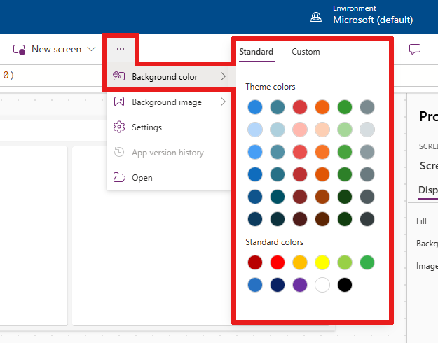

Select a background color for a screen. You can select select from the list of standard colors or select the **Custom** table and choose your own color.

### Background image

> [!div class="mx-imgBorder"] 
> 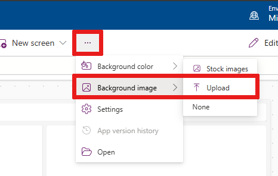

Select **Upload** to upload images to set as the background image.

### Settings

Configure the app's general settings.

> [!div class="mx-imgBorder"] 
> 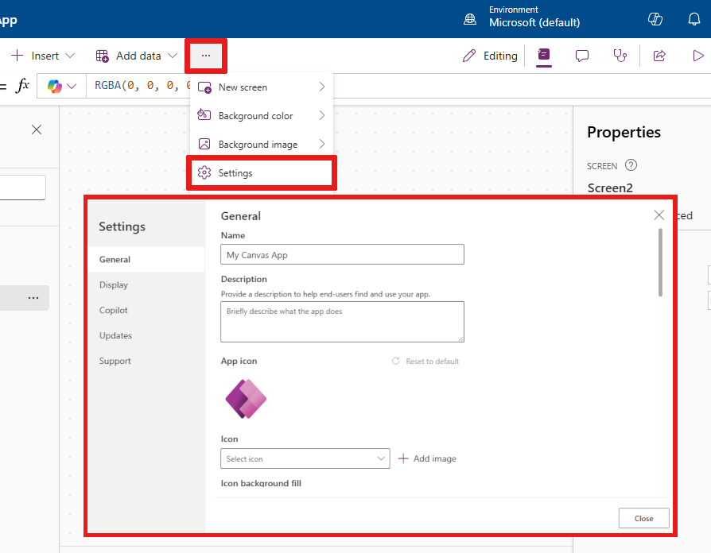

#### General

Shows app name, and allows changing the app icon. To update the icon, select a new icon or background color. To add or update description, enter text in the text box. You can also upload a custom icon for the app using the **Add image** option.

#### Display

Shows the screen size and orientation. To change, select the radio buttons for **Orientation** and **Size**.

Advanced settings allow you to further customize the app screen configuration.

- **Scale to it**: Scales the app to fit available space.
- **Lock aspect ratio**: Locks the height and width ratio.
- **Lock orientation**: Maintains app orientation when device rotates.
-  **Optimize embedding appearance**: Optimizes for embedded experiences by aligning the app to the top left.
-  **Replace formula notification**: Displays notifications to prevent replacing customized size and position properties.

To change the setting, toggle the switch.

More information: [Change screen size and orientation](set-aspect-ratio-portrait-landscape.md)

#### Upcoming features

Allows you to configure advanced settings for the app that include features under preview, experimental or retired features.

More information: [Understand experimental, preview, and deprecated features in Power Apps](working-with-experimental-preview.md)

#### Support

Shows current Power Apps Studio session details, version, and other information useful when working with Microsoft support.

### Power Automate

Create a new flow with Power Automate, or select any available flow.

More information: [Use Power Automate pane](working-with-flows.md)

### Collections

A collection is a group of items that are similar, such as products in a product list. This section lists the collections used by the current app. More information: [Collections in canvas apps](create-update-collection.md) used by the app.

> [!div class="mx-imgBorder"] 
> 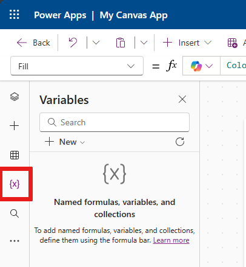

### Variables

You can save data such as the result values from a data set into temporary storage by using variables. This section lists variables used by the current app. More information: [Variables in canvas apps](working-with-variables.md) used by the app.

> [!div class="mx-imgBorder"] 
> 

## 2 – App actions

Use the options in the upper-right corner of Power Apps Studio to work with app-specific actions.

> [!div class="mx-imgBorder"] 
> 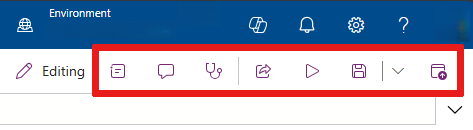

### App name editor

Select the name of the app to edit it.

> [!div class="mx-imgBorder"] 
> 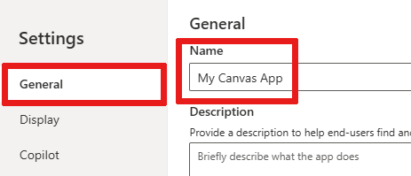

### Share

> [!div class="mx-imgBorder"] 
> 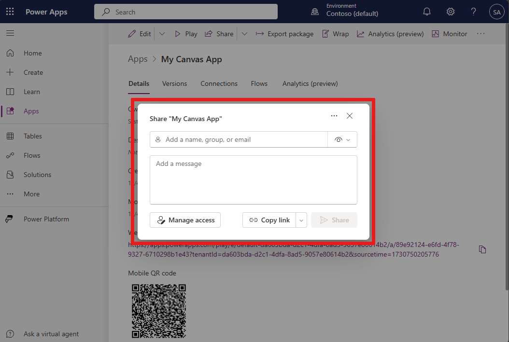

Lets you share the with other users and add them as co-owners of your app. You must save the app before you can share it.

### App checker

Runs the [App checker](https://powerapps.microsoft.com/blog/powerapps-checker-now-includes-app-checker-results-for-canvas-apps-in-solutions/) with available rules and shows the results.

> [!div class="mx-imgBorder"] 
> 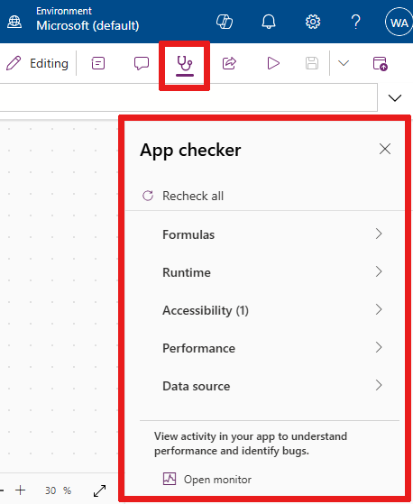

### Comments

Add comments in your app to make suggestions or to track issues for follow-up.

> [!div class="mx-imgBorder"] 
> 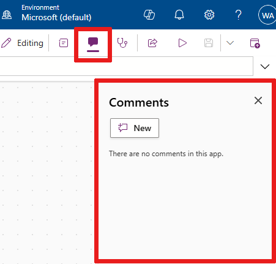

### Preview

This will show a preview version of the app that you can interact with.

### Save

> [!div class="mx-imgBorder"] 
> 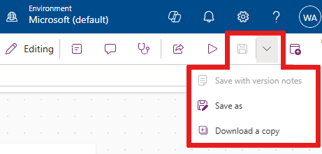

Save allows you to perform the following actions:

- **Save** - Saves recent and unsaved changes you made to the app in Power Apps Studio. Each time you save changes, a new version is created.
- **Save with version notes** - Save and add notes about the updates you've made.
- **Save as** - Duplicate the app by saving the app with a different name.
- **Save and publish** - Allows you to both save the app, and publish it at the same time.
- **Download a copy** - Downland a local copy of the app.

### Publish

Publishes the app’s current version. For more
information about publishing an app, go to [Save and publish canvas apps](save-publish-app.md).

## 3 – Properties list

Shows the list of available properties for the selected object on the canvas.
The properties list changes based on your selection. For a complete list of all properties, go to [All properties](../maker/canvas-apps/reference-properties.md#all-properties).

> [!div class="mx-imgBorder"] 
> 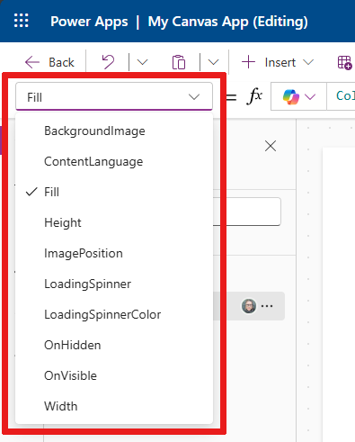

## 4 – Formula bar

Use the formula bar to add, edit, or remove functions relevant to the selected
object and the property selected from the properties list. For example, select
the screen to update the background by using the [RGBA function](/power-platform/power-fx/reference/function-colors).

> [!div class="mx-imgBorder"] 
> 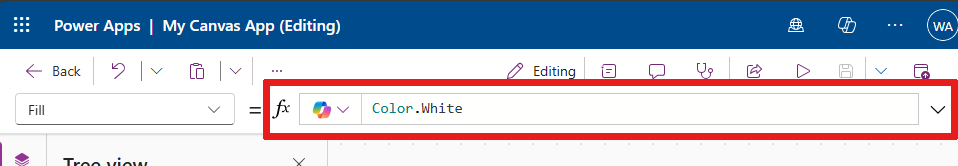

The formula bar is IntelliSense-enabled. When you start entering text that matches one or more functions, the formula bar shows the list of fuctions.

> [!div class="mx-imgBorder"] 
> 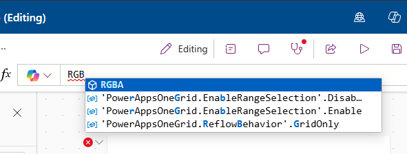

When you select a fuction, the formula bar shows inline function help and highlights help text relevant to the cursor position.

> [!div class="mx-imgBorder"] 
> 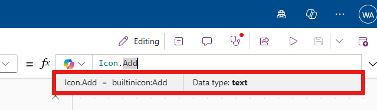

If a formula returns an error, tips relevant to the syntax error and mitigation steps are displayed. 

> [!div class="mx-imgBorder"] 
> 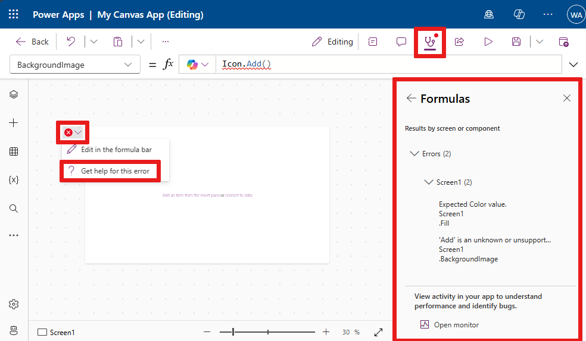

Similarly, you'll find help when working with complex functions, nested
functions, or when correcting a formula syntax.

For a quick and easy function reference, you can also select the formula drop-down menu.

> [!div class="mx-imgBorder"] 
> 

Select an event type from the drop-down menu at the top of the dialog box, such as
**Action** instead of **Text**.

> [!div class="mx-imgBorder"] 
> 

Select an action that you want to add a function for. The available functions for the selected event type are dynamically updated
depending on the object you select.

> [!div class="mx-imgBorder"] 
> 

For example, if you selected a button on the canvas, the available **Action** functions also include the function
*ClearCollect()*.

> [!div class="mx-imgBorder"] 
>  selected")

You can read the description of the selected **Action** function. Double-click the function name to add it into the formula bar.

For a complete list of all canvas app functions, go to [Power Fx formula reference for Power Apps](/power-platform/power-fx/formula-reference).

## 5 – App authoring menu

Switch between various authoring options while working with the app.

> [!div class="mx-imgBorder"] 
> 

> [!TIP]
> You can also select the expand button to expand the list to include names instead of just icons.

- **Tree view** - Shows a tree view of all screens and controls in the current app.
- **Insert** - Allows you to add different controls to the screen.
- **Data** - Add or remove data such as tables that the app connects to.
- **Media** - Insert or remove media from the app.
- **Power Automate**: Add a flow using the [Power Automate pane](working-with-flows.md).
- **Advanced tools**: Allows you to access the [Monitor](../monitor-canvasapps.md) and [Test](test-studio.md) tools to debug and test your app.
- **Search**: Select to search for media, formulas, text, and more in your app. You can also do a search and replace.

## 6 – App authoring options

The options for working with canvas apps change depending on the selection on the left pane.

### Tree view

Select the tree view to show the screens available in the app.

> [!div class="mx-imgBorder"] 
> 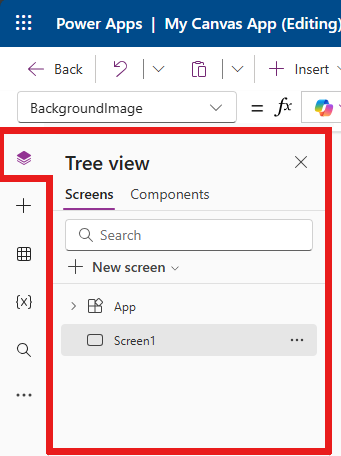

> [!TIP]
> Select **App** in the tree view to work with app-specific controls or to
change app behavior, such as adding a formula on *OnStart* event of the app.

Switch to the **Components** tab to work with component library features. You can add
new components or reuse those that were already published from published
component libraries. More information: [Component library](component-library.md)

> [!div class="mx-imgBorder"] 
> 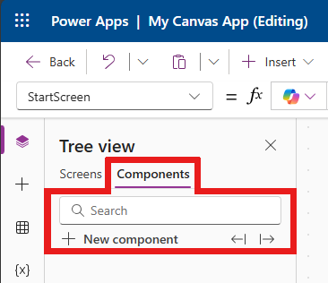

### Insert

More information, see the [Insert](power-apps-studio.md#insert) section above.

### Data

Add, refresh, or remove data sources from your canvas app. You can add one or more [connections](connections-list.md) by using data sources.  

In addition to data stored within tables, there are many connectors available to interact with data in popular SaaS, services, and systems.

> [!div class="mx-imgBorder"] 
> 

To choose other connectors such as SharePoint, OneDrive, or SQL Server, you can
enter text in the data source search box or select from the list of connectors.

> [!div class="mx-imgBorder"] 
> 

More information: [List of all Power Apps connectors](/connectors/connector-reference/connector-reference-powerapps-connectors)

### Visual editor 

When you select **Create new table** and enter a name for the new table, you open visual editor where you can design the table, add columns of different data types, enter data in rows, and save the changes.

> [!div class="mx-imgBorder"] 
> 

To get started with visual editor, select **Create a table** and enter
the table name. You can also expand the *Advanced settings* to update the table's plural name. For example, a table name can be *Shape*, and the plural table name can be *Shapes*.

> [!div class="mx-imgBorder"] 
> 

#### Understand visual editor

Visual editor allows you to work with table rows, columns, and data.

> [!div class="mx-imgBorder"] 
> 

##### Table name

Select the **Edit** button to edit the name of the table.

> [!div class="mx-imgBorder"] 
> 

##### Add row

Select **Add row** to add a new row to the table.

> [!div class="mx-imgBorder"] 
> 

##### Add columns

Select **Add columns** to add new columns of the available column types
supported by visual editor.

###### Supported column types

Visual editor supports specific data types as columns. The following options
are available when creating a new column using visual editor inside Power Apps Studio:

- Text
- Email
- URL
- Phone
- Auto number
- Number
- Date (Only dates without the user locale (time zone) settings are supported.)
- Decimal
- Lookup
- Choice
- Yes/No

> [!IMPORTANT]
> To add columns of types that aren't supported by visual editor, such as file or image, [create a table](create-table.md) by using the solution explorer instead.

###### Advanced options

The advanced options for columns change depending on the type of column. For example, a **Text** column type has an advanced option for **Max length**. By contrast, an **Auto number** column type has options such as the type of autonumbering, prefixes, and maximum number of digits. More information: [Types of fields](../data-platform/types-of-fields.md)

##### Show/hide columns

Use the **Show/hide columns** option to show or hide available columns, including columns automatically created as part of the table metadata.

For example, you can add an *Owner* column created by default to the existing table.

> [!div class="mx-imgBorder"] 
> 

##### Refresh

Refreshes the current table with data.

##### Save

To save changes to a table, select **Save.** When you change a table and try to close it without saving changes, you're prompted to discard changes.

To ensure that changes to the table are saved, you can select the next row inside the table, or select any other cell after editing a cell to trigger the auto save functionality.

> [!div class="mx-imgBorder"] 
> 

After you close a saved table, you'll see the table added to the list of
available data sources in **Data** on the left pane.

##### Visual editor view

Select from the options of **Compact**, **Default**, or **Comfortable** layouts to switch the view with columns and rows spacing to change visual editor layout.

##### Row count

Shows the row counts in the table.

##### Column options

Select the drop-down menu next to the column heading to view column-related options.

| **Option**      | **Description**                                                                                      |
|-----------------|------------------------------------------------------------------------------------------------------|
| *Edit column*   | Edit the column name or advanced options. After it's created, you can't change the name of the column. |
| *Hide*          | Hide or unhide the column.                                                                           |
| *Insert column* | Insert a new column at the selected column location.                                                 |
| *A to Z*        | Sort records in ascending order.                                                                     |
| *Z to A*        | Sort records in descending order.                                                                    |
| *Filter by*     | Filter column data based on the filter criteria you define.                                                 |
| *Move left*     | Move the column to the left from the current position.                                               |
| *Move right*    | Move the column to the right from the current position.                                              |
| *Pin left*      | Pin the column to the left side of the table.                                                        |
| *Pin right*     | Pin the column to the right side of the table.                                                       |
| *Delete column* | Delete the column.                                                                                   |

##### Edit existing table

After you add rows and columns, and add data, you can close the table and use it as
the data source in your app. To edit content in the table, you can use
the app controls or go back to visual editor.

To edit the table, select the table data source, and then select **Edit data** to
open the table in visual editor.

:::image type="content" source="media/studio-edit-2.png" alt-text="Edit table data.":::

After you close visual editor, the data source is automatically refreshed
to reflect the updated data in Power Apps Studio. You can also select **Refresh**
to manually refresh Power Apps Studio to reflect the data in the controls you added on the canvas.

### Media

Select **Media** to add images, video, or audio files to your app. Adding media directly to your app uploads the files to the app and uses the app storage. Each file uploaded to the app as media must be 64 MB or smaller, and the size of all media files uploaded to an app can't exceed 200 MB.

:::image type="content" source="media/studio-media.png" alt-text="Media.":::

If you want to reference more media, consider using [audio and video controls with URLs](../maker/canvas-apps/add-images-pictures-audio-video.md#add-images-audio-or-video-using-the-controls),
using media from [Azure Media Services](../maker/canvas-apps/add-images-pictures-audio-video.md#add-media-from-azure-media-services),
or from [Microsoft Stream](../maker/canvas-apps/controls/control-stream-video.md#example).
More information: [Using multimedia files in Power Apps](../maker/canvas-apps/add-images-pictures-audio-video.md)

## 7 – Canvas/screen

The canvas shows the currently selected screen from the left pane.

## 8 – Properties pane

The properties pane shows properties and options available for the currently
selected object on the canvas. The **Properties** tab shows generic options such as the name, color, size, or position. The **Advanced** tab shows more options for advanced customization. The advanced properties might sometimes be locked for editing, such as when working with data cards. You can select [Unlock to change properties](working-with-cards.md#unlock-a-card) in such situations.

> [!div class="mx-imgBorder"] 
> 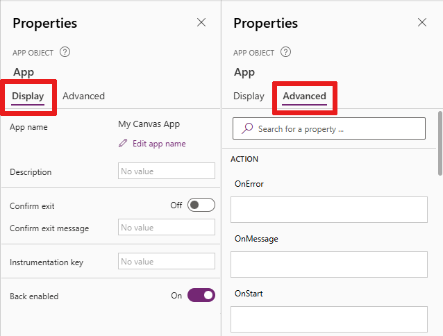

## 9 – Screen selector

Use the screen selector to switch between screens when your canvas app has multiple screens. You can also select a screen from the left pane by selecting the
tree view. If the current selection is inside a container, or inside an individual cell in a gallery, the selector shows the breadcrumbs for the parent elements at each level.

## 10 – Change canvas screen size

You can zoom in or zoom out while authoring the canvas app. Select **Ctrl**+**0**
**Fit to window** to fit the screen size
based on the current authoring window size. The zoom percentage or screen size you use while
authoring a canvas app has no impact on the aspect ratio configured for the app when you preview your app or play a published app.

### See also
