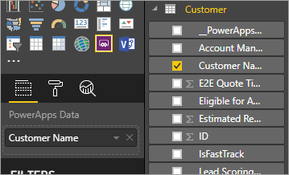
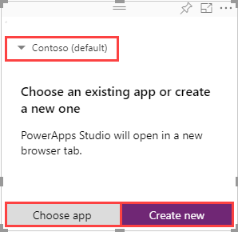
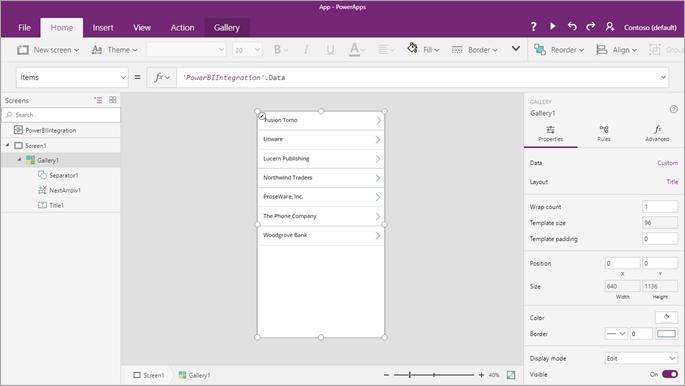
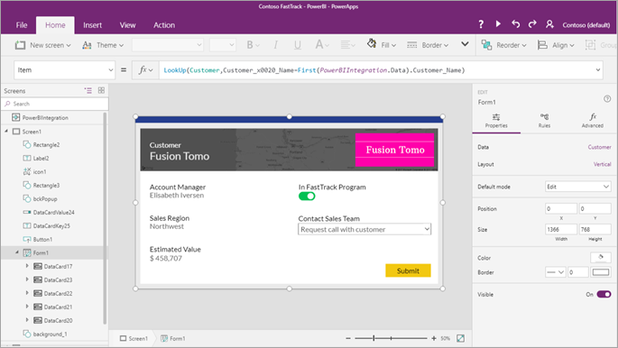
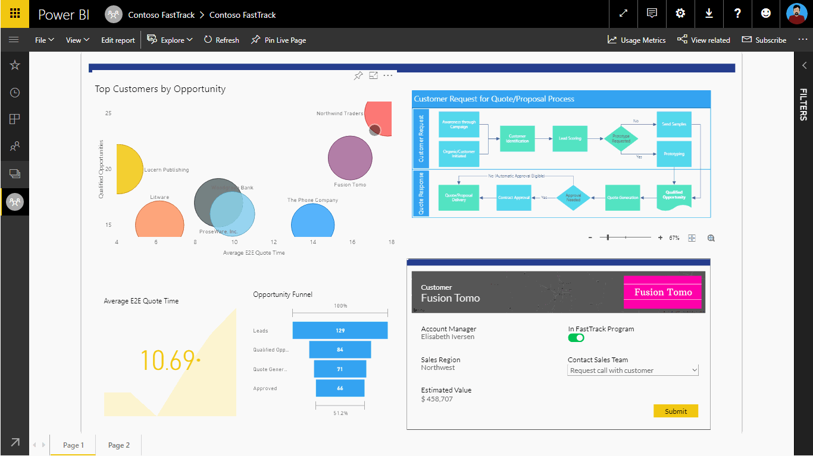
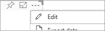

# Power Apps visual for Power BI

Power BI enables data insights and better decision-making, while Power Apps enables everyone to build and use apps that connect to business data. Using the Power Apps visual, you can pass context-aware data to a canvas app, which updates in real time as you make changes to your report. Now, your app users can derive business insights and take actions from right within their Power BI reports and dashboards.

## Using the Power Apps visual

Let's look at the steps required to use the Power Apps visual in your Power BI report.

1. Power Apps visual is available by default in the Power BI service. If you're using Power BI Desktop and don't see it, you must upgrade to the latest version of Power BI Desktop.

2. Add the Power Apps visual to your report, and set the data fields associated with it.

    

    You can choose an existing app or create one, but the report must be published to the Power BI service and opened in Microsoft Edge or Google Chrome.

3.  If you choose to create an app, you can choose in which environment to create it.

    

    If you choose to use an existing app, the visual prompts you to open the app in Power Apps. The visual then sets up the required components in your app so that Power BI can send data to Power Apps.

    If you create a new app, Power Apps creates a simple app with the required components already set up.

    > [!NOTE]
    > You must create a new app from Power Apps visual in Power BI report for the `PowerBIIntegration.Refresh()` function to be available in the app.

    

4. Now in Power Apps Studio, you can use the data fields you set in step 2. The `PowerBIIntegration` object acts like any other Power Apps read-only data source or collection. You can use the object to populate any control, or join and filter with other data sources.

    

    This formula joins Power BI data with the Customer data source: `LookUp(Customer,Customer_x0020_Name=First(PowerBIIntegration.Data).Customer_Name)`

   The Power BI report and the instance of Power Apps Studio that was launched share a live data connection. While they're both open, you can filter or change the data in your report to see the updated data reflect immediately in your app in Power Apps Studio.

5. After you have completed building or making changes to your app, save and publish the app in Power Apps to see your app in the Power BI report.

6. Once you're satisfied with your changes, make sure to share the Power Apps app with users of your report and then save your report.

7. You've created a report in which your users can take actions as they gain insights from your data.

    

    If you need to make changes to an app, open the report in edit mode, select **More options** (**. . .**) on the Power Apps visual and select **Edit**.

    

## Limitations of the Power Apps visual

The following limitations apply to the Power Apps visual:

- The maximum number of records that can be passed from Power BI to Power Apps visual using "PowerBIIntegration" object is limited to 1000.
- Power Apps visual is only supported for [guest users](share-app-guests.md) when the following conditions are met:
  - The canvas app URI (weblink) includes the tenantId of the app in the query string.
  - The Power BI portal authenticates the user, instead of allowing anonymous access. 
  - The canvas app is shared with the guest user attempting to see the contents of the app. 
- Power Apps visual doesn't support multi-level embedding of Power Apps in Sovereign clouds. For example, embedding a Power BI report with Power Apps visual to a SharePoint page, or further embedding that SharePoint page to a Teams channel isn't supported on sovereign clouds.
- If you change the data fields associated with the visual, you must edit the app from within the Power BI service by selecting the ellipsis (...) and then selecting **Edit**. Otherwise, the changes won't be propagated to Power Apps, and the app will behave in unexpected ways.
- The Power Apps visual can't trigger a refresh of Power BI reports and Power BI data sources from within Power BI Desktop. If you write back data from the app to the same data source as the report, your changes won't be reflected immediately in Power BI Desktop. Changes are reflected on the next scheduled refresh.
- The Power Apps visual can't filter the data or send any data back to the report.
- You'll need to share the Power Apps app separately from your report. Learn about [sharing apps in Power Apps](share-app.md).
- Power BI Report Server doesn't support the Power Apps visual.
- Following limitations apply when using the `PowerBIIntegration.Refresh()` function:
    - You must create a new app from Power Apps visual in Power BI report for this function to be available in the app.
    - You must use a source that supports [DirectQuery](/power-bi/desktop-directquery-data-sources) and the data connection must be created using DirectQuery method.
- Power Apps in Power BI Desktop provides data to Power Apps Studio when creating apps but not while editing. Use Power BI Web to preview the data while editing apps.
- The Power BI mobile app doesn't support microphone control in Power Apps visuals.

> [!NOTE]
> We recommend that you first publish your report to the Power BI service and then create or modify apps.

## Browser support

The following table lists the browser supportability for view, create, and modify actions of the Power Apps visual. Supported browsers and actions are identified by a check mark ( &check; ).

|Browser|View|Create|Modify
|-|-|-|-
|Microsoft Edge|&check;|&check;|&check;
|Internet Explorer 11|&check;
|Google Chrome|&check;|&check;|&check;
|Safari \*|&check;
|Mozilla Firefox
|All other browsers

\* In Safari, you must enable cross site tracking (**Preferences** > **Privacy**, and clear **Prevent cross site tracking**) to view Power Apps visual.

## Accessibility support

To navigate the Power Apps visual using the keyboard, follow these steps:

1. Focus selection on the Power BI Report for the Power Apps visual that you want.
2. Use the **Tab** key on the keyboard until the visual is highlighted.
3. Use the **Ctrl+Right** key on the keyboard to enter the visual.
3. Use the  **Tab** key on the keyboard until the component of the visual you want is selected.

For more information, go to [Power BI Accessibility Documentation](/power-bi/desktop-accessibility)

## Next steps

* Go through a simple [step-by-step tutorial](/power-bi/visuals/power-bi-visualization-powerapp).
* Check out our [video](https://aka.ms/powerappscustomvisualvideo).

[!INCLUDE[footer-include](../../includes/footer-banner.md)]
