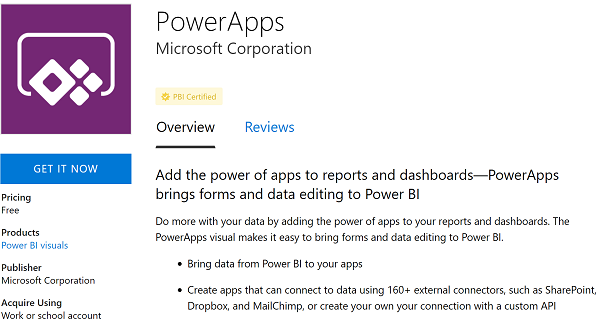

# PowerApps custom visual for Power BI

Power BI enables data insights and better decision-making, while PowerApps enables everyone to build and use apps that connect to business data. Using the PowerApps custom visual, you can pass context-aware data to a canvas app, which updates in real time as you make changes to your report. Now, your app users can derive business insights and take actions from right within their Power BI reports and dashboards.

## Using the PowerApps custom visual

Let's look at the steps required to use the PowerApps custom visual in your Power BI report.

1. Get the custom visual from [AppSource](https://appsource.microsoft.com/product/power-bi-visuals/WA104381378?tab=Overview) or directly import it in the Power BI service.

     

2. Add the PowerApps visual to your report, and set the data fields associated with it.

    

    You can choose an existing app or create one, but the report must be published to the Power BI service and opened in Microsoft Edge or Google Chrome.

3.  If you choose to create an app, you can choose in which environment to create it.

    

    If you choose to use an existing app, the visual prompts you to open the app in PowerApps. The visual then sets up the required components in your app so that Power BI can send data to PowerApps.

    If you create a new app, PowerApps creates a simple app with the required components already set up.

    

4. Now in PowerApps Studio, you can use the data fields you set in step 2. The `PowerBIIntegration` object acts like any other PowerApps read-only data source or collection. You can use the object to populate any control, or join and filter with other data sources.

    

    This formula joins Power BI data with the Customer data source: `LookUp(Customer,Customer_x0020_Name=First(PowerBIIntegration.Data).Customer_Name)`

   The Power BI report and the instance of PowerApps Studio that was launched share a live data connection. While they are both open, you can filter or change the data in your report to see the updated data reflect immediately in your app in PowerApps Studio.

5. After you have completed building or making changes to your app, save and publish the app in PowerApps to see your app in the Power BI report.

6. Once you are satisfied with your changes, make sure to share the PowerApps app with users of your report and then save your report.

7. And with that, you have created a report in which your users can take actions as they gain insights from your data.

    

    If you need to makes changes to an app, open the report in edit mode, click or tap **More options** (**. . .**) on the PowerApps visual and select **Edit**.

    

## Limitations of the PowerApps custom visual

The PowerApps custom visual is available in preview and has these limitations:

- You can't create or modify apps when using the PowerApps custom visual in Power BI desktop, Internet Explorer, or Mozilla Firefox. We recommend that you first publish your report to the Power BI service. Then use Microsoft Edge or Google Chrome to create and update apps.
- If you change the data fields associated with the visual, you must edit the app from within the Power BI service by selecting the ellipsis (...) and then selecting **Edit**. Otherwise, the changes won't be propagated to PowerApps, and the app will behave in unexpected ways.
- The PowerApps custom visual can't trigger a refresh of the Power BI report or Power BI data source. If you write back data from the app to the same data source as the report, your changes won't be reflected immediately. Changes are reflected on the next scheduled refresh.
- The PowerApps custom visual can't filter the data or send any data back to the report.
- You'll need to share the PowerApps app separately from your report. Learn about [sharing apps in PowerApps](share-app.md).
- Power BI Report Server and the mobile app for Power BI don't support the PowerApps custom visual.

## Next steps

* Go through a simple [step-by-step tutorial](embed-powerapps-powerbi.md).
* Check out out our [video](https://aka.ms/powerappscustomvisualvideo).
