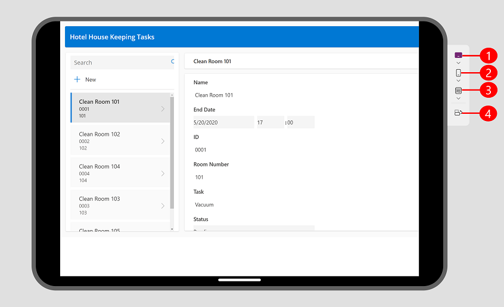

# Preview an app

When you create an app, it's helpful to preview your app and see how it will look for your users. Use the preview app feature to see how your app appears on various devices and in different sizes. Previewing an app is especially beneficial when you're building a responsive app.

To preview an app, open the app for editing in [Power Apps Studio](https://create.powerapps.com), in the actions menu, select 
**Preview the app**.

Use the preview options to see how your app looks on different devices using the device picker. 

> [!div class="mx-imgBorder"] 
> 

Legend: 
1. **Tablet Devices**: Allows you to select from common tablet devices from several manufacturers, along with the ability to select a custom size based on your needs. This option shows a device frame and device safe zone, which is shown as the black area either on the top and bottom or sides depending on the orientation of the device. It also shows a black area with the home bar at the bottom.  
2. **Mobile devices**: Lets you select from common phones from different manufacturers, along with the ability to select a custom size based on your needs. This option shows a device frame and device safe zone, which is shown as the black area either on the top and bottom or sides depending on the orientation of the device. It also shows a black area with the home bar at the bottom. 
3. **Web view**: See how your app looks like on a web browser. You can select a window size to fill the browser window, or you can select canvas size to see how the app looks while authoring without leaving the preview.
4. **Orientation Switcher**: Switch between vertical and horizontal orientation. The **Orientation Switcher** option is disabled if the **Lock Orientation** setting turned on. 

If you're developing a responsive app, the content within the app adjusts to fit the screen size of the device being used.

Watch this video to learn how the device picker helps you confirm that your app is adjusting correctly.

> [!VIDEO https://www.microsoft.com/en-us/videoplayer/embed/RW14Dfz]

## Display settings

The way your app behaves with each preview option is determined by app type and your display settings. 

- If an app is created using the phone layout, you can still preview it on the web and tablet devices using the device picker. However, if an app isn't created using a responsive layout, it then appears in a phone shape on the web and selected tablet device. You get a message explaining why the preview is narrow. If you’d like an app to be responsive to phone, tablet, and web sizes then we recommend selecting the tablet option when you create an app. You can use responsive auto layout containers to determine the flow of the content for different screen sizes including phones. More information: [Building responsive canvas apps](build-responsive-apps.md)  

- Under Display settings:
   - **Scale To Fit**: When set to **On** your entire app is scaled to fit the available space. If a smaller space is available to the app, you may notice empty space on the sides to accommodate the scaling. When a user plays the app, they will also see the empty space.
  - **Lock Orientation**: When set to **On**, the **Switch Orientation** button in the device picker is disabled.  

## Known Issues 

- If **Scale To Fit** setting is on and **Lock Aspect Ratio** is off, your preview won't be accurate. This configuration isn't recommended. More information: [Change screen size and orientation of canvas apps](set-aspect-ratio-portrait-landscape.md)  

- If **Scale to Fit** is off and you resize your browser window while in preview mode, the preview won't be accurate. To address the issue, close and reopen the preview once your browser window is in the desired size. 

