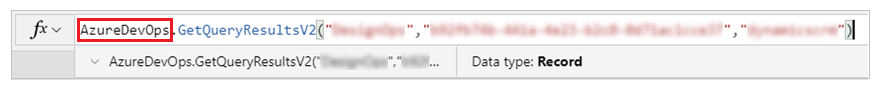
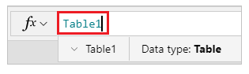
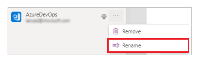

# Rename Power Apps action-based data sources

A change in the display name of a connector in Power Apps may cause errors in formulas used by the app. This problem takes extra efforts to
update existing formulas with manual intervention, and name changes.

With the ability to rename action-based data sources, you can save the extra efforts
required to fix the formulas affected by the connector name change.

## Action-based and tabular data sources

Before you start using this feature, it’s important to understand the difference
between action-based and tabular data sources.

Action-based data sources use the data source, or the service name in the formula. Tabular data sources use the name of the table instead.

For example, [Azure DevOps](https://docs.microsoft.com/connectors/visualstudioteamservices/) is action-based connector, while [Excel](https://docs.microsoft.com/connectors/excel/) is tabular data source.

For example, when you reference an Azure DevOps instance, the formula uses
Azure DevOps as the data source name

When using Excel, the data source name in formula uses the table name (instead of the connector, or the service name):

## How are data source names generated?

Data source names are generated from the display name of the connection they're
based on. The first instance of a data source name in an app is typically the
exact name of the connection. For instance, if you use “AzureDevOps” data
source, the name of the connection will be “AzureDevOps”. And, if you add
another “AzureDevOps” data source to the same application, the second data
source will be named “AzureDevOps_1”.

## Renamed connectors

Occasionally, a connector goes through a change in the display name. For example, from “OldConnector” to “NewConnector”.

Existing apps will continue to work even though your data source names say “OldConnector”. This behavior is because your data sources still point (under the covers) to the correct connector type.

However, if you drop your existing data source in the app, and add it again, the
new data source will be named “NewConnector”. Your formulas will still reference
“OldConnector” though, causing formula errors wherever this data source name exists.

## Fixing broken formula references to data source names

Using the new “Rename” feature, you can rename your action-based connectors and
fix up your formulas automatically.

To fix this kind of problem, rename the data source from the new display name
back to the old display name.

For example, rename the data source display name from “New Connector” back to
“Old Connector”. Once you rename, all your formula references will reconnect and
work as before. Your application will now work correctly. You can save the app
changes and publish the new version.

### Optional – use new data source name (Recommended)

After your data source name and formulas are in sync, you can also rename your
data source again to bring it in line with the new connector name.

For example, you can rename your data source to be “NewConnector”. This rename
updates all formula references to use the new name. We recommended this approach because if you ever have to drop your data source again, then readding the data
source will be based on the newer connector display name. This step will help
you avoid future issues.

This approach works because the data source display name, and the formula
referenced data sources are in sync. In other words, exactly same display name.
Renaming data sources in the formulas can’t happen before you rename
your data source back because the data source display name, and the formula
referenced data sources aren’t the same.

## Limitations

This rename capability is limited to action-based connectors. It doesn’t work
for tabular data sources. Tabular data sources use the name of the tables
they’re pointing to (as opposed to the general name of the service hosting them).

### See also

- [Overview of connectors for canvas apps](connections-list.md)
- [List of all Power Apps connectors](/connectors/connector-reference/connector-reference-powerapps-connectors)
