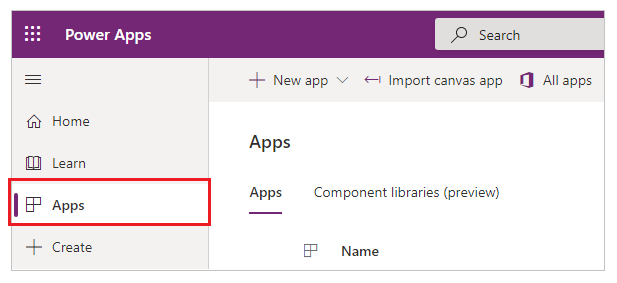
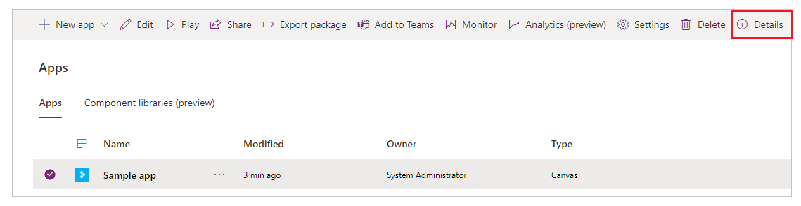
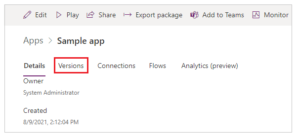
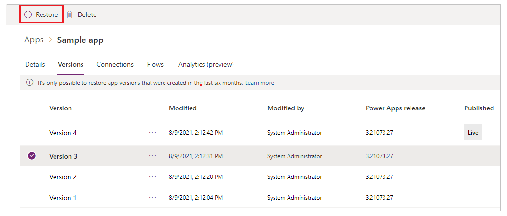
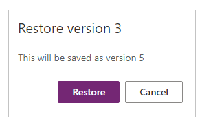
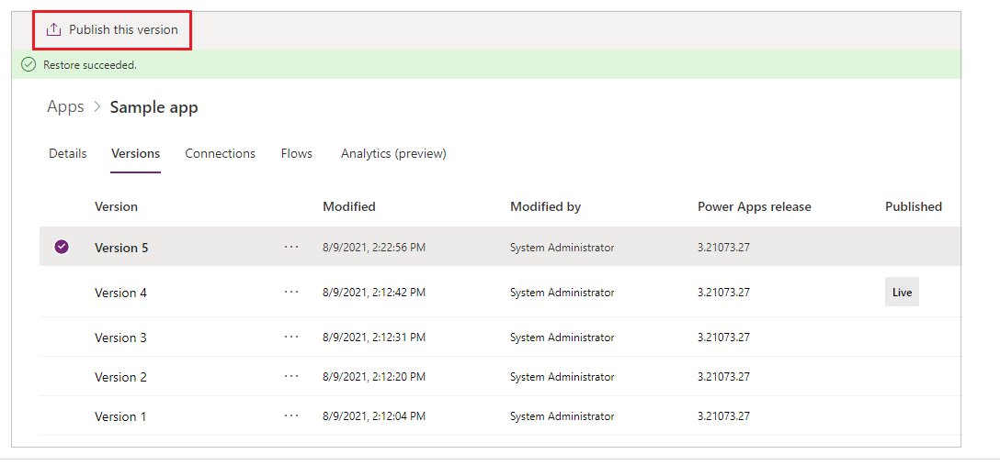
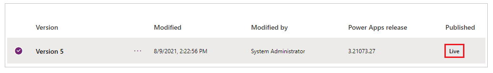

# Restore a canvas app to a previous version

This article shows you how to restore a canvas app to a previous version that was saved to the cloud from your Power Apps account.

> [!NOTE]
> You can only restore app versions created in last six months.

## Restore an app from your account

1. Sign in to [Power Apps](https://make.powerapps.com).

1. Select **Apps** from the left-pane.

    

1. Select your app.

    > [!NOTE]
    > If the app that you want to restore doesn't appear, make sure that you're in the right environment.

1. Select **Details**.

    

1. Select **Versions**.

    

1. Select the app version that you want to restore.

1. Select **Restore**.

    

    > [!NOTE]
    > Only the app owner can restore a version of an app. To set a user as the owner of an app, use the [Power Apps cmdlets for administrators](/power-platform/admin/powerapps-powershell).

1. Confirm by selecting **Restore** again.

    

    New version is created.

1. (Optional) If you want to publish the restored version, select **Publish this version**, and then select **Publish this version** when prompted to confirm.

    

    Notice the published restore version that shows up as **Live**.
    
    

    > [!NOTE]
    > **Publish this version** option only appears for the latest unpublished version of an app.

## More resources
[Share an app](share-app.md)  
[Change app name and tile](set-name-tile.md)  
[Delete an app](delete-app.md)

[!INCLUDE[footer-include](../../includes/footer-banner.md)]