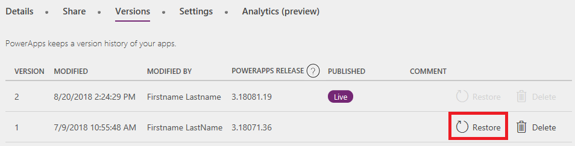
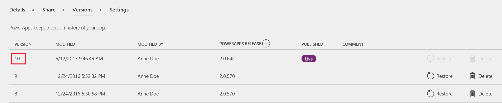

# Restore a canvas app to a previous version

This article shows you how to restore a canvas app to a previous version that was saved to the cloud from your Power Apps account.

> [!NOTE]
> You can only restore app versions created in last six months.

## Restore an app from your account
1. Open [powerapps.com](https://make.powerapps.com?utm_source=padocs&utm_medium=linkinadoc&utm_campaign=referralsfromdoc), and then click or tap **Apps** in the left navigation bar.

    

2. (optional) Near the upper-left corner, filter the list of apps to show only those apps that you own or only those apps to which you contribute.

    

    > [!NOTE]
   > If the app that you want to restore doesn't appear, make sure that you're in the right environment.

3. Near the right edge, click or tap the info icon for the app that you want to restore.

    

4. Click or tap the **Versions** tab, and then click or tap **Restore** for the version that you want to restore.

    

5. In the confirmation dialog box, click or tap **Restore**.  

    A new version is added to your list.

    

## More resources
[Share an app](share-app.md)  
[Change app name and tile](set-name-tile.md)  
[Delete an app](delete-app.md)

[!INCLUDE[footer-include](../../includes/footer-banner.md)]