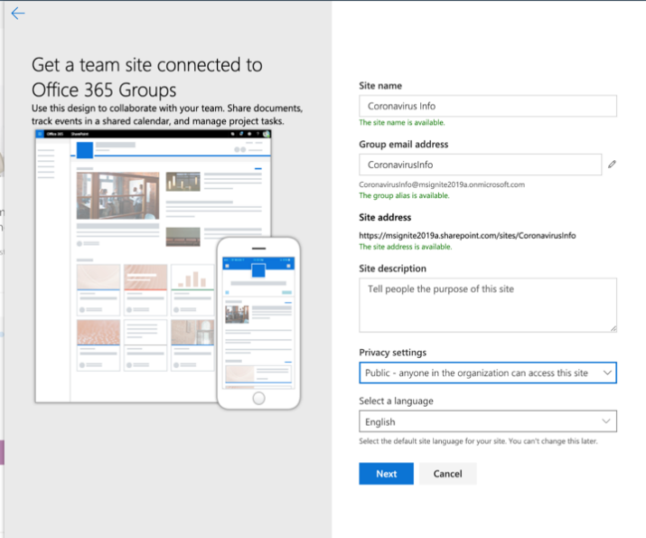
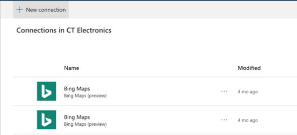
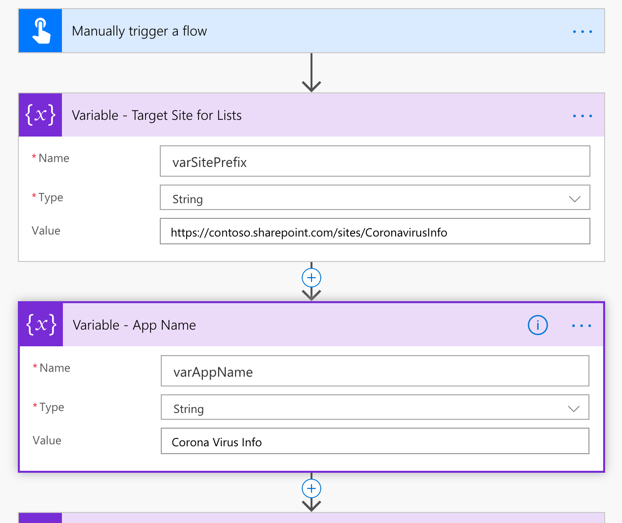
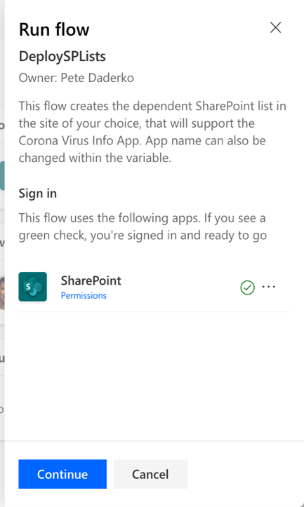
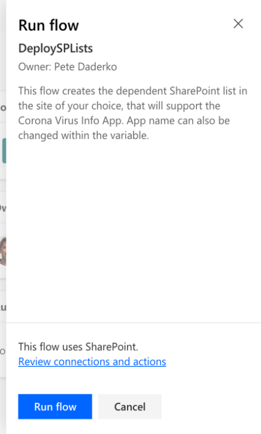
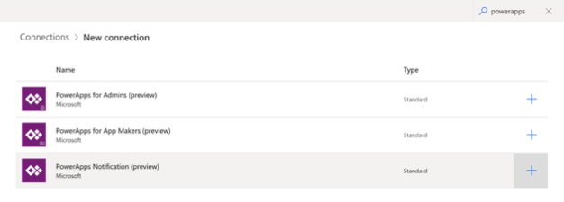

# Coronoa virus: Crisis Communication

Step-by-step instructions for installing and configuring the Coronavirus
Information app for Power Apps.

 

Estimated time to complete these steps: **20-25 minutes**

 

## Overview of the app

 

The Coronavirus Information app provides a user-friendly experience to connect
end users with information about the Coronavirus. Quickly get updates on
internal company news, get answers to frequently asked questions, and get access
to important information like links and emergency contacts. This app requires a
small amount of setup to make it your own.

 

**Prerequisites**

-   [Sign
    up](https://make.powerapps.com/?utm_source=padocs&utm_medium=linkinadoc&utm_campaign=referralsfromdoc) for
    Power Apps.

-   Must have a valid SharePoint Online license and permission to create lists.

-   A public SharePoint site where you can store the data for the app.

 

 

**Download the assets from Github**

All the flows and apps you need for this solution can be found in the Power Apps
tools repository. You can get the entire package here:
aka.ms/CoronaInformationSolution.

 

[TODO] add link to Github assets in the meantime you can access it here:
[https://microsoft.sharepoint.com/:f:/t/CoronaVirusResponseApp/EsqGVhw-L8ZBvFUvlX92CIoBFJTSb3Zc2NGQ8wkaMxEjBw?e=ouKXl0
](https://microsoft.sharepoint.com/:f:/t/CoronaVirusResponseApp/EsqGVhw-L8ZBvFUvlX92CIoBFJTSb3Zc2NGQ8wkaMxEjBw?e=ouKXl0)

 

**Create a new SharePoint site**

**All of the data needed for the app**

**Create the SharePoint lists for app**

The app requires multiple lists that store all the data. To automate the
creation of the SharePoint lists, you can leverage the DeploySPLists flow we
have provided.

 

Import the flow

1.  Navigate to [flow.microsoft.com](http://flow.microsoft.com)

2.  Select **My flows** from the left nav

3.  Select the **Import** button in the command bar

4.  Upload the **DeploySPList.zip** package from the GitHub repository.

>   [./media/image2.png](./media/image2.png)

>   A screenshot of a cell phone Description automatically generated

1.  Add a SharePoint connection for the new Flow by selecting the **Select
    during import** link and completing the form.

>   [./media/image3.png](./media/image3.png)

>   A screenshot of a cell phone Description automatically generated

1.  If you need to create a new SharePoint connection, start by selecting
    **Create new** in the import setup pane.

2.  Select **New connection** in the command bar

1.  Search for the name of the connection (e.g. **SharePoint**)

2.  Select the desired connection and complete the necessary steps.

3.  Select **Save** once you have selected a connection

4.  Select **Import**.

 

Edit the flow

1.  Once the import is done, go back to **My flows** and refresh the list of
    Flows

2.  Select the newly imported flow **DeploySPList**.

3.  Select **Edit** from the command bar.

4.  Open the card called **Variable – Target Site for Lists**.

5.  Change the value to the name of your SharePoint site.

6.  Open the card called **Variable – App name**.

7.  Change the value to the name of your app; by default, it is "Coronavirus
    Info".

1.  Select **Save** to commit your changes.

Does the site need to be created beforehand? If so, we need to call that out.
Are there any  
specific configurations that need to be put in place? Assuming it's a Team (and
not Communications) site?

 

[MB, currently calling that out as a prereq, we can make that more clear]

 

Run the flow

1.  Go back to the detail screen for the **DeploySPList flow.**

2.  Select **Run** from the command bar.

3.  Select **Continue** to and then **Run flow** to trigger the flow.

The flow will then create the following SharePoint lists within your defined
Share

 

| **Display Title**   | **Template** | **Purpose**                                                                                                                                                                                                                                                           | **Description**                                                                                                                                                          |
|---------------------|--------------|-----------------------------------------------------------------------------------------------------------------------------------------------------------------------------------------------------------------------------------------------------------------------|--------------------------------------------------------------------------------------------------------------------------------------------------------------------------|
| CI_LogosAssets      | 101          | To hold logo, and/or other images to be referenced from the app. The logo will be referenced in Power Apps by a direct link or via the ID number of the desired Logo                                                                                                  | Library for related logo(s) and other image assets for the [App Name] app                                                                                                |
| CI_configAdminSetup | 100          | For feature configuration by the Admin of the tool **Note**: This list should be read only to all members who are not admins.                                                                                                                                         | Admin configuration list for the [App Name] app                                                                                                                          |
| CI_Contacts         | 100          | Using the default Contacts Content type to capture information about contacts. (No people picker included – so may require maintenance to ensure data is up-to-date.)  **Note**: This depends on the global contact list type as a default content type in the list.  | Contacts List for the [App Name] app                                                                                                                                     |
| CI_CompanyNews      | 100          | Collection of Company News Items                                                                                                                                                                                                                                      | List for the management of news items visible in the [App Name] app. The Deprecated column can be used to filter news items out of the app (retaining them as a record). |
| CI_FAQ              | 100          | Frequently asked questions                                                                                                                                                                                                                                            | Frequently Asked Questions for the [App Name] app. The Deprecated column can be used to filter FAQ items out of the app (retaining them as a record).                    |
| CI_UsefullLinks     | 100          | Useful hyperlinks list                                                                                                                                                                                                                                                | Useful hyperlinks list for the [App Name] app. The Deprecated column can be used to filter hyperlink items out of the app (retaining them as a record).                  |
| CI_Employee         | 100          | Tracking current employee presence status. Examples : working from home; out sick; on personal leave; and out on vacation  **Note**: 'coming to work' is assumed and not included in the list options                                                                 | Useful hyperlinks list for the [App Name] app. The Deprecated column can be used to filter links items out of the app (retaining them as a record).                      |
| CI_HelpfulTips      | 100          | Users may contribute helpful tips to peers.                                                                                                                                                                                                                           | List for the management of shared tips for the [App Name] App. The Deprecated column can be used to remove tips from the app views (retaining them as a record in SPO).  |

 

Notes

-   All list columns above should be considered as dependencies, therefore
    please protect the lists from accidental schema changes (for example: adding
    new columns is ok, but deleting columns may break the app.)

-   Be careful deleting list items, unless you are not concerned with historical
    records. In the case where you'd like to drop something from contacts, news,
    FAQs, or links, changing the deprecation value from 'No' to 'Yes' will work
    to drop those items from the app.

 

**Import and setup the app**

Now that all the SharePoint lists are created, you can now import the app and
connect it to your new data sources.

 

Import the app

1.  Navigate to make.powerapps.com

2.  Select **Apps** from the left navigation

3.  Select **Import** from the command bar

4.  Upload the **Coronavirusapp.zip** file from the GitHub repository

>   [./media/image8.png](./media/image8.png)

>   A screenshot of a cell phone Description automatically generated

1.  Select **Import**.

 

Update the SharePoint connections

1.  Go back to the **Apps** list

2.  Select **…** next to **Coronavirus Info** [TODO] rename app

3.  Select **Edit** from the contextual menu

>   [./media/image9.png](./media/image9.png)

>   A screenshot of a cell phone Description automatically generated

1.  **Sign in** or create any necessary connections and select **Allow**

>   [./media/image10.png](./media/image10.png)

>   A screenshot of a cell phone Description automatically generated

1.  Navigate to the data drawer in the left pane

>   [./media/image11.png](./media/image11.png)

>   A screenshot of a cell phone Description automatically generated

1.  **Remove** of the existing SharePoint lists in side of the app since they do
    not point to your current SharePoint site.

>   [./media/image12.png](./media/image12.png)

>   A screenshot of a cell phone Description automatically generated

1.  You now want to add the lists from your own SharePoint site. Start by
    searching for SharePoint in the search bar.

>   [./media/image13.png](./media/image13.png)

>   A screenshot of a cell phone Description automatically generated

1.  Select **SharePoint** and choose a connection

>   [./media/image14.png](./media/image14.png)

>   A screenshot of a social media post Description automatically generated

1.  Copy and paste the URL to your SharePoint site in the text field and select
    **Connect**.

>   [./media/image15.png](./media/image15.png)

>   A screenshot of a cell phone Description automatically generated

1.  Select all the SharePoint lists and select **Connect**. (*PG: Do we need the
    Documents library?)*

>   [./media/image16.png](./media/image16.png)

>   A screenshot of a cell phone Description automatically generated

1.  You can now **Save** and **Publish** the app.

 

[TODO] Fix errors on contact screen

 

**Import and setup the admin app**

Create initial content for the app

To create initial content for you app, please refer to the *administration doc
article*. Before proceeding to the next step, be sure to *add your admin
settings*.

 

[TODO] create links to administration doc article

 

**Test the Coronavirus Reference app**

Now that you have your app deployed and your content added, you can now test
your app to make sure that it works.

1.  Go to make.powerapps.com

2.  Select **Apps** from the left nav bar

3.  Select **Coronavirus Reference** to open it up in the web player

 

**Import and setup the notification flow**

The app leverages a flow to send notifications to end users whenever there is a
new company update.

 

Import the news notification flow

1.  Navigate to [flow.microsoft.com](http://flow.microsoft.com)

2.  Select **My flows** from the left nav

3.  Select the **Import** button in the command bar

4.  Upload the **NotifyUsersOfCoronavirusNews.zip** package from the GitHub
    repository.

>   [./media/image17.png](./media/image17.png)

>   A screenshot of a cell phone Description automatically generated

>    

1.  Add connections for the new Flow by selecting the **Select during import**
    link for each connection and completing the form.  
    

    >   [./media/image18.png](./media/image18.png)

    >   A screenshot of a cell phone Description automatically generated

2.  If you need to create a new connection, start by selecting **Create new** in
    the import setup pane.

3.  Select **New connection** in the command bar

1.  Search for the name of the connection (e.g. **PowerApps Notification
    (preview)**)

1.  Select the desired connection and complete the necessary steps.

2.  If you are creating a connection to **PowerApps Notifications (preview),**
    you will see the following dialog.

>    

>   [./media/image20.png](./media/image20.png)

>   A screenshot of a cell phone Description automatically generated

1.  To get the ID, navigate to your **Apps** list

2.  Select the **…** menu for **Coronavirus Reference**

>   [./media/image21.png](./media/image21.png)

>   A screenshot of a cell phone Description automatically generated

1.  Copy the **App ID**

>   [./media/image22.png](./media/image22.png)

>   A screenshot of a social media post Description automatically generated

1.  Paste the **App ID** into the connection creation dialog and select
    **Create**.

>   [./media/image23.png](./media/image23.png)

>   A screenshot of a cell phone Description automatically generated

1.  Once you've created your new connection, go back to the **Import setup**
    panel and select the **Refresh list** button

2.  Your new connection should now appear and you can select it and select
    **Save**.

3.  Select **Import** once you're done adding all of your connections.

>   [./media/image24.png](./media/image24.png)

>   A screenshot of a cell phone Description automatically generated

Edit the news notification flow

1.  Once the import is done, go back to **My flows**.

2.  Select the newly imported flow **Notify users of coronavirus news**.

3.  Select **Edit** from the command bar.

4.  Open the card called **When a new item is posted**

5.  Change the **Site Address** to the name of your SharePoint site.

6.  Change the **List name** to **CI_CompanyNews**

7.  Open the card called **Get the admin config settings**.

8.  Change the **Site Address** to the name of your SharePoint site.

9.  Change the **List name** to **CI_configAdminSetup**

10. Open the card called **Initialize variable – Read more text**.

11. Change the **Value** to “Read more” in your native language.

>   [./media/image25.png](./media/image25.png)

>   A screenshot of a cell phone Description automatically generated

1.  Select **Save** to commit your changes.

 

Test the news notification flow
