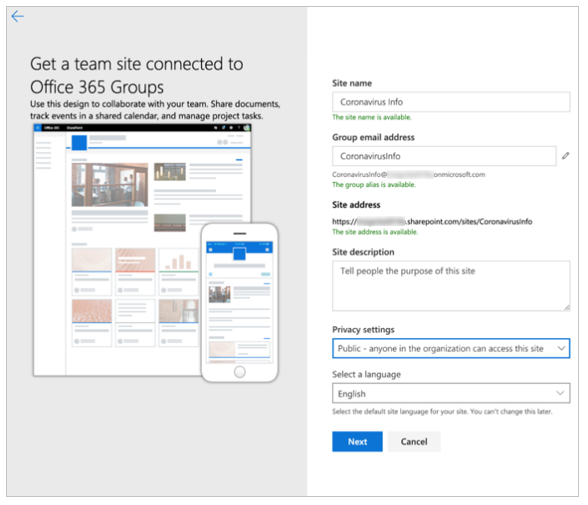
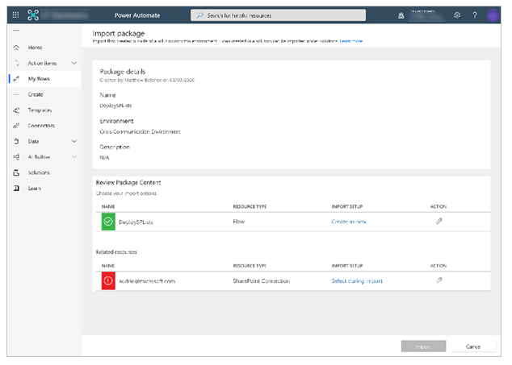
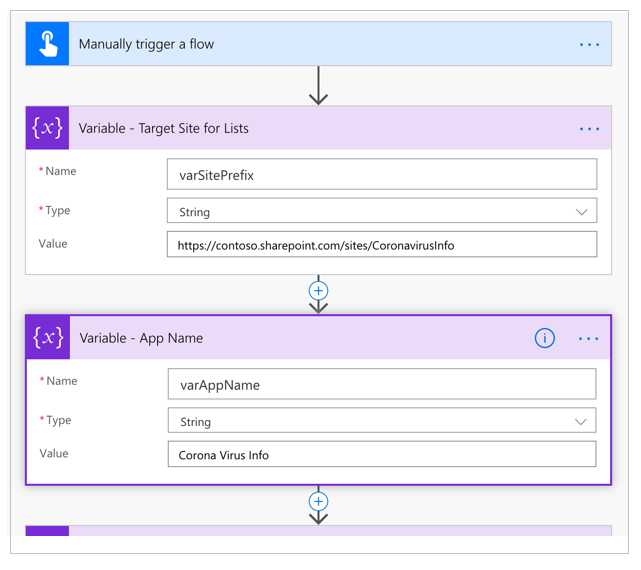
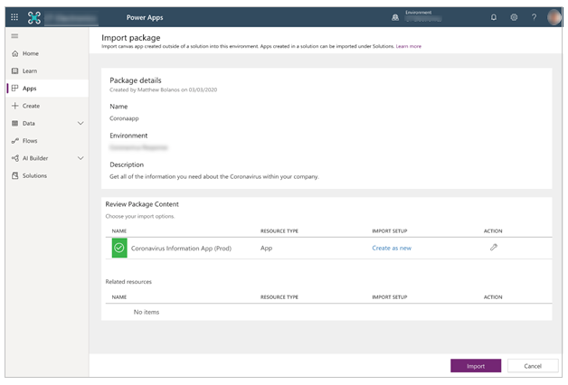
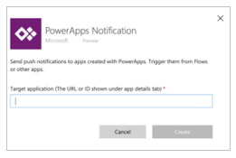
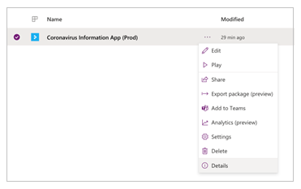
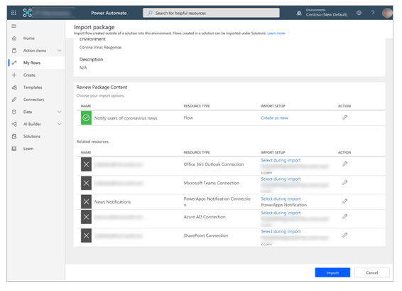
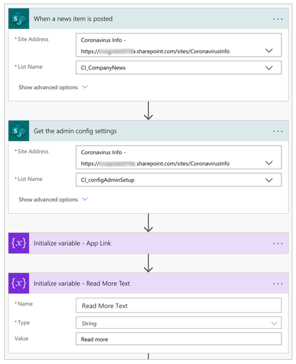

# Set up and learn about the Crisis Communication sample app template in Power Apps

Step-by-step instructions for installing and configuring the Crisis Comunication app for Power Apps.

Estimated time to complete these steps: **20-25 minutes**

## Overview of the app

The Coronavirus Information app provides a user-friendly experience to connect
end users with information about the Coronavirus. Quickly get updates on
internal company news, get answers to frequently asked questions, and get access
to important information like links and emergency contacts. This app requires a
small amount of setup to make it your own.

## Prerequisites

- [Sign
    up](https://make.powerapps.com/?utm_source=padocs&utm_medium=linkinadoc&utm_campaign=referralsfromdoc) for
    Power Apps.
- You must have a valid SharePoint Online license and permission to create lists.
- You must have a public SharePoint site where you can store the data for the app.

    
    
- Download the assets from [aka.ms/CoronaInformationSolution](https://aka.ms/CoronaInformationSolution).

## Create a new SharePoint site

All the data needed for the app will live inside of SharePoint lists, so we will first need to create a new SharePoint site.

1. Login to [SharePoint Online](https://www.sharepoint.com).
1. Select Create site and select next:

    

1. Select Team site:

    

1. Give your site a Name and Description.
1. Set the Privacy settings to public so that everyone in the company can get the necessary information:

    

1. Select Next.
1. Optionally add additional owners.
1. Select Finish.

## Create the SharePoint lists for app

The app requires multiple lists that store all the data. To automate the
creation of the SharePoint lists, you can leverage the *DeploySPLists* flow available from the downloaded [assets package](#prerequisites).

### Import the flow

1. Go to [flow.microsoft.com](https://flow.microsoft.com)
1. Select **My flows** from the left navigation.
1. Select the **Import** button in the command bar.
1. Upload the **DeploySPList.zip** package from the GitHub repository.

    

1. Add a SharePoint connection for the new Flow by selecting the **Select during import** link and completing the form.

    

1. If you need to create a new SharePoint connection, start by selecting
 **Create new** in the import setup pane.
1. Select **New connection** in the command bar:

    

1. Search for the name of the connection, for example *SharePoint*.
1. Select the desired connection and complete the necessary steps.
1. Select **Save** once you have selected a connection.
1. Select **Import**.

### Edit the flow

1. Once the import is done, go back to **My flows** and refresh the list of
    Flows
1. Select the newly imported flow **DeploySPList**.
1. Select **Edit** from the command bar.
1. Open the card called **Variable – Target Site for Lists**.
1. Change the value to the name of your SharePoint site.
1. Open the card called **Variable – App name**.
1. Change the value to the name of your app; by default, it is "Coronavirus
    Info".

    

1. Select **Save** to commit your changes.

### Run the flow

1. Go back to the detail screen for the **DeploySPList flow.**
1. Select **Run** from the command bar.
1. Select **Continue** to and then **Run flow** to trigger the flow.

    

    

The flow will then create the following SharePoint lists within your defined
Share

| **Display Title** | **Template** | **Purpose** | **Description** |
|-|-|-|-|
| CI_LogosAssets | 101 | To hold logo, and/or other images to be referenced from the app. The logo will be referenced in Power Apps by a direct link or via the ID number of the desired Logo. | Library for related logo(s) and other image assets for the [App Name] app. |
| CI_configAdminSetup | 100 | For feature configuration by the Admin of the tool. **Note**: This list should be read only to all members who are not admins. | Admin configuration list for the [App Name] app.
| CI_Contacts | 100 | Using the default Contacts Content type to capture information about contacts. (No people picker included – so may require maintenance to ensure data is up-to-date.)  **Note**: This depends on the global contact list type as a default content type in the list. | Contacts List for the [App Name] app.                                                         |
| CI_CompanyNews | 100 | Collection of Company News Items. | List for the management of news items visible in the [App Name] app. The Deprecated column can be used to filter news items out of the app (retaining them as a record). | 
| CI_FAQ | 100 | Frequently asked questions. | Frequently Asked Questions for the [App Name] app. The Deprecated column can be used to filter FAQ items out of the app (retaining them as a record). |
| CI_UsefullLinks | 100 | Useful hyperlinks list | Useful hyperlinks list for the [App Name] app. The Deprecated column can be used to filter hyperlink items out of the app (retaining them as a record). |
| CI_Employee | 100 | Tracking current employee presence status. Examples: *working from home*; *out sick*; *on personal leave*; and *out on vacation*.  **Note**: *coming to work* is assumed and not included in the list options. | Useful hyperlinks list for the [App Name] app. The Deprecated column can be used to filter links items out of the app (retaining them as a record). |
| CI_HelpfulTips      | 100          | Users may contribute helpful tips to peers. | List for the management of shared tips for the [App Name] App. The Deprecated column can be used to remove tips from the app views (retaining them as a record in SPO).  |

> [!NOTE]
> - All list columns listed above should be considered as dependencies.
    Please protect the lists from accidental schema changes (for example, adding
    new columns is allowed, but deleting columns may break the app.)
> - Use caution when deleting list items; deleting list items deletes historical records. You can toggle deprecation value from *No* to *Yes* to drop records from contacts, news, FAQs or links.

## Import and setup the app

Now that all the SharePoint lists are created, you can now import the app and
connect it to your new data sources.

### Import the app

1. Sign in to [Power Apps](https://make.powerapps.com).
1. Select **Apps** from the left navigation.
1. Select **Import** from the command bar.
1. Upload the **Coronavirusapp.zip** file from the GitHub repository:

    

1. Select **Import**.

### Update the SharePoint connections

1. Go back to the **Apps** list.
1. Select **More Commands** (...) for **Coronavirus Info** app.
1. Select **Edit** from the contextual menu:

    

1. **Sign in** or create any necessary connections and select **Allow**:

    

1. Navigate to the data sources in the left pane:

    

1. **Remove** of the existing SharePoint lists in side of the app since they do
    not point to your current SharePoint site:

    

1. Add the lists from your own SharePoint site. Start by
    searching for SharePoint in the search bar:

    

1. Select **SharePoint** and choose a connection:

    

1. Copy and paste the URL to your SharePoint site in the text field and select
    **Connect**:

    

1. Select all the SharePoint lists and select **Connect**:

    

1. **Save** and **Publish** the app.

## Import and setup the admin app

### Create initial content for the app

To create initial content for you app, please refer to the **administration doc
article**. Before proceeding to the next step, be sure to *add your admin
settings*.

==> @Matthew: What is 'administration doc article? 

### Test the Coronavirus Reference app

Now that you have your app deployed and your content added, you can now test
your app to make sure that it works.

1. Sign in to [Power Apps](https://make.powerapps.com).
2. Select **Apps** from the left navigation.
3. Select **Coronavirus Reference** to play the app. 

## Import and setup the notification flow

The app leverages a flow to send notifications to end users whenever there is a new company update.

### Import the news notification flow

1. Navigate to [flow.microsoft.com](http://flow.microsoft.com)
1. Select **My flows** from the left navigation.
1. Select the **Import** button in the command bar.
1. Upload the **NotifyUsersOfCoronavirusNews.zip** package from the GitHub
    repository:

    

1. Add connections for the new Flow by selecting the **Select during import**
    link for each connection and completing the form:

    

1. If you need to create a new connection, start by selecting **Create new** in the import setup pane.
1. Select **New connection** in the command bar:

    

1. Search for the name of the connection; for example, **PowerApps Notification (preview)**:

    

1. Select the desired connection and complete the necessary steps.
1. If you are creating a connection to **PowerApps Notifications (preview),**
    you will see the following dialog.

    

1. To get the ID, navigate to your **Apps** list.
1. Select the **More Commands** (...) for the **Coronavirus Reference** app and select details:

    

1. Copy the **App ID**:

    

1. Paste the **App ID** into the connection creation dialog and select
    **Create**:

    

1. Once you've created your new connection, go back to the **Import setup**
    panel and select the **Refresh list** button.
1. Your new connection should now appear and you can select it and select
    **Save**.
1. Select **Import** once you're done adding all of your connections.

    

### Edit the news notification flow

1. Once the import is done, go back to **My flows**.
1. Select the newly imported flow **Notify users of coronavirus news**.
1. Select **Edit** from the command bar.
1. Open the card called **When a new item is posted**
1. Change the **Site Address** to the name of your SharePoint site.
1. Change the **List name** to **CI_CompanyNews**
1. Open the card called **Get the admin config settings**.
1. Change the **Site Address** to the name of your SharePoint site.
1. Change the **List name** to **CI_configAdminSetup**
1. Open the card called **Initialize variable – Read more text**.
1. Change the **Value** to “Read more” in your native language.

    

1. Select **Save** to commit your changes.

Test the news notification flow.
