# Set up and learn about the Crisis Communication sample app template in Power Apps

Step-by-step instructions for installing and configuring the Crisis Communication app for Power Apps.

Estimated time to complete these steps: **20-25 minutes**

## Overview of the app

The *Crisis Communication* app provides a user-friendly experience to connect
end users with information about a crisis. Quickly get updates on
internal company news, get answers to frequently asked questions, and get access
to important information like links and emergency contacts. This app requires a
small amount of setup to make it your own.

During this walk through, you will learn how to:
- Create a location for your data
- Import both the Crisis Communication app and its admin app
- Create content for the app
- Import flows to send notifications to users
- Create a centrally managed Teams team to aggregate data and to effectively respond to issues

## Prerequisites

- [Sign
    up](https://make.powerapps.com/?utm_source=padocs&utm_medium=linkinadoc&utm_campaign=referralsfromdoc) for
    Power Apps.
- You must have a valid SharePoint Online license and permission to create lists.
- You must have a public SharePoint site where you can store the data for the app.
- Download the assets from [aka.ms/CrisisCommunicationSolution](https://aka.ms/CrisisCommunicationSolution).

## Create a home for your data

The data for the app will live in SharePoint lists. We'll first need to create new SharePoint site to get started.

### Create a SharePoint site
1. Sign in to [SharePoint Online](https://www.sharepoint.com).
1. Select Create site and select next:

    

1. Select Team site:

    

1. Give your site a Name and Description.
1. Set the Privacy settings to public so that everyone in the company can get the necessary information:

    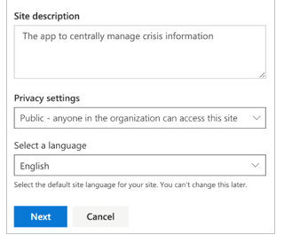

1. Select Next.
1. Optionally add additional owners.
1. Select Finish.

### Create the SharePoint lists for app
The app requires multiple lists that store all the data. To automate the
creation of the SharePoint lists, you can use the *DeploySPLists* flow available from the downloaded [assets package](#prerequisites).

#### Import the SharePoint list deployment flow
1. Go to [flow.microsoft.com](https://flow.microsoft.com)
1. Select **My flows** from the left navigation.
1. Select the **Import** button in the command bar.
1. Upload the **DeploySPList.zip** package from the GitHub repository.

    

1. Add a SharePoint connection for the new Flow by selecting the **Select during import** link and completing the form.

    

1. If you need to create a new SharePoint connection, start by selecting
 **Create new** in the import setup pane.
1. Select **New connection** in the command bar:

    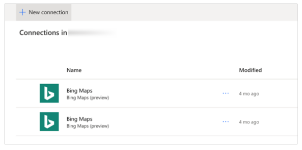

1. Search for the name of the connection, for example *SharePoint*.
1. Select the appropriate connection.
1. Select **Save**.
1. Select **Import**.

#### Edit the SharePoint list deployment flow

1. Once the import is done, go back to **My flows** and refresh the list of
    Flows
1. Select the newly imported flow **DeploySPList**.
1. Select **Edit** from the command bar.
1. Open the card called **Variable – Target Site for Lists**.
1. Change the value to the name of your SharePoint site.
1. Open the card called **Variable – App name**.
1. Change the value to the name of your app; by default, it is "Crisis Communication".

    

1. Select **Save** to commit your changes.

#### Run the SharePoint list deployment flow

1. Go back to the detail screen for the **DeploySPList flow.**
1. Select **Run** from the command bar.
1. Select **Continue** to and then **Run flow** to trigger the flow.

    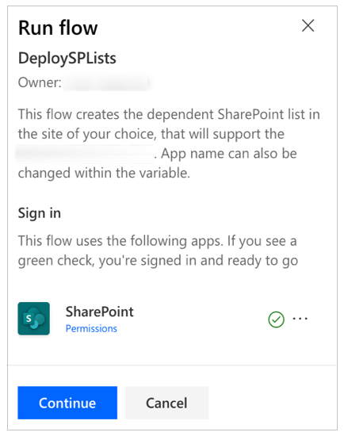

    

> [!NOTE]
> You may receive an error stating that location services are required.
  If this happens, please allow location services to Power Automate and refresh the page before trying again.

The flow will then create the following SharePoint lists within your defined
Share

| **Display Title**| **Purpose** | **Description** |
|-|-|-|
| CI_LogosAssets| To hold logo, and/or other images to be referenced from the app. The logo will be referenced in Power Apps by a direct link or via the ID number of the desired Logo. | Library for related logo(s) and other image assets for the [App Name] app. |
| CI_configAdminSetup | For feature configuration by the Admin of the tool. **Note**: This list should be read only to all members who are not admins. | Admin configuration list for the [App Name] app.
| CI_Contacts | Using the default Contacts Content type to capture information about contacts. (No people picker included – so may require maintenance to ensure data is up to date.)  **Note**: This depends on the global contact list type as a default content type in the list. | Contacts List for the [App Name] app.|
| CI_CompanyNews || Collection of Company News Items. | List for the management of news items visible in the [App Name] app. The Deprecated column can be used to filter news items out of the app (retaining them as a record). | 
| CI_FAQ  | Frequently asked questions. | Frequently Asked Questions for the [App Name] app. The Deprecated column can be used to filter FAQ items out of the app (retaining them as a record). |
| CI_UsefullLinks | Useful hyperlinks list | Useful hyperlinks list for the [App Name] app. The Deprecated column can be used to filter hyperlink items out of the app (retaining them as a record). |
| CI_Employee | Tracking current employee presence status. Examples: *working from home*; *out sick*; *on personal leave*; and *out on vacation*.  **Note**: *coming to work* is assumed and not included in the list options. | Useful hyperlinks list for the [App Name] app. The Deprecated column can be used to filter links items out of the app (retaining them as a record). |
| CI_HelpfulTips             | Users may contribute helpful tips to peers. | List for the management of shared tips for the [App Name] App. The Deprecated column can be used to remove tips from the app views (retaining them as a record in SPO).  |

> [!NOTE]
> - All list columns listed above should be considered as dependencies.
    Please protect the lists from accidental schema changes (for example, adding
    new columns is allowed, but deleting columns may break the app.)
> - Use caution when deleting list items; deleting list items deletes historical records. You can toggle deprecation value from *No* to *Yes* to drop records from contacts, news, FAQs or links.

## Import and setup the Crisis Communication app

Now that all the SharePoint lists are created, you can now import the app and
connect it to your new data sources.

> [!NOTE]
> If you do not want to use the admin app, you can also edit these same properties by editing the SharePoint lists manually.

### Import the app

1. Sign in to [Power Apps](https://make.powerapps.com).
1. Select **Apps** from the left navigation.
1. Select **Import** from the command bar.
1. Upload the **CrisisCommunication.zip** file from the GitHub repository:

    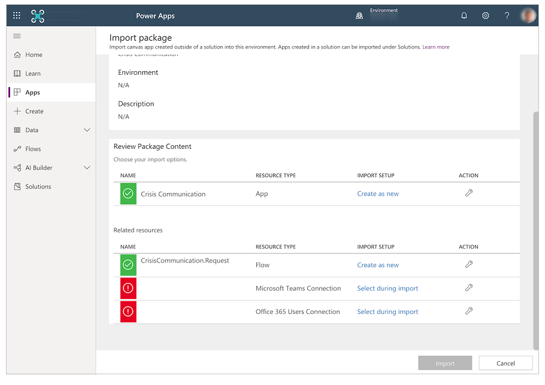

1. Select **Import**.

### Update the SharePoint connections

1. Go back to the **Apps** list.
1. Select **More Commands** (...) for **Crisis Communication** app.
1. Select **Edit** from the contextual menu:

    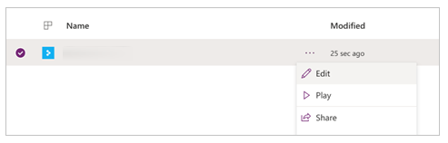

1. **Sign in** or create any necessary connections and select **Allow**:

    

1. Navigate to the data sources in the left pane:

    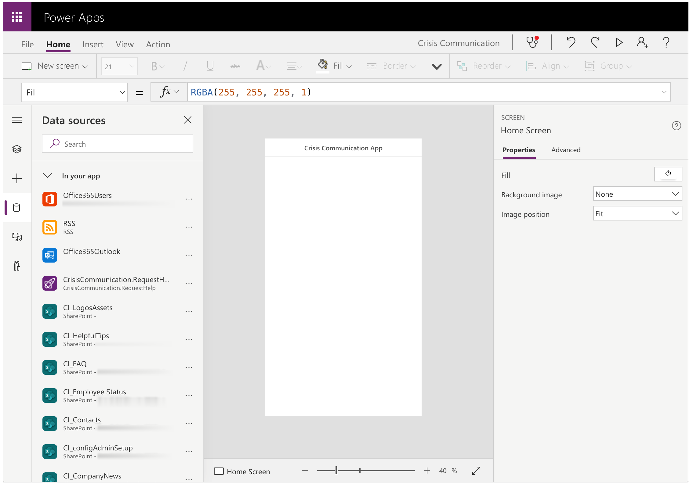

1. **Remove** existing SharePoint lists inside of the app as they do
    not point to your current SharePoint site:

    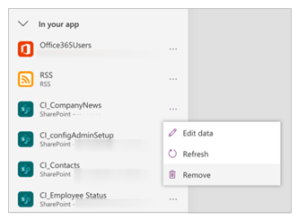

1. Add the lists from your own SharePoint site. Start by
    searching for SharePoint in the search bar:

    

1. Select **SharePoint** and choose a connection:

    

1. Copy and paste the URL to your SharePoint site in the text field and select
    **Connect**:

    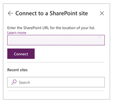

1. Select all the SharePoint lists and libraries and select **Connect**:

    

1. **Save** and **Publish** the app.

### Update the request help Flow
This flow will send an adaptive card to a central Teams team requesting help.

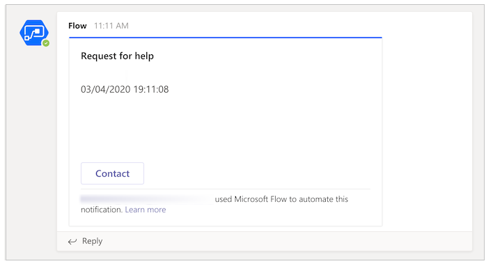

Before completing these step, first create a Teams team for your crisis management team. Once you do, you can get the ID for it
and bring it into your flow. If you need help creating a Teams team, jump to [Create a central crisis management Teams team]() NEEDS A LINK

1. Navigate to the Teams channel that you want to post all of your help requests to
1. Select the **...** menu for the channel.
1. Select **Get link to channel**

    

1. Copy link and paste it in a text editor

    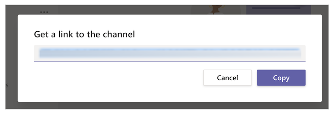

1. Extract the Team ID, which is everything after `groupId=` and before `&tenantId=`.   For example, in the following URL, the channel ID would be `8bc7c0c2-0d4c-4fb8-af99-32da74c9237b`:
   
   `https://teams.microsoft.com/l/channel/19%3ab2fa9fc20f3042a9b63fc5890e1813f8%40thread.tacv2/General?groupId=8bc7c0c2-0d4c-4fb8-af99-32da74c9237b&tenantId=72f988bf-86f1-41af-91ab-2d7cd011db47`,
   
1. Extract the channel ID, which is everything after `https://teams.microsoft.com/l/channel/` and before `/General`.   For example, in the following URL, the channel ID would be `19%3ab2fa9fc20f3042a9b63fc5890e1813f8%40thread.tacv2`:
   
   `https://teams.microsoft.com/l/channel/19%3ab2fa9fc20f3042a9b63fc5890e1813f8%40thread.tacv2/General?groupId=8bc7c0c2-0d4c-4fb8-af99-32da74c9237b&tenantId=72f988bf-86f1-41af-91ab-2d7cd011db47`,
   
1. Navigate to [flow.microsoft.com](https://flow.microsoft.com)
1. Select **My flows** from the left navigation.
1. Select **More commands** (...)  for **CrisisCommunication.RequestHelp** and select **Edit**.
    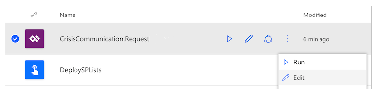
1. Open the **Team Id** card.
1. Paste the Team ID into the **Value** field.
1. Open the **Channel ID** card.
1. Paste the Channel ID into the **Value** field.
    

## Import and setup the admin app
To manage the app you just imported, you'll want to repeat the same steps for the admin app.

1. Sign in to [Power Apps](https://make.powerapps.com).
1. Select **Apps** from the left navigation.
1. Select **Import** from the command bar.
1. Upload the **CrisisCommunicationAdminApp.zip** file from the GitHub repository:

    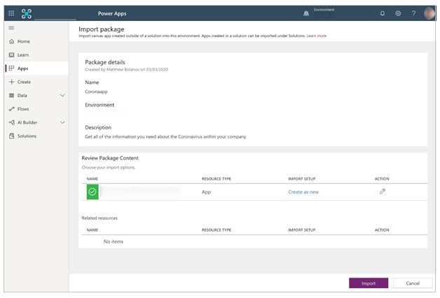

1. Select **Import**.

### Update the SharePoint connections

1. Go back to the **Apps** list.
1. Select **More Commands** (...) for **Crisis Communication Admin App** app.
1. Select **Edit** from the contextual menu:

    

1. **Sign in** or create any necessary connections and select **Allow**:

1. Navigate to the data sources in the left pane:

    

1. **Remove** existing SharePoint lists inside of the app as they do
    not point to your current SharePoint site:

    

1. Add the lists from your own SharePoint site. Start by
    searching for SharePoint in the search bar:

    

1. Select **SharePoint** and choose a connection:

    

1. Copy and paste the URL to your SharePoint site in the text field and select
    **Connect**:

    

1. Select all the SharePoint lists and libraries and select **Connect**:

    

1. **Save** and **Publish** the admin app.

## Create initial content for the app
Now that you have successfully imported both the Crisis Communication app and its admin app, you
can now start creating the initial content. To start, open up the Crisis Communication Admin app.

The admin application allows you to customize all of the information within the Crisis communication app and
also setup key settings for the accompanying flows.

> [!NOTE]
> As a reminder, if you do not want to use the admin app, you can also edit these same properties
  by editing the SharePoint lists manually.

### Setup key parameters under Admin Settings
To initialize your app, you need to provide all of the required fields by navigating to **Admin Settings**.

Complete all of the fields and select **Save** once you are done.

| **Field name** | **Logical name in SharePoint** | **Purpose** |
|-|-|-|
| Admin email | AdminContactEmail | Used to notify others who is administering the application. |
| Logo URL | Logo | The logo of your app which will appear in the top left corner. |
| AAD group ID | AADGroupID | Used to send notifications to end-users about internal company updates via the *Notify users on new crisis communication news* flow. |  
| APP URL | AppURL | The location of the app so that the *Notify users on new crisis communication news* flow can redirect users after selecting **Read more**. | 
| Government RSS Feed | GovernmentRSSFeed | Used to populate the world news feature within the app. Useful if you want to provide additional information to your employees from a trusted source. |
| Notification method | PreferredSentNotification | Used by the *Notify users on new crisis communication news* flow to determine which distribution channel it should use when sending out notifications. |
| Feature flags | Feature1...8 | Used to disable or enable each feature within the application. |

#### Finding the AAD of your distribution group
1. Navigate to [aad.portal.azure.com](https://aad.portal.azure.com)
1. Select **Azure Active Directory** from the left navigation.
1. Select **Groups**.
1. Search for and select your distrobution group.
1. Copy the **Object Id** field.

    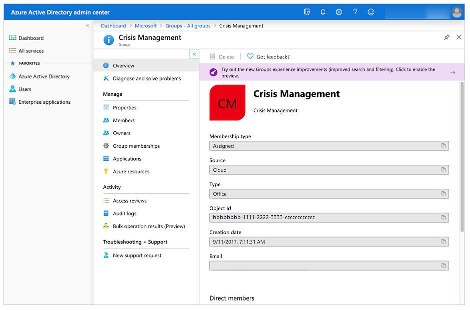

1. Paste the ID into the **AAD group ID** field within the admin application.

### Setup emergency contacts
1. Navigate to **Company Contacts**
1. Select **Create new contact**
1. Complete the form with the contact details

| **Field name** | **Logical name in SharePoint** | **Purpose** |
|-|-|-|
| Full name | FullName | The name of the contact. |
| E-mail | E-mail | The email that will shown for the contact. |
| Country | Country | The country for the contact. This will be used to group the contacts, so can use this field for other groupings if countries doesn't make sense for you |
| Comments | Comments | Shows additional information about the contact; useful to describe when to reach out to this contact. |
| Deprecated | Deprecated | Allows you to hide an existing emergency contact. |

### Setup initial company news
1. Navigate to **Company News**
1. Select **Create new post**
1. Complete the form.

| **Field name** | **Logical name in SharePoint** | **Purpose** |
|-|-|-|
| Title | Title | The title of the update. |
| Details | Details | The full update. You can use HTML in this field. |
| Blurb | Blurb | A short message about the update. This will be used in the *Notify users on new crisis communication news* flow and in the gallery of updates. |
| Deprecated | Deprecated | Allows you to hide an existing post. |

### Setup helpful tips
1. Navigate to **Helpful tips**.
1. Select **New tip**.
1. Complete the form.

| **Field name** | **Logical name in SharePoint** | **Purpose** |
|-|-|-|
| Title | Title | The title of the helpful tip. |
| Resource URL | ResourceURL | An link to additional reading material. (optional) |
| Sub title | SubTitle | A sub title for the tip. (optional) |
| Description | Description | The full description of the helpful tip. |
| Deprecated | Deprecated | Allows you to hide an helpful tip. |

### Setup links
1. Navigate to **Links**.
1. Select **Create new link**.
1. Complete the form.

| **Field name** | **Logical name in SharePoint** | **Purpose** |
|-|-|-|
| Title | Title | The text of the link. |
| URL | URL | The URL of the link. |
| Description | Description | Additional details about the link. (optional) |
| Deprecated | Deprecated | Allows you to hide a link. |

### Setup FAQs
1. Navigate to **FAQ**.
1. Select **Create new FAQ**.
1. Complete the form.

| **Field name** | **Logical name in SharePoint** | **Purpose** |
|-|-|-|
| Title | Title | The question of the FAQ. |
| Rank | Rank | The order of the FAQ. |
| Answer | Answer | The answer to the FAQ |
| Deprecated | Deprecated | Allows you to hide an FAQ. |

## Test and share the app
Now that you've successfully setup all of the data, you can now test the app to make sure it works:

1. Sign in to [Power Apps](https://make.powerapps.com).
2. Select **Apps** from the left navigation.
3. Select **Crisis Communication** to play the app. 

Once you've successfully tested the app, you can share the app with everyone in your company.

## Import and setup the notification flow

The app uses a flow to send notifications to end users whenever there is a new company update.

### Import the news notification flow

1. Navigate to [flow.microsoft.com](https://flow.microsoft.com)
1. Select **My flows** from the left navigation.
1. Select the **Import** button in the command bar.
1. Upload the **CrisisCommunicationNewsNotification.zip** package from the GitHub
    repository:

    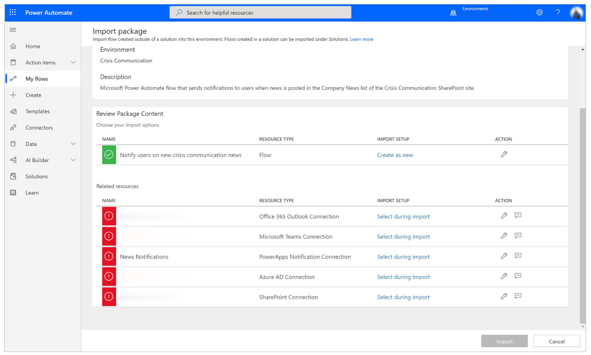

1. Add connections for the new Flow by selecting the **Select during import**
    link for each connection and completing the form:

    

1. If you need to create a new connection, start by selecting **Create new** in the import setup pane.
1. Select **New connection** in the command bar:

    

1. Search for the name of the connection; for example, **PowerApps Notification (preview)**:

    

1. Select the appropriate connection.
1. If you are creating a connection to **PowerApps Notifications (preview),**
    you'll see the following dialog:

    

1. To get the ID, navigate to your **Apps** list.
1. Select the **More Commands** (...) for the **Crisis Communication** app and select details:

    

1. Copy the **App ID**:

    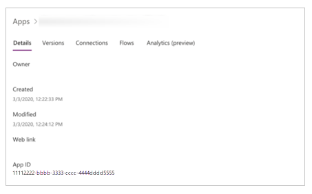

1. Paste the **App ID** into the connection creation dialog and select
    **Create**:

    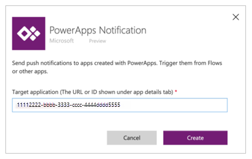

1. Once you've created your new connection, go back to the **Import setup**
    panel and select the **Refresh list** button.
1. Your new connection should now appear and you can select it and select
    **Save**.
1. Select **Import** once you're done adding all of your connections.

    

### Edit the news notification flow

1. Once the import is done, go back to **My flows**.
1. Select the newly imported flow **Notify users on new crisis communication news**.
1. Select **Edit** from the command bar.
1. Open the card called **When a new item is posted**
1. Change the **Site Address** to the name of your SharePoint site.
1. Change the **List name** to **CI_CompanyNews**
1. Open the card called **Get the admin config settings**.
1. Change the **Site Address** to the name of your SharePoint site.
1. Change the **List name** to **CI_configAdminSetup**
1. Open the card called **Initialize variable – Read more text**.
1. Change the **Value** to “Read more” in your native language.

    

1. Select **Save** to commit your changes.

> [!NOTE]
> You may receive an error if one of your connections has not been authorized yet.
  If this happens, please open the card with the unauthorized connection and reauthorize.

### Test the news notification flow
To test the news notification flow, go back to the admin app and create a new internal company update.
Afterwards, all of the users within your distribution list will receive an update by your preferred notification
preference.

> [!NOTE]
> If you run into errors, make sure that you have successfully entered in your distribution group's ID in the admin
  settings within the admin app.

## Monitor office absences with Power BI

Once you have the app deployed and people start to notify that they will be out of the office for various reasons (such
as being sick or working from home) you can now use a Power BI report to track how many and where those people are located.

To start, you can use the sample report 'Presence status report.pbix' available from the downloaded [assets package](#prerequisites).
If needed, download [Power BI Desktop](https://powerbi.microsoft.com/downloads). We will also need some information from
the 'CI_Employee Status' SharePoint list created before, so let's get to it first. Open the list in your site and select List
Settings under the settings icon:

Take a note of the site name and the list id on the browser address bar:

At this point we are ready to open the Power BI report; launch Power BI and open the 'Presence status report.pbix'
file. Move the mouse over the right side of the CI_Employee Status data source until you see the ellipsis, select
it and select the 'Edit query' option:

Once the Power Query editor is opened, right-click the CI_Employee Status data source, and select "Advanced Editor":

Here is where we will use the site name and list id from the SharePoint list: copy the new SharePoint site in the
table (1), and the list id in the three places where we have a GUID (2), and select Done.

Finally, select 'Close & Apply' to update the report to pull data from your SharePoint list.

We now have a Power BI report that shows both the geographical information for office absences for the current day, and
a trend of such absences over many days. We can now publish the report so other people in the organization can see it.

## Integrate your app into Teams
Now that you have a functioning app that has been shared with everyone, you can deploy the app using Teams and create
a crisis management team within Microsoft Teams to respond to issues.

### Deploy the app to the app bar
If you are a Teams admin, you can push the app to all of your users within the Teams app bar.

1. Sign in to [Power Apps](https://make.powerapps.com).
1. Select **Apps** from the left navigation.
1. Select the **...** menu for the **Crisis Communication** app.
1. Select **Add to Teams**

1. Select **Download app**

1. Open **Teams**
1. Navigate to **Apps** from the left app bar.
1. Select **Upload a custom app**.
1. If you are a Teams admin, you will see the ability to upload an app for your entire tenant. Select **Upload for Contoso**.

1. Upload the file that you downloaded from Power Apps.
1. Navigate to the [Teams admin center](https://admin.teams.microsoft.com/dashboard)
1. Select **Setup Policies** under **Teams apps** in the left navigation.

1. Select **Global (Org-wide setup)**
1. Select **Add apps**
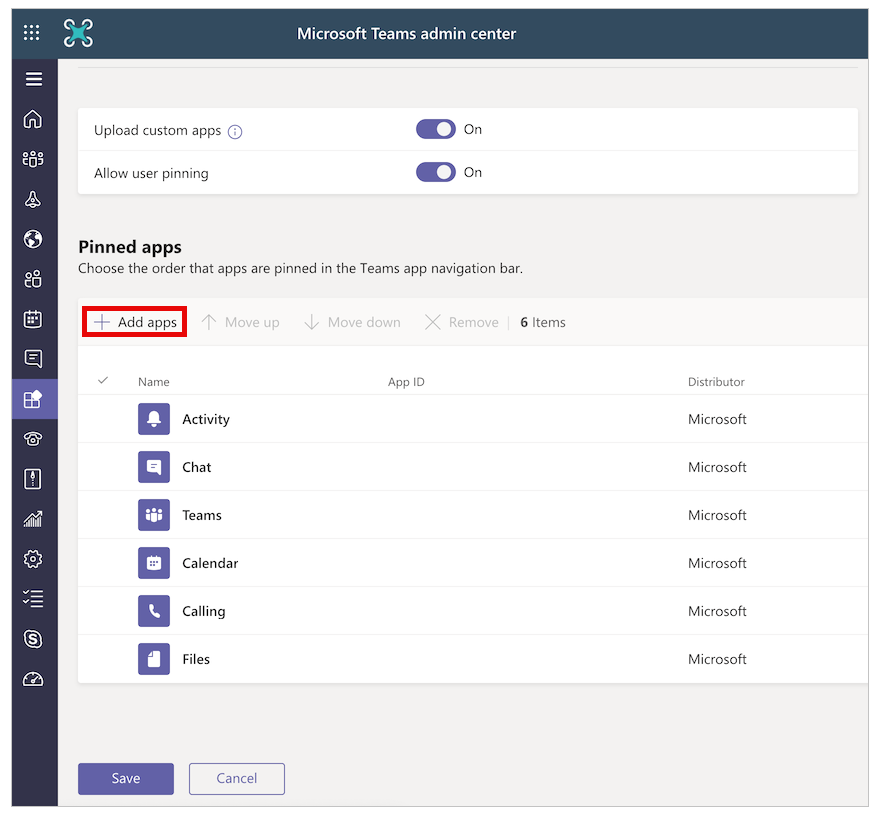
1. Search for and select the **Crisis Information** app you uploaded.

1. Select **Add*.
1. Select **Save**.

> [!NOTE]
> It may take up to 24 hours for users to see the app automatically pinned in their app bar.

### Create a central crisis management Teams team
To coordinate your crisis response, you'll want to create a central Teams team for your crisis management team
and populate it with all of the relevant information.

1. Navigate to Teams
1. Select **Teams** from the left app bar
1. Select **Join or create a Team**
1. Select **Create team** and complete the remaining steps

Once you've successfully created your team, you can pin relevant information as tabs. For example,
you may want to pin the crisis management admin app or the Power BI report to your team. To add the admin app as a tab:

1. Select the **+** button
1. Search for and select **Power Apps**
1. Search for and select **Crisis Information Admin**

1. Select **Save**

To add the Power BI report:
1. Select the **+** button.
1. Search for and select **Power BI**
1. Search for and select your Power BI report
1. Select **Save**

