# Set up and learn about the Crisis Communication sample app in Power Apps

The Crisis Communication sample app provides a user-friendly experience to connect
users with information about a crisis. Quickly get updates on
internal company news, get answers to frequently asked questions, and get access
to important information like links and emergency contacts. This app requires a
small amount of setup to make it your own.

In this walkthrough, you'll learn how to:

- Create a location for your data.
- Import both the Crisis Communication app and its admin app.
- Create content for the app.
- Import flows to send notifications to users.
- Create a centrally managed Teams team to aggregate data and to effectively respond to issues.

Estimated time to complete these steps: **20&ndash;25 minutes**.

> [!NOTE]
> The Crisis Communication sample app is also available for the Power Apps US Government and Power Automate US Government plans. The service URLs for Power Apps and Power Automate US Government versions are different from the commercial versions. More information: [Power Apps US Government service URLs](/power-platform/admin/powerapps-us-government#power-apps-us-government-service-urls) and [Power Automate US Government service URLs](/power-automate/us-govt#power-automate-us-government-service-urls)

## Demo: Crisis Communication app

Watch how to use the Crisis Communication app.

> [!VIDEO https://www.youtube.com/embed/23SypLXiOTw]

## Prerequisites

- [Sign up](https://make.powerapps.com/?utm_source=padocs&utm_medium=linkinadoc&utm_campaign=referralsfromdoc) for Power Apps.
- You must have a valid SharePoint Online license and permission to create lists.
- You must have a public SharePoint site where you can store the data for the app.
- Download the assets from [aka.ms/CrisisCommunicationSolution](https://aka.ms/CrisisCommunicationSolution).

> [!IMPORTANT]
> For any feedback or issues related to the Crisis Communication app, please use the following links:
> - **[Feedback](https://aka.ms/crisis-communication-feedback)**
> - **[Issues](https://aka.ms/crisis-communication-issues)**

## Demo: Build and deploy the Crisis Communication app

Watch how to build and deploy the Crisis Communication app.

> [!VIDEO https://www.youtube.com/embed/Wykrwf9dZ-Y]

## Create a home for your data

Data for the app is stored in SharePoint lists, so the first step is to create a new SharePoint site.

### Create a SharePoint site

1. Sign in to [Office online](https://www.office.com), and then select **SharePoint**.
1. Select **Create site**.

    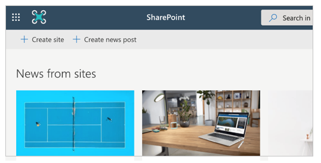

1. Select **Team site**.

    

1. Enter a name and description for your site.
1. Set **Privacy settings** to **Public** so that everyone in the company can get the necessary information.

    

1. Select **Next**.
1. Add additional owners for the site (optional).
1. Select **Finish**.

### Create SharePoint lists for the app

The app uses multiple lists to store its data. You can use the DeploySPLists flow, available from the downloaded [assets package](#prerequisites), to automatically create these lists.

#### Import the SharePoint list deployment flow

1. Go to [flow.microsoft.com](https://flow.microsoft.com).
1. Select **My flows** from the left navigation pane.
1. Select **Import** on the command bar.
1. Upload the **DeploySPLists.zip** package from the GitHub repository.

    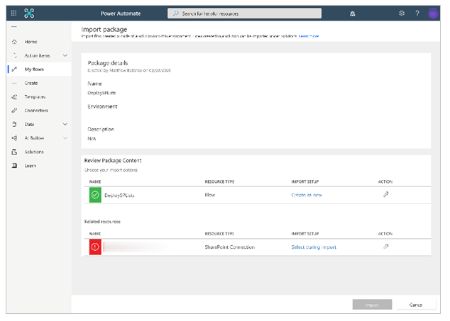

1. Add a SharePoint connection for the new flow by selecting the **Select during import** link and completing the form.

    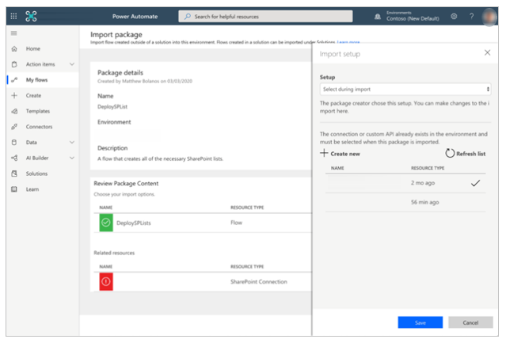

1. If you need to create a new SharePoint connection, select
 **Create new** in the **Import setup** pane.
1. Select **New connection** on the command bar.

    

1. Search for the name of the connection, for example *SharePoint*.
1. Select the connection you created.
1. Select **Save**.
1. Select **Import**.

#### Edit the SharePoint list deployment flow

1. After the import is done, go to **My flows** and refresh the list of flows.
1. Select the newly imported flow, **DeploySPLists**.
1. Select **Edit** on the command bar.
1. Open the **Variable – Target Site for Lists** card.
1. For **Value**, enter the name of your SharePoint site.
1. Open the **Variable – App name** card.
1. For **Value**, enter the name of your app; by default, the name is **Crisis Communication**.

    

1. Select **Save**.

#### Run the SharePoint list deployment flow

1. Go back to the detail screen for the **DeploySPLists** flow.
1. Select **Run** on the command bar.
1. Select **Continue**, and then select **Run flow**.

    

    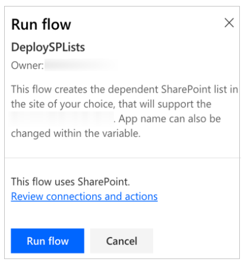

> [!NOTE]
> You might receive an error stating that location services are required.
  If this occurs, allow location services to access Power Automate and refresh the page before trying again.

The flow creates the following SharePoint lists in your SharePoint site.

| **Display title**| **Purpose** | **Description** |
|-|-|-|
| CI_LogosAssets| To hold the logo and/or other images to be referenced from the app. The logo will be referenced in Power Apps by a direct link or via the ID number of the logo you want to use. | The library for related logos and other image assets for the *[App Name]* app. |
| CI_configAdminSetup | Used for feature configuration by the admin of the app.<br>**Note**: This list should be read-only for all members who aren't admins. | Admin configuration list for the *[App Name]* app.
| CI_Contacts | Using the default Contacts Content type to capture information about contacts. (No people picker is included, so this list might need to be manually maintained to ensure its data is up to date.)<br>**Note**: This depends on the global contact list type's being a default content type in the list. | The contacts list for the *[App Name]* app.|
| CI_CompanyNews | Collection of **Company News** items. | A list for managing the news items that appear in the *[App Name]* app. You can use the **Deprecated** column to remove news items from the app views, while retaining them as a record. | 
| CI_FAQ  | Frequently asked questions. | The list of frequently asked questions for the *[App Name]* app. You can use the **Deprecated** column to remove FAQ items from the app views, while retaining them as a record. |
| CI_UsefulLinks | Useful hyperlinks list. | The list of useful hyperlinks for the *[App Name]* app. You can use the **Deprecated** column to remove hyperlink items from the app views, while retaining them as a record. |
| CI_Employee | Tracking current employee presence status. Examples: **working from home**, **out sick**, **on personal leave**, and **out on vacation**.  **Note**: The status **coming to work** is assumed and not included in the list options. | The list of messages that indicate the status of an employee's presence for the *[App Name]* app. You can use the **Deprecated** column to remove status messages from the app views, while retaining them as a record. |
| CI_HelpfulTips             | Helpful tips that users have contributed for their peers. | List for the management of shared tips for the *[App Name]* App. You can use the **Deprecated** column to remove tips from the app views, while retaining them as a record.  |

> [!NOTE]
> - All these list columns should be considered as dependencies.
    Protect the lists from accidental schema changes (for example, adding
    new columns is allowed, but deleting columns might break the app.)
> - Use caution when deleting list items; deleting list items deletes historical records. You can turn the deprecation value toggle from **No** to **Yes** to drop records from contacts, news, FAQs, or links.

## Import and set up the Crisis Communication app

After all SharePoint lists have been created, you can import the app and connect it to your new data sources.

> [!NOTE]
> If you don't want to use the admin app, you can edit these same properties by editing the SharePoint lists manually.

### Import the app

1. Sign in to [Power Apps](https://make.powerapps.com).
1. Select **Apps** from the left navigation pane.
1. Select **Import** on the command bar.
1. Upload the **CrisisCommunication.zip** file from the GitHub repository.

    > [!NOTE]
    > If your tenant is in a GCC environment, upload **CrisisCommunicationGCC.zip**.

    

1. Complete the import setup for **Microsoft Teams Connection** and **Office 365 Users Connection** by selecting the appropriate connections by using the **Select during import** hyperlink. You might have to create a [new connection](add-data-connection.md), if it doesn't already exist.
1. Select **Import**.

### Update the SharePoint connections

1. Go back to the **Apps** list.
1. Select **More commands** (...) for the **Crisis Communication** app.
1. Select **Edit** from the context menu.

    

1. Sign in or create any necessary connections, and then select **Allow**.

1. Go to the data sources in the left pane.

    

1. Remove existing SharePoint lists inside the app, because they don't point to your current SharePoint site.

    

1. Add the lists from your own SharePoint site. Start by
    searching for **SharePoint** in the search bar.

    

1. Select **SharePoint**, and then choose a connection.

    

1. Copy and paste the URL to your SharePoint site in the text field, and then select **Connect**.

    

1. Select all the SharePoint lists and libraries, and then select **Connect**.

    

1. Select **Save**, and then select **Publish**.

### Optional: Enable location updates

This app allows you to record a user's location and store it in your SharePoint site whenever a user sets their status. Your crisis management team can view this data in a Power BI report.

> [!NOTE]
> Enabling location updates is optional. You can skip this section if you don't want to track user location. Additionally, location tracking is currently not supported on Teams desktop.

**To enable location updates**

1. Search for the **btnDateRange** control.
1. Open the **OnSelect** property of the **btnDateRange** control in the formula bar.
1. Copy and paste the following snippet in the formula bar for the **OnSelect** property.

    > [!NOTE]
    > The following snippet is intended to work with versions of the solution that are older than 2020.03.16. For newer versions, edit the code after *// To implement location* comment.


    ```
        UpdateContext({locSaveDates: true});
    // Store the output properties of the calendar in static variables and collections.
    ClearCollect(submittedDates,Sort(Filter(selectedDates,ComponentId=CalendarComponent.Id),Date,Ascending));
    Set(varStartDate,First(submittedDates).Date);
    Set(varEndDate,First(Sort(submittedDates,Date,Descending)).Date);
    // Create a new record for work status for each date selected in the date range.
    ForAll(
        Filter(
            RenameColumns(submittedDates,"Date","DisplayDate"),
            ComponentId=CalendarComponent.Id,
            !(DisplayDate in colDates.Date)
        ),
        Patch('CI_Employee Status',Defaults('CI_Employee Status'),
            {
                Title: varUser.userPrincipalName,
                Date: DisplayDate,
                Notes: "",
                PresenceStatus: LookUp(colWorkStatus,Value=WorkStatusComponent.Selected.Value)
                
                // To implement location, add a comma to the line above and uncomment the lines below for latitude and longitude.
                // Latitude: Text(Location.Latitude),
                // Longitude: Text(Location.Longitude)
            }
        )
    );
        // Update existing dates with the new status.
        ForAll(
            AddColumns(
                Filter(
                    RenameColumns(submittedDates,"Date","DisplayDate"),
                    ComponentId=CalendarComponent.Id,
                    DisplayDate in colDates.Date
                ),
                
                // Get the current record for each existing date.
                "LookUpId",LookUp(RenameColumns(colDates,"ID","DateId"),And(Title=varUser.userPrincipalName,Date=DisplayDate)).DateId
            ),
            Patch('CI_Employee Status',LookUp('CI_Employee Status',ID=LookUpId),
                {
                    PresenceStatus: LookUp(colWorkStatus,Value=WorkStatusComponent.Selected.Value)
                }
            )
        );
        If(
            IsEmpty(Errors('CI_Employee Status')),
            
            // Update the list of work status for the logged-in user.
            ClearCollect(colDates,Filter('CI_Employee Status',Title=varUser.userPrincipalName));
            // Send an email receipt to the logged-in user.
            UpdateContext(
                {
                    locReceiptSuccess: 
                    Office365Outlook.SendEmailV2(
                        // To: send an email to oneself
                        varUser.mail,
                        // Subject
                        Proper(WorkStatusComponent.Selected.Value) & ": " & varStartDate & If(varStartDate<>varEndDate," - " & varEndDate),
                        // Body
                        WorkStatusComponent.Selected.DateRangeReceipt & ": " &
                        // Create a bulleted list of dates
                        "<ul>" & 
                            Concat(submittedDates,"<li>" & Date & Char(10)) &
                        "</ul>"
                    )
                }
            );
            If(
                locReceiptSuccess,
                Notify("You successfully submitted your work status. An email has been sent to you with a summary.",NotificationType.Success,3000),
                Notify("There was an error sending an email summary, but you successfully submitted your work status.",NotificationType.Success,3000);
            );
            
            Navigate('Share to Team Screen',LookUp(colStyles,Key="navigation_transition").Value),
            
            // Case: Error submitting work status
            Notify(varString.WorkStatusError,NotificationType.Warning)
        );
        UpdateContext({locSaveDates: false})
    ```

### Optional: Add additional work status messages

If you want to add more work status messages beyond **work from home** and **out of office**, you can do that by completing the following steps. To begin, you need to update your SharePoint site.

1. Go back to your SharePoint site, and then select **Site contents**.
1. Select **CI_Employee Status**.
1. If the **PresenceStatus** column isn't present, select **Add column**.
1. Select **Show/hide columns**.

    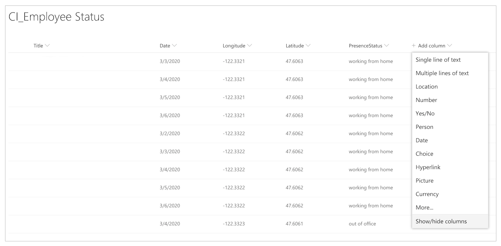

1. Select **PresenceStatus**.
1. Select **Apply**.
1. Select the **PresenceStatus** column.

    

1. Select **Column settings**, and then select **Edit**.

    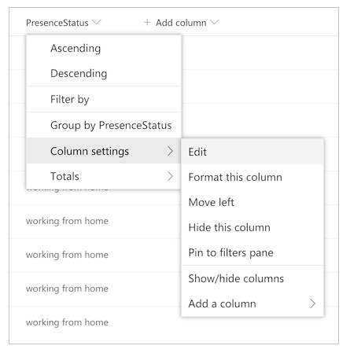

1. Add your additional work status messages in the **Choices** field.

> [!NOTE]
> Record the name of your new choices; you'll use them in subsequent steps.

Now you need to make a few adjustments to the app itself to show your new work status messages.

1. Open the app in Power Apps Studio<!--edit okay?-->.
1. Select the **Work Status** screen.
1. Set the formula bar to the **OnVisible** function.

    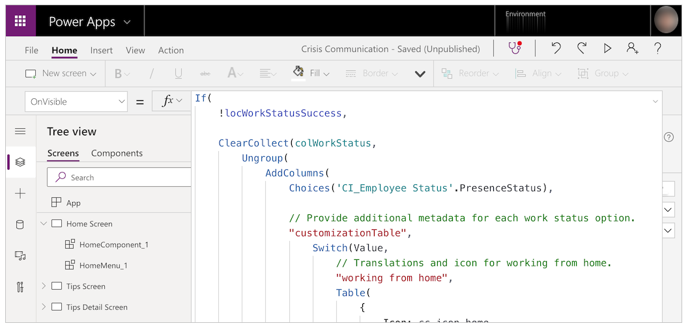

1. Edit the following template, and replace the values with your own.

    ```
        ,"<Name of option in SharePoint list; case sensitive>",
        Table(
            {
                Icon: <Image file>,
                DateRangeQuestion: "Select the dates you'll be <Name of status>.",
                DateRangeReceipt: "You're currently <Name of status>.",
                ShareToTeamEmail: "I'll be <Name of status> on these dates",
                AutoReplyMessage: "I'll be <Name of status> on these dates"
            }
        )
    ```

1. Replace the `/* TEMPLATE FOR ADDITIONAL WORK STATUS OPTIONS */` string with the template.
1. Select **Save**, and then select **Publish**.

### Update the Request for help flow

This flow sends an adaptive card to a central Teams team, requesting help.


Before completing the following step, create a crisis management team in Teams. After you create the team, you can get the ID for it
and bring it into your flow. More information about creating a Teams team: [Create a central crisis management Teams team](#create-a-central-crisis-management-teams-team)

1. Go to the Teams channel that you want to post all your help requests to.
1. Select **More options** (...) for the channel.
1. Select **Get link to channel**.

    

1. Copy the link and paste it in a text editor.

    

1. Extract the **Team ID**, which is everything after `groupId=` and before `&tenantId=`. <br> For example, in the following URL, the group ID is <br>`8bc7c0c2-0d4c-4fb8-af99-32da74c9237b`
   
   `https://teams.microsoft.com/l/channel/19%3ab2fa9fc20f3042a9b63fc5890e1813f8%40thread.tacv2/General?groupId=8bc7c0c2-0d4c-4fb8-af99-32da74c9237b&tenantId=72f988bf-86f1-41af-91ab-2d7cd011db47`
   
1. Extract the **Channel ID**, which is everything after `https://teams.microsoft.com/l/channel/` and before `/General`. <br> For example, in the following URL, the channel ID is<br> `19%3ab2fa9fc20f3042a9b63fc5890e1813f8%40thread.tacv2`
   
   `https://teams.microsoft.com/l/channel/19%3ab2fa9fc20f3042a9b63fc5890e1813f8%40thread.tacv2/General?groupId=8bc7c0c2-0d4c-4fb8-af99-32da74c9237b&tenantId=72f988bf-86f1-41af-91ab-2d7cd011db47`,

1. Go to [flow.microsoft.com](https://flow.microsoft.com).

1. Select **My flows** from the left navigation pane.

1. Select **More commands** (...)  for **CrisisCommunication.Request**, and then select **Edit**.

    

1. Open the **Team Id** card.

1. Paste the team ID into the **Value** field.

1. Open the **Channel ID** card.

1. Paste the channel ID into the **Value** field.

    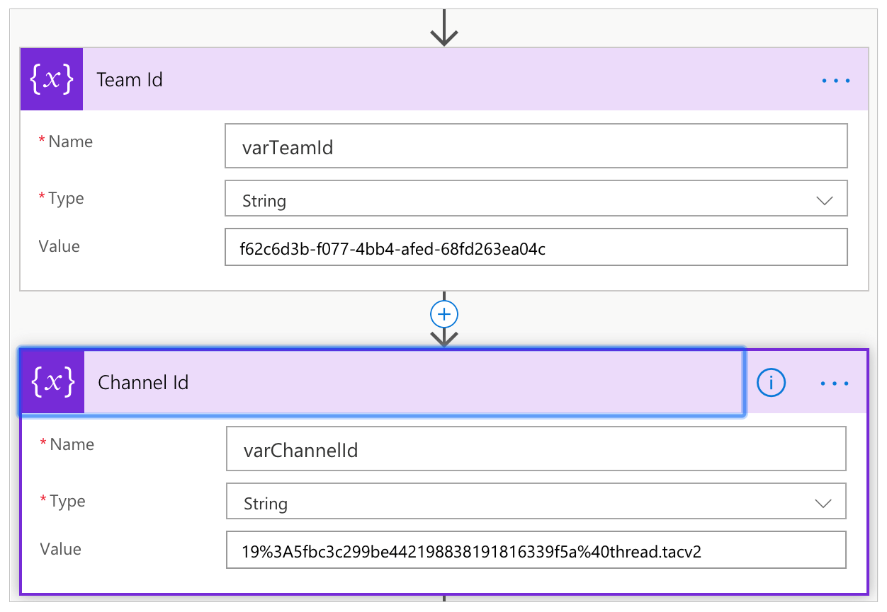

1. Scroll down to the **Get Time** actions and update the action for **Convert time zone** by using your choice of source and destination times.

    

## Optional: Configure a shared inbox<a name="optional-configure-shared-inbox"></a>

The CrisisCommunication.Request flow pulls requests from your inbox before sending them to Teams. If you'd prefer to send request emails to a shared inbox, follow these steps.

> [!NOTE]
> You can skip this section if you don't want to send request emails to a shared inbox.

1. Open the **CrisisCommunication.Request** flow in Edit mode.
1. Select **More commands** (...) from **When an email arrives V3**.
1. Select **Delete**.

     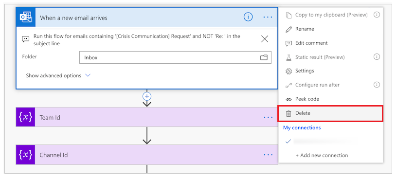

1. Search for and select **When a new email arrives in a shared mailbox (V2)**.
1. Enter the shared inbox address in **Mailbox Address**.
1. Open the **Comments** card.
1. Select **Add a dynamic value** for **Value**.
1. Search for and select **Body**.

     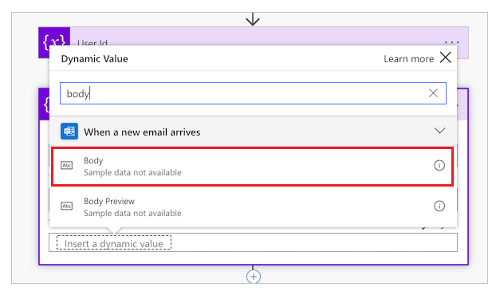

1. Open the **Get user profile card (V2)** card.
1. Select **Add a dynamic value**.
1. Search for and select **From**.

     

## Import and set up the admin app

To manage the app you imported, repeat the same steps for the admin app.

1. Sign in to [Power Apps](https://make.powerapps.com).
1. Select **Apps** from the left navigation pane.
1. Select **Import** on the command bar.
1. Upload the **CrisisCommunicationAdmin.zip** file from the GitHub repository.

    

1. Select **Import**.

### Update SharePoint connections for the admin app

1. Go back to the **Apps** list.
1. Select **More Commands** (...) for **Crisis Communication Admin App**.
1. Select **Edit** from the context menu.

    

1. Sign in or create any necessary connections, and then select **Allow**.

1. Go to the data sources in the left pane.

    

1. Remove existing SharePoint lists inside the app, because they don't point to your current SharePoint site.

    

1. Add the lists from your own SharePoint site. Start by
    searching for **SharePoint** in the search bar.

    

1. Select **SharePoint**, and then choose a connection.

    

1. Copy and paste the URL to your SharePoint site in the text field, and then select
    **Connect**.

    

1. Select all SharePoint lists and libraries, and then select **Connect**.

    

1. Select **Save**, and then select **Publish**.

## Create initial content for the app

At this point, you've successfully imported both the Crisis Communication app and its admin app. You can now start creating the initial content. To start, open the Crisis Communication Admin app.

If you have a GCC environment, you need to enable GCC mode. More information: [How to configure mobile clients for GCC environments](/power-platform/admin/powerapps-us-government#configure-mobile-clients).


You use the admin app to customize all the information in the Crisis Communication app and also to configure key settings for the accompanying flows.

> [!NOTE]
> As a reminder&mdash;if you don't want to use the admin app, you can edit these properties
  by editing the SharePoint lists manually.

### Set up key parameters under Admin Settings

To initialize your app, you need to provide all of the required fields by navigating to **Admin Settings**.

Complete all the fields as shown in the following table, and then select **Save**.

| **Field name** | **Logical name in SharePoint** | **Purpose** | **Example** |
|-|-|-|-|
| Admin email | AdminContactEmail | This is where email requests are sent. They should be set to your email address. If you'd like to send notifications to another inbox, see [optional shared inbox configuration](#optional-configure-shared-inbox), earlier in this article. | admin@contoso.com |
| Logo URL | Logo | The logo of your app that appears in the upper-left corner. | https://contoso.com/logo.png |
| AAD group ID | AADGroupID | Used to send notifications to users about internal company updates via the **Notify users on new crisis communication news** flow. Follow the instructions below to get the Azure Active Directory (Azure AD) ID of your group. | c0ddf873-b4fe-4602-b3a9-502dd944c8d5 |
| APP URL | AppURL | The location of the user app, so that the **Notify users on new crisis communication news** flow can redirect users there after they select **Read more**. | https://apps.preview.powerapps.com/play/\<app URL\>?tenantId=<tenant ID>
| Government RSS Feed | GovernmentRSSFeed | Used to populate the world news feature in the app. Useful if you want to provide additional information to your employees from a trusted source. | https://www.who.int/rss-feeds/news-english.xml |
| Notification method | PreferredSentNotification | Used by the **Notify users on new crisis communication news** flow to determine which distribution channel it should use when sending out notifications. This field is required. | Email, Teams notification, push notification |
| Feature flags | Feature1...8 | Used to disable or enable each feature in the application. |  |

> [!NOTE]
> Teams notification and push notification are currently not supported in GCC.


#### Finding the Azure AD ID for your distribution group

1. Go to [aad.portal.azure.com](https://aad.portal.azure.com).
1. Select **Azure Active Directory** from the left navigation pane.
1. Select **Groups**.
1. Search for and select your distribution group.
1. Copy the **Object Id** field.

    

1. Paste the ID into the **AAD group ID** field in the admin app.

### Set up emergency contacts

1. Go to **Company Contacts**.
1. Select **Create new contact**.
1. Complete the form by using the contact details.

*List schema:*

| **Field name** | **Logical name in SharePoint** | **Purpose** |
|-|-|-|
| Full name | FullName | The name of the contact. |
| E-mail | E-mail | The email address that's shown for the contact. |
| Country | Country | The country for the contact. This field is used to group the contacts; you can use other values to group contacts by if countries don't make sense for you. |
| Comments | Comments | Shows additional information about the contact; useful to describe when to reach out to this contact. |
| Deprecated | Deprecated | Use to hide an existing emergency contact. |

### Set up initial company news

1. Go to **Company News**.
1. Select **Create new post**.
1. Complete the form.

*List schema:*

| **Field name** | **Logical name in SharePoint** | **Purpose** |
|-|-|-|
| Title | Title | The title of the update. |
| Details | Details | The full update. You can use HTML in this field. |
| Blurb | Blurb | A short message about the update. This is used in the **Notify users on new crisis communication news** flow and in the gallery of updates. |
| Deprecated | Deprecated | Use to hide an existing post. |

### Set up helpful tips

1. Go to **Helpful tips**.
1. Select **New tip**.
1. Complete the form.

*List schema:*

| **Field name** | **Logical name in SharePoint** | **Purpose** |
|-|-|-|
| Title | Title | The title of the helpful tip. |
| Resource URL | ResourceURL | A link to additional reading material. (Optional) |
| Sub title | SubTitle | A subtitle for the tip. (Optional) |
| Description | Description | The full description of the helpful tip. |
| Deprecated | Deprecated | Use to to hide a helpful tip. |

### Set up links

1. Go to **Links**.
1. Select **Create new link**.
1. Complete the form.

*List schema:*

| **Field name** | **Logical name in SharePoint** | **Purpose** |
|-|-|-|
| Title | Title | The text of the link. |
| URL | URL | The URL of the link. |
| Description | Description | Additional details about the link. (Optional) |
| Deprecated | Deprecated | Use to hide a link. |

### Set up FAQs

1. Go to **FAQ**.
1. Select **Create new FAQ**.
1. Complete the form.

*List schema:*

| **Field name** | **Logical name in SharePoint** | **Purpose** |
|-|-|-|
| Title | Title | The question in the FAQ. |
| Rank | Rank | The order of the question in the FAQ. |
| Answer | Answer | The answer to the question in the FAQ. |
| Deprecated | Deprecated | Use to hide a question in the FAQ. |

## Test and share the app

Now that you've successfully set up all the data, you can test the app to make sure it works.

1. Sign in to [Power Apps](https://make.powerapps.com).
2. Select **Apps** from the left navigation pane.
3. Select **Crisis Communication** to play the app.

After you've successfully tested the app, you can share it with everyone in your company.

## Import and set up the notification flow

The app uses a flow to send notifications to end users whenever there is a new company update.

### Import the news notification flow

1. Go to [flow.microsoft.com](https://flow.microsoft.com).
1. Select **My flows** from the left navigation pane.
1. Select **Import** on the command bar.
1. Upload the **CrisisCommunicationNewsNotification.zip** package from the GitHub repository.

    > [!NOTE]
    > If your tenant is in a GCC environment, upload **CrisisCommunicationNewsNotificationGCC.zip**.

    

1. Add connections for the new flow by selecting the **Select during import**
    link for each connection, and then completing the form.

    

1. If you need to create a new connection, select **Create new** in the **Import setup** pane.
1. Select **New connection** on the command bar.

    

1. Search for the name of the connection; for example, **PowerApps Notification (preview)**.

    

1. Select the connection you want.
1. If you're creating a connection to **PowerApps Notifications (preview)**,
    you'll see the dialog box as illustrated in the following image.

    

1. To get the ID, go to your **Apps** list.
1. Select **More Commands** (...) for the **Crisis Communication** app, and then select **Details**.

    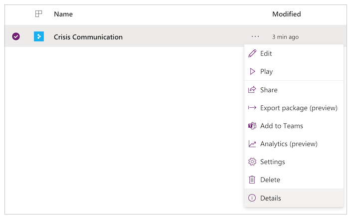

1. Copy the **App ID**.

    

1. Paste the app ID into the connection creation dialog box, and then select **Create**.

    

1. After you've created your new connection, go back to the **Import setup**
    pane and then select **Refresh list**.
1. Your new connection should now appear. Select it, and then select **Save**.
1. After you've finished adding all your connections, select **Import**.

    

### Edit the news notification flow

1. After the import is done, go to **My flows**.
1. Select the newly imported flow, **Notify users on new crisis communication news**.

    > [!NOTE]
    > If you uploaded the GCC package, the flow name is **Notify users on new crisis communication news GCC**.

1. Select **Edit** on the command bar.
1. Open the **When a new item is posted** card.
1. For **Site Address**, enter the name of your SharePoint site.
1. For **List name**, enter **CI_CompanyNews**.
1. Open the **Get the admin config settings** card.
1. For **Site Address**, enter the name of your SharePoint site.
1. For **List name**, enter **CI_configAdminSetup**.
1. Open the **Initialize variable – Read more text** card.
1. For **Value**, enter **Read more** (in your native language).

    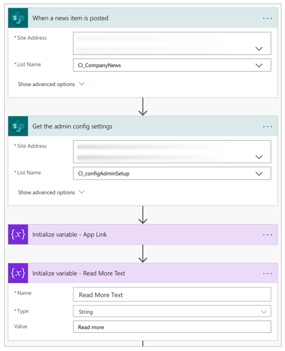

1. Select **Save**.

> [!NOTE]
> You might receive an error if one of your connections hasn't been authorized yet.
  If this occurs, please open the card with the unauthorized connection and reauthorize.


### Optional: Sending notifications to more than 5000 users

The current **Get group members** action is limited to pulling 5000 users for the Office license of Power Automate. Even for the premium license, you may hit throttling limits with the Teams connector if you try to send notifications to too many users. To distribute to more users, you can alter to the flow to send an email to a distribution list instead.

1. Delete the following cards: **Get group members** and **Switch on preferred send notification setting**:

    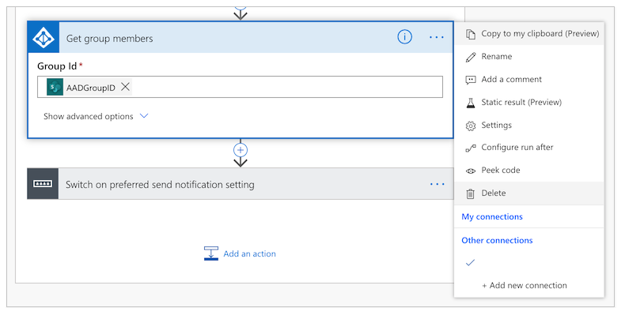

1. Add a new action.

1. Search for and select **Send an email (V2)**:

    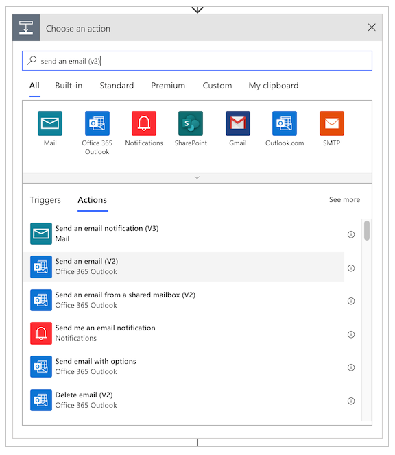

1. In the **To** field, type in the name of your distribution group.

1. In the **Subject** field, select the **Add a dynamic value** button and add the **Title** field from the **When a news item is posted** card:

    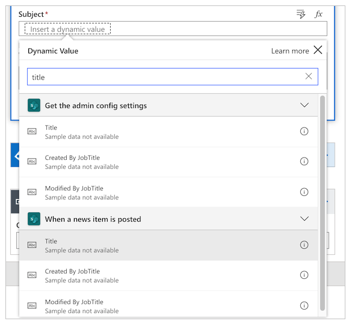

1. In the **Body** field, select the **Add a dynamic value** button and add the **Details** field from the **When a news item is posted** card.

1. Select **Save**.

### Optional: Deep link Teams notification into Teams app

If you would like your Teams notification to open directly into the canvas app
inside of Teams, follow these steps:

1. Update the app URL to point to the Teams deep link in the admin app. <br>
In the admin app, change the app URL to the following, where `App ID` is the ID of your app.

    ```
    https://teams.microsoft.com/l/entity/<APP ID>/<APP ID>
    ```

    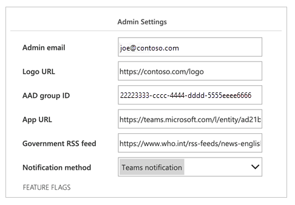

1. Update the app link generated inside of the notification flow. <br> Open the Set App Link Variable card and change the expression for Value to the following:

    ```
    concat(items('Apply_to_each')?['AppUrl'], if(greater(indexOf(items('Apply_to_each')?['AppUrl'], '?'),0),'&','?'), 'context=%7B%22subEntityId%22%3A%22',triggerBody()?['ID'],'%22%7D')
    ```
    

1. Update the canvas app to consume the teams context variable to deep link to the correct news article. <br> For the **OnStart** property of the app, change the Param from `newsid` to `subEntityId`.

    

### Test the news notification flow

To test the news notification flow, go to the admin app and create a new internal company update. Later, all of the users in your distribution list will receive an update by your preferred notification method.

> [!NOTE]
> If you run into errors, make sure that you've successfully entered the group ID of your distribution list in the settings for the admin app.

## Monitor office absences with Power BI

After you've deployed the app and people start to send notifications that they'll be out of the office for various reasons (such
as being sick or working from home), you can use a Power BI report to track how many people have sent notifications and where they're located.  
Note that you need to [enable location tracking](#optional-enable-location-updates) to make the map control work. 

> [!IMPORTANT]
> For the Power BI report to work, you must have at least one entry in the **CI_Employee Status** list.

We'll need some information from
the **CI_Employee Status** SharePoint list we created earlier, so let's get to it first. Open the list in your site, and then select **List Settings** under the **Settings** icon.


Make a note of the site name and list ID on the browser address bar, as shown in the following image.


At this point, we're ready to open the Power BI report. Open Power BI, and then open the **Presence status report.pbix**
file. Hover over the right-hand side of the **CI_Employee Status** data source until you see the ellipsis. Select it, and then select **Edit query**.


After the Power Query editor is opened, right-click the **CI_Employee Status** data source, and then select **Advanced Editor**.


This is where we use the site name and list ID from the SharePoint list.

Copy the new SharePoint site into the SharePoint.Tables string as shown in the following illustration and the list ID in the three places where the GUID is highlighted, and then select **Done**.


If you see any connection errors after updating the connection information, you might need to update the credentials used to connect to the SharePoint list. 

**To update the connection**

1. On the **File** menu, select **Options and settings**, and then select **Data source settings**.

    

1. Select **Edit permissions**.

    

1. Ensure the **Credentials** type is set to **Organizational account**,
and use the credentials to access the SharePoint list.

    

Select **Close & Apply** to update the report to pull data from your SharePoint list.


We now have a Power BI report that shows both the geographical information for office absences for the current day and
a trend of such absences over several days. We can publish the report so other people in the organization can see it.


Your report is now published. You can share it with others in your organization. You can also [schedule the report refresh frequency](/power-bi/refresh-scheduled-refresh).

## Integrate your app into Teams

Now that you have a functioning app that has been shared with everyone, you can deploy the app by creating
a crisis management team within Teams to respond to issues.

### Deploy the app to the app bar

If you're a Teams admin, you can push the app to all your users in the Teams app bar.

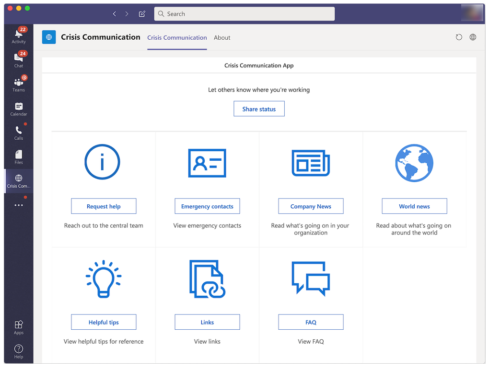

1. Sign in to [Power Apps](https://make.powerapps.com).
1. Select **Apps** from the left navigation pane.
1. Select **More commands** (...) for the **Crisis Communication** app.
1. Select **Add to Teams**.

    

1. Select **Download app**.

    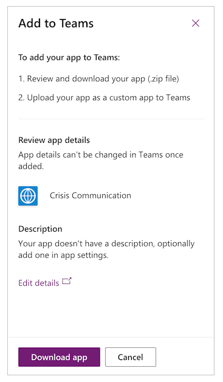

1. Open Teams.
1. Go to **Apps** on the app bar.
1. Select **Upload a custom app**.
1. If you're a Teams admin, you'll be able to upload an app for your entire tenant. Select **Upload for Contoso** (where *Contoso* represents the name of your tenant).

    

1. Upload the file that you downloaded from Power Apps.
1. Go to the [Teams admin center](https://admin.teams.microsoft.com/dashboard).
1. In the left navigation pane under **Teams apps**, select **Setup policies**.

    

1. Select **Global (Org-wide setup)**.
1. Select **Add apps**.

    

1. Search for and select the **Crisis Information** app you uploaded.

    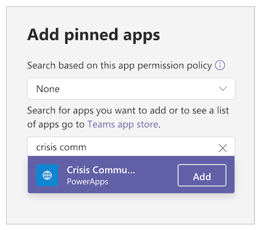

1. Select **Add**.
1. Select **Save**.

> [!NOTE]
> It can take up to 24 hours for users to see the app automatically pinned in their app bar.

### Create a central crisis management team in Teams<a name="create-a-central-crisis-management-teams-team"></a>

To coordinate your crisis response, you'll want to create a central crisis management team in Teams
and populate it with all relevant information. This team only needs to be shared with the central response team.

1. Go to Teams.
1. Select **Teams** from the left app bar.
1. Select **Join or create a Team**.
1. Select **Create team**, and then complete the remaining steps.

    

After you've successfully created your team, you can pin relevant information as tabs. For example,
you might want to pin the crisis management admin app or the Power BI report to your team.

**To add the admin app as a tab**

1. Select the **+** button.
1. Search for and select **Power Apps**.
1. Search for and select **Crisis Information Admin**.

    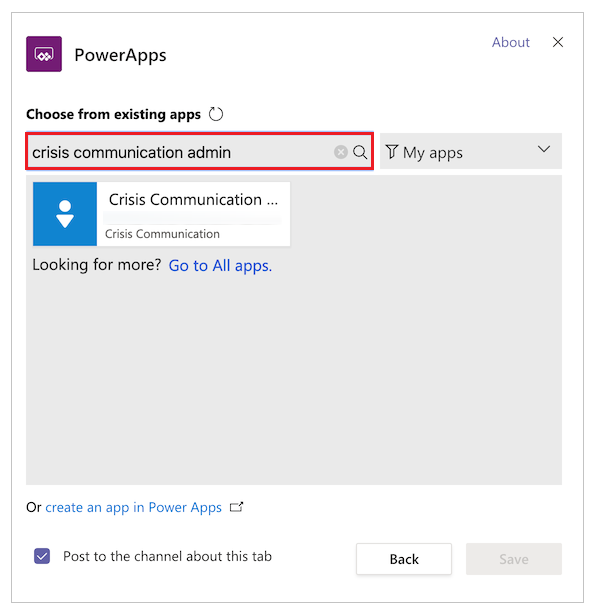

1. Select **Save**.

**To add the Power BI report as a tab**

1. Select the **+** button.
1. Search for and select **Power BI**.
1. Search for and select your Power BI report.
1. Select **Save**.

## FAQ

* **What licenses do I need to run this solution?**

    - The solution in this app uses Office connectors, therefore a seeded Power Apps license from Office is sufficient to run and play the user and admin apps. More information: [Power Platform licensing overview](/power-platform/admin/pricing-billing-skus)
    - If you want to use the Power BI report (packaged as part of the solution), you'll need a Power BI license. More information: [Power BI pricing](https://powerbi.microsoft.com/pricing/)

* **Where should I go if I have feedback about the solution?**

    We'd love to hear about your experience deploying and customizing this solution. To share your experience,
    go to [aka.ms/crisis-communication-feedback](https://aka.ms/crisis-communication-feedback).

* **It looks like I found a bug with the app; where should I go?**

   To file a bug with the solution, go to [aka.ms/crisis-communication-issues](https://aka.ms/crisis-communication-issues).

* **What features aren't currently supported in GCC?**

    The Power Automate bot connector for Teams and the Push Notification connector are currently not available for GCC. Use the email option to alert users about internal news updates instead.

* **How can I update the application?**

    If you would like to update the application, please follow the steps outlined on [aka.ms/CrisisCommunicationSolution](https://aka.ms/CrisisCommunicationSolution).

## Issues and feedback

- For feedback about the Crisis Communication sample template, go to [aka.ms/crisis-communication-feedback](https://aka.ms/crisis-communication-feedback).
- To report an issue with the Crisis Communication app, go to [aka.ms/crisis-communication-issues](https://aka.ms/crisis-communication-issues).

***Disclaimer:*** *This app is a sample and may be used with Microsoft Power Apps and Teams for dissemination of reference information only. This app is not intended or made available for use as a medical device, clinical support, diagnostic tool, or other technology intended to be used in the diagnosis, cure, mitigation, treatment, or prevention of disease or other conditions, and no license or right is granted by Microsoft to use this app for such purposes.  This app is not designed or intended to be a substitute for professional medical advice, diagnosis, treatment, or judgement and should not be used as such.  Customer bears the sole risk and responsibility for any use of this app.  Microsoft does not warrant that the app or any materials provided in connection therewith will be sufficient for any medical purposes or meet the health or medical requirements of any person.* 

### See also

- [Formula reference](formula-reference.md)
- [Controls reference](reference-properties.md)


[!INCLUDE[footer-include](../../includes/footer-banner.md)]