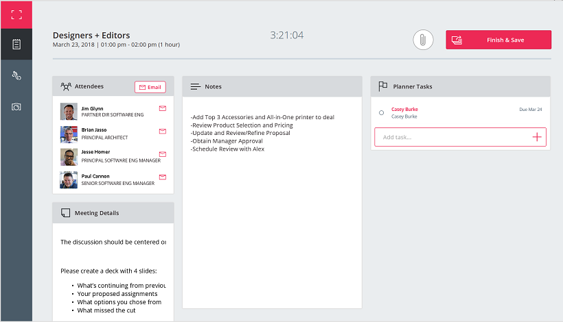

# Set up and learn about the Meeting Capture sample template in Power Apps

## Overview

 In Power Apps, the Meeting Capture sample template is an all-in-one tool for capturing information from meetings as they happen. If you run the app, you can view meeting details, capture notes, take pictures of whiteboards, draw sketches and assign tasks. You can also export all of these items, send them to all meeting attendees, and schedule followup meetings quickly and easily.

## Where can I run the app?

You can run this sample app in your browser, on a tablet, or other device that has a similar form factor.

## How do I open the template and run the app?

[Preview Meeting Capture](https://aka.ms/previewmeetingcapture) or watch these videos to find out more:

- How to [open the template](https://www.youtube.com/watch?v=MTsbjln1AcA&index=1&list=PL8IYfXypsj2B5FizD0ZVVuzf49vr8yXFU).
- How to [run the app](https://youtu.be/mGyxyJL4gJk) from start to finish.

## How do I build the app myself?

Meeting Capture includes a lot of functionality commonly used in Power Apps. By watching these videos, you can explore this functionality and find out how to implement it so you can implement the same functionality and patterns in your own apps.

- [Export content](https://youtu.be/D6kmeM0UFH0) from Power Apps to OneNote.
- [Find available meeting times](https://youtu.be/gSD8m6d_Gv0) for attendees.

Meeting Capture connects to these services in Office 365.

- [Office 365 Users](/connectors/office365users/)
- [Office 365 Outlook](/connectors/office365/)
- [Planner](/connectors/planner/)
- [OneNote (Business)](/connectors/onenote/)
- [Content Conversion](/connectors/conversionservice/)

We hope you enjoy exploring Meeting Capture, and we look forward to hearing how you extend it for your organization!

## Next steps
- [Formula reference](./formula-reference.md)
- [Controls reference](./reference-properties.md)
 

[!INCLUDE[footer-include](../../includes/footer-banner.md)]