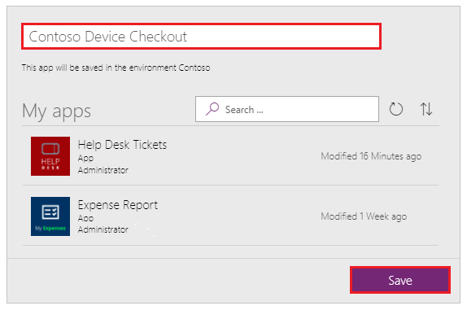
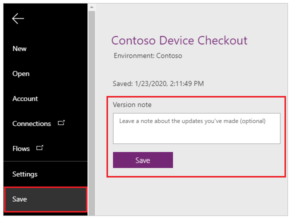
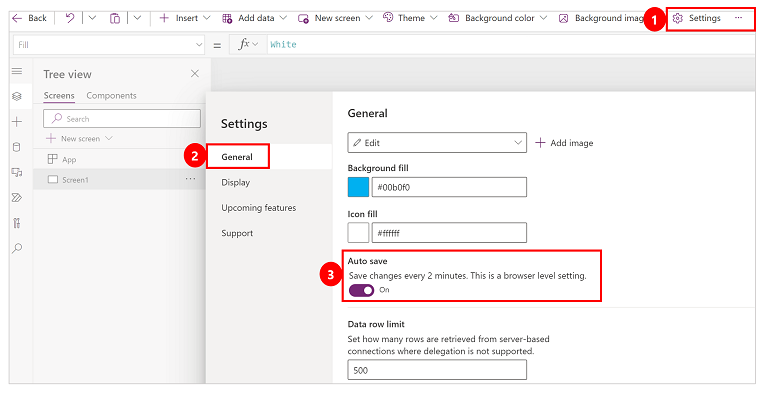
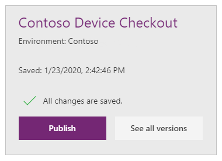
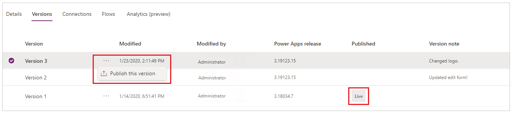

# Save and publish canvas apps

Whenever you save changes to a canvas app, you automatically publish them only for yourself and anyone else who has permissions to edit the app. When you finish making changes, you must explicitly publish them to make them available to everyone with whom the app is shared.

For information about how to share an app, see [Share an app](share-app.md).

## Save changes to an app

In Power Apps Studio, select **Save** on the **File** menu (on the left edge), and then follow either of these steps:

* If you've never saved the app before, selecting **Save** from the **File** menu automatically takes you to **Save as**. Select location as **The cloud**, provide a name for it, and then select **Save**.   

    
* If the app has ever been saved, select **Save**. You can also leave version specific notes or comments.  

    

Power Apps can also periodically save the app every 2 minutes. If you have saved the app once, Power Apps will continue to save a version of the app periodically without requiring the user to press or tap the Save action. Authors can enable or disable the **Auto save** setting from the **Account** tab on the **File** menu.

## Publish an app

1. In Power Apps Studio, select **Save** on the **File** menu (on the left edge), and then select **Publish**.

    
2. In the **Publish** dialog box, select **Publish this version** to publish the app to all users with whom the app is shared.

   

   > [!NOTE]
   > Whenever you publish a canvas app, your app will be upgraded to run on the latest version of Power Apps – which means it will get   the benefit of all the latest features and performance upgrades we’ve added since you last published. If you haven’t published an update in several months, you’ll likely see an immediate performance benefit from republishing now.

## Identify the live version

In [powerapps.com](https://make.powerapps.com?utm_source=padocs&utm_medium=linkinadoc&utm_campaign=referralsfromdoc), select **Apps** on the **File** menu (on the left edge), select the details icon for an app, and then select the **Versions** tab.

The **Live** version is published for everyone with whom the app is shared. The most recent version of any app is available only to those who have edit permissions for it.

To publish the most recent version, highlight the version and select ellipsis (...). Then select **Publish this version** from the drop down menu.

## Next steps

* Find and run the app in a [browser](../../user/run-app-browser.md) or on a [phone](/powerapps/maker/canvas-apps/run-canvas-and-model-apps-on-mobile).
* [Rename an app](set-name-tile.md) from powerapps.com.
* [Restore an app](restore-an-app.md) if you have multiple versions of an app.

[!INCLUDE[footer-include](../../includes/footer-banner.md)]