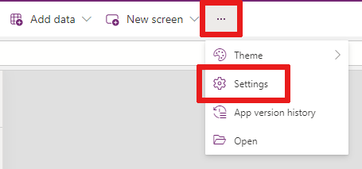

# Save and publish canvas apps

Whenever you save changes to a canvas app, you automatically publish them only for yourself and anyone else who has permissions to edit the app. When you finish making changes, you must explicitly publish them to make them available to everyone with whom the app is shared.

For information about how to share an app, see [Share an app](share-app.md).

 With your app open for editing in [Power Apps Studio](https://create.powerapps.com), in the app actions menu, select **Save** and perform the following actions:

- **Save**: Saves recent and unsaved changes you made to the app in Power Apps Studio. Each time you save changes, a new version is created.
- **Save with version notes**: Save and add notes about the updates you've made.
- **Save as**: Duplicate the app by saving the app with a different name.
- **Save and publish**: Allows you to save the app and publish it at the same time.
- **Download a copy**: Downland a local copy of the app.

> [!div class="mx-imgBorder"] 
> 

Power Apps can also periodically save the app every 2 minutes. If you've saved the app once, Power Apps will continue to save a version of the app periodically without requiring the user to press or tap the Save action. Authors can enable or disable the **Auto save** by going to **Setting** > **General**.

   > [!NOTE]
   > - Whenever you publish a canvas app, your app will be upgraded to run on the latest version of Power Apps – which means it will get the benefit of all the latest features and performance upgrades we’ve added since you last published. If you haven’t published an update in several months, you’ll likely see an immediate performance benefit from republishing now.
   > - To allow users to retrieve app details faster on app startup, certain data will be locally stored on users' devices in the browser cache. Information that will be stored includes app, environment, and connection details. This data will stay stored in the browser based on each browsers’ storage limits. Users can clear stored data based on [instructions for each browser](/troubleshoot/power-platform/power-apps/troubleshooting-startup-issues)

## Create an app description with Copilot (preview)

[This section is prerelease documentation and is subject to change.]

If your app is in a [managed  environment](/power-platform/admin/managed-environment-overview), you can use AI to help you create a description for your app.

When you save and publish your app, on the **Getting ready to publishing** dialog box select, **Create descriptions using AI**.

You can also generate an app description by going to, **Settings** > **General**. Under **Description** select, **Create descriptions using AI**.

> [!IMPORTANT]
> - To use this capability your app must be in a [managed  environment](/power-platform/admin/managed-environment-overview).
> - Preview features aren’t meant for production use and may have restricted functionality. These features are available before an official release so that customers can get early access and provide feedback.
> - For more information, go to our [preview terms](https://go.microsoft.com/fwlink/?linkid=2189520).
> - This capability is powered by [ Azure OpenAI Service](/azure/cognitive-services/openai/overview).
> - This capability is in process of rolling out, and may not be available in your region yet.
> - This capability  may be subject to usage limits or capacity throttling.
> - To understand capabilities and limitations of AI-powered and Copilot features in Power Apps, see [Responsible AI FAQs for Power Apps](../common/responsible-ai-overview.md)

## Identify the live version

To see all versions of an app, go to [Power Apps](https://make.powerapps.com?utm_source=padocs&utm_medium=linkinadoc&utm_campaign=referralsfromdoc) > **Apps** > select your app > **Details** > **Versions**.

The **Live** version is published for everyone with whom the app is shared. The most recent version of any app is available only to those users who have edit permissions for it.

To publish the most recent version, highlight the version and select ellipsis (...). Then select **Publish this version** from the drop-down menu.

> [!NOTE]
> - Changes from a newly published version of an app may take a few seconds to reflect when launching the app. Publish time depends on the complexity of apps, so expect more complex apps to take a few more minutes to publish.
> - If you already have an app open while a new version is published, you must reload the app to get the latest changes.
> - To reduce the time users wait to access your app, the app preload capability is turned on. You can chose to turn it off. Learn more [here](performance-tips.md#enable-preload-app-for-enhanced-performance).

## In-app notifications for an updated version of the app

Depending on the complexity of an app, changes that are recently published may not be available when a user launches the app. If this happens, users will get a toast notification stating **A new version of this app is coming. We'll let you know when it's available.** When the published changes are ready, users will see a notification stating **You're using an old version of this app. Refresh to use the latest version**. Users can select the **Refresh** button to see the latest version of the app.

The following table shows the scenarios where this notification is available.

| Scenario | Availability |
| - | - |
| Canvas app on web | Generally available |
| Customized SharePoint Forms | Not available |
| Canvas app embedded in Teams | Not available | 
| Canvas app embedded in PowerBI | Not available |
| Power Apps web part | Not available |
| Canvas app embedded in iframe | Generally available |

## Next steps

* Find and run the app in a [browser](../../user/run-app-browser.md) or on a [phone](../../mobile/run-powerapps-on-mobile.md).
* [Rename an app](set-name-tile.md) from [Power Apps](https://make.powerapps.com?utm_source=padocs&utm_medium=linkinadoc&utm_campaign=referralsfromdoc).
* [Restore an app](restore-an-app.md) if you have multiple versions of an app.

[!INCLUDE[footer-include](../../includes/footer-banner.md)]
