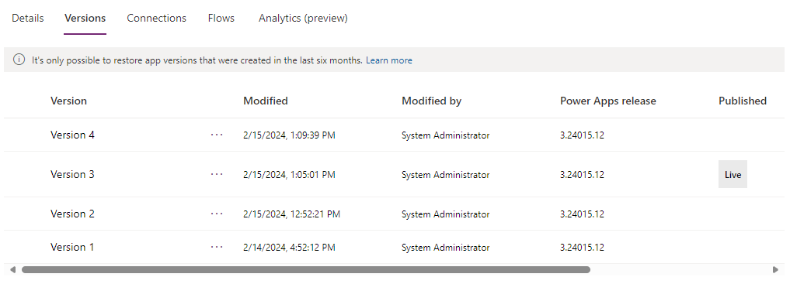

# Save and publish an app in PowerApps
Whenever you save changes to an app, you automatically publish them only for yourself and anyone else who has permissions to edit the app. When you finish making changes, you must explicitly publish them to make them available to everyone with whom the app is shared.

For information about how to share an app, see [Share an app](share-app.md).

## Save changes to an app
In PowerApps Studio, click or tap **Save** on the **File** menu (on the left edge), and then follow either of these steps:

* If you've never saved the app before, provide a name for it, and then click or tap **Save**.

    
* If the app has ever been saved, click or tap **Save**.  

    

PowerApps can also periodically save the app every 2 minutes. If you have saved the app once, PowerApps will continue to save a version of the app periodically without requiring the user to press or tap the Save action. Authors can enable or disable the **Auto save** setting from the **Account** tab on the **File** menu.

## Publish an app
1. In PowerApps Studio, click or tap **Save** on the **File** menu (on the left edge), and then click or tap **Publish this version**.

    
2. In the **Publish** dialog box, tap or click **Publish this version** to publish the app to all users with whom the app is shared.

   

   > [!NOTE]
> We recommend that you update and/or re-publish your app within six months of last publishing it to keep it in sync with the latest version of PowerApps. If you don't update and/or re-publish within six months, the app may stop working without warning.

## Identify the live version
In [powerapps.com](https://web.powerapps.com), click or tap **Apps** on the **File** menu (on the left edge), click or tap the details icon for an app, and then click or tap the **Versions** tab.

The **Live** version is published for everyone with whom the app is shared. The most recent version of any app is available only to those who have edit permissions for it.

To publish the most recent version, click or tap **Publish this version**, and then click or tap **Publish this version** in the **Publish** dialog box.

## Next steps
* [Rename an app](set-name-tile.md) from powerapps.com.
* [Restore an app](restore-an-app.md) if you have multiple versions of an app.
