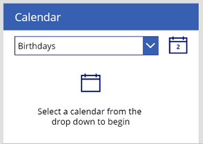
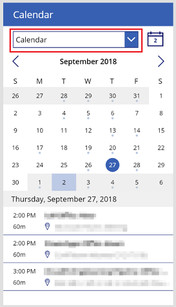

# Calendar-screen template in canvas apps

In a canvas app, add a calendar screen that shows users upcoming events from their Office 365 Outlook accounts. Users can select a date from a calendar and scroll through a list of that day's events. You can change which details appear in the list, add a second screen that shows more details about each event, show a list of attendees for each event, and make other customizations.

You can also add other template-based screens that show different data from Office 365, such as [email](email-screen-overview.md), [people](people-screen-overview.md) in an organization, and [availability](meeting-screen-overview.md) of people users might want to invite to a meeting.

This overview teaches you:
> [!div class="checklist"]
> * How to use the default calendar screen.
> * How to modify it.
> * How to integrate it into an app.

For a deeper dive into this screen's default functionality, see the [calendar-screen reference](calendar-screen-reference.md).

## Prerequisite

Familiarity with how to add and configure screens and other controls as you [create an app in Power Apps](../data-platform-create-app-scratch.md).

## Default functionality

To add a calendar screen from the template:

1. [Sign in](https://make.powerapps.com?utm_source=padocs&utm_medium=linkinadoc&utm_campaign=referralsfromdoc) to Power Apps, and then create an app or open an existing app in Power Apps Studio.

    This topic shows a phone app, but the same concepts apply to a tablet app.

1. On the **Home** tab of the ribbon, select **New screen** > **Calendar**.

    By default, the screen looks similar to this:

    

1. To show data, select an option in the drop-down list near the top of the screen.

    

A few helpful notes:

* Today's date is selected by default, and you can easily return to it by selecting the calendar icon in the upper-right corner.
* If you select a different date, a circle surrounds it, and a light-colored rectangle (blue if the default theme is applied) surrounds today's date.
* If at least one event is scheduled for a particular date, a small colored circle appears under that date in the calendar.
* If you select a date for which one or more events are scheduled, the event(s) appear in a list under the calendar.

## Modify the screen

You can modify the default functionality of this screen in a few common ways:

* [Specify the calendar](calendar-screen-overview.md#specify-the-calendar).
* [Show different details about an event](calendar-screen-overview.md#show-different-details-about-an-event).
* [Hide nonblocking events](calendar-screen-overview.md#hide-nonblocking-events).

If you want to modify the screen further, use the [calendar-screen reference](./calendar-screen-reference.md) as a guide.

### Specify the calendar

If you already know which calendar your users should view, you can simplify the screen by specifying that calendar before you publish the app. This change removes the need for the drop-down list of calendars, so you can remove it.

1. Set the **[OnStart](../controls/control-screen.md)** property of the default screen in the app to this formula:

    ```powerapps-dot
    Set( _userDomain, Right( User().Email, Len( User().Email ) - Find( "@", User().Email ) ) );
    Set( _dateSelected, Today() );
    Set( _firstDayOfMonth, DateAdd( Today(), 1 - Day( Today() ), Days ) );
    Set( _firstDayInView, 
        DateAdd( _firstDayOfMonth, -( Weekday( _firstDayOfMonth) - 2 + 1 ), Days )
    );
    Set( _lastDayOfMonth, DateAdd( DateAdd( _firstDayOfMonth, 1, Months ), -1, Days ) );
    Set( _calendarVisible, false );
    Set( _myCalendar, 
        LookUp( Office365.CalendarGetTables().value, DisplayName = "{YourCalendarNameHere}" )
    );
    Set( _minDate, 
        DateAdd( _firstDayOfMonth, -( Weekday(_firstDayOfMonth) - 2 + 1 ), Days )
    );
    Set( _maxDate, 
        DateAdd(
            DateAdd( _firstDayOfMonth, -( Weekday(_firstDayOfMonth) - 2 + 1 ), Days ),
            40, 
            Days 
        )
    );
    ClearCollect( MyCalendarEvents, 
        Office365.GetEventsCalendarViewV2( _myCalendar.Name, 
            Text( _minDate, UTC ), 
            Text( _maxDate, UTC ) 
        ).value
    );
    Set( _calendarVisible, true )
    ```

    > [!NOTE]
    > This formula is slightly edited from the default value of the **OnSelect** property of the drop-down list for selecting a calendar. For more information about that control, see its section in the [calendar-screen reference](./calendar-screen-reference.md#calendar-drop-down).

1. Replace `{YourCalendarNameHere}`, including the curly braces, with the name of the calendar that you want to show (for example, **Calendar**).

    > [!IMPORTANT]
    > The following steps assume that you've added only one calendar screen to the app. If you've added more than one, control names (such as **iconCalendar1**) will end with a different number, and you'll need to adjust the formulas accordingly.

1. Set the **Y** property of the **iconCalendar1** control to this expression:

    `RectQuickActionBar1.Height + 20`

1. Set the **Y** property of the **LblMonthSelected1** control to this expression:

    `iconCalendar1.Y + iconCalendar1.Height + 20`

1. Set the **Text** property of the **LblNoEvents1** control to this value:

    `"No events scheduled"`

1. Set the **Visible** property of **LblNoEvents1** to this formula:

    `CountRows(CalendarEventsGallery1.AllItems) = 0 && _calendarVisible`

1. Delete these controls:

    - **dropdownCalendarSelection1**
    - **LblEmptyState1**
    - **iconEmptyState1**

1. If the calendar screen isn't the default screen, add a button that navigates from the default screen to the calendar screen so that you can test the app.

    For example, add a button on **Screen1** that navigates to **Screen2** if you added a calendar screen to an app that you created from blank.

1. Save the app, and then test it in a browser or on a mobile device.

### Show different details about an event

By default, the gallery under the calendar, named **CalendarEventsGallery**, shows the start time, the duration, the subject, and the location of each event. You can configure the gallery to show any field (such as the organizer) that the [Office 365 connector](/connectors/office365/#calendareventclientreceive) supports.

1. In **CalendarEventsGallery**, set the **Text** property of a new or an existing label to `ThisItem` followed by a period.

    IntelliSense lists the fields that you can select.

1. Select the field that you want.

    The label shows the type of information that you specified.

### Hide nonblocking events

In many offices, team members send meeting requests to notify each other when they'll be away from the office. To avoid blocking everyone's schedules, the person sending the request sets its availability to **Free**. You can hide these events from the calendar and the gallery by updating a couple of properties.

1. Set the **Items** property of **CalendarEventsGallery** to this formula:

    ```powerapps-dot
    SortByColumns(
        Filter(
            MyCalendarEvents,
            Text( Start, DateTimeFormat.ShortDate ) = 
                Text( _dateSelected, DateTimeFormat.ShortDate ),
            ShowAs <> "Free"
        ),
        "Start"
    )
    ```

    In this formula, the **Filter** function hides not only those events that are scheduled for a date other than the one selected but also events for which the availability is set to **Free**.

1. In the calendar, set the **Visible** property of the **Circle** control to this formula:

    ```powerapps-dot
    CountRows(
        Filter(
            MyCalendarEvents,
            DateValue( Text(Start) ) = DateAdd( _firstDayInView, ThisItem.Value, Days ),
            ShowAs <> "Free"
        )
    ) > 0 && !Subcircle1.Visible && Title2.Visible
    ```
    This formula contains the same filters as the previous formula. Therefore, the event-indicator circle appears under a date only if it has one or more events that are on the selected date and for which the availability isn't set to **Free**.

## Integrate the screen into an app

The calendar screen is a powerful bundle of controls in its own right, but it usually performs best as part of a larger, more versatile app. You can integrate this screen into a larger app in a number of ways, including adding these options:

* [View event details](calendar-screen-overview.md#view-event-details).
* [Show event attendees](calendar-screen-overview.md#show-event-attendees).

### View event details

If users select an event in **CalendarEventsGallery**, you can open another screen that shows more information about that event.

> [!NOTE]
> This procedure shows event details in a gallery with dynamic content, but you can achieve similar results by taking other approaches. For example, you can get more design control by using a series of labels instead.

1. Add a blank screen, named **EventDetailsScreen**, that contains a blank flexible-height gallery and a button that navigates back to the calendar screen.

1. In the flexible-height gallery, add a **Label** control and an **HTML text** control, and set the **AutoHeight** property of both to **true**.

    > [!NOTE]
    > Power Apps retrieves the message body of each event as HTML text, so you need to show that content in an **HTML text** control.

1. Set the **Y** property of the **HTML text** control to this expression:

    `Label1.Y + Label1.Height + 20`

1. Adjust additional properties as necessary to suit your style needs.

    For example, you might want to add a separator line below the **HTML text** control.

1. Set the **Items** property of the flexible-height gallery to this formula:

    ```powerapps-dot
    Table(
        { Title: "Subject", Value: _selectedCalendarEvent.Subject },
        { 
            Title: "Time", 
            Value: _selectedCalendarEvent.Start & " - " & _selectedCalendarEvent.End 
        },
        { Title: "Body", Value: _selectedCalendarEvent.Body }
    )
    ```

    This formula creates a gallery of dynamic data that's set to the field values of **_selectedCalendarEvent**, which is set every time the user selects an event in the **CalendarEventsGallery** control. You can extend this gallery to include more fields by adding more labels to it, but this set provides a good starting point.

1. With the gallery items in place, set the **Text** property of the **Label** control to `ThisItem.Title`, and the **HtmlText** property of the **HTML text** control to `ThisItem.Value`.

1. In **CalendarEventsGallery**, set the **OnSelect** property of the **Title** control to this formula:

    ```powerapps-dot
    Set( _selectedCalendarEvent, ThisItem );
    Navigate( EventDetailsScreen, None )
    ```

    > [!Note]
    > Instead of using the **_selectedCalendarEvent** variable, you could instead use **CalendarEventsGallery**.Selected.

### Show event attendees

The `Office365.GetEventsCalendarViewV2` operation retrieves a variety of fields for each event, including a semicolon-separated set of required and optional attendees. In this procedure, you'll parse each set of attendees, determine which attendees are in your organization, and retrieve the Office 365 profiles of any who are.

1. If your app doesn't contain the Office 365 Users connector, [add it](../add-data-connection.md).

1. To retrieve the Office 365 profiles of the meeting attendees, set the **OnSelect** property of the **Title** control in the **CalendarEventsGallery** to this formula:

    ```powerapps-dot
    Set( _selectedCalendarEvent, ThisItem );
    ClearCollect( AttendeeEmailsTemp,
        Filter(
            Split( ThisItem.RequiredAttendees & ThisItem.OptionalAttendees, ";" ),
            !IsBlank( Result )
        )
    );
    ClearCollect( AttendeeEmails,
        AddColumns( AttendeeEmailsTemp, 
            "InOrg",
            Upper( _userDomain ) = Upper( Right( Result, Len( Result ) - Find( "@", Result ) ) )
        )
    );
    ClearCollect( MyPeople,
        ForAll( AttendeeEmails, If( InOrg, Office365Users.UserProfile( Result ) ) ) 
    );
    Collect( MyPeople,
        ForAll( AttendeeEmails,
            If( !InOrg, 
                { DisplayName: Result, Id: "", JobTitle: "", UserPrincipalName: Result }
            )
        )
    )
    ```

This list discusses what each **ClearCollect** operation does:

- ClearCollect(AttendeeEmailsTemp)
    ```powerapps-dot
    ClearCollect( AttendeeEmailsTemp,
        Filter(
            Split( ThisItem.RequiredAttendees & ThisItem.OptionalAttendees, ";" ), 
            !IsBlank( Result)
        )
    );
    ```

    This formula concatenates the required and optional attendees into a single string and then splits that string into individual addresses at each semicolon. The formula then filters out blank values from that set and adds the other values into a collection named **AttendeeEmailsTemp**.

- ClearCollect(AttendeeEmails)
    ```powerapps-dot
    ClearCollect( AttendeeEmails,
        AddColumns( AttendeeEmailsTemp, 
            "InOrg",
            Upper( _userDomain ) = Upper( Right( Result, Len(Result) - Find("@", Result) ) )
        )
    );
    ```
    This formula roughly determines whether an attendee is in your organization. The definition of **_userDomain** is simply the domain URL in the email address of the person who's running the app. This line creates an additional true/false column, named **InOrg**, in the **AttendeeEmailsTemp** collection. This column contains **true** if **userDomain** is equivalent to the domain URL of the email address in that particular row of **AttendeeEmailsTemp**.

    This approach isn't always accurate, but it gets pretty close. For example, certain attendees in your org might have an email address like Jane@OnContoso.com, whereas **_userDomain** is Contoso.com. The app user and Jane might work at the same company but have slight variations in their email addresses. For cases such as these, you might want to use this formula:

    `Upper(_userDomain) in Upper(Right(Result, Len(Result) - Find("@", Result)))`

    However, this formula matches email addresses like Jane@NotTheContosoCompany.com with a **_userDomain** like Contoso.com, and those people don't work at the same company.

- ClearCollect(MyPeople)

    ```powerapps-dot
    ClearCollect( MyPeople,
        ForAll( AttendeeEmails, 
            If( InOrg, 
                Office365Users.UserProfile( Result )
            )
        )
    );
    Collect( MyPeople,
        ForAll( AttendeeEmails,
            If( !InOrg, 
                { 
                    DisplayName: Result, 
                    Id: "", 
                    JobTitle: "", 
                    UserPrincipalName: Result
                }
            )
        )
    );
    ```
    To retrieve Office 365 profiles, you must use the  [Office365Users.UserProfile](/connectors/office365users/#userprofile) or [Office365Users.UserProfileV2](/connectors/office365users/#userprofile) operation. These operations first gather all the Office 365 profiles for attendees who are in the user's org. Then the operations add a few fields for attendees from outside the organization. You separated these two items into distinct operations because the **ForAll** loop doesn't guarantee order. Therefore, **ForAll** might collect an attendee from outside the organization first. In this case, the schema for **MyPeople** contains only **DisplayName**, **Id**, **JobTitle**, and **UserPrincipalName**. However, the UserProfile operations retrieve much richer data than that. So you force the **MyPeople** collection to add Office 365 profiles before the other profiles.

    > [!NOTE]
    > You can achieve the same result with only one **ClearCollect** function:

    ```powerapps-dot
    ClearCollect( MyPeople, 
        ForAll(
            AddColumns(
                Filter(
                    Split(
                        ThisItem.RequiredAttendees & ThisItem.OptionalAttendees, 
                        ";"
                    ), 
                    !IsBlank( Result )
                ), 
                "InOrg", _userDomain = Right( Result, Len( Result ) - Find( "@", Result ) )
            ), 
            If( InOrg, 
                Office365Users.UserProfile( Result ), 
                { 
                    DisplayName: Result, 
                    Id: "", 
                    JobTitle: "", 
                    UserPrincipalName: Result, 
                    Department: "", 
                    OfficeLocation: "", 
                    TelephoneNumber: ""
                }
            )
        )
    )
    ```

To finish this exercise:

1. Add a screen that contains a gallery for which the **Items** property is set to **MyPeople**.

1. In the **OnSelect** property of the **Title** control in the **CalendarEventsGallery**, add a **Navigate** function to the screen that you created in the previous step.

## Next steps

* [View the reference documentation for this screen](calendar-screen-reference.md).
* [Learn more about the Office 365 Outlook connector](../connections/connection-office365-outlook.md).
* [Learn more about the Office 365 Users connector](../connections/connection-office365-users.md).


[!INCLUDE[footer-include](../../../includes/footer-banner.md)]