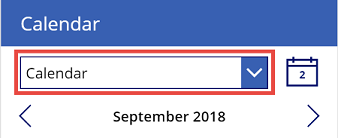
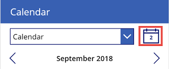
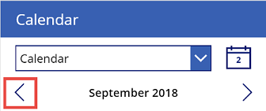
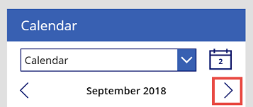
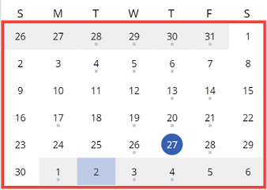
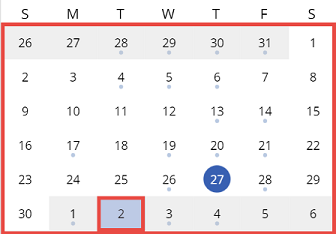
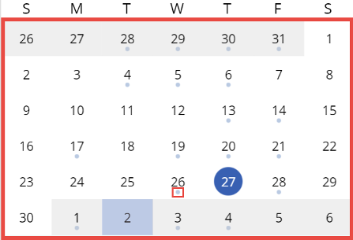
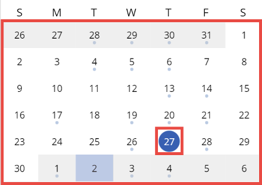
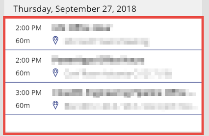

# Reference information about the calendar-screen template for canvas apps

For canvas apps in Power Apps, understand how each significant control in the calendar-screen template contributes to the screen's overall default functionality. This deep dive presents the behavior formulas and the values of other properties that determine how the controls respond to user input. For a high-level discussion of this screen's default functionality, see the [calendar-screen overview](calendar-screen-overview.md).

This topic highlights some significant controls and explains the expressions or formulas to which various properties (such as **Items** and **OnSelect**) of these controls are set:

- [Calendar drop-down (dropdownCalendarSelection)](#calendar-drop-down)
- [Calendar icon (iconCalendar)](#calendar-icon)
- [Previous-month chevron (iconPrevMonth)](#previous-month-chevron)
- [Next-month chevron (iconNextMonth)](#next-month-chevron)
- [Calendar gallery (MonthDayGallery) (+ child controls)](#calendar-gallery)
- [Events gallery (CalendarEventsGallery)](#events-gallery)

## Prerequisite

Familiarity with how to add and configure screens and other controls as you [create an app in Power Apps](../data-platform-create-app-scratch.md).

## Calendar drop-down



- Property: **Items**<br>
    Value: `Office365.CalendarGetTables().value`

    This value is a connector operation that retrieves the app user's Outlook calendars. You can see [the value](/connectors/office365/#entitylistresponse[table]) that this operation retrieves.

- Property: **OnChange**<br>Value: `Select(dropdownCalendarSelection)`

    When the user selects an option in the list, the function in the control's **OnSelect** property runs.

- Property: **OnSelect**<br>
    Value: An **If** function, which appears in the following code block, and several additional functions, which appear in the code block after that.

   This part of the formula runs only the first time that the user selects an option in the drop-down list after opening the app:

    ```powerapps-dot
    If( IsBlank( _userDomain ),
        UpdateContext( {_showLoading: true} );
        Set( _userDomain, Right( User().Email, Len( User().Email ) - Find( "@", User().Email ) ) );
        Set( _dateSelected, Today() );
        Set( _firstDayOfMonth, DateAdd( Today(), 1 - Day( Today() ), Days ) );  
        Set( _firstDayInView, DateAdd( _firstDayOfMonth, -(Weekday(_firstDayOfMonth) - 1), Days ) );
        Set( _lastDayOfMonth, DateAdd( DateAdd( _firstDayOfMonth, 1, Months ), -1, Days ) )  
    );
    ```

    The preceding code defines the following variables:
    
  - **\_userDomain**: The app user's company domain, as reflected in the user's email address.
  - **\_dateSelected**: Today's date (by default). The calendar gallery highlights this date, and the event gallery shows the events that are scheduled for that date.
  - **\_firstDayOfMonth**: The first day of the current month. Because `(Today + (1 - Today)) = Today - Today + 1 = 1`, this **DateAdd** function always returns the first day of the month.
  - **\_firstDayInView**: The first day that the calendar gallery can show. This value isn't the same as the first day of the month unless the month starts on a Sunday. To prevent showing an entire week of the previous month, the value of **\_firstDayInView** is `_firstDayOfMonth - Weekday(_firstDayOfMonth) + 1`.
  - **\_lastDayOfMonth**: The last day of the current month, which is the same as the first day of next month, minus one day.

   The functions after the **If** function run whenever the user selects an option in the calendar drop-down list (not just the first time the user opens the app):

    ```powerapps-dot
    Set( _calendarVisible, false );
    UpdateContext( {_showLoading: true} );
    Set( _myCalendar, dropdownCalendarSelection2.Selected );
    Set( _minDate, 
        DateAdd( _firstDayOfMonth, -(Weekday( _firstDayOfMonth ) - 2 + 1), Days )
    );
    Set(_maxDate, 
        DateAdd(
            DateAdd( _firstDayOfMonth, -(Weekday( _firstDayOfMonth ) - 2 + 1), Days ), 
            40, 
            Days
        )
    );
    ClearCollect( MyCalendarEvents, 
        'Office365'.GetEventsCalendarViewV2( _myCalendar.Name, 
            Text( _minDate, UTC ), 
            Text( _maxDate, UTC )
        ).value
    );
    UpdateContext( {_showLoading: false} );
    Set( _calendarVisible, true )
    ```

    The preceding code defines these variables and one collection:

    - **\_calendarVisible**: Set to **false** so that the calendar doesn't appear while the new selection is loaded.
    - **\_showLoading**: Set to **true** so that loading indicators appear while the new selection is being loaded.
    - **\_myCalendar**: Set to the current value of the **calendar drop-down** control so that events from the correct calendar are retrieved.
    - **\_minDate**: Set to the same value as **\_firstDayInView**. This variable determines what events have already been retrieved from Outlook and cached in the app.
    - **\_maxDate**: Set to the last viewable day in the calendar. The formula is `_firstDayInView + 40`. The calendar displays a maximum of 41 days, so the **\_maxDate** variable always reflects the last viewable day, and determines what events have already been retrieved from Outlook and cached in the app.
    - **MyCalendarEvents**: Set to a collection of the user's events from the selected calendar, ranging from **\_minDate** to **\_maxDate**.
    - **\_showLoading**: Set to **false**; **\_calendarVisible** is set to **true** after everything else has been loaded.

### Color properties

For general color properties, refer to [Color and border properties in Power Apps](../controls/properties-color-border.md).

Unique color properties for calendar drop-down control:

- **ChevronBackground** - Background color for the calendar drop-down.
- **ChevronDisabledBackground** - Background color for the disabled calendar drop-down.
- **ChevronFill** - Fill color for calendar drop-down.
- **ChevronDisabledFill** - Fill color for disabled calendar drop-down.
- **ChevronHoverBackground** - Background color of calendar drop-down when the user keeps the mouse pointer on it.
- **ChevronHoverFill** - Fill color of calendar drop-down when the user keeps the mouse pointer on it.

## Calendar icon



- Property: **OnSelect**<br>
    Value: Four **Set** functions that reset the calendar gallery to today's date:

    ```powerapps-dot
    Set( _dateSelected, Today() );
    Set( _firstDayOfMonth, DateAdd( Today(), 1 - Day( Today() ), Days) );
    Set( _firstDayInView, DateAdd(_firstDayOfMonth, -(Weekday( _firstDayOfMonth ) - 2 + 1), Days));
    Set( _lastDayOfMonth, DateAdd( DateAdd( _firstDayOfMonth, 1, Months ), -1, Days ) )
    ```

    The preceding code resets all date variables that are necessary for displaying the proper calendar view:

    - **\_dateSelected** is reset to today.
    - **\_firstDayOfMonth** is reset to the first day of today's month.
    - **\_firstDayInView** is reset to the first day viewable when today's month is selected.
    - **\_lastDayOfMonth** is reset to the last day of today's month.

    The [**Calendar drop-down**](#calendar-drop-down) section of this topic explains these variables in more detail.

## Previous-month chevron



- Property: **OnSelect**<br>Value: Four **Set** functions and an **If** function that show the previous month in the calendar gallery:

    ```powerapps-dot
    Set( _firstDayOfMonth, DateAdd( _firstDayOfMonth, -1, Months ) );
    Set( _firstDayInView, 
        DateAdd( _firstDayOfMonth, -(Weekday( _firstDayOfMonth ) - 2 + 1), Days )
    );
    Set( _lastDayOfMonth, DateAdd(DateAdd( _firstDayOfMonth, 1, Months ), -1, Days ) );
    If( _minDate > _firstDayOfMonth,
        Collect( MyCalendarEvents,
            'Office365'.GetEventsCalendarViewV2( _myCalendar.Name,
                Text( _firstDayInView, UTC ), 
                Text( DateAdd( _minDate, -1, Days ), UTC )
            ).value
        );
        Set( _minDate, _firstDayInView )
    )
    ```

    > [!NOTE]
    > Definitions for **\_firstDayOfMonth**, **\_firstDayInView**, and **\_lastDayOfMonth** are nearly identical to those in the [Calendar drop-down](#calendar-drop-down) section of this topic.

    The first three lines of the preceding code run whenever the user selects the previous-month chevron. The code sets the variables that are necessary to display the proper calendar view. The remaining code runs only if the user hasn't previously selected this month for the selected calendar.

    If this is the case, **\_minDate** is the first day that appears when the previous month displays. Before the user selects the icon, **\_minDate** has a minimum possible value of the 23rd of the current month. (When March 1 falls on a Saturday, **\_firstDayInView** for March is February 23.) That means that if a user hasn't selected this month yet, **\_minDate** is greater than the new **\_firstDayOfMonth**, and the **If** function returns **true**. The code runs, and a collection and a variable are updated:

    - **MyCalendarEvents** retrieves events from the selected calendar with the [Office365.GetEventsCalendarViewV2](/connectors/office365/#get-calendar-view-of-events--v2-) operation. The date range is between the **\_firstDayInView** date and **\_minDate** - 1. Because **MyCalendarEvents** already contains events on the **\_minDate** date, 1 is subtracted from that date for the maximum value in this new date range.

    - **\_minDate** is set to the current **\_firstDayInView** because this is the first date for which events have been retrieved. If a user returns to this date by selecting the previous-month chevron, the **If** function returns **false**; the code doesn't run because events for this view are already cached in **MyCalendarEvents**.

## Next-month chevron



- Property: **OnSelect**<br>
    Value: Four **Set** functions and an **If** function that show the next month in the calendar gallery:

    ```powerapps-dot
    Set( _firstDayOfMonth, DateAdd( _firstDayOfMonth, 1, Months ) );
    Set( _firstDayInView, 
        DateAdd( _firstDayOfMonth, -(Weekday( _firstDayOfMonth ) - 2 + 1), Days ) );
    Set( _lastDayOfMonth, DateAdd( DateAdd( _firstDayOfMonth, 1, Months ), -1, Days ) );
    If( _maxDate < _lastDayOfMonth,
        Collect( MyCalendarEvents, 
            'Office365'.GetEventsCalendarViewV2( _myCalendar.Name, 
                Text( DateAdd( _maxDate, 1, Days ), UTC ), 
                DateAdd( _firstDayInView, 40, Days )
            ).value
        );
        Set( _maxDate, DateAdd( _firstDayInView, 40, Days) )    
    )
    ```

    > [!NOTE]
    > Definitions for **\_firstDayOfMonth**, **\_firstDayInView**, and **\_lastDayOfMonth** are nearly identical to those in the [Calendar drop-down](#calendar-drop-down) section of this topic.

    The first three lines of the preceding code, which run when the user selects the next-month chevron, set the variables that are necessary to display the proper calendar view. The remaining code runs only if the user hasn't previously selected this month for the selected calendar.

    In that case, **\_maxDate** is the last day that appears when the previous month displays. Before the user selects the next-month chevron, **\_maxDate** has a maximum possible value of the 13th of the next month. (When February 1 falls on a non-leap year Sunday, **\_maxDate** is March 13, which is **\_firstDayInView** + 40 days.) That means that if a user hasn't selected this month yet, **\_maxDate** is greater than the new **\_lastDayOfMonth**, and the **If** function returns **true**. The code runs, and a collection and a variable are updated:

    - **MyCalendarEvents** retrieves events from the selected calendar with the [Office365.GetEventsCalendarViewV2](/connectors/office365/#get-calendar-view-of-events--v2-) operation. The date range is between **\_maxDate** + 1 day and **\_firstDayInView** + 40 days. Because **MyCalendarEvents** already contains events on the **\_minDate** date, 1 is added to that date for the minimum value in this new date range. **\_firstDayInView** + 40 is the formula for **\_maxDate**, so the second date in the range is just the new **\_maxDate**.

    - **\_maxDate** is set to **\_firstDayInView** + 40 days because this is the last day for which events have been retrieved. If a user returns to this date by selecting the next-month chevron, the **If** function returns **false**; the code doesn't run because events for this view are already cached in **MyCalendarEvents**.

## Calendar gallery



- Property: **Items**<br>
    Value: 
	`[0,1,2,3,4,5,6,7,8,9,10,11,12,13,14,15,16,17,18,19,
	20,21,22,23,24,25,26,27,28,29,30,31,32,33,34,35,36,37,38,39,40,41]`
  
  The set of 0 through 41 is used for the items in the calendar gallery because, in the worst-case scenario, the calendar view will have to display 42 full days. This occurs when the first of the month occurs on a Saturday and the last of the month occurs on a Sunday. In this case, the calendar shows six days from the previous month in the row containing the first of the month, and six days from the following month in the row containing the last of the month. This is 42 unique values, of which 30 are for the selected month.

- Property: **WrapCount**<br>
    Value: `7`

  This value reflects a seven-day week.

### Title control in the calendar gallery



- Property: **Text**<br>
    Value: `Day( DateAdd( _firstDayInView, ThisItem.Value, Days ) )`

    Recall that **\_firstDayInView** is defined as (**\_firstDayOfMonth** - its weekday value) + 1. This tells you that **\_firstDayInView** is always a Sunday, and **\_firstDayOfMonth** is always in the first row of **MonthDayGallery**. Because of these two facts, **\_firstDayInView** is always in the very first cell of **MonthDayGallery**. **ThisItem.Value** is the number for that cell in the **MonthDayGallery** item property. So, taking **\_firstDayInView** as a starting point, each cell displays the increment of **\_firstDayInView** + its respective cell value.

- Property: **Fill**<br>
    Value: One **If** function:

    ```powerapps-dot
    If( DateAdd( _firstDayInView, ThisItem.Value ) = Today() && 
                DateAdd( _firstDayInView, ThisItem.Value ) = _dateSelected, 
            RGBA( 0, 0, 0, 0 ),
        DateAdd( _firstDayInView, ThisItem.Value) = Today(), 
            ColorFade( Subcircle.Fill, 0.67 ),
        Abs( Title.Text - ThisItem.Value) > 10,
            RGBA( 200, 200, 200, 0.3 ),
        RGBA( 0, 0, 0, 0 )
    )
    ```

  As discussed in the description of the **Text** property, `DateAdd(_firstDayInView, ThisItem.Value)` represents the day in the visible cell. Taking this into account, the preceding code performs these comparisons:
  1. If the cell’s value is today’s date AND this cell is equivalent to **\_dateSelected**, don't provide a fill value.
  1. If the cell’s value is today’s date but not equivalent to **\_dateSelected**, provide the **ColorFade** fill.
  1. The last comparison isn't as clear. It's a comparison between the actual text value in the cell and the value of the cell item (the number on display and the item number).<br>

      To better understand this, consider September 2018, a month that starts on a Saturday and ends on a Sunday. In this case, the calendar displays the 26th through 31st of August and the 1st of September in the first row, and `Abs(Title.Text - ThisItem.Value) = 26` until September 1st. Then `Abs(Title.Text - ThisItem.Value) = 5`. It will stay at 5 until the last row in the calendar, which displays September 30th and October 1st through 6th. In that `Abs(Title.Text - ThisItem.Value)` will still be 5 for September 30th, but will be 35 for the October dates.<br>

      This is the pattern: For days displayed from the previous month, `Abs(Title.Text - ThisItem.Value)` will always equal the `Title.Text` value of the first day on display. For days being displayed in the next month, `Abs(Title.Text - ThisItem.Value)` will always equal the **MonthDayGallery** item value of the first cell of that month (in this case, October 1st) minus 1. And, most importantly, for days displayed in the currently selected month, `Abs(Title.Text - ThisItem.Value)` will also always equal the value of the first item of that month minus 1 and will never exceed 5, as the previous example shows. So it is perfectly valid to write the formula as `Abs(Title.Text - ThisItem.Value) > 5`.

      This statement checks whether the date value is outside of the currently selected month. If it is, **Fill** is a partially opaque gray.

    > [!NOTE]
    > You can check the validity of this last comparison for yourself by inserting a **Label** control into the gallery and setting its **Text** property to this value:<br>`Abs(Title.Text - ThisItem.Value)`.

- Property: **Visible**<br>
    Value:

    ```powerapps-dot
    !(
        DateAdd( _firstDayInView, ThisItem.Value, Days ) - 
            Weekday( DateAdd( _firstDayInView, ThisItem.Value,Days ) ) + 1 
        > _lastDayOfMonth
    )
    ```

    The preceding statement checks whether the cell is in a row where no days of the currently selected month occur. Recall that subtracting the weekday value of any day from its date value and adding 1 always returns the first item in the row that day lives in. So this statement checks whether the first day in the row is after the last day of the viewable month. If it is, it won't appear because the entire row contains days of the following month.

- Property: **OnSelect**<br>
    Value: A **Set** function that sets the **\_dateSelected** variable to the date of the selected cell:

    ```powerapps-dot
    Set( _dateSelected, DateAdd( _firstDayInView, ThisItem.Value, Days ) )
    ```

### Circle control in the calendar gallery



- Property: **Visible**<br>
    Value: A formula that determines whether any events are scheduled for the selected date and whether the **Subcircle** and **Title** controls are visible:

    ```powerapps-dot
    CountRows(
        Filter( MyCalendarEvents, 
            DateValue( Text( Start ) ) = DateAdd( _firstDayInView, ThisItem.Value, Days )
        )
    ) > 0 && !Subcircle.Visible && Title.Visible
    ```

    The **Circle** control is visible if the **Start** field for any event is equivalent to the date of that cell, if the **Title** control is visible, and if the **Subcircle** control isn't visible. In other words, this control is visible when at least one event occurs on this day, and this day isn't selected. If it is selected, the events for that day are displayed in the **CalendarEventsGallery** control.

### Subcircle control in the calendar gallery



- Property: **Visible**<br>
    Value:

    ```powerapps-dot
    DateAdd( _firstDayInView, ThisItem.Value ) = _dateSelected && Title.Visible
    ```

  The **Subcircle** control is visible when **\_dateSelected** is equivalent to the date of the cell, and the **Title** control is visible. In other words, this control appears when the cell is the currently selected date.

## Events gallery



- Property: **Items**<br>
    Value: A formula that sorts and filters the events gallery:

    ```powerapps-dot
    SortByColumns(
        Filter( MyCalendarEvents,
            Text( Start, DateTimeFormat.ShortDate ) = Text( _dateSelected, DateTimeFormat.ShortDate )
        ),
        "Start"
    )
    ```

   The **MyCalendarEvents** collection contains all the events between **\_minDate** and **\_maxDate**. In order to display the events for only the date selected, a filter is applied on **MyCalendarEvents** to display the events that have a start date equivalent to **\	_dateSelected**. The items are then sorted by their start dates to put them in sequential order.

## Next steps

- [Learn more about this screen](./calendar-screen-overview.md)
- [Learn more about the Office 365 Outlook connector in Power Apps](../connections/connection-office365-outlook.md)
- [Learn more about the Office 365 Users connector in Power Apps](../connections/connection-office365-users.md)


[!INCLUDE[footer-include](../../../includes/footer-banner.md)]