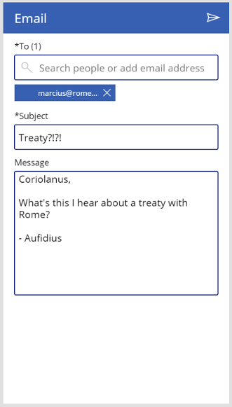

# Email-screen template for canvas apps

In a canvas app, add an email screen that lets users send an email from their Office 365 Outlook account. Users can search for recipients in their orgs and add external email addresses, too. You can add image-attachment support, change the user data that appears in the search gallery, and make other customizations.

You can also add other template-based screens that show different data from Office 365, such as a user's [calendar](calendar-screen-overview.md), [people](people-screen-overview.md) in an organization, and [availability](meeting-screen-overview.md) of the people users might want to invite to a meeting.

This overview teaches you:
> [!div class="checklist"]
> * How to use the default email screen.
> * How to modify it.
> * How to integrate it into an app.

For a deeper dive into this screen's default functionality, see the [email-screen reference](email-screen-reference.md).

## Prerequisite

Familiarity with how to add and configure screens and other controls as you [create an app in Power Apps](../data-platform-create-app-scratch.md).

## Default functionality

To add an email screen from the template:

1. [Sign in](https://make.powerapps.com?utm_source=padocs&utm_medium=linkinadoc&utm_campaign=referralsfromdoc) to Power Apps, and then create an app or open an existing app in Power Apps Studio.

    This topic shows a phone app, but the same concepts apply to a tablet app.

1. On the **Home** tab of the ribbon, select **New screen** > **Email**.

    By default, the screen looks similar to this:

    

A few helpful notes:

* To search for users in your org, start typing their name in the text input box below "To".
* When searching for people, only the top 15 results will be returned.
* To add email addresses for email recipients outside your org, type out the full, valid email address, and select the '+' icon that appears to the right of it.
* You must add at least one person as a recipient and provide a subject to send an email.
* After you send the email, the contents of the subject line and message body, as well as the recipient list will all be erased.

## Modify the screen

You can modify the default functionality of this screen in a few common ways:

* [Add image-attachment support](email-screen-overview.md#add-image-attachment-support)
* [Show different data for people](email-screen-overview.md#show-different-data-for-people)

If you want to modify the screen further, use the [email-screen reference](./email-screen-reference.md) as a guide.

> [!IMPORTANT]
> The following steps assume that you've added only one email screen to the app. If you've added more than one, control names (such as **iconMail1**) will end with a different number, and you'll need to adjust the formulas accordingly.

### Add image-attachment support

This allows users to send a single image with their email as an attachment.

1. On the **Insert** tab, select **Media**, and then select **Add picture**.
1. Set the new control's **Y** property to this expression:

    `TextEmailMessage1.Y + TextEmailMessage1.Height + 20`
    
1. With the **AddMediaWithImage** control inserted, set its height to be less than 210.
1. In the control tree view, select **AddMediaWithImage** > **...** > **Reorder** > **Send to back**.
   This prevents the control from sitting in front of the **PeopleBrowseGallery** control.
1. Change the **Height** property of **EmailPeopleGallery** to this formula:

    ```powerapps-dot
    Min( 
        ( EmailPeopleGallery1.TemplateHeight + EmailPeopleGallery1.TemplatePadding * 2 ) *
            RoundUp( CountRows( EmailPeopleGallery1.AllItems ) / 2, 0 ), 
        304
    )
    ```

1. Set the **ShowScrollbar** property of **EmailPeopleGallery** to this expression:

    ```EmailPeopleGallery1.Height >= 304```
    
    This prevents the max height from pushing the **AddMediaWithImage** control off the page.
    
1. Change the **OnSelect** property of the **iconMail** control to this formula:

    ```powerapps-dot
    Set( _emailRecipientString, Concat(MyPeople, Mail & ";") );
    If( IsBlank( UploadedImage1 ),
        'Office365'.SendEmail( _emailRecipientString, 
            TextEmailSubject1.Text, 
            TextEmailMessage1.Text, 
            { Importance: "Normal" }
        ),
        'Office365'.SendEmail( _emailRecipientString, 
            TextEmailSubject1.Text, 
            TextEmailMessage1.Text, 
            {
                Importance: "Normal",
                Attachments: Table(
                    {
                        Name: "Image.jpg", 
                        ContentBytes: UploadedImage1.Image
                    }
                )
            }
        )
    );
    Reset( TextEmailSubject1 );
    Reset( TextEmailMessage1 );
    Reset( AddMediaButton1 );
    Clear( MyPeople )
    ```
    
    This formula checks for an uploaded image. If there is none, then it uses the same `Office365.SendEmail` operation as before. If there is an image, it is added as an attachment in the Attachments table.
    After sending the email, an additional **Reset** operation is performed on **AddMediaButton** to remove the uploaded image.
> [!NOTE]
> To add more than one attachment to an email, add records to the Attachments table.

### Show different data for people

This screen uses the [Office365Users.SearchUser](/connectors/office365users/#searchuser) operation to search for users in your org. It provides additional fields for each event beyond what appears in the **PeopleBrowseGallery** control. Adding or changing fields in the gallery is simple:

1. In the **PeopleBrowseGallery** control, select a label to modify (or add one and keep it selected).

1. With its **Text** property selected, in the formula bar, replace the contents with `ThisItem.`

    IntelliSense shows a list of fields that you can select.

1. Select the field that you want.

    The **Text** property updates to `ThisItem.{FieldSelection}`.

## Integrate the screen into an app

The email screen is a powerful bundle of controls in its own right, but it usually performs best as part of a larger, more versatile app. You can integrate this screen into a larger app in a number of ways, including [linking to the calendar screen](email-screen-overview.md#linking-to-the-calendar-screen).

### Linking to the calendar screen

Follow the steps outlined in the "Show event attendees" section of [Calendar screen overview](./calendar-screen-overview.md#show-event-attendees) but, in the final step, set the **Navigate** function to open the email screen. After you complete these steps, the **MyPeople** collection is populated, which allows users to send email to the people who are attending the selected event.

> [!NOTE]
> Sending this email will send a separate email from the actual event in your Outlook.

## Next steps

* [View the reference documentation for this screen](./email-screen-reference.md).
* [Learn more about the Office 365 Users connector in Power Apps](../connections/connection-office365-users.md).
* [See all available connections in Power Apps](../connections-list.md).

[!INCLUDE[footer-include](../../../includes/footer-banner.md)]