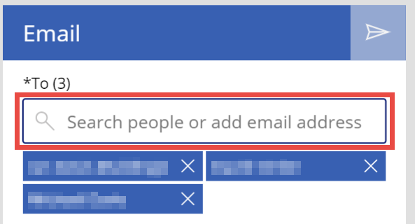
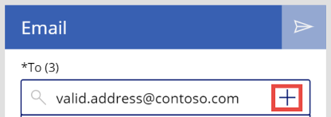
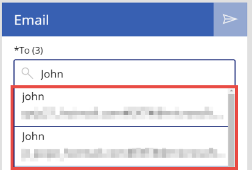
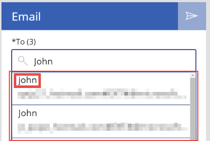
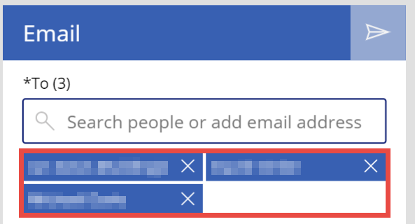
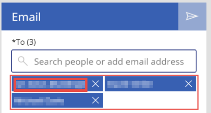
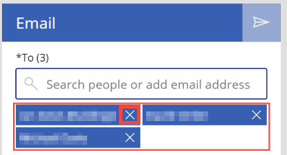

# Reference information about the email-screen template in canvas apps

For canvas apps in Power Apps, understand how each significant control in the email-screen template contributes to the screen's overall default functionality. This deep dive presents the behavior formulas and the values of other properties that determine how the controls respond to user input. For a high-level discussion of this screen's default functionality, see the [email-screen overview](email-screen-overview.md).

This topic highlights some significant controls and explains the expressions or formulas to which various properties (such as **Items** and **OnSelect**) of these controls are set:

* [Text search box](#text-search-box)
* [Add Icon](#add-icon)
* [People browse gallery](#people-browse-gallery)
* [Email people gallery](#email-people-gallery) (+ child controls)
* [Mail icon](#mail-icon)

## Prerequisite

Familiarity with how to add and configure screens and other controls as you [create an app in Power Apps](../data-platform-create-app-scratch.md).

## Text search box

   

Several other controls in the screen have a dependency on the **Text search box** control:

* If a user starts typing any text, **PeopleBrowseGallery** appears.
* If a user types out a valid email address, **AddIcon** appears.
* When a user selects a person within **PeopleBrowseGallery**, the search contents are reset.

## Add icon

   

The **Add icon** control allows app users to add people who don't exist inside their org to the recipient list of the email being composed.

* Property: **Visible**<br>
    Value: Logic to show the control only when a user types a valid email address into the search box:

    ```powerapps-dot
    !IsBlank( TextSearchBox.Text ) &&
        IsMatch( TextSearchBox.Text, Match.Email ) &&
        Not( Trim( TextSearchBox.Text ) in MyPeople.UserPrincipalName )
    ```
  Line by line, the preceding code block says that the **Add icon** control will be visible only if:

    * **TextSearchBox** contains text.
    * The text in **TextSearchBox** is a valid email address.
    * The text in **TextSearchBox** doesn't already exist in the **MyPeople** collection.

* Property: **OnSelect**<br>
    Value: Selecting this adds the valid email address to the **MyPeople** collection. This collection is used by the screen as the recipient list:

    ```powerapps-dot
    Collect( MyPeople,
        { 
            DisplayName: TextSearchBox.Text, 
            UserPrincipalName: TextSearchBox.Text, 
            Mail: TextSearchBox.Text
        }
    );
    Reset( TextSearchBox )
    ```
  
  This code block adds a row to the **MyPeople** collection and populates three fields with the text in **TextSearchBox**. These three fields are **DisplayName**, **UserPrincipalName**, and **Mail**. It then resets the contents of **TextSearchBox**.

## People browse gallery

   

* Property: **Items**<br>
    Value: The top 15 search results of the search text typed into the **TextSearchBox** control:
    
    ```powerapps-dot
    If( !IsBlank( Trim(TextSearchBox.Text ) ), 
        'Office365Users'.SearchUser( {searchTerm: Trim( TextSearchBox.Text ), top: 15} )
    )
    ```

  The items of this gallery are populated by search results from the [Office365.SearchUser](/connectors/office365users/#searchuser) operation. The operation takes the text in `Trim(TextSearchBox)` as its search term and returns the top 15 results based on that search.
  
  **TextSearchBox** is wrapped in a `Trim()` function because a user search on spaces is invalid. The `Office365Users.SearchUser` operation is wrapped in an `If(!IsBlank(Trim(TextSearchBox.Text)) ... )` function, which means that the operation is performed only if the search box contains user-entered text. This improves performance. 

### People browse gallery Title control

   

* Property: **Text**<br>
    Value: `ThisItem.DisplayName`

  Displays the person's display name from their Office 365 profile.

* Property: **OnSelect**<br>
    Value: Code to add the user to an app-level collection, and then select the user:

    ```powerapps-dot
    Concurrent(
        Set( _selectedUser, ThisItem ),
        Reset( TextSearchBox ),
        If( Not( ThisItem.UserPrincipalName in MyPeople.UserPrincipalName ), 
            Collect( MyPeople, ThisItem )
        )
    )
    ```
Selecting this control does three things concurrently:

   * Sets the **_selectedUser** variable to the item selected.
   * Resets the search term in **TextSearchBox**.
   * Adds the selected item to the **MyPeople** collection, a collection of all the selected users that the email screen uses as a set of recipients.

## Email people gallery

   

* Property: **Items**<br>
    Value: `MyPeople`

  This is the collection of people initialized or added to by selecting the **PeopleBrowseGallery Title** control.

* Property: **Height**<br>
    Value: Logic to set the height, based on the number of items currently in the gallery:

    ```powerapps-dot
    Min( 
        ( EmailPeopleGallery.TemplateHeight + EmailPeopleGallery.TemplatePadding * 2) *
            RoundUp(CountRows(EmailPeopleGallery.AllItems) / 2, 0 ),
        304
    )
    ```

  The height of this gallery adjusts to the number of items in the gallery, with a maximum height of 304.
  
  It takes `TemplateHeight + TemplatePadding * 2` as the total height of a single row of **EmailPeopleGallery**, then multiplies it by the number of rows. Since `WrapCount = 2`, the number of true rows is `RoundUp(CountRows(EmailPeopleGallery.AllItems) / 2, 0)`.

* Property: **ShowScrollbar**<br>
    Value: `EmailPeopleGallery.Height >= 304`
  
  When the height of the gallery reaches 304, the scroll bar is visible.

### Email people gallery Title control

   

* Property: **OnSelect**<br>
    Value: `Set(_selectedUser, ThisItem)`

  Sets the **_selectedUser** variable to the item selected in **EmailPeopleGallery**.

### Email people gallery iconRemove control

   

* Property: **OnSelect**<br>
    Value: `Remove( MyPeople, LookUp( MyPeople, UserPrincipalName = ThisItem.UserPrincipalName ) )`

  Looks up the record in the **MyPeople** collection, where **UserPrincipalName** matches the **UserPrincipalName** of the selected item, and removes that record from the collection.

## Mail icon

* Property: **OnSelect**<br>
    Value: Logic to send the user's email message:

    ```powerapps-dot
    Set( _emailRecipientString, Concat( MyPeople, Mail & ";" ) );
    'Office365'.SendEmail( _emailRecipientString, 
        TextEmailSubject.Text, 	
        TextEmailMessage.Text, 
        { Importance:"Normal" }
    );
    Reset( TextEmailSubject );
    Reset( TextEmailMessage );
    Clear( MyPeople )
    ```

  Sending an email message requires a semicolon-separated string of email addresses. In the preceding code:
  1. The first line of code takes the **Mail** field from all the rows in the **MyPeople** collection, concatenates them into a single string of email addresses separated by semicolons, and sets the **_emailRecipientString** variable to that string value.

  1. It then uses the [Office365.SendEmail](/connectors/office365/#sendemail) operation to send the email to the recipients.
    The operation has three required parameters, **To**, **Subject**, and **Body**, and one optional parameter--**Importance**. In the preceding code, these are **_emailRecipientString**, **TextEmailSubject**.Text, **TextEmailMessage**.Text, and **Normal**, respectively.
  1. Finally, it resets the **TextEmailSubject** and **TextEmailMessage** controls and clears the **MyPeople** collection.

* Property: **DisplayMode**<br>
    Value: `If( Len( Trim( TextEmailSubject.Text ) ) > 0 && !IsEmpty( MyPeople ), DisplayMode.Edit, DisplayMode.Disabled )`
  For an email to be sent, the email subject line must have text, and the recipient (**MyPeople**) collection must not be empty.

## Next steps

* [Learn more about this screen](./email-screen-overview.md)
* [Learn more about the Office 365 Outlook connector in Power Apps](../connections/connection-office365-outlook.md)
* [Learn more about the Office 365 Users connector in Power Apps](../connections/connection-office365-users.md)


[!INCLUDE[footer-include](../../../includes/footer-banner.md)]