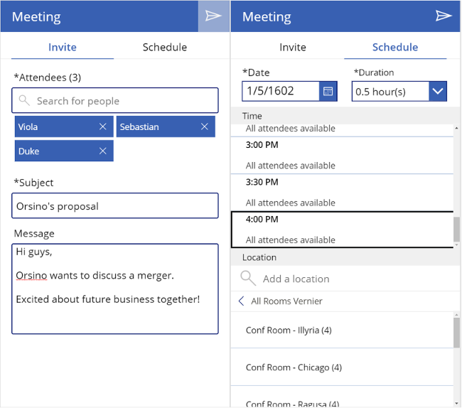

# Meeting-screen template for canvas apps

In a canvas app, add a meeting screen that lets users create and send meeting requests from their Office 365 Outlook accounts. Users can search for attendees in their org and add external email addresses. If your tenant has meeting rooms built into Outlook, users can select a location as well.

You can also add other template-based screens that show different data from Office 365, such as [email](email-screen-overview.md), [people](people-screen-overview.md) in an organization, and a user's [calendar](calendar-screen-overview.md).

This overview teaches you about the high-level functionality of the screen.

For a deeper dive into this screen's default functionality, see the [meeting-screen reference](meeting-screen-reference.md).

## Prerequisite

Familiarity with how to add and configure screens and other controls as you [create an app in Power Apps](../data-platform-create-app-scratch.md).

## Default functionality

To add a meeting screen from the template:

1. [Sign in](https://make.powerapps.com?utm_source=padocs&utm_medium=linkinadoc&utm_campaign=referralsfromdoc) to Power Apps, and then create an app or open an existing app in Power Apps Studio.

    This topic shows a phone app, but the same concepts apply to a tablet app.

1. On the **Home** tab of the ribbon, select **New screen** > **Meeting**.

  When filled out, both tabs of the meeting screen look similar to this:

  

A few helpful notes:

* The meeting screen allows an app user to create a meeting in Outlook.
  Users can search for and add attendees and, optionally, add a meeting room to the meeting.
* To search for a user in your org, start typing their name in the text-input box under "Attendees".
* When you search for people, only the top 15 results are returned.
* To add email addresses for attendees outside your org, type out the full, valid email address, and select the '+' icon that appears to the right of the email address.
* To create a meeting, you must add at least one person as an attendee, provide a subject, and select a meeting time in the **Schedule** tab.
* After you send the meeting request, all information for that meeting is cleared.
* The **OnSelect** statement of the Send icon (upper-right corner) contains this formula:
    ```powerapps-dot
    Set( _myCalendarName, 
        LookUp( 'Office365'.CalendarGetTables().value, DisplayName = "Calendar" ).Name 
    );
    ```
* "Calendar" is the default display name for most Office user's calendars, but your org might differ. If so, you can change "Calendar" to the appropriate term for your org.
* You get an error if you try to schedule a meeting that occurs in the past or add more than 20 people to a meeting.

## Next steps

* [View the reference documentation for this screen](./meeting-screen-reference.md).
* [Learn more about the Office 365 Outlook connector](../connections/connection-office365-outlook.md).
* [Learn more about the Office 365 Users connector](../connections/connection-office365-users.md).


[!INCLUDE[footer-include](../../../includes/footer-banner.md)]