# Reference information about the meeting-screen template for canvas apps

For canvas apps in Power Apps, understand how each significant control in the meeting-screen template contributes to the screen's overall default functionality. This deep dive presents the behavior formulas and the values of other properties that determine how the controls respond to user input. For a high-level discussion of this screen's default functionality, see the [meeting-screen overview](meeting-screen-overview.md).

This topic highlights some significant controls and explains the expressions or formulas to which various properties (such as **Items** and **OnSelect**) of these controls are set:

* [Invite tab (LblInviteTab)](#invite-tab)
* [Schedule tab (LblScheduleTab)](#schedule-tab)
* [Text search box](#text-search-box)
* [Add icon (AddIcon)](#add-icon)
* [People browse gallery](#people-browse-gallery) (+ child controls)
* [Meeting people gallery](#meeting-people-gallery) (+ child controls)
* [Meeting date picker (MeetingDateSelect)](#meeting-date-picker)
* [Meeting duration drop-down (MeetingDurationSelect)](#meeting-duration-drop-down)
* [Find meeting times gallery](#find-meeting-times-gallery) (+ child controls)
* [Room browse gallery](#room-browse-gallery) (+ child controls)
* [Back chevron (RoomsBackNav)](#back-chevron) (may not be visible if tenant doesn't have rooms lists)
* [Send icon](#send-icon)

## Prerequisite

Familiarity with how to add and configure screens and other controls as you [create an app in Power Apps](../data-platform-create-app-scratch.md).

## Invite tab

   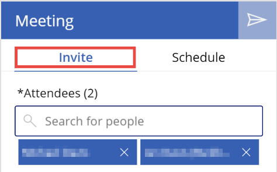

* Property: **Color**<br>
    Value: `If( _showDetails, LblRecipientCount.Color, RectQuickActionBar.Fill )`

    **_showDetails** is a variable used to determine whether the **LblInviteTab** control or the **LblScheduleTab** control is selected. If the value of **_showDetails** is **true**, **LblScheduleTab** is selected; if the value is **false**, **LblInviteTab** is selected. That means that if the value of **_showDetails** is **true** (this tab *isn't* selected), the tab color matches that of **LblRecipientCount**. Otherwise, it matches the fill value of **RectQuickActionBar**.

* Property: **OnSelect**<br> 
    Value: `Set( _showDetails, false )`

    Sets the **_showDetails** variable to **false**, which means the contents of the Invite tab are visible, and the contents of the **Schedule** tab are hidden.

## Schedule tab

   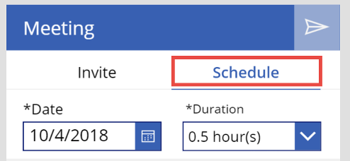

* Property: **Color**<br>
    Value: `If( !_showDetails, LblRecipientCount.Color, RectQuickActionBar.Fill )`

    **_showDetails** is a variable used to determine whether the **LblInviteTab** control or the **LblScheduleTab** control is selected. If it's true, **LblScheduleTab** is selected; if false, **LblInviteTab** is. This means that if **_showDetails** is true (this tab *is* selected), the tab color matches the fill value of **RectQuickActionBar**. Otherwise, it matches the color value of **LblRecipientCount**.

* Property: **OnSelect**<br>
    Value: `Set( _showDetails, true )`

    Sets the **_showDetails** variable to **true**, which means the contents of the Schedule tab are visible, and the contents of the Invite tab are hidden.

## Text search box

   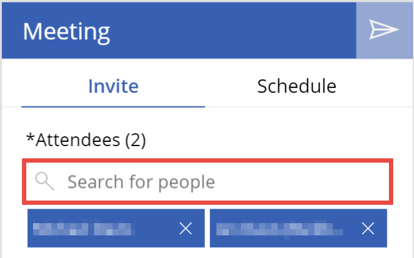

<!--Include description of text search box control?-->

Several other controls in the screen have a dependency on this one:

* If a user starts typing any text, **PeopleBrowseGallery** becomes visible.
* If a user types a valid email address, **AddIcon** becomes visible.
* When a user selects a person within **PeopleBrowseGallery** the search contents are reset.

## Add icon

   

This control allows users to add people who don't exist inside their org to the attendee list for the meeting being composed.

* Property: **Visible**<br>
    Value: Three logical checks that all must evaluate to **true** for the control to be visible:

    ```powerapps-dot
    !IsBlank( TextSearchBox.Text ) &&
        IsMatch( TextSearchBox.Text, Match.Email ) &&
        Not( Trim( TextSearchBox.Text ) in MyPeople.UserPrincipalName )
    ```

  Line by line, this code block says that the **AddIcon** control is visible only if:

  * The **TextSearchBox** contains text.
  * The text in **TextSearchBox** is a valid email address.
  * The text in **TextSearchBox** doesn't already exist in the **MyPeople** collection.

* Property: **OnSelect**<br> 
    Value: A **Collect** statement to add the user to the attendee list, another to refresh available meeting times, and several variable toggles:

    ```powerapps-dot
    Collect( MyPeople,
        { 
            DisplayName: TextSearchBox.Text, 
            UserPrincipalName: TextSearchBox.Text, 
            Mail: TextSearchBox.Text
        }
    );
    Concurrent(
        Reset( TextSearchBox ),
        Set( _showMeetingTimes, false ),
        UpdateContext( { _loadMeetingTimes: true } ),
        Set( _selectedMeetingTime, Blank() ),
        Set( _selectedRoom, Blank() ),
        Set( _roomListSelected, false ),
        ClearCollect( MeetingTimes, 
            AddColumns(
                'Office365'.FindMeetingTimes(
                    { 
                        RequiredAttendees: Concat(MyPeople, UserPrincipalName & ";")
                        MeetingDuration: MeetingDurationSelect.Selected.Minutes,
                        Start: Text( DateAdd( MeetingDateSelect.SelectedDate, 8, Hours ), UTC ),
                        End: Text( DateAdd( MeetingDateSelect.SelectedDate, 17, Hours ), UTC ),
                        MaxCandidates: 15, 
                        MinimumAttendeePercentage:1, 
                        IsOrganizerOptional: false, 
                        ActivityDomain: "Work"
                    }
                ).MeetingTimeSuggestions,
                "StartTime", MeetingTimeSlot.Start.DateTime, 
                "EndTime", MeetingTimeSlot.End.DateTime
            )
        )
    );
    UpdateContext( { _loadingMeetingTimes: false } );
    Set( _showMeetingTimes, true )
    ```

  Selecting this control adds the valid email address (visible only if a valid email address is typed into **TextSearchBox**) to the **MyPeople** collection (this collection is the attendee list) and then refreshes the available meeting times with the new user entry.

  At a low level, this code block:
  1. Collects the email address into the **MyPeople** collection, collecting the email address into the **DisplayName**, **UserPrincipalName**, and **Mail** fields.
  1. Resets the contents of the **TextSearchBox** control.
  1. Sets the **_showMeetingTimes** variable to **false**. This variable controls the visibility of **FindMeetingTimesGallery**, which displays open times for the selected attendees to meet.
  1. Sets the **_loadMeetingTimes** context variable to **true**. This variable sets a loading state, which toggles the visibility of loading state controls like **_LblTimesEmptyState** to indicate to the user that their data is being loaded.
  1. Sets **_selectedMeetingTime** to **Blank()**. **_selectedMeetingTime** is the selected record from the **FindMeetingTimesGallery** control. It is blanked here because the addition of another attendee might mean that the previous definition of **_selectedMeetingTime** is not be available for that attendee.
  1. Sets **_selectedRoom** to **Blank()**. **_selectedRoom** is the selected room record from **RoomBrowseGallery**. The room availabilities are determined from the value of **_selectedMeetingTime**. With that value blanked, the **_selectedRoom** value is no longer valid, so it must be blanked.
  1. Sets **_roomListSelected** to **false**. This line may not be applicable to everyone. In Office, you can group your rooms by different "room lists." If you have room lists, this screen accounts for that, allowing you to first select a room list before selecting a room from within that list. The value of **_roomListSelected** is what determines whether a user (in a tenant with room lists only) will be viewing rooms within a room list or the set of room lists. It's set to **false** to force users to reselect a new room list.
  1. Uses the [Office365.FindMeetingTimes](/connectors/office365/#find-meeting-times) operation to determine and collect the available meeting times for the attendees. This operation passes:
      * The **UserPrincipalName** of each selected user into the *RequiredAttendees* parameter.
      * **MeetingDurationSelect**.Selected.Minutes into the *MeetingDuration* parameter.
      * MeetingDateSelect.SelectedDate + 8 hours into the *Start* parameter. Eight hours is added because, by default, the full date/time for the calendar control is 12:00 AM of the selected date. You probably want to retrieve availabilities within normal working hours. A normal work start time would be 8:00 AM.
      * **MeetingDateSelect**.SelectedDate + 17 hours into the *End* parameter. 17 hours is added because 12:00 AM + 17 = 5:00 PM. A normal work end time would be 5:00 PM.
      * *15* into the *MaxCandidates* parameter. This means the operation returns only the top 15 available times for the selected date. This makes sense because there are only sixteen 30-minute chunks in an 8-hour work day, and a 30-minute meeting is the minimum one can set in this screen.
      * *1* into the *MinimumAttendeePercentage* parameter. Essentially, unless no attendees are available, the meeting time is retrieved.
      * **false** into the *IsOrganizerOptional* parameter. The app user is not an optional attendee for this meeting.
      * "Work" into the *ActivityDomain* parameter. This means the times retrieved are only those within a normal working time period.
  1. The **ClearCollect** function also adds two columns: "StartTime" and "EndTime". This simplifies the data returned. 
  The field containing the available start and end times is the **MeetingTimeSlot** field. This field is a record containing the Start and End records, which themselves contain the **DateTime** and **TimeZone** values of their respective suggestion. Instead of attempting to retrieve this nesting of records, adding the "StartTime" and "EndTime" columns to the **MeetingTimes** collection brings those **Start > DateTime** and **End > DateTime** values to the surface of the collection.
  1. Once these functions have all completed, the **_loadingMeetingTimes** variable is set to **false**, removing the loading state, and **_showMeetingTimes** is set to **true**, displaying **FindMeetingTimesGallery**.

## People browse gallery

   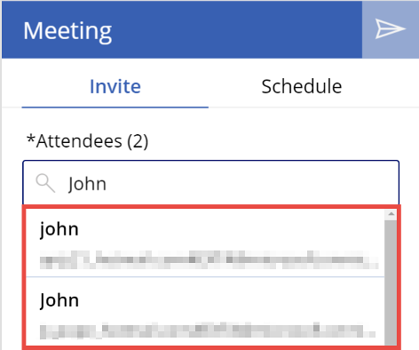

* Property: **Items**<br>
    Value: 
    ```powerapps-dot
    If( !IsBlank( Trim( TextSearchBox.Text ) ), 
        'Office365Users'.SearchUser( { searchTerm: Trim(TextSearchBox.Text), top: 15 } )
    )
    ```

The items of this gallery are populated by search results from the [Office365.SearchUser](/connectors/office365users/#searchuser) operation. The operation takes the text in `Trim(**TextSearchBox**)` as its search term and returns the top 15 results based on that search.
  
**TextSearchBox** is wrapped in a **Trim** function because a user search on spaces isn't valid. The `Office365Users.SearchUser` operation is wrapped in an `If(!IsBlank(Trim(TextSearchBox.Text)) ... )` function because retrieving search results before a user has searched is a performance waste.

### People browse gallery Title

   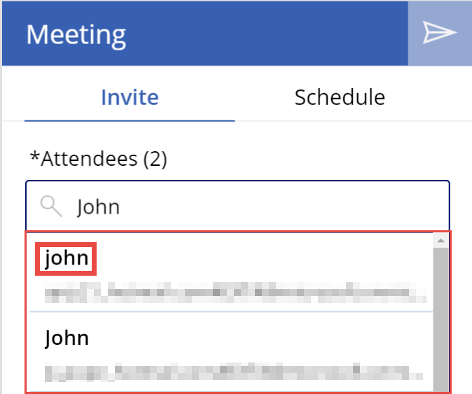

* Property: **Text**<br>
    Value: `ThisItem.DisplayName`

    Displays the person's display name from their Office 365 profile.

* Property: **OnSelect**<br>
    Value: A **Collect** statement to add the user to the attendee list, another to refresh available meeting times, and several variable toggles:

    ```powerapps-dot
    Concurrent(
        Reset( TextSearchBox ),
        Set( _selectedUser, ThisItem ),
        If( Not( ThisItem.UserPrincipalName in MyPeople.UserPrincipalName ), 
            Collect( MyPeople, ThisItem ); 
            Concurrent(
                Set( _showMeetingTimes, false ),
                UpdateContext( { _loadMeetingTimes: true } ),
                Set( _selectedMeetingTime, Blank() ),
                Set( _selectedRoom, Blank() ),
                Set( _roomListSelected, false ),
                ClearCollect( MeetingTimes, 
                    AddColumns(
                        'Office365'.FindMeetingTimes(
                            {
                                RequiredAttendees: Concat( MyPeople, UserPrincipalName & ";" ),
                                MeetingDuration: MeetingDurationSelect.Selected.Minutes,
                                Start: Text( DateAdd( MeetingDateSelect.SelectedDate, 8, Hours ), UTC ),
                                End: Text( DateAdd( MeetingDateSelect.SelectedDate, 17, Hours ), UTC ),
                                MaxCandidates: 15, 
                                MinimumAttendeePercentage: 1, 
                                IsOrganizerOptional: false, 
                                ActivityDomain: "Work"
                            }
                        ).MeetingTimeSuggestions,
                        "StartTime", MeetingTimeSlot.Start.DateTime, 
                        "EndTime", MeetingTimeSlot.End.DateTime
                    )
                )
            );
            UpdateContext( { _loadingMeetingTimes: false } );
            Set( _showMeetingTimes, true )
        )
    )
    ```

    At a high level, selecting this control adds the person to the **MyPeople** collection (the app's storage of the attendee list), and refreshes the available meeting times based on the new user addition.

    Selecting this control is very similar to selecting the **AddIcon** control; the only difference is that the `Set(_selectedUser, ThisItem)` statement and the execution order of the operations. As such, this discussion won't be as deep. For a fuller explanation, read through the [AddIcon control](#add-icon) section.

    Selecting this control resets **TextSearchBox**. Then, if the selection is not in the **MyPeople** collection, the control:
    1. Sets the **_loadMeetingTimes** state to **true** and the **_showMeetingTimes** state to **false**, blanks the **_selectedMeetingTime** and **_selectedRoom** variables, and refreshes the **MeetingTimes** collection with the new addition to the **MyPeople** collection. 
    1. Sets the **_loadMeetingTimes** state to **false**, and sets **_showMeetingTimes** to **true**. If the selection is already in the **MyPeople** collection, it resets only the contents of **TextSearchBox**.

## Meeting people gallery

   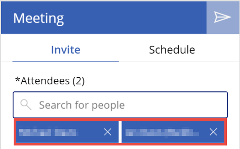

* Property: **Items**<br>
    Value: `MyPeople`

    The **MyPeople** collection is the collection of people initialized or added to by selecting the **PeopleBrowseGallery Title** control.

* Property: **Height**<br>
    Value: Logic to allow the gallery to grow to a maximum height of 350:

    ```powerapps-dot
    Min( 
        76 * RoundUp( CountRows( MeetingPeopleGallery.AllItems ) / 2, 0 ),
        350
    )
    ```

  
   The height of this gallery adjusts to the number of items in the gallery, to a maximum height of 350. The formula takes 76 as the height of a single row of **MeetingPeopleGallery**, then multiplies it by the number of rows. The **WrapCount** property is set to 2, so the number of true rows is `RoundUp(CountRows(MeetingPeopleGallery.AllItems) / 2, 0)`.

* Property: **ShowScrollbar**<br>
    Value: `MeetingPeopleGallery.Height >= 350`

    When the maximum height of the gallery is reached (350), the scroll bar is visible.

### Meeting people gallery Title

   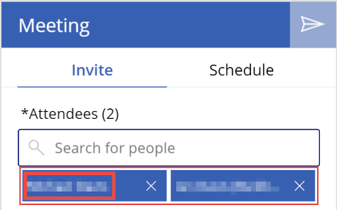

* Property: **OnSelect**<br>
    
    Value: `Set(_selectedUser, ThisItem)`
    
    Sets the **_selectedUser** variable to the item selected in **MeetingPeopleGallery**.

### Meeting people gallery iconRemove

   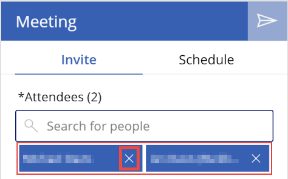

* Property: **OnSelect**<br>
    Value: A **Remove** statement to remove the user from the attendee list, a **Collect** statement to refresh available meeting times, and several variable toggles:

    ```powerapps-dot
    Remove( MyPeople, LookUp( MyPeople, UserPrincipalName = ThisItem.UserPrincipalName ) );
    Concurrent(
        Reset( TextSearchBox ),
        Set( _showMeetingTimes, false ),
        UpdateContext( { _loadMeetingTimes: true } ),
        Set( _selectedMeetingTime, Blank() ),
        Set( _selectedRoom, Blank() ),
        Set( _roomListSelected, false ),
        ClearCollect( MeetingTimes, 
            AddColumns(
                'Office365'.FindMeetingTimes(
                    {
                        RequiredAttendees: Concat( MyPeople, UserPrincipalName & ";" ), 
                        MeetingDuration: MeetingDurationSelect.Selected.Minutes,
                        Start: Text( DateAdd( MeetingDateSelect.SelectedDate, 8, Hours ), UTC ), 
                        End: Text( DateAdd( MeetingDateSelect.SelectedDate, 17, Hours ), UTC ),
                        MaxCandidates: 15, 
                        MinimumAttendeePercentage: 1, 
                        IsOrganizerOptional: false, 
                        ActivityDomain: "Work"
                    }
                ).MeetingTimeSuggestions,
                "StartTime", MeetingTimeSlot.Start.DateTime, 
                "EndTime", MeetingTimeSlot.End.DateTime
            )
        )
    );
    UpdateContext( { _loadingMeetingTimes: false } );
    Set( _showMeetingTimes, true )
    ```

  At a high level, selecting this control removes the person from the attendee list and refreshes the available meeting times based on the removal of this person.

  After the first line of the preceding code, selecting this control is almost identical to selecting the **AddIcon** control. As such, this discussion will not be as deep. For a fuller explanation, read through the [AddIcon control section](#add-icon).

  In the first line of code, the selected item is removed from the **MyPeople** collection. The code then:
  1. Resets **TextSearchBox**, and then removes the selection from the **MyPeople** collection. 
  1. Sets the **_loadMeetingTimes** state to **true** and the **_showMeetingTimes** state to **false**, blanks the **_selectedMeetingTime** and **_selectedRoom** variables, and refreshes the **MeetingTimes** collection with the new addition to the **MyPeople** collection. 
  1. Sets the **_loadMeetingTimes** state to **false**, and sets **_showMeetingTimes** to **true**.

## Meeting date picker

   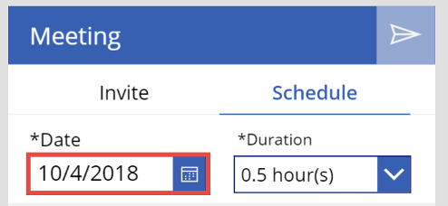

* Property: **DisplayMode**<br>
    Value: `If( IsEmpty(MyPeople), DisplayMode.Disabled, DisplayMode.Edit )`

    A date for a meeting cannot be chosen until at least one attendee has been added to the **MyPeople** collection.

* Property: **OnChange**<br>
    Value: `Select( MeetingDateSelect )`

    Changing the selected date triggers the code in the **OnSelect** property of this control to run.

* Property: **OnSelect**<br>
    Value: A **Collect** statement to refresh available meeting times, and several variable toggles:
  
    ```powerapps-dot
    Concurrent(
        Reset( TextSearchBox ),
        Set( _showMeetingTimes, false ),
        UpdateContext( { _loadingMeetingTimes: true } ),
        Set( _selectedMeetingTime, Blank() ),
        Set( _selectedRoom, Blank() ),
        Set( _roomListSelected, false ),
        ClearCollect( MeetingTimes, 
            AddColumns(
                'Office365'.FindMeetingTimes(
                    {
                        RequiredAttendees: Concat( MyPeople, UserPrincipalName & ";" ), 
                        MeetingDuration: MeetingDurationSelect.Selected.Minutes,
                        Start: Text( DateAdd( MeetingDateSelect.SelectedDate, 8, Hours ), UTC ), 
                        End: Text( DateAdd( MeetingDateSelect.SelectedDate, 17, Hours ), UTC ),
                        MaxCandidates: 15, 
                        MinimumAttendeePercentage: 1, 
                        IsOrganizerOptional: false, 
                        ActivityDomain: "Work"
                    }
                ).MeetingTimeSuggestions,
                "StartTime", MeetingTimeSlot.Start.DateTime, 
                "EndTime", MeetingTimeSlot.End.DateTime
            )
        )
    );
    UpdateContext( { _loadingMeetingTimes: false } );
    Set( _showMeetingTimes, true )
    ```

  At a high level, selecting this control refreshes the available meeting times. It is valuable because if a user changes the date, the available meeting times need to update to reflect the attendees' availabilities for that day.

  With the exception of the initial **Collect** statement, this is identical to the **OnSelect** functionality of the **AddIcon** control. As such, this discussion will not be as deep. For a fuller explanation, read through the [AddIcon control](#add-icon) section.

  Selecting this control resets **TextSearchBox**. It then: 
  1. Sets the **_loadMeetingTimes** state to **true** and the **_showMeetingTimes** state to **false**, blanks the **_selectedMeetingTime** and **_selectedRoom** variables, and refreshes the **MeetingTimes** collection with the new date selection. 
  1. Sets the **_loadMeetingTimes** state to **false**, and sets **_showMeetingTimes** to **true**.

## Meeting duration drop-down

   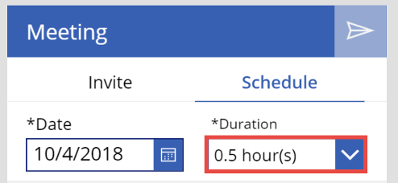

* Property: **DisplayMode**<br>
    Value: `If( IsEmpty(MyPeople), DisplayMode.Disabled, DisplayMode.Edit )`

    A duration for a meeting cannot be chosen until at least one attendee has been added to the **MyPeople** collection.

* Property: **OnChange**<br>
    Value: `Select(MeetingDateSelect1)`

    Changing the selected duration triggers the code in the **OnSelect** property of the **MeetingDateSelect** control to run.

## Find meeting times gallery

   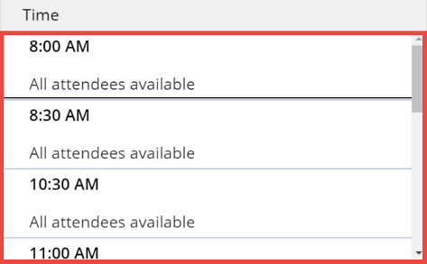

* Property: **Items**<br>
    Value: `MeetingTimes`

    The collection of potential meeting times retrieved from the [Office365.FindMeetingTimes](/connectors/office365/#find-meeting-times) operation.

* Property: **Visible**<br>
    Value: `_showMeetingTimes && _showDetails && !IsEmpty( MyPeople )`

    The gallery is visible only if **_showMeetingTimes** is set to **true**, the user has selected the **LblScheduleTab** control, and there is at least one attendee added to the meeting.

### Find meeting times gallery Title

   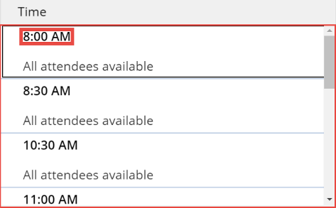

* Property: **Text**<br>
    Value: A conversion of the start time to be displayed in the user's local time:

    ```powerapps-dot
    Text(
        DateAdd(
            DateTimeValue( ThisItem.StartTime ),
            - TimeZoneOffset(), 
            Minutes
        ),
        DateTimeFormat.ShortTime
    )
    ```

  The retrieved value of **StartTime** is in UTC format. To [convert from UTC to local time](../functions/function-dateadd-datediff.md#converting-from-utc), the **DateAdd** function is applied.
  The [Text function](../functions/function-text.md#datetime) takes a date/time as its first argument, and formats it based on its second argument. You pass it the local time conversion of **ThisItem.StartTime**, and display it as **DateTimeFormat.ShortTime**.

* Property: **OnSelect**<br>
    Value: Several **Collect** statements to gather meeting rooms and their suggested availabilities, as well as several variable toggles:

    ```powerapps-dot
    Set( _selectedMeetingTime, ThisItem );
    UpdateContext( { _loadingRooms: true } );
    If( IsEmpty( RoomsLists ),
        ClearCollect( RoomsLists, 'Office365'.GetRoomLists().value) );
    If( CountRows( RoomsLists ) <= 1,
        Set( _noRoomLists, true );
        ClearCollect( AllRooms, 'Office365'.GetRooms().value );
        Set( _allRoomsConcat, Concat( FirstN( AllRooms, 20 ), Address & ";" ) );
        ClearCollect( RoomTimeSuggestions, 
            'Office365'.FindMeetingTimes(
                {
                    RequiredAttendees: _allRoomsConcat, 
                    MeetingDuration: MeetingDurationSelect.Selected.Minutes,
                    Start: _selectedMeetingTime.StartTime & "Z", 
                    End: _selectedMeetingTime.EndTime & "Z", 
                    MinimumAttendeePercentage: "1",
                    IsOrganizerOptional: "false", 
                    ActivityDomain: "Unrestricted"
                }
            ).MeetingTimeSuggestions
        );
        ClearCollect( AvailableRooms, 
            AddColumns(
                AddColumns(
                    Filter( 
                        First( RoomTimeSuggestions ).AttendeeAvailability,
                        Availability="Free"
                    ), 
                    "Address", Attendee.EmailAddress.Address
                ), 
                "Name", LookUp( AllRooms, Address = Attendee.EmailAddress.Address ).Name 
            )
        );
        ClearCollect( AvailableRoomsOptimal, 
            DropColumns(
                DropColumns( AvailableRooms, "Availability" ), 
                "Attendee" 
            )
        ),
        Set( _roomListSelected, false) 
    );
    UpdateContext( {_loadingRooms: false} )
    ```

  At a high level, this code block gathers available rooms for users who don't have rooms lists, based on the selected date/time for the meeting. Otherwise, it simply retrieves the rooms lists.

  At a low level, this code block:
  1. Sets **_selectedMeetingTime** to the selected item. This is used to find what rooms are available during that time.
  1. Sets the loading state variable **_loadingRooms** to **true**, turning the loading state on.
  1. If the **RoomsLists** collection is empty, it retrieves the user's tenant's rooms lists and stores them in the **RoomsLists** collection.
  1. If the user has no room list or one room list:
      1. The **noRoomLists** variable is set to **true**, and this variable is used to determine the items displayed in the **RoomBrowseGallery** control.
      1. The `Office365.GetRooms()` operation is used to retrieve the first 100 rooms in their tenant. These are stored in the **AllRooms** collection.
      1. The **_allRoomsConcat** variable is set to a semicolon-separated string of the first 20 email addresses of the rooms in the **AllRooms** collection. This is because the [Office365.FindMeetingTimes](/connectors/office365/#find-meeting-times) is limited to searching for the available times of 20 person objects in a single operation.
      1. The **RoomTimeSuggestions** collection uses the [Office365.FindMeetingTimes](/connectors/office365/#find-meeting-times) to retrieve the availabilities of the first 20 rooms in the **AllRooms** collection, based on the time values from the **_selectedMeetingTime** variable. Note that the `& "Z"` is used to properly format the **DateTime** value.
      1. The **AvailableRooms** collection is created. This is simply the **RoomTimeSuggestions** collection of attendee availabilities with two additional columns added to it: "Address" and "Name". "Address" is the email address of the room, and "Name" is the name of the room.
      1. Then, the **AvailableRoomsOptimal** collection is created. This is just the **AvailableRooms** collection with the "Availability" and "Attendee" columns removed. Doing this matches the schemas of **AvailableRoomsOptimal** and **AllRooms**. This allows you to use both collections in the **Items** property of the **RoomBrowseGallery**.
      1. **_roomListSelected** is set to **false**.
  1. The loading state, **_loadingRooms**, is set to **false** once everything else has finished executing.

## Room browse gallery

   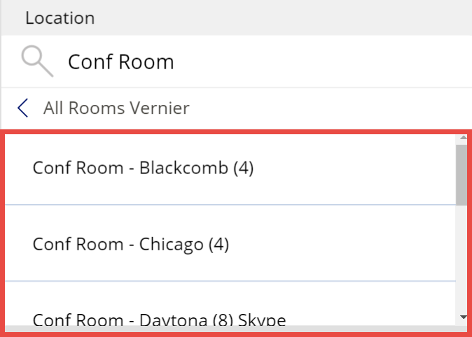

* Property: **Items**<br>
    Value: Logically set to two internal collections of identical schema, depending on whether the user has selected a room list or has rooms lists in their tenant:

    ```powerapps-dot
    Search(
        If( _roomListSelected || _noRoomLists, AvailableRoomsOptimal, RoomsLists ),
        Trim(TextMeetingLocation1.Text), 
        "Name", 
        "Address"
    )
    ```

  This gallery displays the **AvailableRoomsOptimal** collection if **_roomListSelected** or **_noRoomLists** is **true**. Otherwise, it displays the **RoomsLists** collection. This can be done because the schema of these collections are identical.

* Property: **Visible**<br>
    Value: ```_showDetails && !IsBlank( _selectedMeetingTime ) && !_loadingRooms```

    The gallery is visible only if the three preceding statements evaluate to **true**.

### RoomBrowseGallery Title

   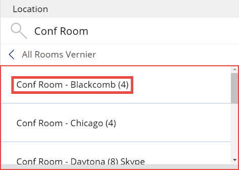

* Property: **OnSelect**<br>
    Value: A set of logically bound **Collect** and **Set** statements, which might or might not be triggered, depending on whether the user is viewing room lists or rooms:

    ```powerapps-dot
    UpdateContext( { _loadingRooms: true } );
    If( !_roomListSelected && !noRoomLists,
        Set( _roomListSelected, true );
        Set( _selectedRoomList, ThisItem.Name );
        ClearCollect( AllRooms, 'Office365'.GetRoomsInRoomList( ThisItem.Address ).value );
        Set( _allRoomsConcat, Concat( FirstN( AllRooms, 20 ), Address & ";" ) );
        ClearCollect( RoomTimeSuggestions, 
            'Office365'.FindMeetingTimes(
                {
                    RequiredAttendees: _allRoomsConcat, 
                    MeetingDuration: MeetingDurationSelect.Selected.Minutes,
                        Start: _selectedMeetingTime.StartTime & "Z", 
                    End: _selectedMeetingTime.EndTime & "Z", 
                    MinimumAttendeePercentage: "1",
                    IsOrganizerOptional: "false", 
                    ActivityDomain: "Unrestricted"
                }
            ).MeetingTimeSuggestions
        );
        ClearCollect( AvailableRooms, 
            AddColumns(
                AddColumns(
                    Filter(
                        First( RoomTimeSuggestions ).AttendeeAvailability, 
                        Availability = "Free"
                    ),
                    "Address", Attendee.EmailAddress.Address 
                ), 
                "Name", LookUp( AllRooms, Address = Attendee.EmailAddress.Address ).Name
            )
        );
        ClearCollect( AvailableRoomsOptimal, 
            DropColumns(
                DropColumns( AvailableRooms, "Availability" )
            ), 
            "Attendee" )
        ),
        Set( _selectedRoom, ThisItem )
    );
    UpdateContext( {_loadingRooms: false} )
    ```

  The actions that occur when this control is selected depend on whether a user is currently viewing a set of room lists or a set of rooms. If it's the former, then selecting this control retrieves the rooms that are available at the selected time from the selected room list. If it's the latter, selecting this control sets the **_selectedRoom** variable to the selected item. The preceding statement is very similar to the **Select** statement for [**FindMeetingTimesGallery Title**](#find-meeting-times-gallery).

  At a low level, the preceding code block:
  1. Turns the loading state for the rooms on by setting **_loadingRooms** to **true**.
  1. Checks to see if a room list has been selected, and if the tenant has room lists. If so:
      1. Sets **_roomListSelected** to **true** and sets **_selectedRoomList** to the selected item.
      1. The **_allRoomsConcat** variable is set to a semicolon-separated string of the first 20 email addresses of the rooms in the **AllRooms** collection. This is because the [Office365.FindMeetingTimes](/connectors/office365/#find-meeting-times) operation is limited to searching for the available times of 20 person objects in a single operation.
      1. The **RoomTimeSuggestions** collection uses the [Office365.FindMeetingTimes](/connectors/office365/#find-meeting-times) operation to retrieve the availabilities of the first 20 rooms in the **AllRooms** collection, based on the time values from the **_selectedMeetingTime** variable. Note that `& "Z"` is used to properly format the **DateTime** value.
      1. The **AvailableRooms** collection is created. This is simply the **RoomTimeSuggestions** collection of attendee availabilities with two additional columns added to it: "Address" and "Name". "Address" is the email address of the room, and "Name" is the name of the room.
      1. Then, the **AvailableRoomsOptimal** collection is created. This is just the **AvailableRooms** collection with the "Availability" and "Attendee" columns removed. Doing this matches the schemas of **AvailableRoomsOptimal** and **AllRooms**. This allows you to use both collections in the **Items** property of **RoomBrowseGallery**.
      1. **_roomListSelected** is set to **false**.
  1. The loading state, **_loadingRooms**, is set to **false** once everything else has finished executing.

## Back chevron

   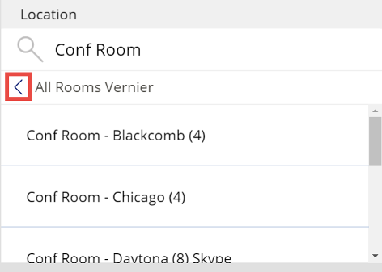

* Property: **Visible**<br>
    Value: `_roomListSelected && _showDetails`

    This control is visible only if both a room list has been selected and the **Schedule** tab is selected.

* Property: **OnSelect**<br>
    Value: `Set( _roomListSelected, false )`

    When **_roomListSelected** is set to **false**, it changes the **RoomBrowseGallery** control to display items from the **RoomsLists** collection.

## Send icon

   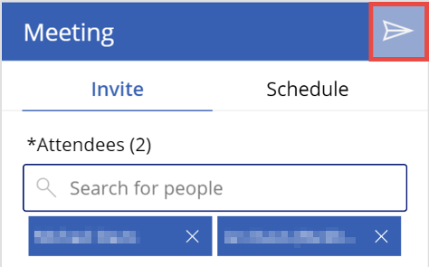

* Property: **DisplayMode**<br>
    Value: Logic to force user to input certain meeting details before the icon becomes editable.
    
    ```powerapps-dot
    If( Len( Trim( TextMeetingSubject1.Text ) ) > 0
        && !IsEmpty( MyPeople ) && !IsBlank( _selectedMeetingTime ),
        DisplayMode.Edit, DisplayMode.Disabled
    )
    ```
  The icon is selectable only if the meeting subject is filled out, there is at least one attendee for the meeting, and a meeting time has been selected. Otherwise, it's disabled.

* Property: **OnSelect**<br>

    Value: Code to send the meeting invite to your selected attendees and clear all the input fields:

    ```powerapps-dot
    Set( _myCalendarName, LookUp( 'Office365'.CalendarGetTables().value, DisplayName = "Calendar" ).Name );
    Set( _myScheduledMeeting, 
        'Office365'.V2CalendarPostItem( _myCalendarName,
            TextMeetingSubject1.Text, 
            Text(DateAdd(DateTimeValue( _selectedMeetingTime.StartTime), -TimeZoneOffset(), Minutes) ),
            Text(DateAdd(DateTimeValue( _selectedMeetingTime.EndTime), -TimeZoneOffset(), Minutes) ),
            {
                RequiredAttendees: Concat( MyPeople, UserPrincipalName & ";" ) & _selectedRoom.Address, 
                Body: TextMeetingMessage1.Text, 
                Location: _selectedRoom.Name, 
                Importance: "Normal", 
                ShowAs: "Busy", 
                ResponseRequested: true
            }
        )
    );
    Concurrent(
        Reset( TextMeetingLocation1 ),
        Reset( TextMeetingSubject1 ),
        Reset( TextMeetingMessage1 ),
        Clear( MyPeople ),
        Set( _selectedMeetingTime, Blank() ),
        Set( _selectedRoomList, Blank() ),
        Set( _selectedRoom, Blank() ),
        Set( _roomListSelected, false )
    )
    ```
  
  At a low level, this code block:
  1. Sets **_myCalendarName** to the calendar in the [Office365.CalendarGetTables()](/connectors/office365/#get-calendars) operation with a **DisplayName** of "Calendar."
  1. Schedules the meeting with all of the input values from the various selections the user made throughout the screen using the [Office365.V2CalendarPostItem](/connectors/office365/#create-event--v2-) operation.
  1. Resets all of the input fields and variables used in creating the meeting.

> [!NOTE]
> Depending on your region, the calendar you want might not have a display name of "Calendar." Go to Outlook to see what the title of your calendar is, and make the appropriate change in the app.

## Next steps

* [Learn more about this screen](./meeting-screen-overview.md)
* [Learn more about the Office 365 Outlook connector in Power Apps](../connections/connection-office365-outlook.md)
* [Learn more about the Office 365 Users connector in Power Apps](../connections/connection-office365-users.md)


[!INCLUDE[footer-include](../../../includes/footer-banner.md)]