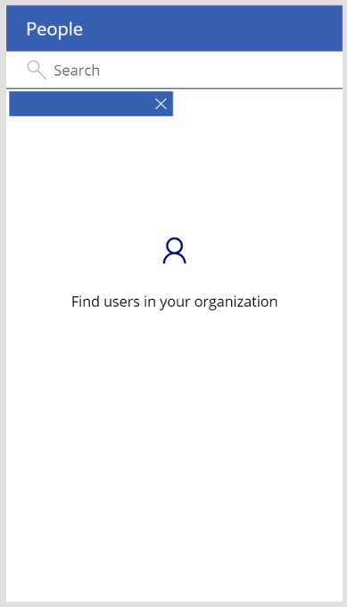
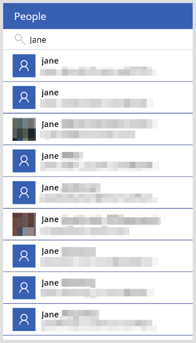
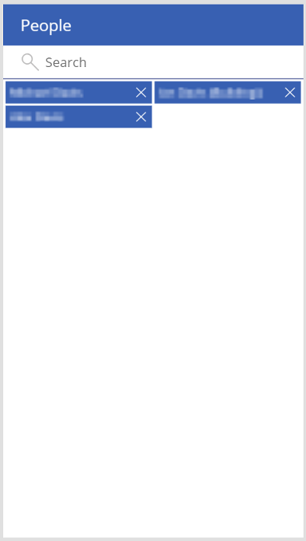

# People-screen template in canvas apps

In a canvas app, add a people screen that lets users search for people within their organizations. Users can search for, select, and add people to a collection. You can change which types of data appear in the search result gallery, use your people selections to send an email, and make other customizations.

You can also add other template-based screens that show different data from Office 365, such as [email](email-screen-overview.md), a user's [calendar](calendar-screen-overview.md), and [availability](meeting-screen-overview.md) of people users might want to invite to a meeting.

This overview teaches you:
> [!div class="checklist"]
> * How to use the default people screen.
> * How to modify the screen.
> * How to integrate the screen into apps.

For a deeper dive into this screen's default functionality, see the [people-screen reference](people-screen-reference.md).

## Prerequisite

Familiarity with how to add and configure screens and other controls as you [create an app in Power Apps](../data-platform-create-app-scratch.md).

## Default functionality

To add a people screen from the template:

1. [Sign in](https://make.powerapps.com?utm_source=padocs&utm_medium=linkinadoc&utm_campaign=referralsfromdoc) to Power Apps, and then create an app or open an existing app in Power Apps Studio.

    This topic shows a phone app, but the same concepts apply to a tablet app.

1. On the **Home** tab of the ribbon, select **New screen** > **People**.

    By default, the screen looks similar to this:

    

1. To start searching for users, select the text input box at the top and start typing a coworker's name. The search results appear below the text input box:

    

1. When you select individuals from the search results, they are added to the **MyPeople** collection. The search bar input value is reset, revealing the collection of people you've selected:

    

## Modify the screen

You can modify the default functionality of this screen by [showing different data for people](people-screen-overview.md#show-different-data-for-people).

If you want to modify the screen further, use the [people-screen reference](./people-screen-reference.md) as a guide.

### Show different data for people

This screen uses the [Office365Users.SearchUser](/connectors/office365users/#searchuser) operation to search for users in your org. It provides additional fields for each event beyond what appears in the **UserBrowseGallery** control. Adding or changing fields in the gallery is a simple process:

1. In the **UserBrowseGallery**, select a label to modify (or add one and keep it selected).

1. With its **Text** property selected, in the formula bar, replace the contents with `ThisItem.`

    IntelliSense shows a list of fields that you can select.

1. Select the field that you want.

    The **Text** property should update to `ThisItem.{FieldSelection}`.

## Integrate the screen into an app

The people screen is a powerful bundle of controls in its own right, but it usually performs best as part of a larger, more versatile app. You can integrate this screen into a larger app in a number of ways, including [using your cached list of people](people-screen-overview.md#use-your-cached-list-of-people).

### Use your cached list of people

The people screen caches your people selections in the **MyPeople** collection. Should your business scenario call for a person lookup, you will need to know how to use this collection. Here, you'll walk through how to connect this screen to a rudimentary email screen and send emails to users in the **MyPeople** collection. You'll also gain insight into how the [email-screen](./email-screen-overview.md) works.

1. Add the Office 365 Outlook data source to your app by selecting the **View** tab, selecting **Data sources** > **Add data source**, and looking for the Office 365 Outlook connector. You might have to select **New connection** to find it.
1. After inserting the people screen, insert a new blank screen. Within that screen, add a back-arrow icon, two text-input boxes, and a send icon.
1. Rename the screen to **EmailScreen**, the back-arrow icon to **BackIcon**, one text-input box to **SubjectLine**, the other to **MessageBody**, and the send icon to **SendIcon**.
1. Set the **OnSelect** property of **BackIcon** to `Back()`.
1. Set the **OnSelect** property of **SendIcon** to this formula:

    ```powerapps-dot
    Office365.SendEmailV2( 
        Concat( MyPeople, UserPrincipalName & ";" ), 
        SubjectLine.Text, 
        MessageBody.Text 
    )
    ```
    
    Here, you're using the Outlook connector to send an email. You pass it `Concat(MyPeople, UserPrincipalName & ";")` as the list of recipients. This formula concatenates all of the email addresses in the **MyPeople** collection into a single string with semicolons separating them. This is no different from writing out a string of email addresses separated by semicolons in the "To" line of your favorite email client.
    * You're passing `SubjectLine.Text` as the subject of the message, and `MessageBody.Text` as the body of the message.
1. On the people screen, in the upper-right corner, insert the **Mail** icon.
   Change the icon color to whatever suits you.
1. Set the **OnSelect** property of the **SendIcon** to `Navigate( EmailScreen, None )`.

    You now have a two-screen app in which you can select users, compose an email message to them, and then send it. Feel free to test it out, but be careful, because the app sends emails to everyone you add to the **MyPeople** collection.

## Next steps

* [View the reference documentation for this screen](./people-screen-reference.md).
* [Learn more about the Office 365 Outlook connector](../connections/connection-office365-outlook.md).
* [Learn more about the Office 365 Users connector](../connections/connection-office365-users.md).


[!INCLUDE[footer-include](../../../includes/footer-banner.md)]