---
title: Use search pane (preview)
description: Learn how to use the Search pane inside Power Apps Studio to find text.
author: TashasEv
ms.topic: conceptual
ms.custom: canvas
ms.reviewer: tapanm
ms.date: 03/16/2022
ms.subservice: canvas-maker
ms.author: tashas
search.audienceType: 
  - maker
search.app: 
  - PowerApps
contributors:
  - tapanm-msft
  - TashasEv
---

# Use search pane (preview)

[This article is pre-release documentation and is subject to change.]

You can now use the search pane to locate objects across your app like media files, variables, collections, data sources and more. You can also use the search pane to find repeated instances of strings in formulas. For example, using the search pane, you can look for each instance of `HoverColor` to determine the setting for that property in other areas of your app. You can use the search pane to learn more about what is being used by your app where, along with being able to go right to results to make necessary updates.

> [!IMPORTANT]
> - This is a preview feature.
> - [!INCLUDE[cc_preview_features_definition](../../includes/cc-preview-features-definition.md)]
> - This feature is being rolled out and depending on your region, it may not be available for your tenant yet.

## Prerequisites

- [Sign up](../signup-for-powerapps.md) for Power Apps.
- [Create an app](get-started-test-drive.md) or [open an existing app](edit-app.md) in Power Apps.
- Learn how to [configure a control](add-configure-controls.md).
- Create a [new app](data-platform-create-app.md), or open an [existing app](edit-app.md) in Power Apps.

## Enable the search pane

The search pane is enabled on the new apps by default. However, you need to manually enable it on existing apps.

To enable search pane on existing apps:

1. Open a [new](data-platform-create-app.md) or an [existing](edit-app.md) app in Power Apps Studio.

1. Select **Settings** at the top.

1. Select **Upcoming features**.

1. Under the **Preview** tab, select **Search** to turn this feature on.

    :::image type="content" source="media/search/enable-search.png" alt-text="Search feature listed under the preview section of upcoming features in settings.":::

    Search pane is enabled:

    :::image type="content" source="media/search/search-pane.png" alt-text="Search pane visible inside Power Apps Studio.":::

## Open search pane

You can open the search pane using the Search icon, or shortcut keys. To use the shortcut keys, press **Ctrl+F** when your cursor is outside the formula bar. When inside the formula bar, press **Ctrl+Shift+F* to open search pane.

> [!NOTE]
> Pressing **Ctrl+F** inside the formula bar will open the [Find and Replace](formula-bar-find-replace.md) capability inside the formula bar.

## Using the Search pane

When working with search, you have options to help you filter and refine your search. We'll look at these options.

## Filter

1.  Add text or characters to search for into the provided input area.

2.  Select the filter icon on the righthand side of the provided input area.

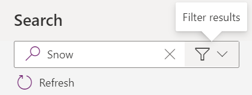

3.  Select one or more categories on the right to filter your search results. By default, "All" is selected and results from all categories will be shown.

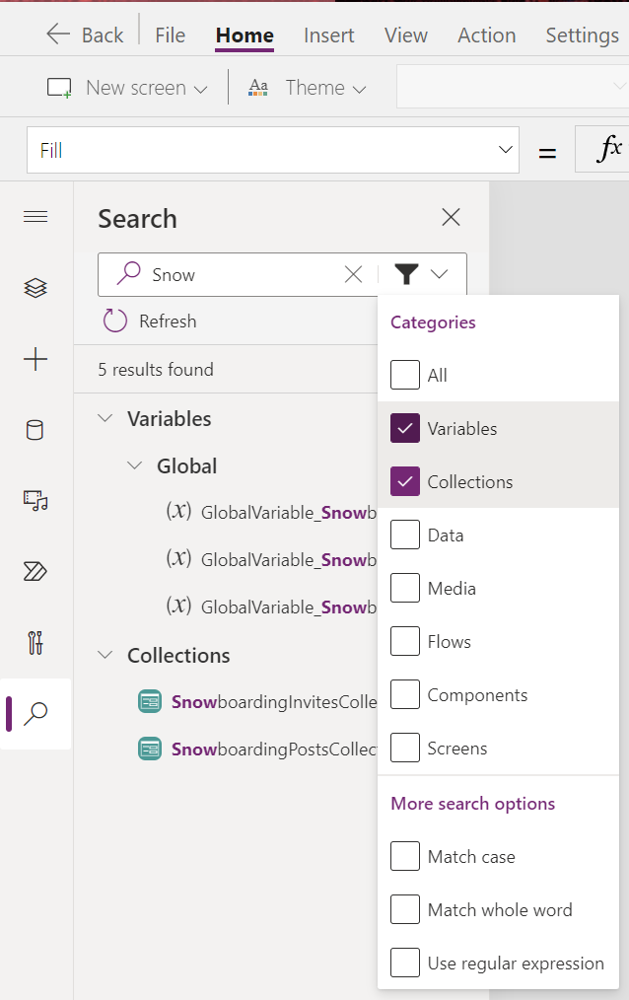

## Refine your search

Below the filter categories, you can also refine your search results using the options under **More search options**:

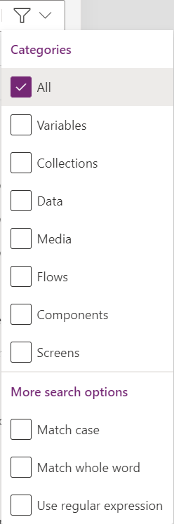

- **Match case** returns only matches with the specified case.  
    In the example below, instances of Snow will appear as a match, but snow would not.

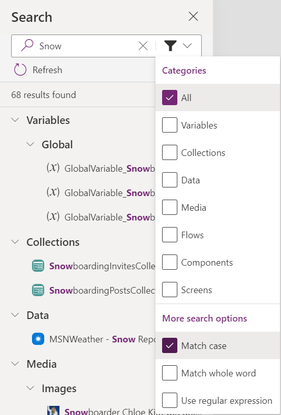

- **Match Whole Word** returns only exact matches of the entire sequence of characters.  
    In the example below, "Snow" returns only 2 results although "Snow" appears within names many times across app objects.

- **Use regular expression (RegEx)** returns only matches conforming to the regular expression specified within the input area. See [regular-expression syntax](https://docs.microsoft.com/en-us/previous-versions/1400241x(v=vs.100)) for an introduction to the syntax.   
    In the example below, using the Regular Expression search capability with *Snowboarding( Mountain\| Dashboard)* returns matches for*Snowboarding* when it appears together with either*Mountain* or*Dashboard* as shown below.

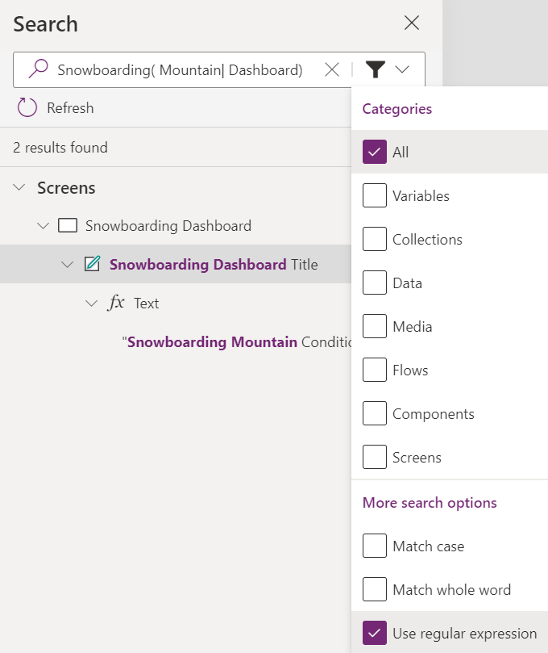

# Working with Search results

Selecting search results in different areas of the Search pane will behave differently depending on the context of the result. In broad terms, there are two major types of search results in the pane: **definitions** and **instances**. Definitions describe the object being referred to in your app, usually in a formula. Instances are the individual formula references where you refer to the object.

In the Search pane there are several category headers which you can use to navigate through the results in addition to filtering as shown above. The Variables, Collections, Data, Media, Flows, and Components categories all refer to **definitions.** When you select results under these category headers, you'll be taken either to the appropriate definition screen backstage (such as for Variables and Collections) or to the appropriate pane where that object was added to your app (such as for Data, Media, Flows, and Components).

The Screens category is based on the structure of the screens pivot under the Tree View. Here you will find **instances**: search results which are directly tied to an individual App, Screen, or Control property in the formula bar. When you select a result under the Screens category, you'll be taken to that specific formula bar reference and the related control will be selected if applicable.

Here we'll explore each search result type.

## Variables

Selecting either a Global or Context Variable under the Variables header will navigate to the information screen backstage for that variable.

**Global Variable:**

**Context Variable:**

## Collections

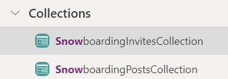

Selecting a collection under the Collections header will navigate you to the information screen backstage for that collection.

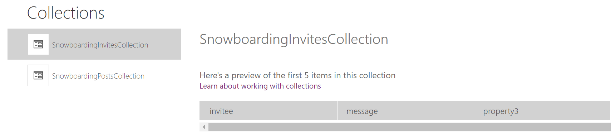

## Data

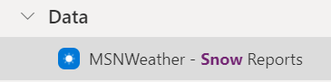

Selecting a result under the Data header will open the Data Pane and pre-populate the search input for that pane with the selected result text to help further refine the pane results.

## Media

Selecting a result under the Media header will open the Media Pane and pre-populate the search input for that pane with the selected result text to help further refine the pane results.

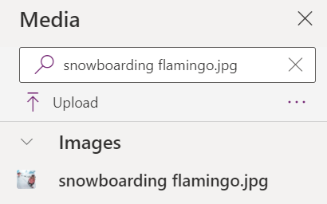

## Flows

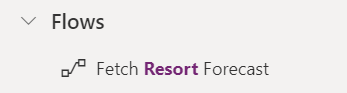

This header will only appear if you have enabled the Power Automate Pane (Preview) feature under Settings. Selecting a result here will open the Power Automate Pane and pre-populate the search input for that pane with the selected result text to help further refine the pane results. [Learn more about the Power Automate Pane here.](https://docs.microsoft.com/en-us/powerapps/maker/canvas-apps/working-with-flows)

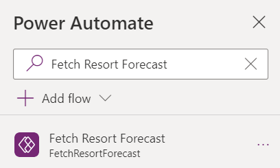

## Components

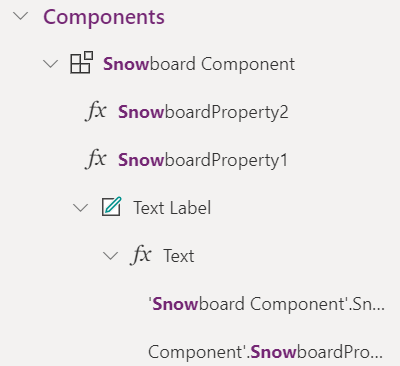

Selecting a result under the Components header will navigate you to the Components pivot in the Tree View Pane and pre-populate the search input for that pane with the selected result text to help further refine the pane results.

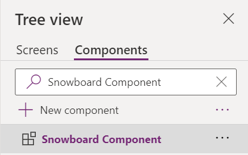

## Screens

Selecting a result under the Screen header will select the appropriate control or screen on the canvas for the result and open the property for the result in the formula bar. The selected result will also be highlighted in the formula bar.

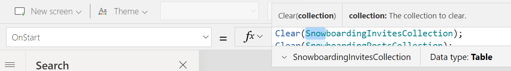

# Refreshing the Search results

If you make changes within the app, you'll need to refresh the results pane to see the change reflected in your search results.

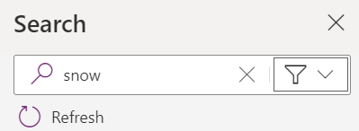

# Clearing the Search term

Search terms and results are kept until you no longer need them. To clear the search term and results, select the 'X' on the right hand side of the input area.

# Limitations

The Search pane is limited to returning up to 2000 results. You'll receive a notification if you've exceeded that amount of results with a prompt to refine your search.

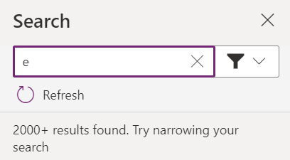
