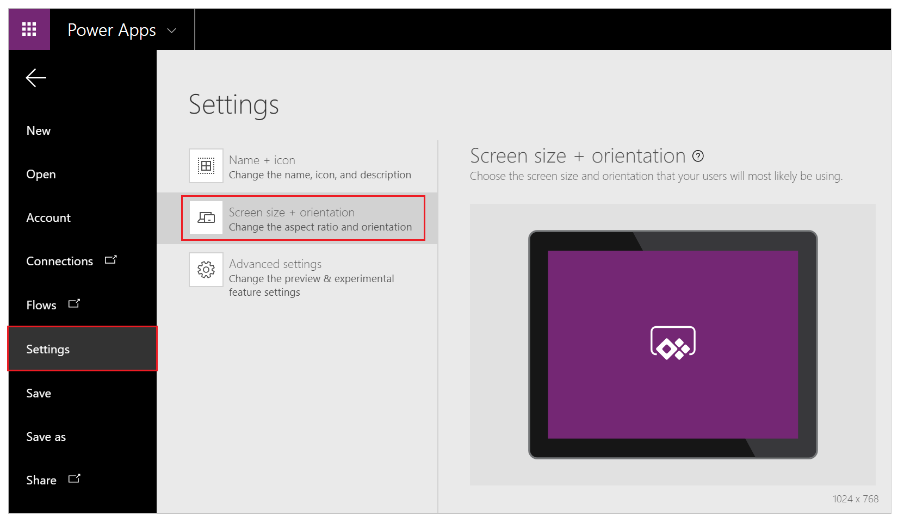

# Change screen size and orientation of a canvas app in PowerApps
Customize a canvas app by changing its screen size and orientation.

## Prerequisites
1. Create an app, or open one for editing.

2. On the **File** menu, select **App settings**.

## Change screen size and orientation
1. Under **App settings**, select **Screen size + orientation**.

    

2. In the **Orientation** list, select **Portrait** or **Landscape**.

3. (Tablet apps only) Under **Aspect ratio**, perform either of these steps:

    - Select the ratio that matches the target device for this app.
    - Select **Custom** to set your own size, and then specify a width between 50 - 3840 and a height between 50 - 2160.

    

4. Under **Lock aspect ratio**, specify either **On** or **Off**.

    If you lock the aspect ratio, the app will retain the appropriate aspect ratio for a phone. If the app is running on another kind of device, the app will display incorrectly and may show unwanted results. If you unlock the aspect ratio, the app will adjust to the aspect ratio of the device on which it's running.

5. Under **Lock orientation**, specify either **On** or **Off**.

    If you lock the app's orientation, the app will retain the orientation that you specify. If the app is running on a device for which the screen is in a different orientation, the app will display incorrectly and may show unwanted results. If you unlock the app's orientation, it will adjust to the screen orientation of the device on which it's running.

    You can also modify the app's orientation by enabling **Enable app embedding user experience** in **Advanced settings**. This feature top-left aligns the app when it's embedded and changes the background color of the hosting canvas to white.

6. Select **Apply** to save your changes.

## Next step
On the **File** menu, select **Save** to republish your app with the new settings.
