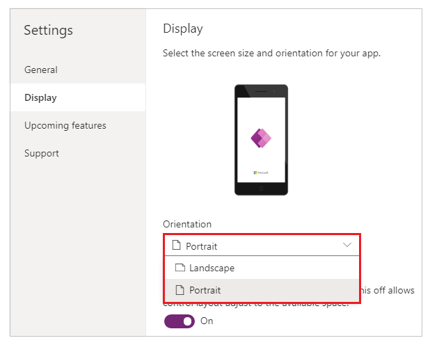
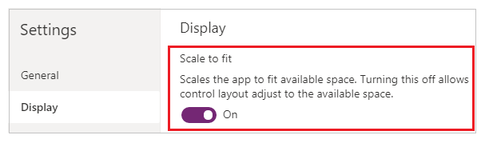
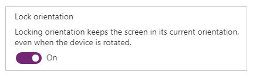

# Change screen size and orientation of canvas apps

Customize a canvas app by changing its screen size and orientation.

## Change screen size and orientation

1. Sign in to [Power Apps](https://make.powerapps.com).
1. Open the app to [edit](edit-app.md).
1. Select **File** menu.
1. Select **Settings**.
1. Select **Display**.
1. Under **Orientation** list, select **Portrait** or **Landscape**.   

    

1. (Tablet apps only) Under **Aspect ratio**, perform either of these steps:

    - Select the ratio that matches the target device for this app.
    - Select **Custom** to set your own size, and then specify a width between 50 - 3840 and a height between 50 - 2160.

    
    
    > [!NOTE]
    > **Size** is only available for apps with **Tablet** layout.

1. Under **Scale to fit**, specify either **On** or **Off**.

    

    This setting is on by default so that app screens resize to fit the available space on the device. When this setting is on, the app's **Width** property matches its **DesignWidth**, and the app's **Height** matches its **DesignHeight**.

    If you turn this setting off, the app adjusts to the aspect ratio of the device on which it's running and takes up all of the available space. The app doesn't scale and, as a result, screens can show more information.

    When this setting is turned off, **Lock aspect ratio** is automatically turned off and disabled. In addition, the **Width** property of all screens is set to `Max(App.Width, App.DesignWidth)`, and their **Height** property is set to `Max(App.Height, App.DesignHeight)` so that they track the dimensions of the window in which the app is running. With this change, you can create apps that respond to different devices and window dimensions. More information: [Create responsive layout](create-responsive-layout.md)

1. Under **Lock aspect ratio**, specify either **On** or **Off**.

    

    If this setting is on, the app retains the screen orientation and aspect ratio that you specified in steps 2 and 3, no matter the device. For example, a phone app that's running in a web browser retains the ratio for a phone, showing a dark bar on each side instead of filling the window.

    If this setting is off, the app adjusts to the aspect ratio of the device on which it's running (and distorting the UI if necessary).

1. Under **Lock orientation**, specify either **On** or **Off**.

    

    If you lock the app's orientation, the app retains the orientation that you specify. If the app is running on a device for which the screen is in a different orientation, the app displays incorrectly and may show unwanted results. If you unlock the app's orientation, it adjusts to the screen orientation of the device on which it's running.

    You can also modify the app's orientation by enabling **Optimize embedding appearance** in **Settings** > **Display**. This feature top-left aligns the app when it's embedded and changes the background color of the hosting canvas to white.

    

1. Close **Settings** dialog.

1. [Save and publish](save-publish-app.md) your app.

## Next steps

- [Create responsive layouts in canvas apps](create-responsive-layout.md).
- Check [common issues and resolutions](common-issues-and-resolutions.md) if you're running into any problems.

[!INCLUDE[footer-include](../../includes/footer-banner.md)]
