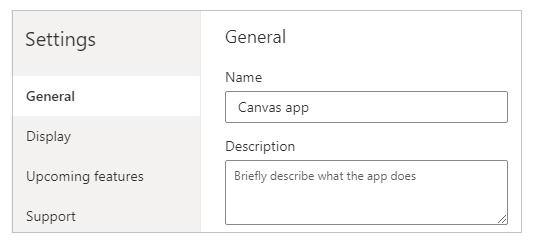
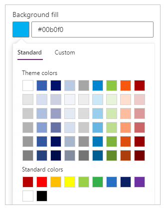

# Change app name and icon for canvas apps

Customize a canvas app by changing its name and icon.

## Prerequisites

1. Create an app, or open one for editing.

2. On the **File** menu, select **Settings**.

## Rename an app

Under **General**, update the app name inside the **Name** text box.

## Change an app tile

Follow one or more of these steps:

* Select a different background color from the list of options.

    

* Select an icon from the list of default icons.

    

* Select **Browse file**, select the image that you want to use, and then select **Open**.

    > [!NOTE]
  > For best results, use a square-shaped icon.

## Next step
On the **File** menu, select **Save** to republish your app with the new settings.

## More resources
* [Share an app](share-app.md)
* [Delete an app](delete-app.md)
* [Restore an app to a previous version](restore-an-app.md)

[!INCLUDE[footer-include](../../includes/footer-banner.md)]