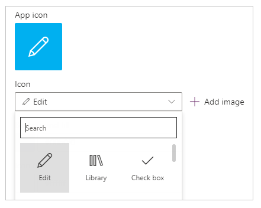

# Change app name and icon in PowerApps
Customize an app by changing its name and tile.

## Prerequisites
1. Create an app, or open one for editing.

2. On the **File** menu, click or tap **App settings**.

## Rename an app
Under **App name**, click or tap **Rename this app**, and then type a different name.

## Change an app tile
Follow one or more of these steps:

* Click or tap a different background color from the list of options.

    

* Click or tap an icon from the list of default icons.

    

* Click or tap **Browse file**, click or tap the image that you want to use, and then click or tap **Open**.

    > [!NOTE]
> For best results, use a square-shaped icon.

## Next step
On the **File** menu, click or tap **Save** to republish your app with the new settings.

## More resources
* [Share an app](share-app.md)
* [Delete an app](delete-app.md)
* [Restore an app to a previous version](restore-an-app.md)
