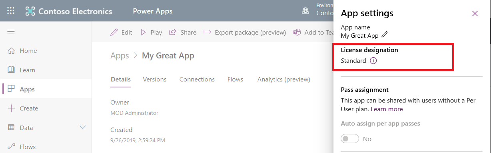
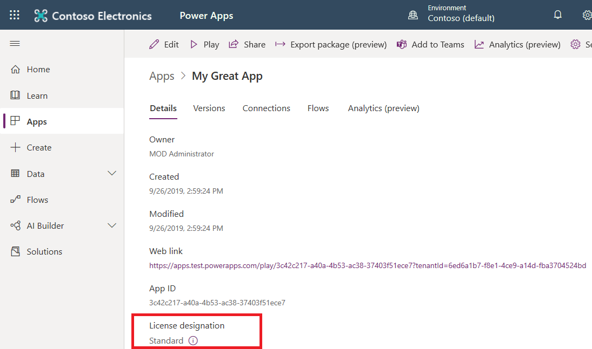

# Settings

This topic outlines how to interpret information and use controls in app
settings.

## License designation

In October 2019 a collection of connectors were reclassified from Standard to
Premium.
[This documentation](https://docs.microsoft.com/en-us/power-platform/admin/powerapps-flow-licensing-faq#office-365) outlines
which connectors were reclassified. Apps using these connectors prior to the
reclassification have been granted an extended timeframe which allows users
without a premium license to access these apps. The following table outlines the
designations and which license an end user must have to access an app.

| **Designation​** | **Definition**                                                                                                                                                                                                                                                                                                                                            |
|-----------------|-----------------------------------------------------------------------------------------------------------------------------------------------------------------------------------------------------------------------------------------------------------------------------------------------------------------------------------------------------------|
| Standard​        | An app that only uses standard connectors. An end user must have a Power Apps for Office 365 plan, per app plan, or a per user plan to access this app.​                                                                                                                                                                                                   |
| Extended​        | An app allowed to use connectors promoted to premium on Oct. 1st, 2019.​ An end user must have a Power Apps for Office 365 plan, per app plan or per user plan. [This documentation](https://docs.microsoft.com/en-us/power-platform/admin/powerapps-flow-licensing-faq#office-365) outlines which connectors were promoted to premium on Oct. 1st 2019.  ​ |
| Premium​         | An app that uses at least one premium connector. An end user must have a per app plan or per user plan to access.​                                                                                                                                                                                                                                         |

The license designation appears in app settings.

The license designation also appears in the app details view.

## Pass assignment

This information is in [About Power Apps per app
plans](https://docs.microsoft.com/en-us/power-platform/admin/about-powerapps-perapp#step-three-set-up-apps-to-use-per-app-plans)
section in the Power Platform admin guide.
