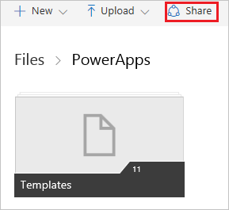
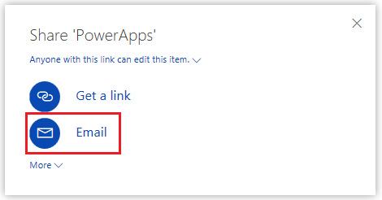
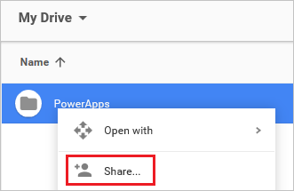

# Share Excel data used by your app

You can share Excel data with your app users in a [cloud account](connections/cloud-storage-blob-connections.md), such as OneDrive.

For example, you might create an app that shows the names and phone numbers of the technical-support group at your company. The information is stored in an Excel spreadsheet, which you put in a folder in Dropbox. You then share the folder with your app users so that they can see the names and phone numbers.

You must share the data so that users can run and even modify your app. Users who aren't given the sharing permissions won't see the data in the Excel file.

This topic shows you how to share data in an Excel spreadsheet using Dropbox, OneDrive, and Google Drive. To create an app that displays data from an Excel file, see [Create an app from a set of data](get-started-create-from-data.md).

## Share data in Dropbox
1. Sign in to Dropbox using the same account that you used to create a connection from Power Apps to Dropbox.
2. Select the folder that contains the Excel file, and then select **Share**:  
   
    
3. In the dialog box, enter the email addresses with which your app users sign in to Dropbox.  
   
    
4. If your app users will add, modify, or delete data in your app,  select **Can edit**. Otherwise, select **Can view**.
5. Select **Share**.

For more information, see [Sharing folders on Dropbox](https://www.dropbox.com/en/help/19).

## Share data in OneDrive
1. Sign in to OneDrive using the same account that you used when you created a connection from Power Apps to OneDrive.
2. Select the folder that contains the file, and then select **Share**:  
   
    
   
    > [!NOTE]
   > In OneDrive for Business, share the file itself, not the folder that contains the file.
3. In the dialog box, select **Email**.
   
    
4. Specify the email addresses with which your app users sign in to OneDrive, and then select **Share**.  
   
    

For more information, see [Share OneDrive files and folders](https://support.office.com/article/Share-OneDrive-files-and-folders-and-change-permissions-9fcc2f7d-de0c-4cec-93b0-a82024800c07).

## Share data in Google Drive
1. Sign in to Google Drive using the same account with which you created a connection from Power Apps to Google Drive.
2. Right-click the folder that stores your Excel file, and then select **Share**.  
   
    
3. In the dialog box, enter the email addresses with which your app users sign in to Google Drive:  
   
    
4. If your app users will add, modify, or delete data in your app, then select **Can edit** in the list of permissions. Otherwise, select **Can view**.
5. Select **Done**.

For more information, see [Share Google Drive files and folders](https://support.google.com/drive/answer/2494822).

### Known limitations
For information about how to share Excel data within your organization, [review these limitations](connections/cloud-storage-blob-connections.md#known-limitations).

[!INCLUDE[footer-include](../../includes/footer-banner.md)]