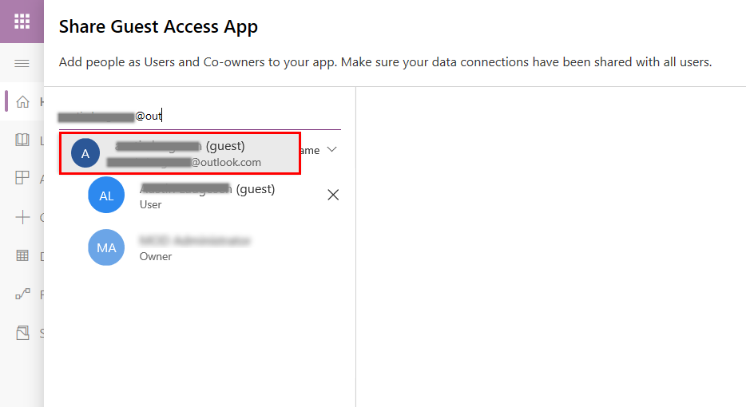

# Share a canvas app with guest users

Canvas apps can be shared with guest users of an Azure Active Directory (Azure AD) tenant. This enables inviting external business partners, contractors, and third parties to run your company's canvas apps.

## Prerequisites

- In Azure AD, enable B2B external collaboration for the tenant. More information: [Enable B2B external collaboration and manage who can invite guests](/azure/active-directory/b2b/delegate-invitations)

  > [!NOTE]
  > B2B external collaboration is enabled by default; however, you need to verify that the settings weren't changed by a tenant admin. For more information about Azure AD B2B, go to [What is guest user access in Azure AD B2B?](/azure/active-directory/b2b/what-is-b2b).

- Access to an account that can add guest users to an Azure AD tenant. Admins and users with the Guest Inviter role can add guests to a tenant.

- The guest user must have a license with Power Apps use rights that matches the capability of the app assigned through one of the following tenants:

  - The tenant hosting the app being shared
  - The home tenant of the guest user

Watch this video to learn how to share an app with guests:
> [!VIDEO https://www.microsoft.com/videoplayer/embed/RWLTiv]

## Steps to grant guest access

1. In Azure AD, select **New guest user**. More information: [Quickstart: Add a new guest user in Azure AD](/azure/active-directory/b2b/b2b-quickstart-add-guest-users-portal)

    

2. If the guest user doesn't already have a license in their home tenant, assign a license to the guest user.

   - To assign guest users from admin.microsoft.com, go to [Assign licenses to one user](/office365/admin/subscriptions-and-billing/assign-licenses-to-users).

   - To assign guest users from portal.azure.com, go to [Assign or remove licenses](/azure/active-directory/fundamentals/license-users-groups).
 
   > [!IMPORTANT]
   > You might need to disable the Microsoft 365 admin center preview to assign a license to a guest.

3. Share the canvas app by doing the following:

    1. Sign in to [Power Apps](https://make.powerapps.com).

    1. On the left pane, select **Apps**.

    1. Select a canvas app.

    1. On the command bar, select **Share**.

    1. Enter an email address for a guest user from an Azure AD tenant. More information: [What is guest user access in Azure AD B2B?](/azure/active-directory/b2b/what-is-b2b)

       

After you share an app for guest access, guests can discover and access apps shared with them from the email sent to them as part of sharing. You can also share the app URL directly with the guest instead. To find the URL, go to [Power Apps](https://make.powerapps.com), select **Apps** on left pane, select the app, and then select the **Details** tab. The app URL is displayed under **Web link**.

## Considerations and limitations for guest access

- Guests can only be assigned the User role, and not the Co-owner role, for apps shared with them.
- Power Apps guest access uses Azure B2B.
- Power Apps recognizes guests in states 1 through 4&mdash;as outlined in the [Azure B2B documentation](/azure/active-directory/b2b/user-properties)&mdash;when the guest uses a web browser.
- Power Apps recognizes guests in states 1, 3, and 4&mdash;as outlined in the Azure B2B documentation&mdash;when the guest uses [Power Apps Mobile](https://powerapps.microsoft.com/downloads). More information: [Sign in using Power Apps Mobile](../../mobile/run-powerapps-on-mobile.md#sign-in)
- Power Apps can't recognize guests that authenticate by using [Azure AD direct federation](/azure/active-directory/b2b/direct-federation) or [email one-time passcode authentication](/azure/active-directory/external-identities/one-time-passcode).
- Power Apps [per app plans](/power-platform/admin/powerapps-flow-licensing-faq#how-is-microsoft-power-apps-and-power-automate-licensed) are scoped to apps in a specific environment, so they can't be recognized across tenants.
- Power Apps [included with Office](/power-platform/admin/pricing-billing-skus#power-appspower-automate-for-microsoft-365) and Power Apps [per user plans](/power-platform/admin/powerapps-flow-licensing-faq#how-is-microsoft-power-apps-and-power-automate-licensed) have the following characteristics:
  - In the Azure public cloud, they're recognized across tenants in guest scenarios because they aren't bound to a specific environment.
  - In Azure national or sovereign clouds, they're recognized across tenants in guest scenarios. More information: [National clouds](/azure/active-directory/develop/authentication-national-cloud), [Azure geographies](https://azure.microsoft.com/global-infrastructure/geographies/#geographies)
  - Licenses are not recognized across tenants in difference Azure clouds. 

## Frequently asked questions

### What's the difference between canvas app guest access and Power Apps portals?

With canvas apps, you can build an app that's tailored to digitizing business processes, without writing code in a traditional programming language such as C#. Guest access for canvas apps enables teams of individuals made up of different organizations participating in a common business process to access the same app resources that might be integrated with a wide variety of Microsoft and third-party sources. More information: [Overview of canvas-app connectors for Power Apps](./connections-list.md)

[Power Apps portals](../portals/overview.md) provide you the ability to build low-code, responsive websites that allow external users to interact with the data stored in Dataverse. With Power Apps portals, organizations can create websites that can be shared with users external to their organization either anonymously or through the sign-in provider of their choice, such as LinkedIn, Microsoft account, or other commercial sign-in provider.

The following table outlines a few core capability differences between Power Apps portals and canvas apps. 

| Guest access in | Interface | Authentication | Accessible data sources |
|------|--------|----------|-------------------|
| Power Apps portals | Browser-only experience | Allows anonymous and authenticated access | Dataverse |
| Canvas apps | Browser and mobile apps | Requires authentication via Azure AD | Any of approximately 150 out-of-the-box connectors and any custom connector  |

### Can guests access customized forms in SharePoint?

Yes. Any user who can access a SharePoint list with a customized form can create and edit items in the list by using the form. As long as the custom form only uses standard connectors, the guest isn't required to have any Power Apps license.

### Why is a guest who accesses a customized form in SharePoint prompted for a trial?

If the custom form uses a premium connector, a guest must have a Power Apps license to access the custom form. If the custom form only uses standard connectors, your tenant must allow Microsoft Power Platform internal consent plans to be assigned to users. For more details about Power Platform internal consent plans, read [block trial license commands](/power-platform/admin/powerapps-powershell#block-trial-licenses-commands).  

### Can guests access apps embedded in SharePoint?

Yes. However, access to canvas standalone apps requires that the user have a license with Power Apps user rights that matches the capability of the app; this includes embedded apps. When embedding a canvas app in SharePoint by using the Power Apps embed control, enter the app ID. To do this, enter the app ID in the **App web link or ID** box.

When embedding a canvas app in SharePoint via the iFrame HTML tag, reference the app by using the full web URL. To find the URL, sign in to [Power Apps](https://make.powerapps.com), select an app, and then select the **Details** tab. The URL is displayed under **Web link**.

### How is it that guests can open the app shared with them, but no data connections are created?

As is the case with non-guests, the underlying data sources accessed by the app must also be made accessible to the guest.

### What license must be assigned to my guest so they can run an app shared with them?

You must assign your guest the same license that's required for non-guests to run the app. For instance, if the app uses premium connectors, a Power Apps per app plan or a Power Apps per user plan must be assigned to the guest.  

|    Plan                             | SharePoint customized form | Standalone canvas app using non-premium connectors | Standalone canvas app using premium connectors | Model-driven app |
|---------------------------------|----------------------------|----------------------------------------------------|------------------------------------------------|------------------|
| SharePoint user (no Power Apps license) | x                          |                                                    |                                                |                  |
| Power Apps included with Office    | x                          | x                                                  |                                                |                  |
| Power Apps per app plan          | x                          | x                                                  | x                                              | x                |
| Power Apps per user plan         | x                          | x                                                  | x                                              | x                |

For more information about pricing and the capabilities of various plans, go to [Microsoft Power Apps and Power Automate Licensing Guide](https://go.microsoft.com/fwlink/?linkid=2085130).

### In Power Apps Mobile, how does a guest see apps for their home tenant?

Any user who has used their mobile device to access a canvas app that was published in an Azure AD tenant that isn't their home tenant, must sign out of Power Apps and sign back in to Power Apps Mobile.  

### In Power Apps Mobile, how does a guest see apps in the guest tenant?

The guest user opens the email they received when an app in the guest tenant was shared, and selects **Open the app**. This applies to both Azure AD and Microsoft account users.

### Must a guest accept the Azure AD guest invitation before an app can be shared with them?

No. If a guest opens an app that was shared with them before they accepted a guest invitation, the guest will be prompted to accept the invitation as part of the sign-in experience while opening the app.  

### In which Azure AD tenant are connections created for a guest user?

Connections for an app are always made in the context of the Azure AD tenant the app is associated with. For example, if an app is created in the Contoso tenant, the connections made for Contoso internal and guest users are made in the context of the Contoso tenant.

### Can guests use Microsoft Graph via the Microsoft Security Graph connector or a custom connector by using Microsoft Graph APIs?

No, Azure AD guests can't query Microsoft Graph to retrieve information for a tenant in which they're a guest.

### Which Intune policies apply to guests who are using my apps?

Intune only applies the policies of a user's home tenant. For instance, if Lesa@Contoso.com shares an app with Wanda@Fabrikam.com, Intune continues to apply Fabrikam.com policies on Wanda's device, regardless of the apps Wanda runs.

### Which connectors support guest access?

Connectors that don't use any type of Azure AD authentication will support guest access. The following table enumerates all connectors that do use Azure AD authentication, and identifies which connectors currently support guest access. More information: [List of all Power Apps connectors](/connectors/connector-reference/connector-reference-powerapps-connectors)

| **Connector**                                     | **Supports guest access**                                              |
|---------------------------------------------------|------------------------------------------------------------------------|
| 10to8 Appointment Scheduling                      | No                                                                     |
| Adobe Creative Cloud                              | No                                                                     |
| Adobe Sign                                        | No                                                                     |
| Asana                                             | No                                                                     |
| AtBot Admin                                       | No                                                                     |
| AtBot Logic                                       | No                                                                     |
| Azure AD                                          | Yes                                                                    |
| Azure Automation                                  | Yes                                                                    |
| Azure Container Instance                          | Yes                                                                    |
| Azure Data Factory                                | Yes                                                                    |
| Azure Data Lake                                   | Yes                                                                    |
| Azure DevOps                                      | No                                                                     |
| Azure Event Grid                                  | No                                                                     |
| Azure IoT Central                                 | Yes                                                                    |
| Azure Key Vault                                   | No                                                                     |
| Azure Kusto                                       | Yes                                                                    |
| Azure Log Analytics                               | Yes                                                                    |
| Azure Resource Manager                            | Yes                                                                    |
| Basecamp 2                                        | No                                                                     |
| Bitbucket                                         | No                                                                     |
| Bitly                                             | No                                                                     |
| bttn                                              | No                                                                     |
| Buffer                                            | No                                                                     |
| Business Central                                  | No                                                                     |
| CandidateZip                                      | No                                                                     |
| Capsule CRM                                       | No                                                                     |
| Cloud PKI Management                              | No                                                                     |
| Cognito Forms                                     | No                                                                     |
| Microsoft Dataverse                               | Yes*                                                                     |
| Microsoft Dataverse (Legacy)                      | No                                                                     |
| D&B Optimizer                                     | No                                                                     |
| Derdack SIGNL4                                    | No                                                                     |
| Disqus                                            | No                                                                     |
| Document Merge                                    | No                                                                     |
| Dynamics 365                                      | No                                                                     |
| Dynamics 365 AI for Sales                         | Yes                                                                    |
| Dynamics 365 for Fin & Ops                        | No                                                                     |
| Enadoc                                            | No                                                                     |
| Eventbrite                                        | No                                                                     |
| Excel Online (Business)                           | No                                                                     |
| Excel Online (OneDrive)                           | No                                                                     |
| Expiration Reminder                               | No                                                                     |
| FreshBooks                                        | No                                                                     |
| GoToMeeting                                       | No                                                                     |
| GoToTraining                                      | No                                                                     |
| GoToWebinar                                       | No                                                                     |
| Harvest                                           | No                                                                     |
| HTTP with Azure AD                                | No                                                                     |
| Infusionsoft                                      | No                                                                     |
| Inoreader                                         | No                                                                     |
| Intercom                                          | No                                                                     |
| JotForm                                           | No                                                                     |
| kintone                                           | No                                                                     |
| LinkedIn                                          | No                                                                     |
| Marketing Content Hub                             | No                                                                     |
| Medium                                            | No                                                                     |
| Metatask                                          | No                                                                     |
| Microsoft Forms                                   | No                                                                     |
| Microsoft Forms Pro                               | No                                                                     |
| Microsoft Graph Security                          | No                                                                     |
| Microsoft Kaizala                                 | No                                                                     |
| Microsoft School Data Sync                        | No                                                                     |
| Microsoft StaffHub                                | No                                                                     |
| Microsoft Teams                                   | Yes                                                                    |
| Microsoft To-Do (Business)                        | No                                                                     |
| Muhimbi PDF                                       | No                                                                     |
| NetDocuments                                      | No                                                                     |
| Office 365 Groups                                 | Yes                                                                    |
| Office 365 Outlook                                | No                                                                     |
| Office 365 Users                                  | Yes                                                                    |
| Office 365 Video                                  | No                                                                     |
| OneDrive                                          | No                                                                     |
| OneDrive for Business                             | No                                                                     |
| OneNote (Business)                                | No                                                                     |
| Outlook Tasks                                     | Yes                                                                    |
| Outlook&period;com                                       | No                                                                     |
| Paylocity                                         | No                                                                     |
| Planner                                           | No                                                                     |
| Plumsail Forms                                    | No                                                                     |
| Power Apps for Admins | No |
| Power Apps for Makers | No |
| Power Automate Management | No |
| Power BI                                          | Yes                                                                    |
| Power Platform for Admins                                          | No                                                                    |
| Project Online                                    | No                                                                     |
| ProjectWise Design Integration                    | No                                                                     |
| Projectwise Share                                 | No                                                                     |
| SharePoint                                        | Yes                                                                    |
| SignNow                                           | No                                                                     |
| Skype for Business Online                         | No                                                                     |
| Soft1                                             | No                                                                     |
| Stormboard                                        | No                                                                     |
| Survey123                                         | No                                                                     |
| SurveyMonkey                                      | No                                                                     |
| Toodledo                                          | No                                                                     |
| Typeform                                          | No                                                                     |
| Vimeo                                             | No                                                                     |
| Webex Teams                                       | No                                                                     |
| Windows Defender Advanced Threat Protection (ATP) | No                                                                     |
| Word Online (Business)                            | No                                                                     |

\* When using the Microsoft Dataverse as the data source, ensure that the guest user is licensed from the same tenant where you have Dataverse data located.

### See also

[Edit an app](edit-app.md)  
[Restore an app to a previous version](restore-an-app.md)  
[Export and import an app](export-import-app.md)  
[Delete an app](delete-app.md)  

[!INCLUDE[footer-include](../../includes/footer-banner.md)]
