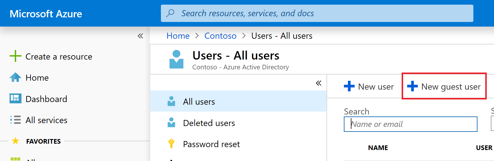

# Share a canvas app with guest users

Canvas apps can be shared with guest users of a Microsoft Entra tenant. You can invite external business partners, contractors, and third parties to run your company's canvas apps.

Watch this video to learn how to share an app with guests:
> [!VIDEO https://learn-video.azurefd.net/vod/player?id=84cd1908-2ca9-415b-a819-3ffb61e55eca]

## Prerequisites

- In Microsoft Entra ID, enable B2B external collaboration for the tenant. More information: [Configure external collaboration settings for B2B in Microsoft Entra External ID](/entra/external-id/external-collaboration-settings-configure)

  > [!NOTE]
  > B2B external collaboration is enabled by default. However, you need to verify that the settings weren't changed by a tenant admin. For more information about Microsoft Entra B2B, see [Overview: B2B collaboration with external guests for your workforce](/entra/external-id/what-is-b2b).

- Access to an account that can add guest users to a Microsoft Entra tenant. Admins and users with the Guest Inviter role can add guests to a tenant.

- To access an app that connects to Dataverse, the guest user must have a license with Power Apps use rights that matches the capability of the app. The exception to this prerequisite is when an app is hosted in a [Microsoft Dataverse for Teams environment](/power-platform/admin/about-teams-environment).
  
> [!NOTE]
> Ensure that you perform these steps on the **resource tenant**, and not on the **home tenant**.
>
> - A **resource tenant** is where the app is expected to exist, and where the user is expected to create the app using Power Apps as a guest.
> - A **home tenant** is where the user's account resides and authenticates against.

## Steps to grant guest access

1. In Microsoft Entra ID, select **New guest user**. More information: [Quickstart: Add a guest user and send an invitation](/entra/external-id/b2b-quickstart-add-guest-users-portal)

    

2. If the guest user doesn't already have a license in their home tenant, assign a license to the guest user.

   - To assign guest users from admin.microsoft.com, go to [Add users and assign licenses at the same time](/microsoft-365/admin/add-users/add-users).

   - To assign guest users from portal.azure.com, go to [Assign or remove licenses](/entra/fundamentals/licensing).

   > [!IMPORTANT]
   > You might need to disable the Microsoft 365 admin center preview to assign a license to a guest.

3. [Share an app from Power Apps](Share an app from Power Apps)

## Considerations and limitations for guest access

- Users accessing web experiences in different Microsoft Entra tenants must access Power Apps in a standalone browser session (different browser or InPrivate browser session). The standalone browser session insures that Power Apps picks up the correct Azure B2B user identity for the app being accessed.
- Power Apps guest access uses Azure B2B.
- Power Apps Mobile doesn't support authentication using [Microsoft Entra direct federation](/azure/active-directory/b2b/direct-federation). More information: [Sign in using Power Apps Mobile](../../mobile/run-powerapps-on-mobile.md#sign-in)
- Power Apps [per app plans](/power-platform/admin/powerapps-flow-licensing-faq#how-is-microsoft-power-apps-and-power-automate-licensed) are scoped to apps in a specific environment, so they can't be recognized across tenants.
- Power Apps [included with Office](/power-platform/admin/pricing-billing-skus#power-appspower-automate-for-microsoft-365) and Power Apps [per user plans](/power-platform/admin/powerapps-flow-licensing-faq#how-is-microsoft-power-apps-and-power-automate-licensed) have the following characteristics:
  - In the Azure public cloud, they're recognized across tenants in guest scenarios because they aren't bound to a specific environment.
  - In Azure national or sovereign clouds, they're recognized across tenants in guest scenarios. For more information, see [National clouds](/azure/active-directory/develop/authentication-national-cloud), [Azure geographies](https://azure.microsoft.com/global-infrastructure/geographies/#geographies)
  - Licenses aren't recognized across tenants in difference Azure clouds.
  - Not all connectors create connections in the resource tenant by default.
  - A user that signs in to an app using Azure B2B, doesn't see their identity information in **My account**.

    :::image type="content" source="media/share-app/guest-my-account.png" alt-text="creenshot that shows the Power Apps Azure B2B user profile known issue.":::

## Frequently asked questions

### What's the difference between canvas app guest access and Power Pages?

With canvas apps, you can build an app tailored to digitizing business processes, without writing code in a traditional programming language such as C#. Guest access for canvas apps enables teams of individuals made up of different organizations participating in a common business process to access the same app resources that might be integrated with a wide variety of Microsoft and partner sources. More information: [Overview of canvas-app connectors for Power Apps](./connections-list.md)

[Power Pages](/power-pages/introduction) provide you with the ability to build low-code, responsive websites that allow external users to interact with the data stored in Dataverse. With Power Pages, organizations can create websites and share them with users external to their organization either anonymously or through the sign-in provider of their choice, such as LinkedIn, Microsoft, or other commercial sign-in provider.

The following table outlines a few core capability differences between Power Pages and canvas apps.

| Guest access in | Interface | Authentication | Accessible data sources |
|------|--------|----------|-------------------|
| Power Pages | Browser-only experience | Allows anonymous and authenticated access | Dataverse |
| Canvas apps | Browser and mobile apps | Requires authentication via Microsoft Entra ID | Any of approximately 150 out-of-the-box connectors and any custom connector  |

### Can guests access customized forms in SharePoint?

See [What license must be assigned to my guest so they can run an app shared with them?](#what-license-must-be-assigned-to-my-guest-so-they-can-run-an-app-shared-with-them)

### Why is a guest who accesses a customized form in SharePoint prompted for a trial?

If the custom form uses a premium connector, a guest must have a Power Apps license to access the custom form. If the custom form only uses standard connectors, your tenant must allow Microsoft Power Platform internal consent plans to be assigned to users. For more details about Power Platform internal consent plans, read [block trial license commands](/power-platform/admin/powerapps-powershell#block-trial-licenses-commands).  

### Can guests access apps embedded in SharePoint?

Yes. However, access to canvas standalone apps requires a user license with Power Apps user rights that matches the capability of the app, including embedded apps. When embedding a canvas app in SharePoint with the Power Apps embed control, enter the app ID in the **App web link or ID** box.

When embedding a canvas app in SharePoint via the iFrame HTML tag, reference the app by using the full web URL. To find the URL, sign in to [Power Apps](https://make.powerapps.com), select an app, and then select the **Details** tab. The URL is displayed under **Web link**.

### How is it that guests can open the app shared with them, but no data connections are created?

As is the case with nonguests, the underlying data sources accessed by the app must also be made accessible to the guest.

### What license must be assigned to my guest so they can run an app shared with them?

The following table explains whether the guests can run (use) customized Microsoft Lists or SharePoint library forms, canvas apps, and model-driven apps using the referenced license.

| Plan | Customized Microsoft Lists or SharePoint library form (using nonpremium connectors) | Customized Microsoft Lists or SharePoint library (using premium connectors) | Canvas app (using nonpremium connectors) | Canvas app (using premium connectors) | Model-driven app |
| ------ | ------- | -------- | -------- | --------- | --------- |
| No license | &check; | &cross; | &cross; | &cross; | &cross; |
| SharePoint user (without Power Apps license) | &check; | &cross; | &cross; | &cross; | &cross; |
| Power Apps included with Office | &check; | &cross; | &check; | &cross; | &cross; |
| Power Apps per app plan | &check; | &check; | &check; | &check; | &check; |
| Power Apps per user plan | &check; | &check; | &check; | &check; | &check; |

For more information about pricing and the capabilities of various plans, go to [Microsoft Power Apps and Power Automate Licensing Guide](https://go.microsoft.com/fwlink/?linkid=2085130).

### In Power Apps Mobile, how does a guest see apps for their home tenant?

When users access a canvas app through a mobile device and the app is published in a non-home Microsoft Entra tenant, they can [switch to a different directory](../../mobile/tenant-switcher.md).

### In Power Apps Mobile, how does a guest see apps in the guest tenant?

The guest user opens the email they received when an app in the guest tenant is shared and selects **Open the app**. This view applies to both Microsoft Entra and Microsoft account users. You can also create a deep link. For more information, see [Use deep links with Power Apps mobile](/power-apps/mobile/run-powerapps-on-mobile).

### Must a guest accept the Microsoft Entra guest invitation before an app can be shared with them?

No. If a guest opens an app shared with them before they accept a guest invitation, the guest is prompted to accept the invitation as part of the sign-in experience while opening the app.  

### In which Microsoft Entra tenant are connections created for a guest user?

Connections for an app are always made in the context of the Microsoft Entra tenant the app is associated with. For example, if an app is created in the Contoso tenant, the connections made for Contoso internal and guest users are made in the context of the Contoso tenant.

### Can guests use Microsoft Graph with Power Apps?

By default, Azure B2B users have limited permission to access information from Microsoft Graph. A user’s permission in Microsoft Graph determines what's returned when using connectors such as Microsoft Security Graph, Office 365 Users, Office 365 Groups, and custom connectors using Microsoft Graph APIs. For more information about Microsoft Graph permissions, see [Default user permissions](/entra/fundamentals/users-default-permissions?context=graph%2Fcontext#restrict-guest-users-default-permissions) and [Working with users in Microsoft Graph](/graph/api/resources/users?#user-and-group-search-limitations-for-guest-users-in-organizations).  

### Which Intune policies apply to guests who are using my apps?

Intune only applies the policies of a user's home tenant. For instance, if `Lesa@Contoso.com` shares an app with `Wanda@Fabrikam.com`, Intune continues to apply Fabrikam.com policies on Wanda's device, regardless of the apps Wanda runs.

### Can I disable cross tenant license recognition?

No. Authorization capabilities can and should be used to control which users access a resource. For instance, Dataverse environments can be bound to a security group that excludes Azure B2B guest users.

### Why can an Azure B2B user without a license access a model driven app?

The detection of a previously licensed user no longer having a license isn't immediate. If you expect a user to lose access to an app using Dataverse, then their authorization to the app or data should be updated. For example, the app should be unshared with the user or Dataverse security roles should be removed from the user.

### Which connectors create connections in the resource tenant by default?

Users relying on Azure B2B to access an app only has implications on connectors that use Microsoft Entra ID for authentication. Some Microsoft Entra ID based connectors default to creating a connection in the resource tenant, while others default to creating a connection in the home tenant. Connectors that don't use any type of Microsoft Entra ID authentication work the same for guests and members in a tenant. The following table enumerates all connectors that do use Microsoft Entra ID authentication and default creates connections in the resource tenant. For more information on each connector as there might be restriction, see [List of all Power Apps connectors](/connectors/connector-reference/connector-reference-powerapps-connectors)

| **Connector**                                     | **Creates connection in resource tenant by default**                                             |
|---------------------------------------------------|------------------------------------------------------------------------|
| Microsoft Entra                                          | Yes                                                                    |
| Azure Automation                                  | Yes                                                                    |
| Azure Container Instance                          | Yes                                                                    |
| Azure Data Factory                                | Yes                                                                    |
| Azure Data Lake                                   | Yes                                                                    |
| Azure IoT Central                                 | Yes                                                                    |
| Azure Kusto                                       | Yes                                                                    |
| Azure Log Analytics                               | Yes                                                                    |
| Azure Resource Manager                            | Yes                                                                    |
| Microsoft Dataverse                               | Yes*                                                                     |
| Dynamics 365 AI for Sales                         | Yes                                                                    |
| Microsoft Teams                                   | Yes                                                                    |
| Office 365 Groups                                 | Yes                                                                    |
| Office 365 Users                                  | Yes                                                                    |
| Outlook Tasks                                     | Yes                                                                    |
| Power BI                                          | Yes                                                                    |
| SharePoint                                        | Yes                                                                    |

\* When using the Microsoft Dataverse as the data source, ensure that the guest user is licensed from the same tenant where you have Dataverse data located.

### See also

[Edit an app](edit-app.md)  
[Restore an app to a previous version](restore-an-app.md)  
[Export and import an app](export-import-app.md)  
[Delete an app](delete-app.md)  

[!INCLUDE[footer-include](../../includes/footer-banner.md)]
