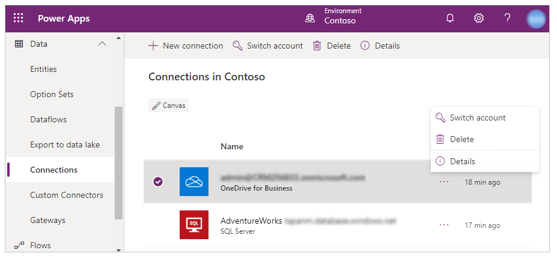
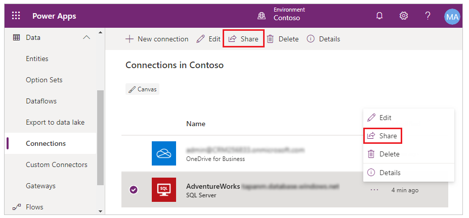
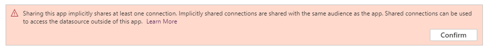

# Share resources used by canvas apps

Before you [share a canvas app](share-app.md), consider the types of resources on which it relies, such as one or more of the following:

* Tables in Microsoft Dataverse.

    For information about giving users access to this data, see [Manage table permissions](share-app.md#manage-table-permissions).
    
* A connection to a data source.
* An on-premises data gateway.
* A custom connector.
* An Excel workbook or other service.
* A flow.

Some of these resources are shared automatically when you share the app. Other resources require you or the people with whom you share the app to take extra steps so that the app works as you expect.

You can also share your connections, custom connectors and on-premises data gateway with your entire organization.

## Connections

Some connections (such as SQL Server with SQL or Windows authentication) are [implicitly shared](share-app-resources.md#implicit-sharing) with the app when you share the app with other users. Other connections require users to create their own connections and explictly grant security privleges (such as security roles for the Dataverse, OneDrive for Business, SQL Server with Azure AD authentication).

You can determine whether a connection is automatically shared as part of the app when you share the app with other users; allowing you to update sharing permissions. To do this, go to make.powerapps.com and select **Data** -> **Connections** from left navigation. Then select the required connection. If the **Share** button appears on top navigation or if the **Share** option displays when you select *More Commands* (...), the selected connection can be shared with other users.

  

  

### Implicit sharing

When you share an app that uses a connection that can be shared, the app connection is **implicitly shared** along with the app. For example, following message appears when you go to make.powerapps.com, select **Apps**, choose an app that uses such connection, select *More Commands* (...) and then select **Share**:

  

If you select **Confirm** and share the chosen app with other users, the app connection is implicitly shared with those users along with the app.

## On-premises data gateways
If you create and share an app that includes data from an on-premises source, the [on-premises data gateway](gateway-management.md) itself and certain types of connections to that gateway will be shared automatically. For any connection that isn’t shared automatically, you can share it manually (as the previous section shows) or let the app prompt users to create their own connections. To show the connection or connections with which a gateway has been configured:

1. Open [powerapps.com](https://make.powerapps.com?utm_source=padocs&utm_medium=linkinadoc&utm_campaign=referralsfromdoc), click or tap **Manage** in the left navigation bar, and then click or tap **Gateways**.
2. Click or tap a gateway, and then click or tap the **Connections** tab.

> [!NOTE]
> If you share one or more connections manually, you might need to reshare them under these circumstances:

* You add an on-premises data gateway to an app that you’ve already shared.
* You change the set of people or groups with whom you’ve shared an app that has an on-premises data gateway.

## Custom connectors
When you share an app that uses a custom connector, it is automatically shared, but users must create their own connections to it.

On [powerapps.com](https://make.powerapps.com?utm_source=padocs&utm_medium=linkinadoc&utm_campaign=referralsfromdoc), you can view or update permissions for a custom connector. In the left navigation bar, click or tap **Manage**, click or tap **Connections**, and then click or tap **New connection** (in the upper-right corner). Click or tap **Custom**, and then click or tap a custom connector to display details about it.

## Excel workbooks
If a shared app uses data to which not all users have access (such as an Excel workbook in a cloud-storage account), [share the data](share-app-data.md).

## Flows
If you share an app that includes a flow, users who run the app will be prompted to confirm or update any connections on which the flow relies. In addition, only the person who created the flow can customize its parameters. For example, you can create a flow that sends mail to an address that you specify, but other users can’t change that address.

[!INCLUDE[footer-include](../../includes/footer-banner.md)]