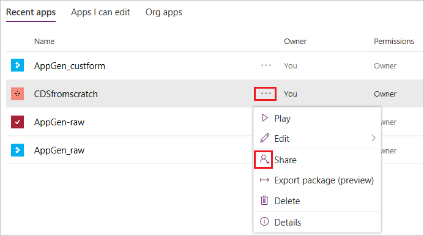
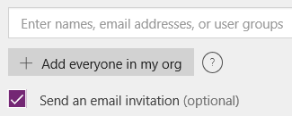
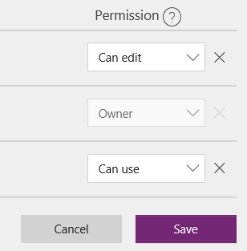

# Share a canvas app in PowerApps

After you build a canvas app that addresses a business need, specify which users in your organization can run the app and which can modify and even reshare it. Specify each user by name, or specify a security group in Azure Active Directory. If everyone would benefit from your app, specify that your entire organization can run it.

> [!IMPORTANT]
> For a shared app to function as you expect, you must also manage permissions for the data source or sources on which the app is based, such as [Common Data Service for Apps](#common-data-service-for-apps) or [Excel](share-app-data.md). You might also need to share [other resources](share-app-resources.md) on which the app depends, such as flows, gateways, or connections.

## Prerequisites

Before you share an app, you must save it to the cloud (not locally) and then publish the app.

- Give your app a meaningful name and a clear description, so that people know what your app does and they can easily find it in a list. On the **File** menu in PowerApps Studio, select **App settings**, specify a name, and then type or paste a description.

- Whenever you make changes, you must save and publish the app again if you want others to see those changes.

## Share an app

1. [Sign in](https://web.powerapps.com?utm_source=padocs&utm_medium=linkinadoc&utm_campaign=referralsfromdoc) to PowerApps, and then select **Apps** near the left edge.

    

1. Select the ellipsis (...) for the app that you want to share, and then select **Share**.

    

1. Specify with which users or security groups in Azure Active Directory you want to share the app.

    > [!NOTE]
    > You can't share apps with a distribution group in your organization or with any users or groups outside your organization.

    

    You can also share the app with your entire organization so that they can run the app, but they won't be able to modify or share it.

1. (optional) To help users find your app, select the check box for sending them an email invitation.

    The invitation contains a link that users can select to run the app.

    - If a user selects the link on a desktop computer, the app opens in [Dynamics 365](http://home.dynamics.com).
    - If the user selects the link on a mobile device, the app opens in PowerApps Mobile.

    If you grant users permission to modify the app, the message also contains a separate link to open the app for editing in PowerApps Studio.

    Regardless of whether you send an invitation, users can run the app from AppSource on [Dynamics 365](http://home.dynamics.com). Users who have **Can edit** permission can also edit the app from within [PowerApps](http://web.powerapps.com?utm_source=padocs&utm_medium=linkinadoc&utm_campaign=referralsfromdoc).

1. Specify the permission for each user or security group, and then select **Save**.

    - **Can use**: Users can run the app but not share it.
    - **Can edit**: Users can run the app, modify it, and share the customized version to other users.

        

    To change permissions for a user or a security group, select the down arrow next to the permission that the user or group already has, and then specify a different permission.

    To remove all permissions for a user or a group, select the **x** icon for that user or group.

## Security-group considerations

- If you share an app with a security group, existing members of that group and anyone who joins it will have the permission that you specify for that group. Anyone who leaves the group loses that permission unless they belong to a different group that has access or you give them permission as an individual.
- Every member of a security group has the same permission for an app as the overall group does. However, you can specify greater permissions for one or more members of that group to allow them greater access. For example, you can give Security Group A the **Can use** permission, but you can also give User B, who belongs to that group, **Can edit** permission. Every member of the security group can run the app, but only User B can edit it. If you give Security Group A the **Can edit** permission and User B **Can use** permission, that user can still edit the app.

## Manage entity permissions

### Common Data Service for Apps

If you create an app based on Common Data Service (CDS) for Apps, you must also ensure that the users who will run it have the appropriate permissions for the entity or entities on which the app relies. Specifically, those users must belong to a security role that can perform tasks such as creating, reading, writing, and/or deleting relevant records. In many cases, you'll want to create one or more custom security roles with the exact permissions that users need to use your apps. You can then assign that role or roles to users as appropriate. 

#### Prerequisite

To perform the next two procedures, you must have **System administrator** permissions for a CDS for Apps database.

#### Create a security role

1. [Sign in to PowerApps](https://web.powerapps.com?utm_source=padocs&utm_medium=linkinadoc&utm_campaign=referralsfromdoc), and make sure that you're in the same environment as the app that you want to share.

1. In the upper-right corner, select the gear icon, and then select **Advanced customizations**.

    

1. Select the **Security roles** link.

    

1. Under **All Roles**, select **New**, and then type or paste a name for the role that you're creating.

    

1. Select one or more tabs to find the entity or entities that your app uses, and then select the permissions that you want to grant the security role.

    For example, this graphic shows that a security role can create, read, write, and delete records in the Account entity, which appears on the **Core records** tab.

    

1. Select **Save and Close**.

#### Assign a user to a role

1. Open the **Advanced customizations** pane as the previous procedure describes, and then select the **Users** link.

    

1. In the upper-right corner, type or paste the name of the user whom you want to assign to the role, and then select the search icon.

    

1. In the search results, point to the result that you want, and then select the check box that appears.

1. In the top banner, select **Manage roles**.

1. In the dialog box that appears, select the check boxes for **Common Data Service User** and the role users need for your app, and then select **OK.**

    

### Common Data Service (previous version)

When you share an app that's based on an older version of the Common Data Service, you must share the runtime permission to the service separately. If you don’t have permission to do this, see your environment admin.
